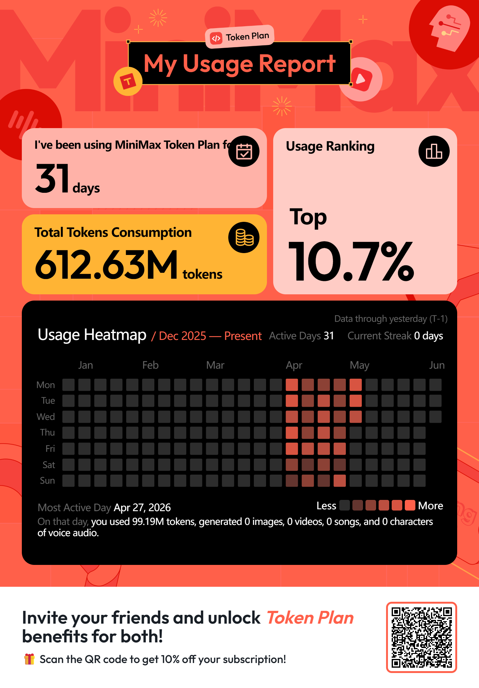
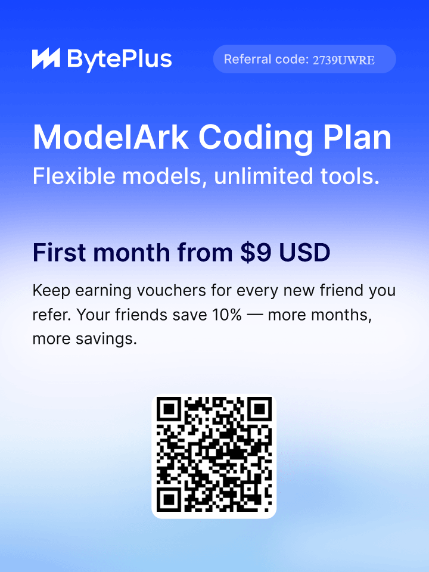
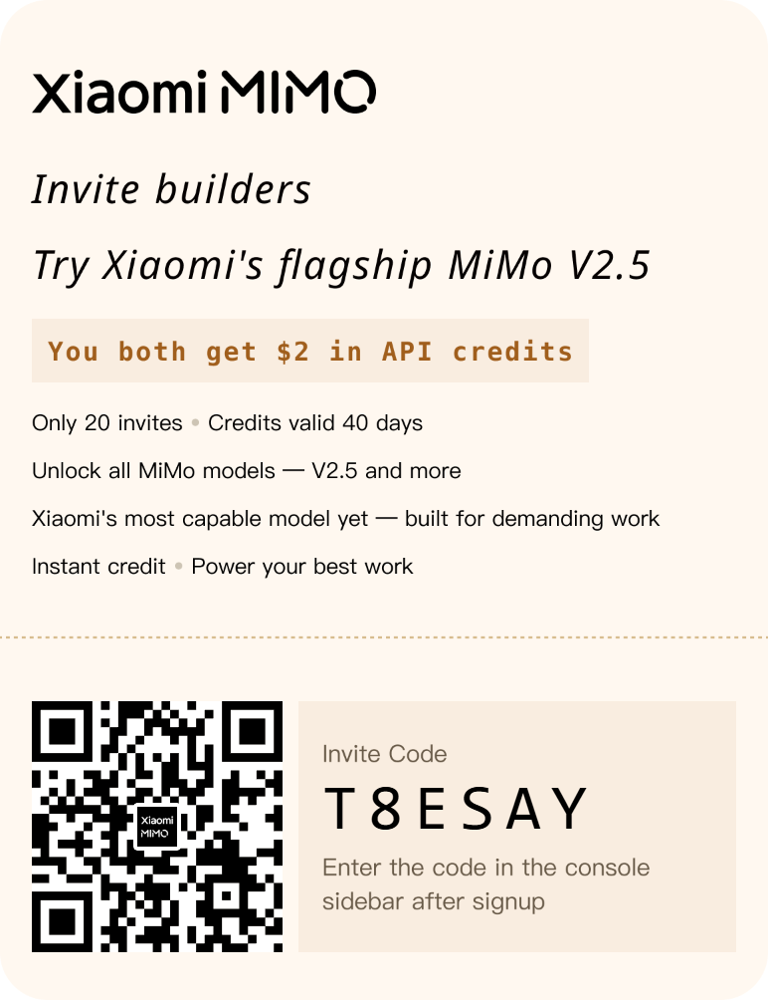

Many thanks to those who subscribe via my referral links! 🙏

## Claude Ecosystem

### [Claude Code Guest Pass](https://claude.ai/referral/ZkoAngod1A)

Share a free week of Claude Code with friends. If they love it and subscribe, you'll get $10 of extra usage to keep building.

My passes:

- ~~https://claude.ai/referral/ZkoAngod1A~~ — **out of stock as of 2026-04-30**

Friend's passes:

- ~~https://claude.ai/referral/7RBJExZ7LA~~ — **out of stock as of 2026-05-31**

### [ClaudeKit](https://claudekit.cc/?ref=BWA910UK)

ClaudeKit is a platform providing tools and resources to work with Claude AI more effectively — including prompt templates, workflows, and extensions.

Sign up via the referral link to get **20% off** your first purchase!

Referral code: `BWA910UK`

Link: https://claudekit.cc/?ref=BWA910UK

## AI Coding Platforms & LLM APIs

### [OpenCode Go](https://opencode.ai/go?ref=HE42WGS8BM)

Invite friends to OpenCode Go. Earn **$5** when a friend subscribes, and they'll get **$5** too.

- Share your referral link.
- Your friend joins and subscribes to Go.
- You both get a **$5 usage credit** to apply toward your Go usage limits.

Referral code: `HE42WGS8BM`

Link: https://opencode.ai/go?ref=HE42WGS8BM

### [Z.ai](https://z.ai/subscribe?ic=PLKIAYEIPW)

🚀 You've been invited to join the GLM Coding Plan! Enjoy full support for Claude Code, Cline, and 20+ top coding tools — starting at just $10/month. Subscribe now and grab the limited-time deal! Link： https://z.ai/subscribe?ic=PLKIAYEIPW

### [MiniMax](https://platform.minimax.io/subscribe/token-plan?code=CAQ5sxHAq6&source=link)

🎁 MiniMax Token Plan Referral Program until **Jul 1, 2026**. **$45.00 API Voucher Reward** per successful paid referral.

**How it works:**

- **For Referred Users:** Use a referral link to get **10% off** your subscription and become a dev ambassador.
- **For Referrers:** Earn **10% back in API vouchers** for every successful paid referral, usable across all MiniMax models. Plus priority access to events and model previews.

Referral code: `CAQ5sxHAq6`

Link: https://platform.minimax.io/subscribe/token-plan?code=CAQ5sxHAq6&source=link

### [Synthetic](https://synthetic.new/?referral=CNBFyw28zF0dZoj)

Thanks for helping us grow!

Invite your friends to Synthetic and both of you will receive $10.00 in subscription credit when they subscribe!

Share Your Referral Link

https://synthetic.new/?referral=CNBFyw28zF0dZoj

Your referral link contains your unique code: CNBFyw28zF0dZoj

### [ModelArk](https://www.byteplus.com/activity/codingplan?ac=MMAUCIS9NT1S&rc=2739UWRE)

https://www.byteplus.com/activity/codingplan?ac=MMAUCIS9NT1S&rc=2739UWRE

### [BigModel.cn — Platform Invite](https://www.bigmodel.cn/invite?icode=rIX6uZrLYfy8fQ6Urca4xf2gad6AKpjZefIo3dVEQyA%3D)

General BigModel.cn (Zhipu AI / 智谱 AI) platform invitation — new users get **20M free tokens** to explore the API, playground, and AGI apps.

Link: https://www.bigmodel.cn/invite?icode=rIX6uZrLYfy8fQ6Urca4xf2gad6AKpjZefIo3dVEQyA%3D

### [BigModel.cn — GLM Coding Plan](https://www.bigmodel.cn/glm-coding?ic=VGRZKHKNKW)

The **GLM Coding Plan** is a low-cost subscription that powers Claude Code, Cline, and other AI coding tools using GLM-5.1 / GLM-4.7 models.

**Friend's discount:** Subscribe via my link and get **5% off** your first GLM Coding Plan order.

**My rebate (challenge-based, resets every 30 invitees):**

- **3 friends subscribed** → I receive **10% cashback** of their actual paid amount.
- **30 friends subscribed** → I receive an **additional 10%** of the total paid amount for those 30 orders.
- The mission resets for every 30 friends invited — no upper limit.

Rebate credit can be used for anything on BigModel: resource packs, API calls, package subscriptions.

Invitation code: `VGRZKHKNKW`

Link: https://www.bigmodel.cn/glm-coding?ic=VGRZKHKNKW

### [Xiaomi MiMo](https://platform.xiaomimimo.com?ref=T8ESAY)

Xiaomi MiMo Open Platform — running Xiaomi's flagship MiMo V2.5 and the rest of the lineup. Sign up with my code and you'll instantly get **$2** in API credits.

After signup, enter the code at the bottom-left of the console. Credits valid **40 days**.

Referral code: `T8ESAY`

Link: https://platform.xiaomimimo.com?ref=T8ESAY

## Cloud Computing

### [Alibaba Cloud](https://www.alibabacloud.com/campaign/benefits?referral_code=A92LU5)

Alibaba Cloud is one of the world's largest cloud computing platforms — offering 50+ products including ECS, OSS, RDS, Redis, MongoDB, and networking.

**New user benefits (via referral):**

- Up to **$1,700** in free trial credits (individual) or **$8,500** (enterprise)
- **12-month free** ECS (Elastic Compute Service) trial
- **50+** products available in free trial
- New-user coupons and discounts on first orders

**How it works:** Sign up via the referral link as a new user → complete identity verification → access free trials and promotions.

Referral code: `A92LU5`

Link: https://www.alibabacloud.com/campaign/benefits?referral_code=A92LU5

## Cloud Storage

### [PikPak](https://mypikpak.com/drive/activity/invited?invitation-code=75940186)

PikPak is a private cloud storage service with built-in support for magnet links, torrents, and saving videos from the web — great for offline downloads and cross-device access.

Sign up with my invitation code to unlock **free premium days** (10 TB of premium storage for a limited trial). Enter the code within 12 hours of registration, or install directly via the link to auto-bind the invitation.

Invitation code: `75940186`

Link: https://mypikpak.com/drive/activity/invited?invitation-code=75940186
