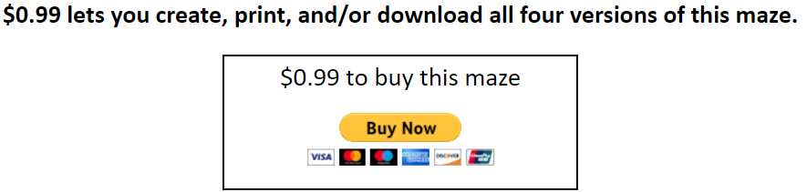
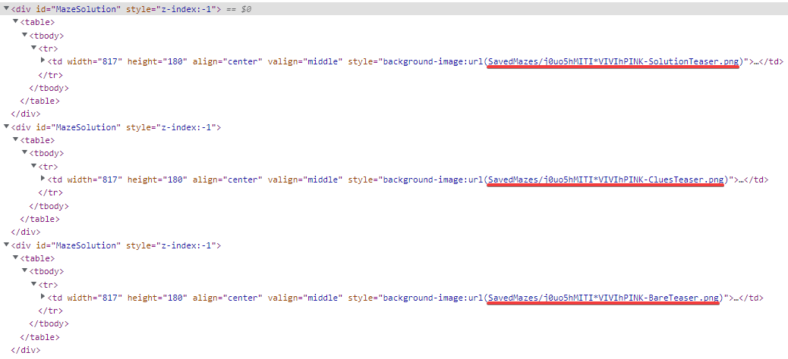
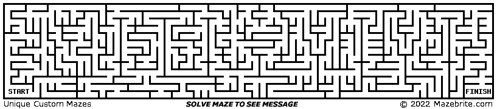

[mazebrite.com](https://mazebrite.com/) là một trang web tạo ra mê cung với thông điệp ẩn khá hay ho. Nhưng mazebrite sẽ lấy phí là $0.99 cho mỗi kết quả. Như này:

Nên post này sẽ giới thiệu cách nhận ảnh kết quả miễn phí từ [mazebrite.com](https://mazebrite.com/).

#### Note:
1. Trick này hoạt động được trong thời điểm hiện tại (28/11/2022), còn tương lai thì chưa biết :D
2. MiTi giới thiệu trick lấy được ảnh, còn bản quyền này nọ thì bạn tự chịu trách nhiệm nhé :D

#### Let's go!

1. Truy cập [mazebrite.com](https://mazebrite.com/) và tạo mê cung như bình thường.

Bạn sẽ nhận được 3 bức ảnh với watermark như này:

2. Truy cập Inspect, bằng cách chuột phải -> chọn Inspect hoặc nhấn phím tắt (F12), hoặc Ctrl + Shift + I. Sau đó chọn tab Elements. Ở đây tìm đến tag 
 có id __MazeSolution__ Đoạn mình gạch dưới như hình dưới là link của image.

Giờ mình bỏ từ _Tester_, sau đó ghép với cụm mazebrite.com, ta được link ảnh kết quả. VD: như với hình trên, Tiến được 3 link sau:
- [https://www.mazebrite.com/SavedMazes/j0uo5hMITI*VIVIhPINK-Solution.png](https://www.mazebrite.com/SavedMazes/j0uo5hMITI*VIVIhPINK-Solution.png)

- [https://www.mazebrite.com/SavedMazes/j0uo5hMITI*VIVIhPINK-Clues.png](https://www.mazebrite.com/SavedMazes/j0uo5hMITI*VIVIhPINK-Clues.png)

- [https://www.mazebrite.com/SavedMazes/j0uo5hMITI*VIVIhPINK-Bare.png](https://www.mazebrite.com/SavedMazes/j0uo5hMITI*VIVIhPINK-Bare.png)

Chúc các bạn thành công. Ủng hộ MiTi tại site này và [Facebook](https://www.facebook.com/tiennm99) nhé.
