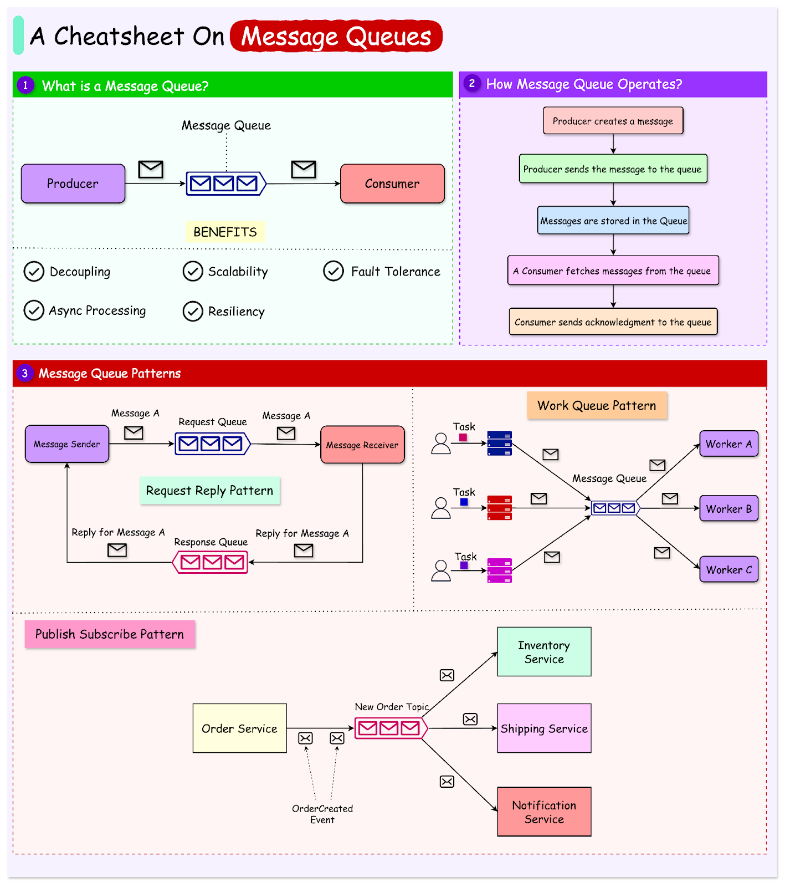
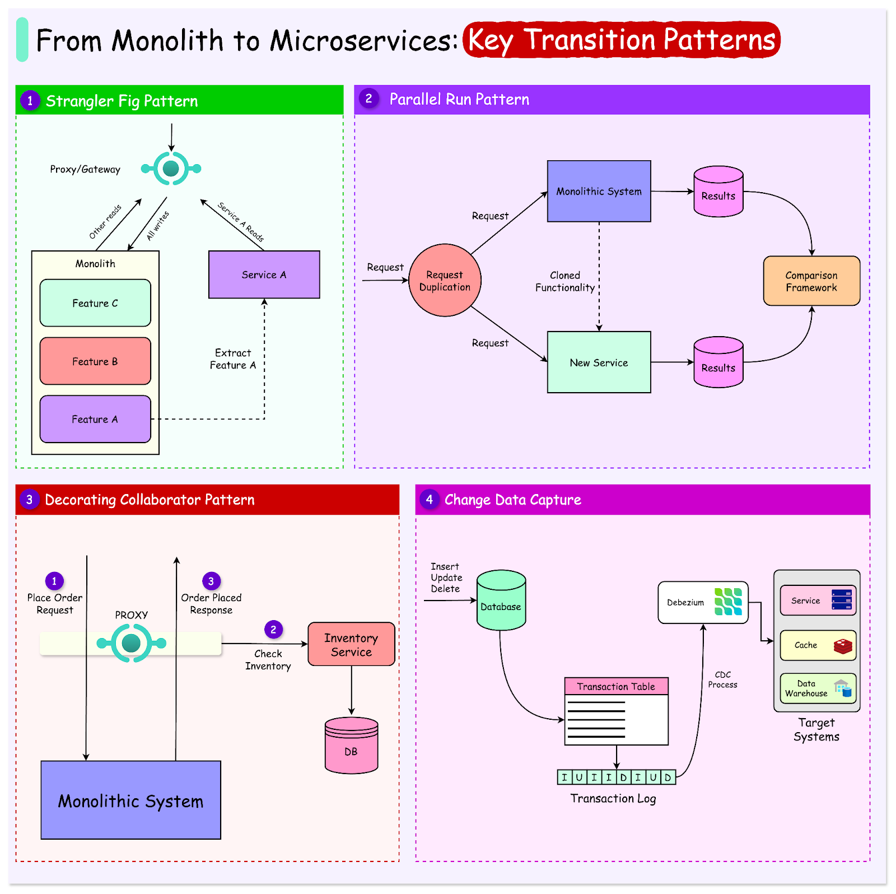

<i>
Xin chào các bạn, đây lại là một lần mình quay viết blog sau chuỗi ngày lười biếng :D

Một vấn đề mình nhận ra nhưng lười sửa đổi đó là mình đọc nhiều blog, nghịch nhiều tool, nhưng không có cái nào mình thật sự nghiêm túc, đủ để viết thành một blog chất lượng cả. Nếu có gì tâm đắc thì mình cũng quá lười để viết lại.

Vì vậy mình chuyển sang thử một hình thức khác, đó là tổng hợp lại những bài blog hay mà mình đã tìm thấy, đọc được trong tuần vừa qua và tổng hợp lại thành một bản newsletter hàng tuần. Mong được mọi người ủng hộ.

Không lòng vòng nữa, sau đây là Newsletter #1 của mình.
</i>

## [Seconds Since the Epoch](https://aphyr.com/posts/378-seconds-since-the-epoch)

Bài viết này giải thích lý do tại sao thời gian POSIX, thường được cho là số giây kể từ kỷ nguyên Unix (ngày 1 tháng 1 năm 1970), thực tế không chính xác như vậy. Nguyên nhân là do thời gian POSIX bắt nguồn từ Giờ Phối Hợp Quốc Tế (UTC) và tiêu chuẩn giả định rằng mỗi ngày dài đúng 86.400 giây. Tuy nhiên, độ dài của một ngày thay đổi và các nhà thiên văn học định kỳ tuyên bố giây nhuận để giữ cho ngày UTC không trôi quá xa so với ngày mặt trời. Những giây nhuận này gây ra sự gián đoạn trong thời gian POSIX. Bài viết cũng thảo luận về các giải pháp thay thế cho thời gian POSIX và nỗ lực chấm dứt giây nhuận vào năm 2035.

## [B-Trees: More Than I Thought I'd Want to Know](https://benjamincongdon.me/blog/2021/08/17/B-Trees-More-Than-I-Thought-Id-Want-to-Know/)

Bài đăng trên blog này đi sâu vào cấu trúc dữ liệu Cây B, đặc biệt tập trung vào việc sử dụng chúng trong các công cụ lưu trữ cơ sở dữ liệu. Nó giải thích các ràng buộc do I/O đĩa áp đặt và cách Cây B giải quyết các ràng buộc này bằng cách định vị các khóa cùng nhau trên đĩa. Bài viết thảo luận về các trang có rãnh, được sử dụng để bố trí các khóa trên đĩa để tối đa hóa vị trí và nén khóa. Nó cũng bao gồm các kỹ thuật tối ưu hóa khác nhau như cắt ngắn khóa phân tách, các trang tràn và con trỏ anh em. Cuối cùng, bài đăng trên blog đề cập đến một số biến thể Cây B và các tối ưu hóa khác có thể cung cấp các tối ưu hóa trong một số trường hợp nhất định.

## [SQL NULLs are Weird!](http://raymondtukpe.com/sql-nulls-are-weird.html)

Bài viết này khám phá những hành vi kỳ lạ của giá trị NULL trong SQL, đặc biệt là cách chúng được xử lý trong các ràng buộc UNIQUE. Tác giả chỉ ra rằng, không giống như những gì người ta thường mong đợi, SQL coi tất cả các giá trị NULL là các giá trị riêng biệt. Điều này có nghĩa là một cột có ràng buộc UNIQUE có thể chứa nhiều giá trị NULL vì mỗi giá trị NULL được coi là khác với các giá trị NULL khác. Bài viết tiếp tục thảo luận về cách đảm bảo tính duy nhất khi xử lý các giá trị NULL, sử dụng các cột được tạo và lập chỉ mục một phần.

## [Understanding JVM Garbage Collector Performance](https://mill-build.org/blog/6-garbage-collector-perf.html)

Bài viết này giải thích cách thức hoạt động của bộ thu gom rác (GC) trong Java Virtual Machine (JVM) và cung cấp các phương pháp cải thiện hiệu suất của nó. Tác giả bắt đầu bằng việc mô tả một GC lý thuyết đơn giản, sau đó đi sâu vào các thuật toán GC thực tế như Mark-and-Sweep và Generational Garbage Collection. Bài viết cũng thảo luận về các tham số cấu hình GC quan trọng, như kích thước heap và các tùy chọn GC khác nhau, đồng thời cung cấp các hướng dẫn về cách điều chỉnh chúng để đạt hiệu suất tối ưu. Cuối cùng, tác giả đưa ra các khuyến nghị cụ thể để cải thiện hiệu suất GC trong các dự án thực tế, bao gồm việc theo dõi và phân tích hành vi GC, cũng như điều chỉnh cấu hình GC dựa trên tải công việc cụ thể.

## [A Deep Dive into JVM Start-Up](https://www.youtube.com/watch?v=ED1oc7gn5uY)

Bạn có bao giờ thắc mắc điều gì xảy ra "đằng sau hậu trường" trước khi dòng lệnh System.out.println("Hello World") quen thuộc được thực thi trong ứng dụng Java? Video này sẽ đưa bạn vào một hành trình khám phá sâu sắc quy trình khởi động phức tạp của Java Virtual Machine (JVM). Từ việc phân tích cú pháp các tham số, kiểm tra tài nguyên hệ thống, thiết lập môi trường, đến quá trình tải, liên kết và khởi tạo lớp, bạn sẽ hiểu rõ hơn về những bước cần thiết để JVM "tạo ra vũ trụ" cho ứng dụng của bạn. Video cũng hé lộ những thay đổi thú vị trong tương lai với Project Leyden, hứa hẹn cải thiện đáng kể thời gian khởi động và hiệu suất của JVM. Đây là một tài liệu tham khảo giá trị cho bất kỳ nhà phát triển Java nào muốn nâng cao hiểu biết về nền tảng cốt lõi mà họ đang sử dụng.

## [Parallel processing with Virtual Threads - A comparative analysis](https://www.dhaval-shah.com/parallel-processing-virtual-threads-reactor-vs-jdk/)

Bài viết này phân tích hiệu suất của việc sử dụng Virtual Threads trong xử lý song song, so sánh giữa hai cách tiếp cận: triển khai dựa trên JDK 21 và Spring Core Reactor. Tác giả bắt đầu bằng việc nêu ra các hạn chế của các luồng hệ điều hành truyền thống, như chi phí tài nguyên cao và khả năng mở rộng hạn chế. Sau đó, bài viết giới thiệu về Virtual Threads, một tính năng mới trong JDK 21, cho phép tạo ra hàng triệu luồng nhẹ với chi phí thấp, đặc biệt hiệu quả cho các tác vụ I/O. Bài viết cung cấp các ví dụ mã cho cả hai phương pháp triển khai và tiến hành phân tích so sánh dựa trên các tiêu chí như thời gian xử lý, sử dụng bộ nhớ và hoạt động của bộ thu gom rác (GC). Kết quả cho thấy, việc sử dụng Virtual Threads với triển khai dựa trên JDK mang lại hiệu suất vượt trội so với Spring Core Reactor, đặc biệt khi xử lý số lượng lớn đối tượng. Tuy nhiên, triển khai dựa trên JDK yêu cầu bộ nhớ nhiều hơn và có thời gian dừng GC dài hơn, nhưng điều này không ảnh hưởng đáng kể đến độ trễ của ứng dụng. Tác giả kết luận rằng, đối với các ứng dụng yêu cầu hiệu suất cao và khả năng mở rộng, Virtual Threads trong JDK 21 là lựa chọn ưu việt.

## Bonus: Vài ảnh hay ho đến từ [ByteByteGo](https://bytebytego.com/)

