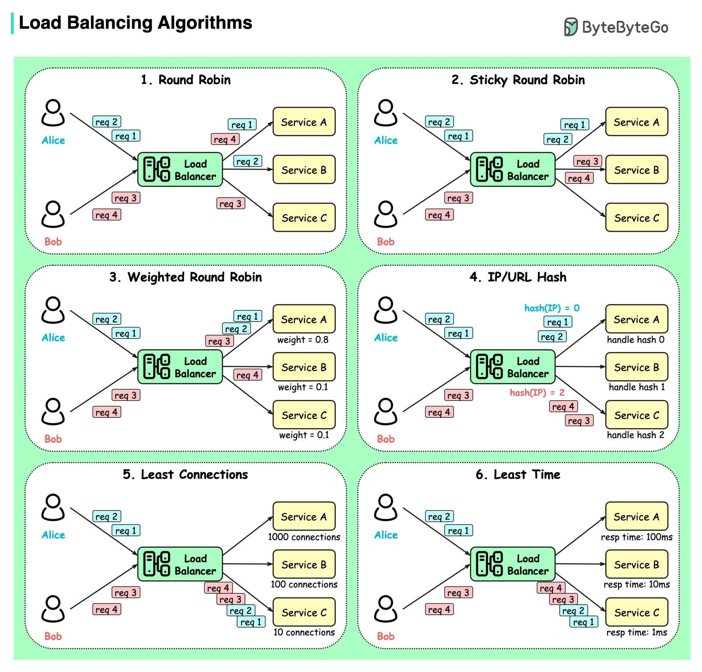

<i>
Chào các bạn, đến hẹn lại lên, đây là Newsletter #2 của mình. Cuối tuần này mình đi chơi ở Xuyên Mộc, vừa về hôm nay thôi nên giờ mới lên bài.

Thôi không vòng vo nữa, vào ngay Newsletter #2 của MiTi nào.
</i>

## [Some things to expect in 2025](https://lwn.net/Articles/1003780)

Bài viết dự đoán một số xu hướng và sự kiện có thể xảy ra trong cộng đồng Linux và phần mềm tự do năm 2025. Đầu tiên, sched-ext sẽ trở thành yếu tố thay đổi cuộc chơi, cho phép tải trình lập lịch CPU từ không gian người dùng thông qua BPF, thúc đẩy sự sáng tạo và thử nghiệm. Mã Rust sẽ được tích hợp nhiều hơn vào kernel, mang lại các tính năng mà người dùng cuối có thể không nhận ra. Bài viết cảnh báo về một nỗ lực backdoor tương tự như XZ có thể xuất hiện, và các dự án chỉ có một người duy trì sẽ bị coi là rủi ro hơn.

Một dự án lớn có thể phát hiện ra rằng họ đã hợp nhất nhiều mã do AI tạo ra mà tác giả không thực sự hiểu. Đồng thời, sẽ có nhiều nỗ lực tập trung hơn vào việc tạo ra các hệ thống AI tạo sinh thực sự tự do. Các tổ chức hỗ trợ công việc phần mềm tự do sẽ tiếp tục gặp khó khăn. Nhiều sản phẩm dựa trên đám mây sẽ trở thành "cục gạch" khi nhà sản xuất phá sản hoặc ngừng hỗ trợ. Phần cứng hoàn toàn mở sẽ trở nên phổ biến hơn, và các bản phân phối cho thiết bị di động sẽ chứng kiến sự quan tâm trở lại. Cuối cùng, bài viết nhấn mạnh rằng sự hiếu chiến toàn cầu sẽ tác động đến cộng đồng, và lời kêu gọi được đưa ra là hãy giữ vững các giá trị cốt lõi của cộng đồng trong bối cảnh chính trị phân cực.

## [Why you should use compact table columns](https://vladmihalcea.com/compact-table-columns/)

Bài viết giải thích tầm quan trọng của việc sử dụng các kiểu cột (column types) nhỏ gọn trong thiết kế cơ sở dữ liệu để tăng tốc độ truy vấn SQL. Việc sử dụng các kiểu cột nhỏ gọn cho phép lưu trữ nhiều bản ghi và mục chỉ mục hơn trong bộ nhớ cache, giúp giảm thiểu số lần truy cập đĩa. StackOverflow là một ví dụ điển hình, họ đã sử dụng chiến lược này để phục vụ hàng nghìn truy vấn mỗi giây chỉ với một máy chủ SQL duy nhất.

Bài viết chỉ ra rằng việc sử dụng các khóa chính (Primary Key) và khóa ngoại (Foreign Key) kiểu int hoặc tinyint thay vì UUID hoặc bigint, biểu diễn giá trị enum bằng 1 byte, và giới hạn độ dài của các cột VARCHAR giúp tiết kiệm không gian lưu trữ. Tác giả cũng trình bày các ví dụ cụ thể trên MySQL và PostgreSQL, cho thấy việc sử dụng các kiểu cột nhỏ gọn có thể giảm đáng kể kích thước bảng và chỉ mục, từ đó cải thiện hiệu suất truy vấn. Tuy nhiên, cần lưu ý về việc căn chỉnh cột (column alignment) trong PostgreSQL để đạt hiệu quả tối ưu. Tóm lại, việc lựa chọn kiểu cột phù hợp là một yếu tố quan trọng để tối ưu hóa hiệu suất cơ sở dữ liệu.

## [Rate limiting with Redis: An essential guide](https://foojay.io/today/rate-limiting-with-redis-an-essential-guide/)

Bài viết này giới thiệu về rate limiting (giới hạn tốc độ truy cập), giải thích tầm quan trọng của nó trong việc bảo vệ tài nguyên khỏi bị quá tải, ngăn chặn lạm dụng, đảm bảo truy cập công bằng, quản lý tải, giảm chi phí và bảo vệ hệ thống khỏi downtime. Redis được giới thiệu như một công cụ phổ biến để triển khai rate limiter nhờ tốc độ, độ tin cậy và các tính năng như thao tác nguyên tử, lưu trữ dữ liệu và Lua scripting.

Bài viết trình bày chi tiết các thuật toán rate limiting phổ biến: Leaky Bucket (ổn định luồng traffic), Token Bucket (xử lý các đợt tăng đột biến), Fixed Window Counter (đơn giản, độ chính xác thấp), Sliding Window Log (độ chính xác cao, tốn nhiều tài nguyên) và Sliding Window Counter (cân bằng giữa độ chính xác và hiệu quả).

Để chọn thuật toán phù hợp, cần hiểu rõ đặc điểm traffic (dự đoán được, đột biến, hỗn hợp), mức độ chính xác cần thiết, giới hạn tài nguyên (bộ nhớ, CPU, khả năng mở rộng) và trải nghiệm người dùng. Bài viết nhấn mạnh rằng rate limiting không chỉ là việc thiết lập giới hạn mà còn là thiết kế các hệ thống hiệu quả, công bằng và thân thiện với người dùng. Các triển khai cho từng loại rate limiter với Java & Redis sẽ được phát hành hàng tuần.

## [Why does Cloudflare Pages have such a generous Free tier?](https://mattsayar.com/why-does-cloudflare-pages-have-such-a-generous-free-tier)

Bài viết của Matt Sayar khám phá lý do tại sao Cloudflare Pages lại có một gói miễn phí hào phóng trong bối cảnh nhiều dịch vụ hosting hiện nay cung cấp các gói miễn phí tương tự. Cloudflare Pages nổi bật với băng thông không giới hạn, điều mà ít nền tảng nào khác có thể cạnh tranh. Các dịch vụ như GitHub Pages, GitLab Pages và Netlify đều có giới hạn băng thông, trong khi Cloudflare cho phép người dùng thoải mái phát triển trang web mà không lo lắng về chi phí phát sinh.

Tác giả cho rằng việc cung cấp băng thông không giới hạn phù hợp với chiến lược của Cloudflare trong việc phát triển một internet an toàn và nhanh chóng. Một trang web tĩnh nhẹ nhàng và dễ phục vụ, giúp Cloudflare tiết kiệm chi phí. Hơn nữa, khi người dùng trải nghiệm dịch vụ miễn phí, họ có xu hướng có ấn tượng tích cực và có thể chuyển sang sử dụng các sản phẩm trả phí của Cloudflare trong tương lai.

Bài viết cũng nhấn mạnh rằng Cloudflare đang đầu tư vào việc cải thiện internet và cung cấp nhiều dịch vụ bảo mật miễn phí, từ đó tạo ra một vòng luân chuyển lợi ích cho cả người dùng và công ty. Tác giả kết luận rằng đây là một cơ hội tốt để thử nghiệm các sản phẩm mới của Cloudflare, đặc biệt là trong thời gian gói miễn phí vẫn còn hiệu lực.

## [How I program with LLMs](https://crawshaw.io/blog/programming-with-llms)

Bài viết này tổng hợp những kinh nghiệm cá nhân của tác giả trong việc sử dụng các mô hình ngôn ngữ lớn (LLM) trong lập trình trong năm vừa qua. Tác giả nhấn mạnh rằng việc sử dụng LLM đã mang lại hiệu quả tích cực cho năng suất làm việc, và việc quay trở lại lập trình mà không có chúng trở nên khó khăn. Tác giả thường sử dụng LLM để tự động hóa các bước lặp đi lặp lại và một công cụ có tên sketch.dev đang được phát triển để hỗ trợ lập trình Go.

Có ba cách chính mà tác giả sử dụng LLM: để tự động hoàn thành code, cho các tác vụ tìm kiếm, và trong các phiên lập trình dựa trên chat. Tác giả thấy rằng LLM đặc biệt hữu ích khi anh ta biết những gì cần viết, nhưng không có đủ năng lượng để bắt đầu một file mới, tra cứu các thư viện cần thiết. LLM cung cấp bản nháp đầu tiên, thường chứa các ý tưởng hay, các dependency cần thiết và một vài lỗi. Việc sửa các lỗi này thường dễ dàng hơn là bắt đầu từ đầu.

LLM cũng rất hữu ích trong việc tạo ra các code review packet, đặc biệt là khi chúng cần sử dụng nhiều thư viện phổ biến. Tuy nhiên, cần phải biên dịch và chạy thử code do LLM tạo ra trước khi đọc kỹ, vì chúng có thể tạo ra code không biên dịch được.

Ví dụ, tác giả đã sử dụng LLM để viết một reservoir sampler cho các quartiles của các số float. LLM đã tạo ra một package có cấu trúc tốt, interface tốt và các test, nhưng code ban đầu không biên dịch được và các test chứa các giá trị sai. Tác giả đã sửa các lỗi này và sau đó yêu cầu LLM tạo ra các test tốt hơn bằng cách so sánh kết quả của reservoir sampler với một triển khai tiêu chuẩn. LLM đã tạo ra một fuzz test, nhưng nó chứa một lỗi cú pháp. Sau khi tác giả sửa lỗi này, fuzz test đã hoạt động tốt.

Nhìn chung, tác giả kết luận rằng LLM có thể là một công cụ hữu ích cho các lập trình viên, nhưng chúng không hoàn hảo và cần được sử dụng một cách cẩn thận. LLM có thể giúp cải thiện năng suất, viết test toàn diện hơn và làm cho code dễ đọc hơn.

## Bonus #1

*Tuần này có kha khá bonus đến từ nhiều nguồn khác nhau:*
Một vài ebook mình tìm được:

- [Designing Distributed Systems](doc/EN-CNTNT-eBook-DesigningDistributedSystems.pdf)
- [[FINAL] SOTI 2025 Results Press Release](doc/[FINAL]%20SOTI%202025%20Results%20Press%20Release.pdf)
- [2025 GDC State of the Game Industry report](doc/2025%20GDC%20State%20of%20the%20Game%20Industry%20report.pdf)
- [Quastor Summaries](doc/Quastor%20Summaries.pdf)

## Bonus #2: Vài ảnh hay ho đến từ [ByteByteGo](https://bytebytego.com/)

