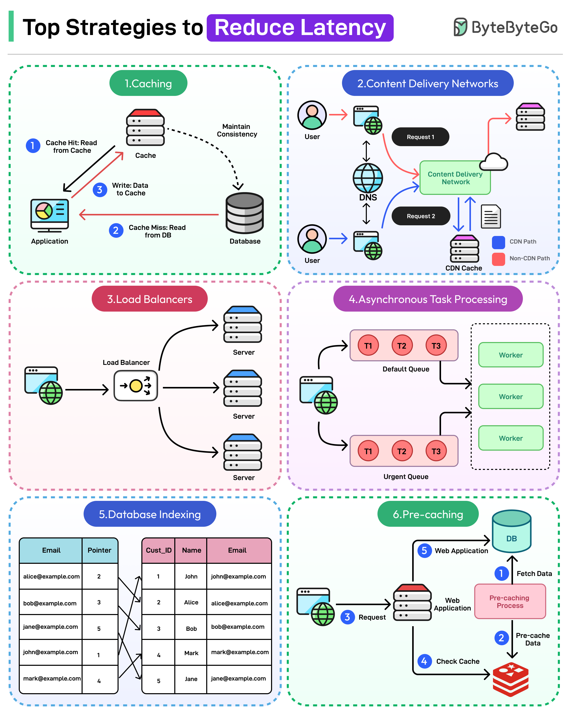
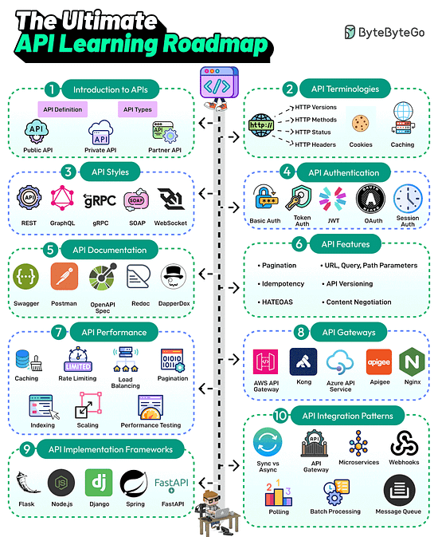
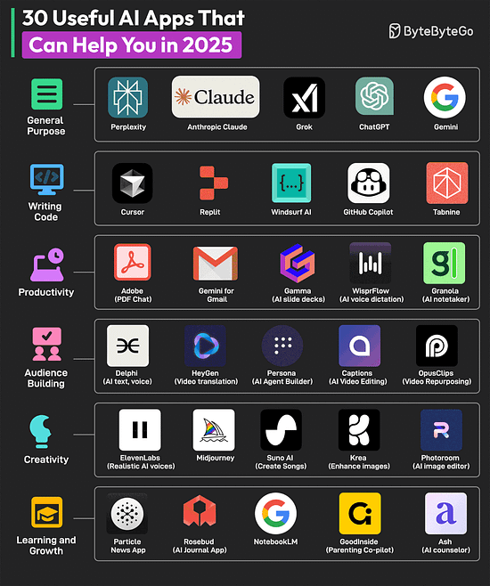
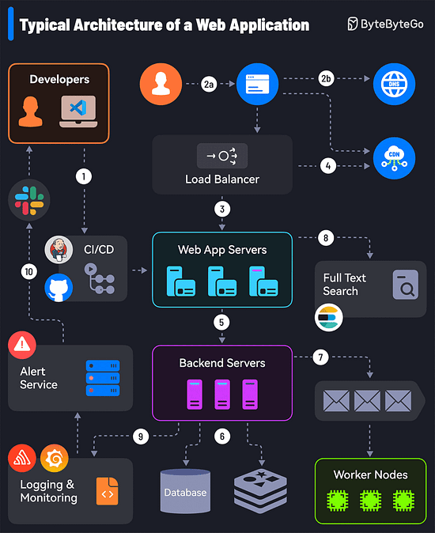
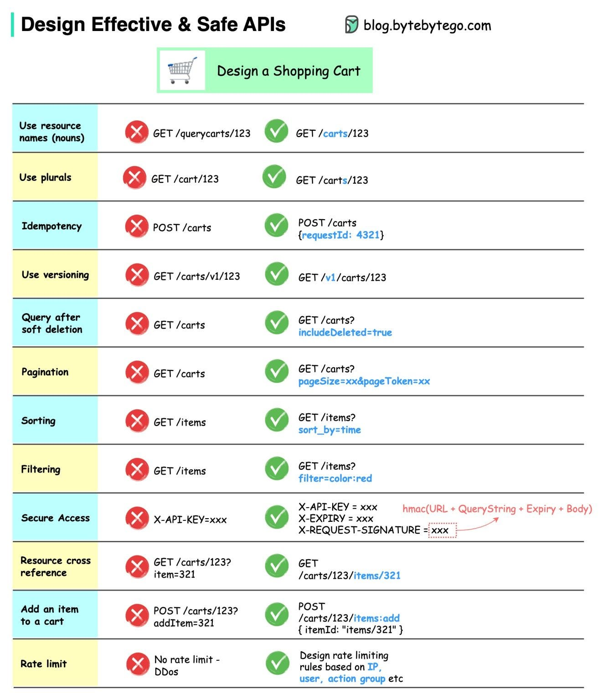
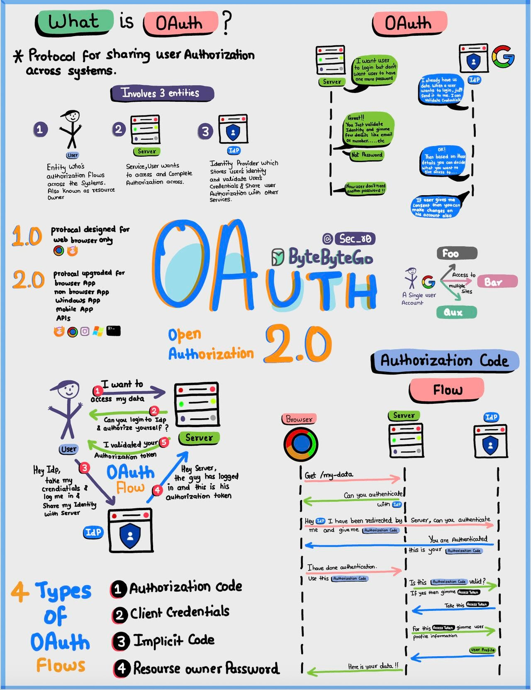
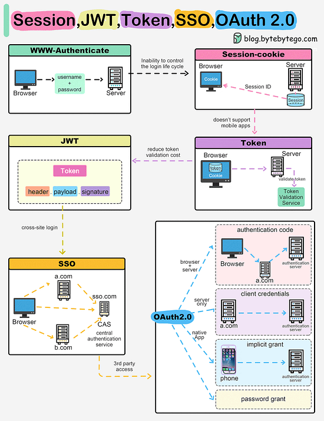

<i>
Chào các bạn, lại một cuối tuần nữa trôi qua, mời các bạn chill chill cùng Newsletter #3 của MiTi.
</i>

## [Java's Plans for 2025 - Inside Java Newscast #83](https://www.youtube.com/watch?v=y26XGt8d_kI)

Video này trên Inside Java Newscast trình bày những phát triển và kế hoạch dự kiến cho Java trong năm 2025, tập trung vào các dự án OpenJDK lớn như Babylon, Loom, Leyden, Lilliput, Panama và Valhalla (ngoại trừ Amber, sẽ được đề cập trong một video khác).

## [Why You Should Learn Kotlin in 2025](https://dev.to/empiree/why-you-should-learn-kotlin-in-2025-47g0)

Bài viết này trên Dev.to khuyến khích các nhà phát triển tìm hiểu Kotlin vào năm 2025, nhấn mạnh các tính năng hiện đại, khả năng tương tác với Java và các ứng dụng đa dạng của nó. Bài đăng này cũng thảo luận về thị trường việc làm và mức lương tiềm năng cho các nhà phát triển Kotlin.

## [Mastering Java Logging: Best Practices for Effective Application Monitoring](hhttps://dev.to/aaravjoshi/mastering-java-logging-best-practices-for-effective-application-monitoring-20h7)

Bài viết này trên Dev.to cung cấp hướng dẫn toàn diện về việc thực hiện ghi log hiệu quả trong các ứng dụng Java. Nó bao gồm các khía cạnh thiết yếu như chọn khung ghi log phù hợp, sử dụng các cấp log thích hợp, triển khai ghi log có cấu trúc và nhận biết ngữ cảnh, quản lý hiệu suất và bảo mật, đồng thời thiết lập ghi log tập trung.

## [Fixed Window Counter Rate Limiter (Redis & Java)](https://foojay.io/today/fixed-window-counter-rate-limiter-redis-java/)

Bài viết này trên foojay.io trình bày cách triển khai thuật toán giới hạn tốc độ bộ đếm cửa sổ cố định bằng Redis và Java. Bài viết này giải thích cách hoạt động của thuật toán, cách triển khai nó bằng Jedis và Redis và cách kiểm tra nó bằng Redis TestContainers và JUnit 5.

## [How JVM handles exceptions](https://foojay.io/today/how-jvm-handles-exceptions/)

Bài viết này trên foojay.io đi sâu vào cách Máy ảo Java (JVM) xử lý các ngoại lệ, tập trung vào bảng ngoại lệ và các hướng dẫn bytecode liên quan đến các khối try-catch-finally.

## [Database Sharding Explained](https://architecturenotes.co/p/database-sharding-explained)

Bài viết này trên Architecture Notes giải thích về phân vùng cơ sở dữ liệu, một kỹ thuật để phân phối dữ liệu trên nhiều máy khi một máy duy nhất không thể xử lý khối lượng công việc dự kiến. Bài viết này bao gồm các tùy chọn khác trước khi phân vùng, các loại phân vùng, tầm quan trọng của khóa phân vùng, cách xử lý các giao dịch đa phân vùng và sự phức tạp hoạt động của việc phân vùng.

## [Protecting your time from predators in large tech companies](https://www.seangoedecke.com/predators/)

Bài viết blog này của seangoedecke.com cảnh báo các kỹ sư phần mềm giỏi tại các công ty công nghệ lớn về việc những người khác liên tục tìm cách giành lấy thời gian của họ, đôi khi một cách khai thác. Nó cung cấp hướng dẫn về cách xác định và tránh những "kẻ săn mồi" này để tập trung vào các trách nhiệm chính.

## [How to improve your WFH lighting to reduce eye strain](https://rustle.ca/posts/articles/work-from-home-lighting)

Bài viết này trên rustle.ca thảo luận về tầm quan trọng của ánh sáng phù hợp để giảm mỏi mắt khi làm việc tại nhà. Tác giả chia sẻ kinh nghiệm cá nhân và cung cấp lời khuyên thực tế về cách tạo ra một môi trường ánh sáng dễ chịu, bao gồm sử dụng ánh sáng tự nhiên, cải thiện chất lượng ánh sáng nhân tạo và cân bằng độ sáng để giảm thiểu độ tương phản.

## [Working fast and slow](https://www.seangoedecke.com/working-fast-and-slow/)

Bài viết blog này trên seangoedecke.com thảo luận về hai kiểu làm việc mà tác giả đã xác định trong sự nghiệp kỹ thuật của mình: làm việc tập trung và làm việc không tập trung. Thay vì cảm thấy có lỗi khi ngày làm việc của họ không phải lúc nào cũng nhất quán, họ tập trung vào việc tận dụng tối đa từng giai đoạn, tận dụng tối đa các giai đoạn tập trung và thực hiện công việc ít quan trọng hơn trong những ngày ít tập trung.

## Bonus

### Bonus #1: Vài ảnh hay ho đến từ [ByteByteGo](https://bytebytego.com/)

### Bonus #2: Một vài link hay ho khác

- [Self-hosted Alternatives to Popular Software](https://openalternative.co/self-hosted)
