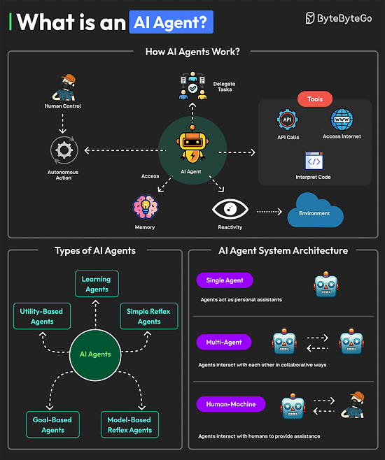
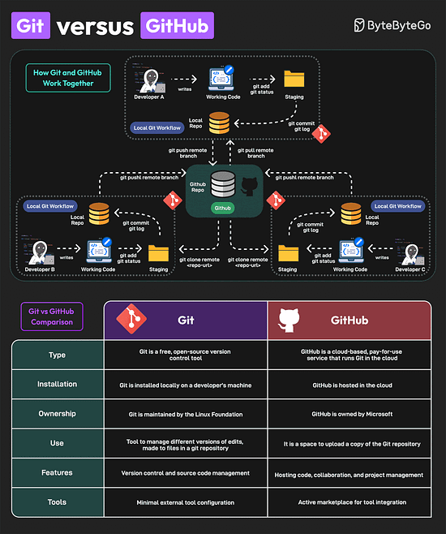
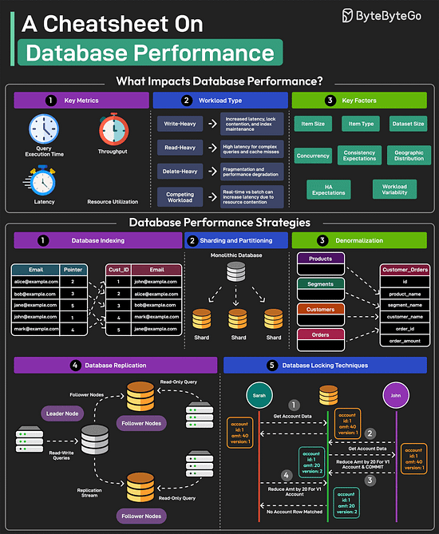
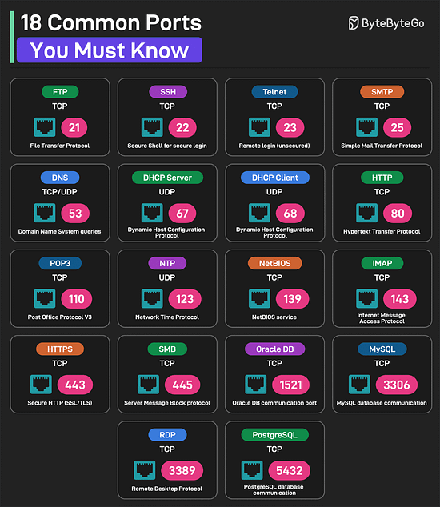

<i>
Chào các bạn, cuối tuần rồi MiTi hơi lười nên không lên bài. Mời các bạn thưởng thức Newsletter #5 nhé!
</i>

## [5 Advanced Java Reflection Techniques for Dynamic Programming](https://dev.to/aaravjoshi/5-advanced-java-reflection-techniques-for-dynamic-programming-4ph1)

Bài viết "5 Advanced Java Reflection Techniques for Dynamic Programming" của Aarav Joshi đi sâu vào sức mạnh của Java Reflection API, cho phép developer kiểm tra và thao tác cấu trúc của classes và objects trong runtime. Bài viết trình bày 5 kỹ thuật nâng cao: truy cập private members (cẩn trọng); tạo dynamic instances của classes sử dụng tên classes được xác định ở runtime; sử dụng custom annotations để thêm metadata và xử lý nó trong runtime (ví dụ: logging); tạo dynamic proxies để triển khai cross-cutting concerns như logging hoặc transaction management; và thao tác bytecode ở runtime với các thư viện như ByteBuddy để sửa đổi classes trong runtime. Mặc dù các kỹ thuật này mang lại sự linh hoạt và khả năng mở rộng, bài viết nhấn mạnh tầm quan trọng của việc sử dụng chúng một cách thận trọng do các vấn đề tiềm ẩn về maintainability và performance. Reflection là một công cụ mạnh mẽ cho developer Java để tạo ra các ứng dụng dynamic và thích ứng.

## [Mistakes You Apparently Just Have to Make Yourself](https://medium.com/@mcfunley/mistakes-you-apparently-just-have-to-make-yourself-cc2dd2bfc25c)

Bài viết liệt kê những sai lầm mà dường như ai cũng phải tự mình trải qua, bất chấp những lời khuyên. Đó là những "kiến thức không thể chuyển giao," những điều bạn phải tự "chạm vào bếp nóng" mới tin.

Tác giả đưa ra các ví dụ như: viết lại code từ đầu vì nó quá tệ; nghĩ rằng thêm độ phức tạp vào sẽ giúp phần mềm dễ quản lý hơn; sử dụng công nghệ mới nhất cho một vấn đề chưa từng thấy; tin rằng thêm network hops sẽ làm hệ thống nhanh hơn; nhầm lẫn giữa việc xây dựng hệ thống và dự án mã nguồn mở; viết wrapper cho command line tool; đánh giá thấp sự quan trọng của các khía cạnh khác ngoài lập trình; chỉ tập trung vào functional tests; triển khai code bằng version control tool; nhầm lẫn giữa decoupling logic và separation vật lý; tin rằng quan liêu có thể giải quyết mọi vấn đề hoặc không giải quyết được gì; và gộp code của hai team chỉ vì họ dùng cùng một danh từ.

Tác giả kết thúc bằng một lời quảng cáo hài hước cho startup Skyliner, như một chiếc "áo trói" để giúp bạn tránh lặp lại những sai lầm này.

## [Service Reliability Mathematics](https://addyosmani.com/blog/service-reliability/)

Bài viết "Service Reliability" làm rõ rằng việc đơn giản hóa độ tin cậy dịch vụ thành tỷ lệ phần trăm duy nhất bỏ qua nhiều sắc thái quan trọng. Tác giả Matt Rickard nhấn mạnh rằng không phải tất cả thời gian ngừng hoạt động đều như nhau, và tác động của nó thay đổi theo thời gian và bối cảnh kinh doanh. Mỗi "nine" (9) bổ sung trong độ tin cậy đòi hỏi nỗ lực kỹ thuật và độ phức tạp hoạt động tăng lên theo cấp số nhân, thường đòi hỏi các thay đổi kiến trúc cơ bản.

Bài viết chỉ ra những giả định ẩn sau các con số độ tin cậy, chẳng hạn như phân phối đồng đều các lỗi theo thời gian và bỏ qua các tình huống suy giảm một phần. Nó cũng nhấn mạnh các trade-off kỹ thuật liên quan đến việc theo đuổi độ tin cậy cao hơn, chẳng hạn như tốc độ phát triển so với sự ổn định và chi phí so với dự phòng.

Bài viết kết thúc bằng cách kêu gọi các kỹ sư xem xét tác động kinh doanh thực tế của các loại lỗi khác nhau và tập trung vào việc cung cấp giá trị nhất quán cho người dùng đồng thời duy trì các hoạt động kỹ thuật bền vững, thay vì mù quáng theo đuổi các con số độ tin cậy tùy ý. Các phương pháp tiếp cận hiện đại đang chuyển sang các số liệu sắc thái hơn như error budget và SLO (Service Level Objectives) dựa trên trải nghiệm người dùng.

## [How to write a good design document](https://grantslatton.com/how-to-design-document)

Bài viết "How to Design Document" đưa ra lời khuyên hữu ích về cách viết tài liệu thiết kế hiệu quả. Tài liệu thiết kế, theo tác giả, là một báo cáo kỹ thuật phác thảo chiến lược triển khai của một hệ thống trong bối cảnh trade-offs và constraints. Mục tiêu chính là thuyết phục người đọc (và quan trọng nhất là chính tác giả) rằng thiết kế này là tối ưu trong tình hình hiện tại.

Tác giả so sánh việc viết tài liệu thiết kế với việc viết một chứng minh toán học. Để đạt được hiệu quả cao nhất, cần tuân thủ tổ chức tốt, tương tự như tổ chức code. Người viết nên tránh tạo ra "spaghetti design docs" bằng cách đảm bảo mọi câu văn đều liên kết và dễ hiểu. Mục tiêu là không gây bất ngờ cho người đọc, giúp họ cảm thấy giải pháp rõ ràng ngay cả khi nó đòi hỏi nhiều suy nghĩ phức tạp.

Bài viết cũng nhấn mạnh tầm quan trọng của việc nắm bắt được tâm lý của người đọc và dự đoán những phản đối có thể xảy ra. Hơn nữa, cần chỉnh sửa để loại bỏ mọi từ ngữ thừa thãi, vì sự chú ý của người đọc là một nguồn tài nguyên hạn chế. Tác giả khuyến khích việc thực hành bằng cách đánh giá các tài liệu khác và chắt lọc ý tưởng thành các tweet ngắn gọn.

Cuối cùng, bài viết gợi ý tổ chức tài liệu thành các bullet point có thể tóm tắt trong một câu duy nhất và sử dụng footnote cho các chi tiết phức tạp để không làm gián đoạn mạch chính của tài liệu.

## [Picking your battles when you are hyper-rational](https://newsletter.weskao.com/p/picking-your-battles-hyper-rational)

Wes Kao chia sẻ về xu hướng phổ biến của những người có tư duy logic cao (hyper-rational operators): tập trung vào việc "đúng về mặt kỹ thuật" mà bỏ qua hiệu quả thực tế. Bài viết khuyến khích bạn nên suy nghĩ về bức tranh lớn hơn thay vì cố gắng sửa những lỗi nhỏ nhặt hoặc giải thích quá nhiều chi tiết không cần thiết.

Wes đưa ra hai ví dụ cụ thể: một về việc làm rõ các vấn đề về múi giờ với recruiter, và một về việc giải thích lý do nhầm lẫn với hệ thống thanh toán cho bộ phận tài chính. Trong cả hai trường hợp, Wes gần như đã gửi những email dài dòng, giải thích rõ ràng sự nhầm lẫn, nhưng sau đó nhận ra rằng việc này không mang lại giá trị thực tế.

Thay vào đó, Wes đã chọn những phản hồi ngắn gọn, tập trung vào việc giải quyết vấn đề trước mắt. Bài viết đặt ra câu hỏi: Liệu lời giải thích này có giúp chúng ta tiến gần hơn đến mục tiêu không? Liệu bối cảnh này có giúp ích cho người khác hay chỉ chứng minh rằng tôi đúng về một điều không quan trọng? Tôi đang phục vụ cuộc trò chuyện, hay cái tôi của mình?

Bài viết kết luận rằng, mặc dù có những lúc cần làm rõ sự nhầm lẫn, nhưng đối với những vấn đề nhỏ và không quan trọng, tốt hơn hết là nên bỏ qua và tập trung vào mục tiêu chính.

## [Measuring Programmer Influence, Kinda Sorta](https://tidyfirst.substack.com/p/measuring-programmer-influence-kinda)

Craig Tataryn từ Tidy First thảo luận về cách sử dụng dữ liệu để đánh giá đóng góp của lập trình viên trong một team lớn, dù ông khẳng định không có câu trả lời đáng tin cậy và rõ ràng. Dữ liệu chỉ có thể cung cấp gợi ý về các loại tác động nhất định từ những hành vi cụ thể. Ông cảnh báo rằng việc sử dụng dữ liệu này để xếp hạng, sa thải, thăng chức hoặc thưởng sẽ làm mất đi tính tin cậy của nó ngay lập tức.

Phân tích dựa trên dữ liệu từ dự án React cho thấy việc tạo file và thay đổi file tuân theo phân phối Pareto, tức là một số ít lập trình viên tạo ra phần lớn các file và những file này cũng được thay đổi nhiều nhất. Để xác định những người có ảnh hưởng đáng kể, tác giả kết hợp cả số lượng file được tạo và số lần các file đó được người khác thay đổi. Những người tạo nhiều file mà những file đó được chỉnh sửa nhiều sẽ được coi là có ảnh hưởng lớn hơn.

Ông đưa ra một số cách sử dụng tốt dữ liệu này, như xác định vị trí của bạn so với đồng nghiệp, tìm người để mentor, hoặc xác định những người có ít quyền lực hơn so với tác động thực tế của họ. Tuy nhiên, ông cũng cảnh báo về những cách sử dụng xấu, như dùng dữ liệu để thưởng, đặt hạn ngạch, thăng chức hoặc sa thải. Ông nhấn mạnh rằng nhiều đóng góp quan trọng không thể được ghi lại bằng số liệu và việc quá tập trung vào số liệu có thể dẫn đến những hành vi không mong muốn.

Tóm lại, bài viết khuyến khích sử dụng dữ liệu một cách cẩn thận và luôn ghi nhớ mục tiêu thực sự là tạo ra tác động tích cực, thay vì chỉ tập trung vào số liệu.

## [Building personal software with Claude](https://blog.nelhage.com/post/personal-software-with-claude/)

Trong bài viết này, tác giả chia sẻ trải nghiệm sử dụng Claude để chuyển một phần của Emacs package sang Rust, giúp giảm thời gian thực thi từ 90 giây xuống còn 15ms. Điều đáng nói là Claude đã thực hiện gần như toàn bộ dự án dưới sự giám sát của tác giả mà không cần anh phải viết nhiều code.

Ban đầu, tác giả chỉ kỳ vọng Claude sẽ là một công cụ hỗ trợ nhỏ, tương tự như một công cụ tìm kiếm tài liệu tốt hơn và Stack Overflow. Tuy nhiên, Claude đã vượt xa những kỳ vọng đó. Tác giả đã tải file obsidian.el lên và yêu cầu Claude viết một chương trình Rust để tăng tốc hàm obsidian-update. Claude đã đọc khoảng 1000 dòng Emacs Lisp, xác định 200 dòng liên quan, thiết kế định dạng JSON và chuyển logic sang khoảng 150 dòng Rust. Mã này thậm chí còn biên dịch và chạy ngay lần đầu tiên.

Tác giả cũng yêu cầu Claude viết code Emacs để sử dụng chương trình Rust, sử dụng tính năng "advice" để vá obsidian.el. Kết quả cũng rất ấn tượng, chỉ có một lỗi nhỏ được Claude sửa nhanh chóng. Toàn bộ dự án chỉ mất một buổi chiều.

Tác giả nhấn mạnh rằng LLM đang cải thiện với tốc độ chóng mặt và việc sử dụng chúng giúp giảm chi phí code. Tuy nhiên, sự hiểu biết về code, kiến trúc tốt và thiết kế vẫn rất quan trọng. Ông cũng gợi ý rằng có thể sẽ trở nên quan trọng hơn bao giờ hết khi viết code dễ xóa để có thể yêu cầu LLM tạo lại từ đầu khi cần thiết.

Tóm lại, bài viết cho thấy tiềm năng của LLM trong việc giúp các nhà phát triển xây dựng phần mềm cá nhân một cách nhanh chóng và hiệu quả, đồng thời giải phóng họ khỏi những công việc nhàm chán như xử lý các hệ thống xác thực phức tạp và cập nhật các framework mới nhất.

## Bonus: Vài ảnh hay ho đến từ [ByteByteGo](https://bytebytego.com/)

