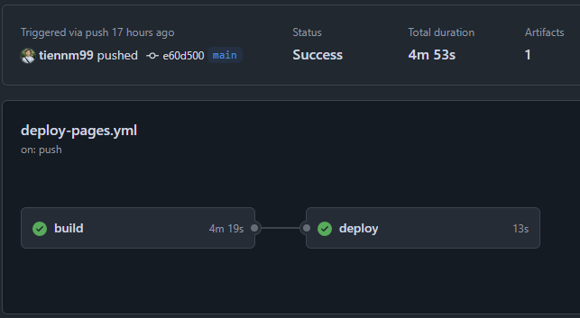
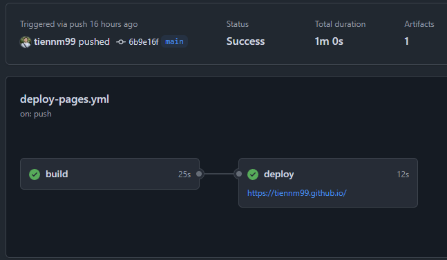

Gần đây khi đăng Newsletter, mình có đính kèm nhiều hình ảnh, và khi build với Hugo, Hugo sẽ cần process những hình ảnh này (tạo nhiều ảnh với kích thước khác nhau, nhằm tối ưu thời gian load). Và thời gian build của mình đã tăng lên đáng kể (có khi lên đến tận 4 phút). Để giải quyết vấn đề này, mình đã tìm hiểu và ứng dụng GitHub Action Cache để giảm thời gian build.

## GitHub Actions Cache là gì?

GitHub Actions Cache là một tính năng của GitHub Actions cho phép bạn lưu trữ các file hoặc thư mục giữa các lần chạy workflow. Điều này giúp tránh việc phải tải lại hoặc tạo lại các dependencies hoặc các file không thay đổi, từ đó giảm đáng kể thời gian chạy workflow.

Một số trường hợp thường sử dụng cache:

- Dependencies của dự án (node_modules, vendor, etc.)
- Output của quá trình build (resources, artifacts, etc.)
- Database hoặc các file dữ liệu lớn

## Tại sao cần tối ưu thời gian build?

Thực tế khi build hugo, việc build lại toàn bộ site mỗi khi có thay đổi nhỏ có thể tốn nhiều thời gian như mình mô tả ở phần đầu bài. Trong hầu hết các trường hợp, chỉ có một phần nhỏ của website thay đổi, còn lại các resources như hình ảnh, stylesheet đã được xử lý từ lần build trước.

Đối với Hugo, thư mục `resources` chứa các file đã được xử lý như hình ảnh đã được resize, file SCSS đã được biên dịch thành CSS. Việc cache thư mục này giúp tránh phải xử lý lại các file không thay đổi.

## Triển khai GitHub Actions Cache với Hugo

Dưới đây là workflow GitHub Actions mình đang sử dụng để triển khai trang web Hugo lên GitHub Pages, với việc áp dụng cache cho thư mục `resources`:

```yaml
name: Deploy site to GitHub Pages

on:
  push:
    branches:
      - main
  pull_request:
    branches:
      - main

  workflow_dispatch:

permissions:
  contents: read
  pages: write
  id-token: write

concurrency:
  group: "pages"
  cancel-in-progress: true

defaults:
  run:
    shell: bash

jobs:
  build:
    runs-on: ubuntu-latest
    env:
      HUGO_VERSION: 0.140.2
    steps:
      - name: Install Hugo CLI
        run: |
          wget -O ${{ runner.temp }}/hugo.deb https://github.com/gohugoio/hugo/releases/download/v${HUGO_VERSION}/hugo_extended_${HUGO_VERSION}_linux-amd64.deb \
          && sudo dpkg -i ${{ runner.temp }}/hugo.deb
      - name: Checkout
        uses: actions/checkout@v4
        with:
          submodules: recursive
          fetch-depth: 0
      - name: Setup Pages
        id: pages
        uses: actions/configure-pages@v5
      - name: Restore resources
        uses: actions/cache/restore@v4
        with:
          path: |
            resources
          key: ${{ runner.os }}-resources-${{ github.run_id }}
          restore-keys: |
            ${{ runner.os }}-resources-
      - name: Build with Hugo
        env:
          HUGO_CACHEDIR: ${{ runner.temp }}/hugo_cache
          HUGO_ENVIRONMENT: production
          TZ: Asia/Ho_Chi_Minh
        run: |
          hugo \
            --gc \
            --minify \
            --baseURL "${{ steps.pages.outputs.base_url }}/"
      - name: Save resources
        uses: actions/cache/save@v4
        with:
          path: |
            resources
          key: ${{ runner.os }}-resources-${{ github.run_id }}
      - name: Upload artifact
        uses: actions/upload-pages-artifact@v3
        with:
          path: ./public

  deploy:
    environment:
      name: github-pages
      url: ${{ steps.deployment.outputs.page_url }}
    runs-on: ubuntu-latest
    needs: build
    steps:
      - name: Deploy to GitHub Pages
        id: deployment
        uses: actions/deploy-pages@v4
```

### Chi tiết về cách sử dụng cache

Trong workflow trên, có hai bước liên quan đến cache:

1. **Restore resources**: Khôi phục cache từ các lần chạy trước

```yaml
- name: Restore resources
  uses: actions/cache/restore@v4
  with:
    path: |
      resources
    key: ${{ runner.os }}-resources-${{ github.run_id }}
    restore-keys: |
      ${{ runner.os }}-resources-
```

2. **Save resources**: Lưu cache mới sau khi build

```yaml
- name: Save resources
  uses: actions/cache/save@v4
  with:
    path: |
      resources
    key: ${{ runner.os }}-resources-${{ github.run_id }}
```

### Cách hoạt động của cache key

Các tham số trong phần cache:

- **path**: Đường dẫn đến thư mục hoặc file cần cache, ở đây là thư mục `resources` của Hugo
- **key**: Khóa duy nhất để xác định cache. Format phổ biến là `${{ runner.os }}-[cache-name]-[hash]`
- **restore-keys**: Danh sách các prefix key để tìm cache phù hợp nếu không tìm thấy cache chính xác

Trong ví dụ này:

- `${{ runner.os }}` đảm bảo cache chỉ được sử dụng trên cùng một hệ điều hành
- `resources` là tên của cache
- `${{ github.run_id }}` là ID duy nhất của mỗi lần chạy workflow

Với cách thiết lập này, nếu không tìm thấy cache chính xác với key `${{ runner.os }}-resources-${{ github.run_id }}`, GitHub Actions sẽ tìm cache gần nhất có prefix `${{ runner.os }}-resources-`.

## So sánh hiệu suất

Sau khi áp dụng cache, thời gian build của mình đã giảm đáng kể:

| Trạng thái | Thời gian build trung bình |
|------------|----------------------------|
| Không cache | ~4 phút 19 giây           |
| Có cache   | ~25 giây                   |

Với các dự án lớn hơn, sự chênh lệch thời gian có thể lên đến hàng phút hoặc thậm chí hàng chục phút.




## Mở rộng: Cache các dependencies khác

Ngoài việc cache resources của Hugo, bạn có thể áp dụng cách tiếp cận tương tự cho các loại dependencies khác:

### Node.js dependencies (node_modules)

```yaml
- name: Restore node_modules
  uses: actions/cache/restore@v4
  with:
    path: |
      node_modules
    key: ${{ runner.os }}-node-${{ hashFiles('**/package-lock.json') }}
    restore-keys: |
      ${{ runner.os }}-node-
```

### Go modules

```yaml
- name: Restore Go modules
  uses: actions/cache/restore@v4
  with:
    path: |
      ~/go/pkg/mod
    key: ${{ runner.os }}-go-${{ hashFiles('**/go.sum') }}
    restore-keys: |
      ${{ runner.os }}-go-
```

## Tối ưu hóa cache

Để sử dụng cache hiệu quả hơn, bạn có thể xem xét các chiến lược sau:

1. **Cache chọn lọc**: Chỉ cache các file thực sự cần thiết, tránh cache các file tạm thời hoặc file log
2. **Hash file dependencies**: Sử dụng hash của file như package-lock.json để tạo key, đảm bảo cache được cập nhật khi dependencies thay đổi
3. **Cache layering**: Sử dụng nhiều cache khác nhau cho các thành phần khác nhau của ứng dụng

## Kết luận

GitHub Actions Cache là một công cụ mạnh mẽ giúp tối ưu quy trình CI/CD của bạn. Với Hugo, việc cache thư mục `resources` giúp giảm đáng kể thời gian build, đặc biệt là khi dự án của bạn có nhiều hình ảnh hoặc stylesheet cần xử lý.

Đây chỉ là một ví dụ cơ bản về cách sử dụng GitHub Actions Cache. Trong thực tế, tùy thuộc vào dự án cụ thể, bạn có thể cần áp dụng các chiến lược cache phức tạp hơn.

Nếu bạn muốn tìm hiểu thêm, có thể tham khảo repository của GitHub Actions Cache: [https://github.com/actions/cache](https://github.com/actions/cache), hoặc trong document sau: [https://docs.github.com/en/actions/guides/caching-dependencies-to-speed-up-workflows](https://docs.github.com/en/actions/guides/caching-dependencies-to-speed-up-workflows).

Hy vọng bài viết này sẽ hữu ích cho bạn trong việc tối ưu quy trình CI/CD của dự án. Nếu bạn có bất kỳ câu hỏi hoặc góp ý nào, đừng ngần ngại để lại comment bên dưới.

Toàn bộ workflow mình đang sử dụng có thể tìm thấy trong [repo GitHub của mình](https://github.com/tiennm99/tiennm99.github.io) hoặc bạn có thể copy từ ví dụ trong bài này.
