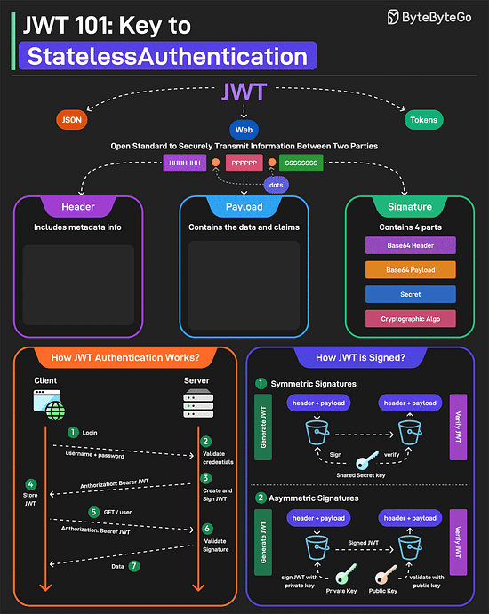

<i>
Mừng ngày Quốc tế Phụ nữ 8/3, chúc tất cả các bạn nữ một ngày tốt lành, luôn vui tươi và hạnh phúc!
Con gái sinh ra là để yêu thương :>
Chào mừng các bạn đến với Newsletter #6.
</i>

## [How I use LLMs as a staff engineer](https://www.seangoedecke.com/how-i-use-llms/)

Sean Goedecke, một staff engineer tại GitHub, chia sẻ cách anh tận dụng LLM (Large Language Models) trong công việc hàng ngày. Anh nhấn mạnh rằng, thay vì viết code hoàn toàn, LLM hiệu quả nhất khi được dùng như một công cụ hỗ trợ.

Cụ thể, anh dùng Copilot cho việc "autocomplete" code, đặc biệt hữu ích khi làm việc với các ngôn ngữ hoặc vùng kiến thức ít quen thuộc. Với các đoạn code "throwaway" (chỉ dùng một lần), anh thoải mái dùng LLM để tăng tốc độ. Anh cũng sử dụng LLM như một "tutor" để học các domain mới, đặt câu hỏi và kiểm tra kiến thức.

Ngoài ra, LLM còn được dùng để "debug" ở bước cuối cùng khi đã cạn ý tưởng, hoặc để "proofread" các tài liệu kỹ thuật dài. Sean không dùng LLM để viết PR (Pull Request) hoàn chỉnh hoặc các tài liệu quan trọng như ADR (Architecture Decision Record).

Tóm lại, theo Sean, LLM là công cụ giá trị nếu được sử dụng đúng cách, giúp tăng năng suất và học hỏi nhanh hơn, đặc biệt khi làm việc ngoài vùng "expertise".

## [Software development topics I've changed my mind on after 10 years in the industry](https://chriskiehl.com/article/thoughts-after-10-years)

Chris Kiehl là một lập trình viên phần mềm hiện đang làm việc tại Amazon. Anh đã viết cuốn sách "Lập trình hướng dữ liệu trong Java" và tạo ra Gooey, một công cụ chuyển đổi hầu hết các chương trình dòng lệnh Python thành ứng dụng GUI đầy đủ chức năng chỉ với một dòng code. Bốn năm trước, Kiehl đã đăng một danh sách các chủ đề về phát triển phần mềm mà anh đã thay đổi quan điểm sau khi làm việc trong ngành công nghiệp. Đây là một bản cập nhật về quan điểm của Kiehl - những điều anh đã thay đổi suy nghĩ, những ý kiến anh đã tiếp thu trong quá trình làm việc, và những điều anh vẫn giữ nguyên quan điểm.

## [Looking Under the Lamppost (On Problem-Solving)](https://www.edbatista.com/2025/01/looking-under-the-lamppost-on-problem-solving.html)

Ed Batista mở đầu bài viết bằng một câu chuyện ngụ ngôn quen thuộc: một người đàn ông tìm chìa khóa dưới cột đèn, dù biết đã đánh rơi ở chỗ tối hơn. Câu chuyện này là phép ẩn dụ cho cách chúng ta thường tiếp cận việc giải quyết vấn đề. Thay vì đối mặt với vấn đề cần giải quyết, chúng ta lại tập trung vào vấn đề muốn giải quyết.

Tác giả chỉ ra một số lý do cho hành vi này: vấn đề thực sự có thể nằm ngoài vùng chuyên môn, tốn quá nhiều thời gian, hoặc thậm chí không có lời giải. Thay vì đối mặt với những khó khăn này, chúng ta chọn những vấn đề nhỏ, dễ giải quyết để cảm thấy "hiệu quả" hoặc để bảo vệ hình ảnh cá nhân.

Tuy nhiên, việc này kìm hãm sự phát triển của chúng ta. Để mở rộng vùng an toàn, chúng ta cần bước ra khỏi nó. Sự dũng cảm không chỉ là tự tin vào khả năng thành công, mà còn là nhận thức rằng cái giá của việc không thử còn lớn hơn cái giá của thất bại.

Thất bại không phải là điều đáng sợ, mà là cơ hội để học hỏi và loại trừ các khả năng. Vì vậy, đừng mãi tìm kiếm dưới ánh đèn, hãy dũng cảm đối mặt với bóng tối, nơi những giải pháp thực sự đang chờ đợi.

## [Sliding Window Log Rate Limiter (Redis & Java)](https://foojay.io/today/sliding-window-log-rate-limiter-redis-java/)

Bài viết này giới thiệu về Sliding Window Log Rate Limiter, một phương pháp chính xác để kiểm soát tốc độ xử lý request. Thay vì chia thời gian thành các khoảng cố định, phương pháp này ghi lại dấu thời gian của từng request, cho phép theo dõi request trong một khoảng thời gian trượt (rolling time period) như giây hoặc phút.

Bài viết hướng dẫn cách triển khai Sliding Window Log sử dụng Redis và Java, tận dụng command `HEXPIRE` mới của Redis 8 để thiết lập thời gian hết hạn cho các field cụ thể trong một hash. Mỗi request (nếu được phép) sẽ được ghi lại bằng timestamp trong Redis hash. Sau đó, đếm số lượng request trong khoảng thời gian cho phép bằng command `HLEN`. Nếu vượt quá giới hạn, request mới sẽ bị từ chối.

Tác giả cũng cung cấp code mẫu Java sử dụng thư viện Jedis để tương tác với Redis, cùng với các test case sử dụng Redis TestContainers, JUnit 5 và AssertJ để đảm bảo rate limiter hoạt động đúng như mong đợi trong nhiều tình huống khác nhau, như kiểm tra số lượng request trong giới hạn, vượt quá giới hạn, sau khi sliding window reset, và xử lý đồng thời nhiều client.

## [Project Loom: Structured Concurrency – Java](https://foojay.io/today/project-loom-structured-concurrency-java/)

Bài viết giới thiệu về Structured Concurrency, một tính năng mới được giới thiệu trong Java 19 (incubator), Java 21 (preview) và Java 23 (preview) như là một phần của Project Loom. Structured Concurrency giúp đơn giản hóa việc lập trình concurrent bằng cách tạo ra trật tự và tính dễ đoán trong quản lý task.

Structured Concurrency hoạt động bằng cách chia một task chính thành nhiều subtask đồng thời và task chính không thể hoàn thành cho đến khi các subtask này hoàn tất. API này bao gồm lớp StructuredTaskScope (trong java.util.concurrent), cho phép tạo các subtask bằng StructuredTaskScope::fork và đợi chúng hoàn thành bằng StructuredTaskScope::join.

Bài viết cũng giới thiệu StructuredTaskScope.ShutdownOnSuccess (hủy các subtask khác khi một subtask thành công) và StructuredTaskScope.ShutdownOnFailure (hủy các subtask khác khi một subtask thất bại). Ngoài ra, có thể debug bằng lệnh jcmd.

Lợi ích của Structured Concurrency bao gồm đơn giản hóa quản lý task, cải thiện khả năng xử lý lỗi, đảm bảo an toàn tài nguyên và tính dễ đoán. Tính năng này hứa hẹn mang lại các ứng dụng concurrent hiện đại, dễ bảo trì và hiệu quả hơn.

## [Taking Out the Trash in Java](https://medium.com/@benweidig/taking-out-the-trash-in-java-19bcc0c7bd0c)

Bài viết này cung cấp một cái nhìn tổng quan về Garbage Collection (GC) trong Java, một cơ chế quản lý bộ nhớ tự động quan trọng của JVM. Thay vì yêu cầu developer tự quản lý việc cấp phát và giải phóng bộ nhớ, GC tự động xác định và thu hồi bộ nhớ không còn được sử dụng, giúp giảm thiểu lỗi và đơn giản hóa quá trình phát triển.

Bài viết giải thích cách JVM chia bộ nhớ thành các vùng khác nhau như Heap (nơi lưu trữ đối tượng) và Stack (nơi quản lý các lời gọi phương thức và biến cục bộ). Heap lại được chia thành Young Generation (Eden Space và Survivor Spaces) cho các đối tượng mới tạo và Old Generation cho các đối tượng tồn tại lâu hơn.

Bài viết cũng giới thiệu các loại GC khác nhau có sẵn trong JVM, bao gồm Serial GC, Parallel GC, G1 GC, ZGC, Shenandoah GC và Epsilon GC. Mỗi loại GC có các thuật toán và ưu tiên khác nhau, được tối ưu hóa cho các khối lượng công việc khác nhau. Ví dụ: ZGC được thiết kế để có độ trễ cực thấp, trong khi Parallel GC tập trung vào thông lượng cao.

Cuối cùng, bài viết cung cấp các mẹo thực tế để giảm thiểu garbage, gỡ lỗi và phân tích GC, cũng như điều chỉnh các cài đặt GC để cải thiện hiệu suất ứng dụng.

## [How Precision Time Protocol handles leap seconds](https://engineering.fb.com/2025/02/03/production-engineering/how-precision-time-protocol-ptp-handles-leap-seconds/)

Bài viết này thảo luận về cách Facebook (Meta) xử lý leap seconds (giây nhuận) trong hệ thống của họ, đặc biệt là với sự gia tăng của Precision Time Protocol (PTP) cho đồng bộ hóa thời gian chính xác trong các trung tâm dữ liệu.

Trước đây, Meta sử dụng "leap second smearing" cho NTP (Network Time Protocol), nhưng với PTP, phương pháp này không còn phù hợp do yêu cầu độ chính xác cao hơn (nanosecond). Leap second smearing là quá trình điều chỉnh tốc độ đồng hồ để bù đắp cho giây nhuận.

Giải pháp của Meta cho PTP là "self-smearing" bằng thư viện fbclock, sử dụng thuật toán dịch thời gian tự động, stateless và reproducible. Tuy nhiên, phương pháp này vẫn tạo ra sự khác biệt đáng kể giữa các host trong quá trình smearing.

Do đó, Meta khuyến nghị sử dụng TAI (International Atomic Time) thay vì UTC (Coordinated Universal Time) để tránh phải xử lý giây nhuận. Tuy nhiên, trong nhiều trường hợp, việc chuyển đổi sang UTC vẫn cần thiết.

Cuối cùng, Meta ủng hộ việc ngừng thêm giây nhuận sau năm 2035 để toàn ngành có thể dựa vào UTC, đơn giản hóa cơ sở hạ tầng và loại bỏ các giải pháp smearing khác nhau. Một tương lai không có giây nhuận sẽ giúp hệ thống đạt được độ chính xác thời gian cao hơn một cách dễ dàng và hiệu quả.

## [Developer philosophy](https://qntm.org/devphilo)

Bài viết này trình bày triết lý phát triển phần mềm của qntm, một nhà văn khoa học viễn tưởng và nhà phát triển phần mềm. Trong một buổi thảo luận với các nhà phát triển mới, qntm đã chia sẻ bảy nguyên tắc cốt lõi trong triết lý phát triển của mình:

1. **Tránh việc viết lại từ đầu**: Nếu việc viết lại toàn bộ dự án trở nên hấp dẫn, điều đó cho thấy đã có những sai lầm không thể tránh khỏi. Hãy theo dõi các dấu hiệu như nợ kỹ thuật tăng, khó khăn khi thay đổi code, và khó khăn khi ghi chú hoặc giới thiệu cho các nhà phát triển mới.

2. **Hoàn thành 90% công việc trong 50% thời gian**: Nhiều dự án mất 90% thời gian cho 90% công việc đầu tiên và 90% thời gian còn lại cho 10% cuối cùng. Hãy sử dụng thời gian còn lại để cải thiện quy trình hoặc trả nợ kỹ thuật.

3. **Tự động hóa các thói quen tốt**: Thay vì nhắc nhở mọi người thực hiện các hành vi tốt một cách thủ công, hãy tự động hóa chúng bằng cách thêm các kiểm tra tự động hoặc sửa lỗi tự động.

4. **Tư duy về dữ liệu bệnh lý**: Thay vì chỉ tập trung vào trường hợp lý tưởng, hãy nghĩ về cách mọi thứ có thể thất bại và viết code để xử lý các trường hợp đó.

5. **Luôn tìm cách viết code tốt hơn**: Nếu có thời gian, hãy xem xét lại code để tìm cách cải thiện.

6. **Viết code có thể kiểm thử**: Code nên có giao diện rõ ràng và ít tác dụng phụ để dễ dàng kiểm thử.

7. **Code không chỉ đúng mà còn phải rõ ràng và dễ hiểu**: Tránh code hoạt động "tình cờ" mà không có lý do rõ ràng. Code nên rõ ràng, dễ nhìn và dễ hiểu ngay cả khi không có lỗi.

Bài viết này cung cấp một cái nhìn sâu sắc về cách tiếp cận phát triển phần mềm một cách hiệu quả và bền vững

## Bonus

### Bonus 1: Vài video hay ho đến từ [ByteByteGo](https://bytebytego.com/)

[System Design: Why Is Docker Important?](https://www.youtube.com/watch?v=QEzbZKtLi-g)

### Bonus 2: Vài ảnh hay ho đến từ [ByteByteGo](https://bytebytego.com/)

