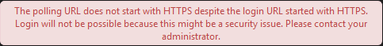

*Chi tiết về Coolify mình sẽ cân nhắc giới thiệu kĩ hơn trong một bài viết riêng. Hôm nay mình sẽ chỉ tập trung vào giải quyết vấn đề mình gặp phải thôi.*

## Vấn đề

Sau khi setup Nextcloud bằng Coolify thành công, bạn đã có thể sử dụng giao diện web bằng ip hoặc domain bình thường. Tuy nhiên khi dùng Nextcloud client để đăng nhập thì sẽ gặp lỗi sau:

*The polling URL does not start with HTTPS despite the login URL started with HTTPS. Login will not be possible because this might be a security issue. Please contact your administrator.*



## Cách khắc phục

1. Connect vào termial của Nextcloud.
2. Chạy lệnh sau để mở file cấu hình Nextcloud:

```bash
nano /config/www/nextcloud/config/config.php
```

3. Update lại như sau:

```
'overwrite.cli.url' => 'https://yourdomain.com',
'overwriteprotocol' => 'https',
```

*Thay <code>yourdomain.com</code> bằng domain của bạn.*

4. Save lại file và restart Nextcloud.

5. Thử đăng nhập lại từ client.

Cảm ơn bạn đã đọc bài. Chúc bạn thành công!
