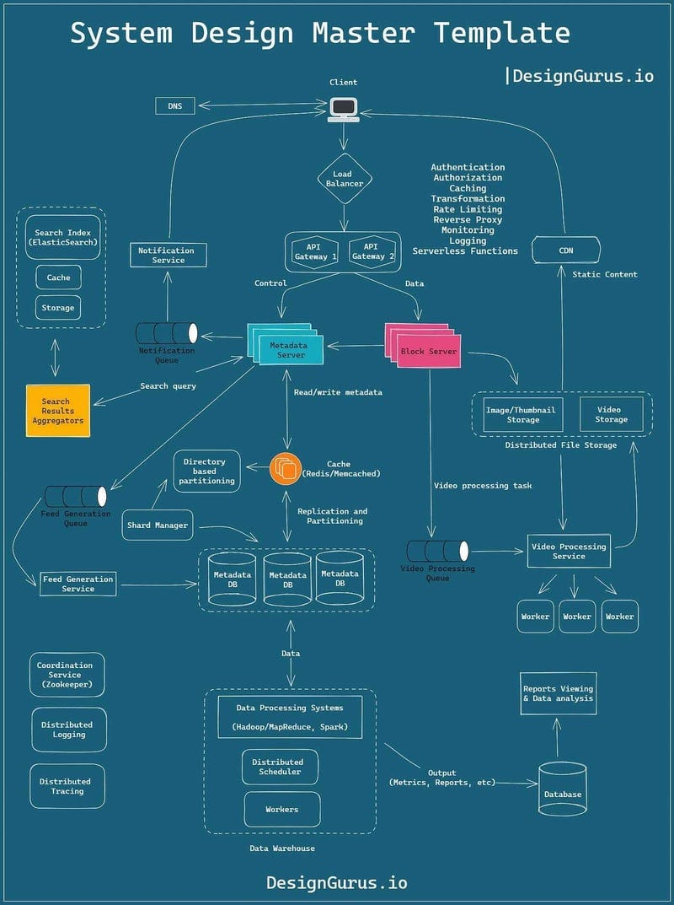

*Mời bạn thưởng thức Newsletter \#8.*

## [Let's deadlock all the things](https://info.michael-simons.eu/2025/02/05/lets-deadlock-all-the-things/)

Bài viết của Michael Simons kể về một lỗi "rookie" mà ông gặp phải khi làm việc với Java HttpClient, cho thấy rằng ngay cả những lập trình viên có kinh nghiệm cũng có thể mắc những lỗi cơ bản.

Tác giả đang cố gắng chuyển đổi code từ `HttpURLConnection` cũ sang `HttpClient` mới của Java. Trong quá trình này, ông đã cố gắng sử dụng `PipedInputStream` và `PipedOutputStream` để xử lý request body, bỏ qua cảnh báo trong JavaDoc về việc sử dụng cả hai đối tượng trong cùng một thread có thể gây deadlock.

Mặc dù code "hoạt động" trong các test cơ bản, nhưng khi xử lý payload lớn hơn buffer mặc định (1024 bytes), hệ thống sẽ bị deadlock và có thể làm cạn kiệt tất cả các thread có sẵn.

Tác giả chia sẻ một số bài học rút ra:
1. Đọc kỹ tài liệu và không bỏ qua các cảnh báo
2. Cần có góc nhìn thứ hai từ đồng nghiệp
3. Test kỹ hơn, đặc biệt là các trường hợp biên
4. AI có thể giúp tạo test input, nhưng không thể thay thế việc hiểu sâu về API

Cuối cùng, tác giả đã tìm ra giải pháp bằng cách sử dụng virtual thread để xử lý việc ghi dữ liệu, tránh deadlock và cho phép xử lý payload lớn một cách hiệu quả.

## [Engineers who won't commit](https://www.seangoedecke.com/taking-a-position/)

Bài viết của Sean Goedecke thảo luận về một vấn đề phổ biến trong giới kỹ sư phần mềm: việc không dám đưa ra quan điểm trong các cuộc thảo luận kỹ thuật. Tác giả cho rằng mặc dù việc giữ thái độ "cởi mở" và "không cam kết" có thể phù hợp với kỹ sư mới vào nghề, nhưng khi bạn là người có nhiều kinh nghiệm nhất trong phòng họp, bạn cần phải đưa ra quan điểm của mình, ngay cả khi chỉ tự tin 55-60%.

Tác giả chỉ ra rằng việc không đưa ra quan điểm có thể dẫn đến những hậu quả tiêu cực:
- Buộc những người ít kinh nghiệm hơn phải tự quyết định
- Có thể dẫn đến việc người kém nhất nhưng nói to nhất trong nhóm đưa ra quyết định tồi
- Tạo gánh nặng cho quản lý khi họ phải đưa ra quyết định kỹ thuật thay vì kỹ sư

Tuy nhiên, tác giả cũng thừa nhận rằng có những trường hợp ngoại lệ hợp lý, đặc biệt là trong môi trường làm việc độc hại nơi các kỹ sư có thể bị trừng phạt vì đưa ra ước tính không chính xác.

Bài viết kết luận rằng việc đưa ra quan điểm là trách nhiệm của kỹ sư có kinh nghiệm, và việc không làm điều đó có thể được coi là một dạng hèn nhát. Điều quan trọng là phải phân biệt giữa việc đưa ra quan điểm trong môi trường làm việc và việc giữ thái độ cởi mở trong các cuộc thảo luận với đồng nghiệp có cùng trình độ.

## [Patterns for building realtime features](https://zknill.io/posts/patterns-for-building-realtime/)

Bài viết của Zach Knill giới thiệu các mẫu thiết kế phổ biến để xây dựng tính năng realtime trong ứng dụng. Các tính năng realtime giúp ứng dụng cảm giác hiện đại, có tính cộng tác và luôn được cập nhật kịp thời.

Tác giả giới thiệu 4 mẫu thiết kế chính:

1. **Poke/Pull**: Server gửi thông báo ("poke") cho các client đã đăng ký khi có thay đổi, sau đó client sẽ tự động kéo ("pull") dữ liệu mới. Mẫu này dễ tích hợp vào ứng dụng hiện có nhưng có thể gây tải cho server do nhiều client cùng kéo dữ liệu.

2. **Push state**: Server trực tiếp đẩy trạng thái mới đến client thay vì chỉ gửi thông báo. Mẫu này giải quyết vấn đề tải server nhưng có thể không hiệu quả khi trạng thái lớn hoặc khi client cần biết chính xác điều gì đã thay đổi.

3. **Push operations**: Server gửi các thao tác thay đổi thay vì toàn bộ trạng thái. Mẫu này giúp client biết chính xác điều gì đã thay đổi và giảm lượng dữ liệu truyền tải, nhưng yêu cầu client phải có logic để áp dụng các thao tác.

4. **Event sourcing**: Server gửi các sự kiện đã xảy ra thay vì các thao tác. Mẫu này cho phép client có logic phức tạp hơn nhưng yêu cầu client phải hiểu ý nghĩa của mỗi sự kiện.

Tác giả cũng thảo luận về các phương thức vận chuyển (transports) như WebSocket, SSE, và các thách thức khi triển khai trong hệ thống phân tán. Trong môi trường có nhiều server replica, việc đồng bộ trạng thái giữa các client kết nối với các server khác nhau có thể phức tạp, và các dịch vụ Pub/Sub có thể giúp giải quyết vấn đề này.

## [Optimizing the databases at Quora](https://quoraengineering.quora.com/Optimizing-the-databases-at-Quora)

Bài viết từ đội ngũ kỹ sư Quora chia sẻ chi tiết về quá trình tối ưu hóa cơ sở dữ liệu của họ. Quora đã phải đối mặt với nhiều thách thức khi hệ thống phát triển, bao gồm việc xử lý lượng lớn dữ liệu và đảm bảo hiệu suất cho người dùng.

Các chiến lược tối ưu chính bao gồm:

1. **Phân mảnh dữ liệu (Sharding)**: Quora đã triển khai sharding để phân phối tải trên nhiều máy chủ cơ sở dữ liệu. Họ sử dụng một chiến lược sharding dựa trên user_id, cho phép họ phân phối dữ liệu người dùng một cách hiệu quả.

2. **Tối ưu hóa truy vấn**: Đội ngũ đã phân tích và tối ưu các truy vấn phổ biến, thêm các chỉ mục phù hợp và loại bỏ các truy vấn không cần thiết.

3. **Caching**: Quora triển khai nhiều lớp cache khác nhau:
   - Cache ở cấp độ ứng dụng cho dữ liệu thường xuyên truy cập
   - Cache ở cấp độ cơ sở dữ liệu cho các kết quả truy vấn phổ biến
   - Sử dụng Memcached cho cache phân tán

4. **Đọc/ghi phân tách (Read/Write Splitting)**: Hệ thống được thiết kế để phân tách các hoạt động đọc và ghi, cho phép mở rộng độc lập các khả năng đọc và ghi.

5. **Giám sát và cảnh báo**: Quora đã xây dựng hệ thống giám sát toàn diện để theo dõi hiệu suất cơ sở dữ liệu và phát hiện sớm các vấn đề.

Bài viết cũng nhấn mạnh tầm quan trọng của việc:
- Thường xuyên phân tích và tối ưu hóa hiệu suất
- Xây dựng các công cụ tự động hóa cho việc quản lý cơ sở dữ liệu
- Duy trì sự cân bằng giữa hiệu suất và tính đơn giản của hệ thống

## [Failure Mitigation for Microservices: An Intro to Aperture](https://careersatdoordash.com/blog/failure-mitigation-for-microservices-an-intro-to-aperture/)
Bài viết từ đội ngũ DoorDash giới thiệu về Aperture, một hệ thống quản lý độ tin cậy mã nguồn mở mà họ đã phát triển để giải quyết các vấn đề phổ biến trong kiến trúc microservices.

Aperture được thiết kế để giải quyết 3 thách thức chính:
1. **Cascading Failures**: Lỗi lan truyền từ service này sang service khác
2. **Retry Storms**: Các request thất bại được thử lại nhiều lần
3. **Death Spirals**: Lỗi lan truyền ngang trong cùng một service

Hệ thống hoạt động theo 3 bước chính:
1. **Collect**: Thu thập metrics từ các node (CPU, memory, latency, error rate) thông qua sidecar và tổng hợp trong Prometheus
2. **Analyze**: Controller giám sát metrics và theo dõi các sai lệch so với service-level objectives (SLO) được định nghĩa trong file YAML
3. **Actuate**: Khi các policy được kích hoạt, Aperture sẽ thực hiện các hành động như load shedding hoặc rate limiting phân tán

DoorDash đã triển khai Aperture trong một service chính và thử nghiệm với các request nhân tạo. Kết quả cho thấy nó hoạt động như một global rate limiter và load shedder mạnh mẽ, dễ sử dụng.

Bài viết cũng nhấn mạnh tầm quan trọng của việc:
- Thiết lập SLO rõ ràng cho mỗi service
- Giám sát liên tục và phát hiện sớm các vấn đề
- Tự động hóa việc xử lý các sự cố
- Duy trì tính đơn giản của hệ thống

## [Zero Configuration Service Mesh with On-Demand Cluster Discovery](https://netflixtechblog.com/zero-configuration-service-mesh-with-on-demand-cluster-discovery-ac6483b52a51)
Bài viết từ đội ngũ Netflix chia sẻ về hành trình chuyển đổi sang service mesh và cách họ giải quyết thách thức về cấu hình cluster trong môi trường microservices phức tạp.

Netflix đã sớm chuyển sang cloud, bắt đầu từ năm 2008 và hoàn thành vào năm 2010. Trong giai đoạn đầu, họ đã xây dựng các công cụ riêng như Eureka cho service discovery và Ribbon cho IPC (Inter-Process Communication). Tuy nhiên, khi hệ thống phát triển, họ gặp phải nhiều thách thức mới:
- Hỗ trợ nhiều loại IPC client khác nhau (REST, GraphQL, gRPC)
- Môi trường đa ngôn ngữ (Java, Node.js, Python)
- Nhu cầu về các tính năng phức tạp như adaptive concurrency limiting, circuit breaking

Để giải quyết các vấn đề này, Netflix quyết định chuyển sang sử dụng service mesh với Envoy làm proxy. Tuy nhiên, họ gặp phải thách thức về việc cấu hình cluster: mỗi service có thể cần giao tiếp với hàng chục cluster khác nhau, và danh sách này thay đổi liên tục.

Netflix đã hợp tác với Kinvolk và cộng đồng Envoy để phát triển tính năng On-Demand Cluster Discovery (ODCDS). Với tính năng này, proxy có thể tìm kiếm thông tin cluster khi cần thiết, thay vì phải định nghĩa trước tất cả các cluster trong cấu hình.

Quy trình hoạt động:
1. Request đến Envoy
2. Kiểm tra cluster đích dựa trên header
3. Nếu cluster chưa tồn tại, tạm dừng request
4. Yêu cầu thông tin cluster từ control plane
5. Nhận thông tin cluster và endpoints
6. Tiếp tục xử lý request

Lợi ích chính:
- Không cần cấu hình trước các cluster
- Giảm độ phức tạp của hệ thống
- Tiết kiệm bộ nhớ bằng cách chỉ tải thông tin cluster cần thiết
- Dễ dàng chuyển đổi từ hệ thống cũ sang service mesh

Tuy nhiên, cũng có một số nhược điểm:
- Thêm độ trễ cho request đầu tiên đến một cluster
- Có thể không phù hợp với các service yêu cầu độ trễ rất thấp

Netflix vẫn đang trong giai đoạn đầu của hành trình service mesh và đang tiếp tục cải thiện hệ thống, đặc biệt là trong việc tối ưu hóa EDS (Endpoint Discovery Service).

## [The Quest to Understand Metric Movements](https://medium.com/pinterest-engineering/the-quest-to-understand-metric-movements-8ab12ae97cda)
Bài viết từ đội ngũ Pinterest chia sẻ về cách họ xây dựng hệ thống phân tích nguyên nhân gốc rễ (Root Cause Analysis - RCA) cho các chuyển động của metrics. Khi một metric quan trọng có sự thay đổi bất thường, việc tìm ra nguyên nhân có thể rất phức tạp do có nhiều yếu tố có thể ảnh hưởng.

Pinterest đã phát triển ba phương pháp tiếp cận chính:

1. **Slice and Dice**: Phân tích chi tiết các phân đoạn của metric để tìm manh mối về nguyên nhân thay đổi. Ví dụ, khi phân tích tỷ lệ xem video, họ có thể chia nhỏ theo các chiều như quốc gia, loại thiết bị, loại Pin, v.v. Phương pháp này đặc biệt hiệu quả trong việc chẩn đoán các vấn đề về metrics video.

2. **General Similarity**: Tìm kiếm các metrics khác có chuyển động tương tự trong cùng khoảng thời gian. Hệ thống sử dụng bốn yếu tố để đo lường độ tương đồng:
   - Pearson correlation: đo mối quan hệ tuyến tính
   - Spearman's rank correlation: đo mối quan hệ đơn điệu
   - Euclidean similarity: dựa trên khoảng cách Euclidean
   - Dynamic time warping: cho phép so sánh các chuỗi thời gian có độ dài khác nhau

3. **Experiment Effects**: Phân tích tác động của các thử nghiệm A/B testing lên metrics. Hệ thống sẽ:
   - Tính toán tác động của mỗi thử nghiệm lên metric
   - Sử dụng Welch's t-test để đánh giá ý nghĩa thống kê
   - Lọc các thử nghiệm dựa trên p-value và sự mất cân bằng giữa nhóm kiểm soát và nhóm thử nghiệm

Các phương pháp này có thể được sử dụng kết hợp với nhau để thu hẹp phạm vi tìm kiếm nguyên nhân. Pinterest đang tiếp tục cải thiện hệ thống bằng cách:
- Thêm cơ chế phản hồi từ người dùng
- Tích hợp với các nền tảng dữ liệu khác
- Khám phá các mối quan hệ nhân quả giữa các metrics
- Tích hợp RCA vào các công cụ khám phá và trực quan hóa dữ liệu

## [Meta's Hyperscale Infrastructure: Overview and Insights](https://cacm.acm.org/research/metas-hyperscale-infrastructure-overview-and-insights/)
Bài viết từ Chunqiang Tang của Meta chia sẻ tổng quan về cơ sở hạ tầng hyperscale của công ty và những bài học kinh nghiệm từ quá trình phát triển. Mặc dù hầu hết các kỹ sư không trực tiếp xây dựng cơ sở hạ tầng hyperscale, việc hiểu về nó rất có ích vì nhiều công nghệ phổ biến ngày nay đã bắt nguồn từ môi trường này.

Các điểm chính về văn hóa kỹ thuật của Meta:

1. **Move fast**: Tập trung vào việc triển khai nhanh và lặp lại liên tục:
   - Triển khai liên tục code mới nhất vào production
   - Sử dụng serverless functions cho các sản phẩm
   - Cho phép các team nhanh chóng thay đổi ưu tiên

2. **Technology openness**: 
   - Sử dụng monorepo cho tất cả dự án
   - Không áp dụng quy tắc sở hữu code nghiêm ngặt
   - Đóng góp nhiều dự án mã nguồn mở (PyTorch, Llama, Presto, RocksDB)

3. **Research in production**: 
   - Không có phòng nghiên cứu riêng biệt
   - Các team phát triển sản phẩm trực tiếp thực hiện nghiên cứu
   - Đảm bảo các giải pháp hoạt động ở quy mô lớn

4. **Common infrastructure**:
   - Chuẩn hóa phần cứng (một loại server duy nhất cho non-AI workloads)
   - Tối ưu hóa ứng dụng cho phần cứng thay vì ngược lại
   - Tập trung vào tối ưu hóa toàn cục thay vì cục bộ

Chiến lược AI của Meta bao gồm:
- Thiết kế đồng bộ toàn bộ stack từ PyTorch đến AI accelerators
- Tối ưu hóa mạng và các mô hình ML như Llama
- Tích hợp chặt chẽ giữa phần cứng và phần mềm

Bài viết cũng nhấn mạnh tầm quan trọng của việc:
- Duy trì sự cân bằng giữa tốc độ phát triển và độ ổn định
- Tập trung vào việc tối ưu hóa toàn cục
- Đầu tư vào nghiên cứu và phát triển các công nghệ mới
- Chia sẻ kiến thức và công nghệ với cộng đồng

## [Incremental Platforms: Monolithic Modular Architecture](https://newsletter.optimistengineer.com/p/incremental-platforms-monolithic)
Bài viết của Marcos F. Lobo giới thiệu về kiến trúc Monolithic Modular, một cách tiếp cận để xây dựng nền tảng có khả năng phát triển bền vững. Kiến trúc này kết hợp sự đơn giản của monolithic với lợi ích của thiết kế modular và tách biệt.

Đặc điểm chính của kiến trúc này:
1. **Single Deployment**: Toàn bộ code được đóng gói và triển khai như một ứng dụng duy nhất
2. **Internal Modularization**: Ứng dụng được chia thành các module hoặc component riêng biệt, mỗi module có:
   - Interface rõ ràng
   - Contract xác định cách giao tiếp với các module khác
   - Trách nhiệm duy nhất và được định nghĩa rõ ràng

Để đạt được kiến trúc này, tác giả đề xuất các nguyên tắc:

1. **Định nghĩa ranh giới và contract rõ ràng**:
   - Mỗi module phải có interface công khai
   - Sử dụng các pattern như facade để tránh truy cập trực tiếp vào implementation

2. **Tách biệt các mối quan tâm**:
   - Đảm bảo mỗi module có một trách nhiệm duy nhất
   - Giảm thiểu sự phụ thuộc giữa các module

3. **Tổ chức code và cấu trúc package**:
   - Sử dụng cấu trúc package phản ánh sự phân chia module
   - Đảm bảo mỗi module có thể được tách riêng trong tương lai

4. **Testing và tự động hóa**:
   - Test các use case của monolith
   - Sử dụng CI/CD để kiểm tra tính toàn vẹn và giao tiếp giữa các module

5. **Quản lý phụ thuộc và giao tiếp**:
   - Sử dụng dependency injection
   - Xem xét sử dụng messaging hoặc events để tách biệt các module

Lợi ích chính:
- **Đơn giản trong triển khai và vận hành**: Một artifact duy nhất, giảm overhead
- **Dễ dàng phát triển và refactor**: Giao dịch đơn giản, truy cập tài nguyên dễ dàng
- **Hiệu suất và tính nhất quán**: Gọi giữa các module trong bộ nhớ, xử lý giao dịch đơn giản
- **Hỗ trợ Domain-Driven Design**: Dễ dàng chia hệ thống theo bounded contexts

Kiến trúc này đặc biệt phù hợp cho:
- Dự án giai đoạn đầu
- Nhóm nhỏ
- Hệ thống cần tính nhất quán và toàn vẹn giao dịch
- Nền tảng có thể phát triển dần dần thành kiến trúc phân tán trong tương lai

## Bonus: Vài video hay ho đến từ [ByteByteGo](https://bytebytego.com/)

[How the Garbage Collector Works in Java, Python, and Go!](https://www.youtube.com/watch?v=3Kqal7QaCCM)

## Bonus 2: Vài hình ảnh hay ho đến từ [ByteByteGo](https://bytebytego.com/)

## Bonus 3: Vài hình ảnh hay ho đến từ [DesignGurus](https://designgurus.io/)

