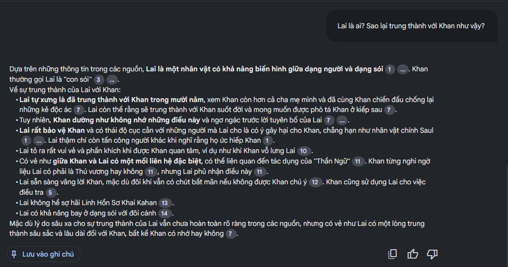
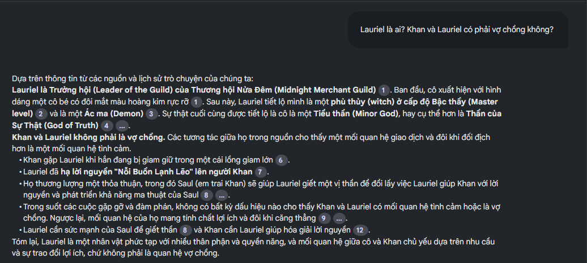
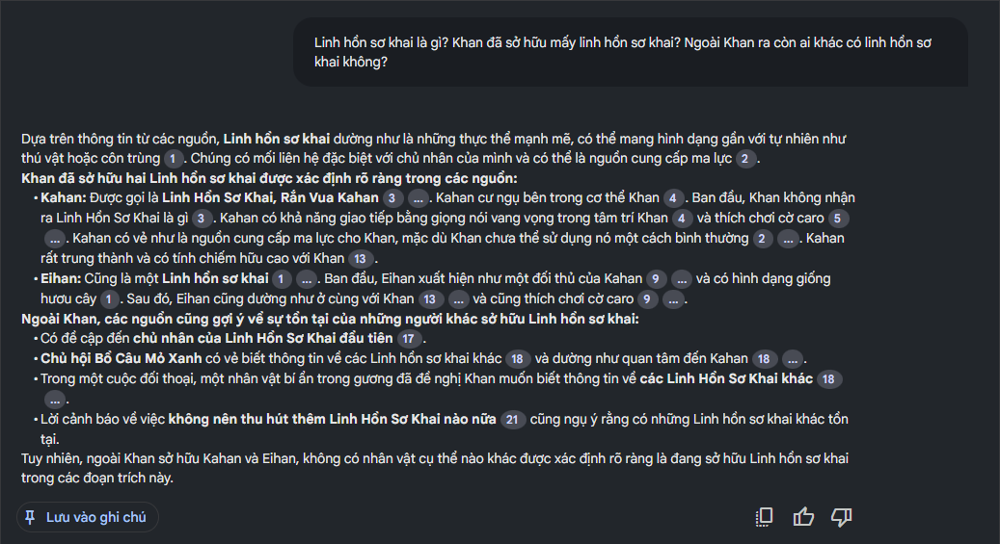

Gần đây mới mua được Anh trai nhân vật chính tập 2. Nhưng chợt nhận ra vì đọc quá nhiều truyện nên có nhiều nhân vật mình không nhớ hoặc kể cả là... cốt truyện. Gần đây với sự bùng nổ của AI, Google cũng cung cấp NotebookLM miễn phí cho mọi người. Nên sẵn tiện mình tranh thủ giới thiệu cách dùng NotebookLM để hỏi đáp về nội dung của Anh trai nhân vật chính.

__Note 1: Mình là dev, nên một số phần thiên về tech mình cũng lười giải thích. Tuy nhiên cũng sẽ cố gắng hướng dẫn thân thiện, dễ làm với mọi người. Nhưng không tránh khỏi sai sót, nếu có chỗ nào chưa rõ có thể comment hoặc inbox mình trao đổi thêm nhé. Mình khá bận nên trả lời nhanh hay chậm cũng hên xui__

__Note 2: Ở đây nội dung mình sử dụng để hỏi đáp đến từ bản web novel đăng trên [Hako](https://ln.hako.vn/), sẽ có một số khác biệt nhất định so với bản sách giấy nhé!__

## Chuẩn bị data

### Dành cho techie
_Nếu bạn không phải dân tech, có thể chuyển đến [mục kế tiếp](#dành-cho-non-tech), mình đã chuẩn bị sẵn data sẵn cho bạn. Phần này để các bạn thích tech mày mò thêm thôi._

1. Bạn clone repo này của mình: https://github.com/tiennm99/atnvc-crawler. Làm theo hướng dẫn trong file README để setup và crawl data.
   __Note:__ Script này mình viết đã lâu, gần đây có thấy Hako bị block, hãy đảm bảo máy của bạn truy cập được https://ln.hako.vn/ trước khi tiến hành nhé. Có thể dùng VPN hoặc Cloudflare WARP để bypass.
2. Mặc định NotebookLM giới hạn số lượng file cũng như kích thước file cho 1 notebook. Mà hiện tại theo như bản web novel Anh trai nhân vật chính trên Hako đã có đến 133 chương rồi. Vì vậy chúng ta sẽ dùng tool để merge các chap lại với nhau, mình gợi ý là ghép các chap cùng 1 arc lại cho dễ quản lý nhé. Bước này bạn dùng gì cũng được, tự viết cũng ok. Mình thì DIY bằng [script này](https://github.com/tiennm99/utils/raw/refs/heads/main/join.bat).
3. (Tuỳ thích) Đặt lại tên cho các file đã merge.

### Dành cho non tech

Mình có upload sẵn các file mình đã xử lý ở bên dưới. Bạn có thể dùng như trang web nhé.

[Arc 1](data/Arc%201.txt)
[Arc 2](data/Arc%202.txt)
[Arc 3](data/Arc%203.txt)
[Others](data/Others.txt)

Hoặc có thể dùng thông qua link Google Drive sau:

https://drive.google.com/drive/folders/1r85mnSVMGtEz2WBMq3fUBUIcOKqUpc7N?usp=sharing

_Mình hay dọn dẹp nên có khi quên mất và delete thư mục share. Nếu gặp vấn đề thì gì thì hú mình nhé_

__Hiện tại mình mới update đến chương 133 theo như trên Hako thôi nhé. Có thể mình sẽ update thêm trong tương lai nếu có nhiều bạn hứng thú__

## Setup NotebookLM

1. Truy cập trang NotebookLM: https://notebooklm.google.com/
2. Đăng nhập bằng account Google
3. Tạo sổ ghi chú mới. Đặt tên tuỳ thích, mà nên đặt tên gợi nhớ để dễ phân biệt
3. Up các file đã tạo ở phần chuẩn bị data lên.
   - Nếu bạn dùng web mình tạo sẵn thì chọn mục Liên kết/Trang web
   - Nếu bạn dùng thư mục Google Drive của mình thì chọn Google Drive/Google Tài liệu/Được chia sẻ với tôi
4. Bắt đầu sử dụng thôi :D

_Tips: Đôi khi bạn sẽ muốn biết thông tin về arc bạn đã đọc rồi thôi, tránh bị spoil. Như ở trên mình có khuyên gom nhóm lại thành arc. Không muốn NotebookLM biết arc nào thì trong phần `Nguồn` bỏ tick arc đó đi là được_

## Vài hình ảnh demo

## Mở rộng

Bài này mình demo với Anh trai nhân vật chính, nhưng thực chất có thể ứng dụng với bất kỳ truyện nào. Mở rộng hơn nữa còn có thể dùng cho document trong công việc, hay các sách báo khác,... Có thể thấy AI đang phát triển mạnh mẽ và có nhiều tiềm năng rất lớn. Một số ông lớn về công nghệ như Google cũng cung cấp các dịch vụ miễn phí như NotebookLM. Dù dùng ở trong công việc hay vui chơi giải trí gì đều rất hữu ích. Mình cũng lo sợ một ngày nào đó AI sẽ cho mình ra chuồng gà mất. Nếu có fuba nào đọc xong và thấy cảm động, xin hãy bao nuôi anh dev này 🥺🥺
