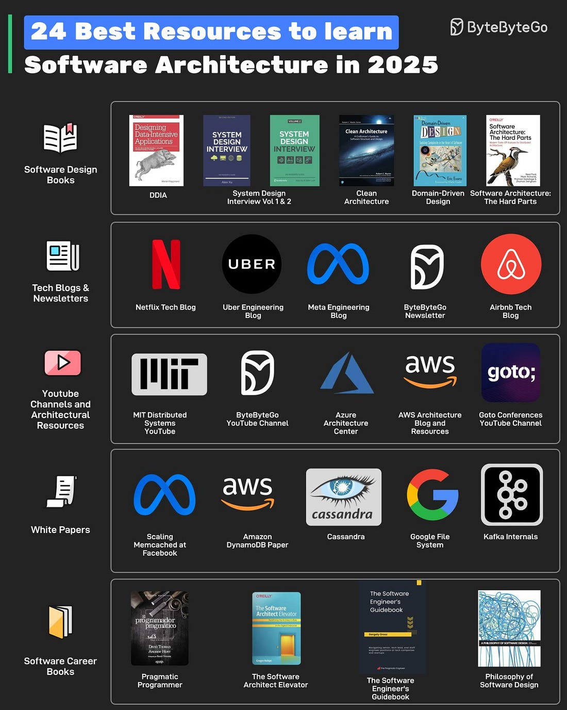
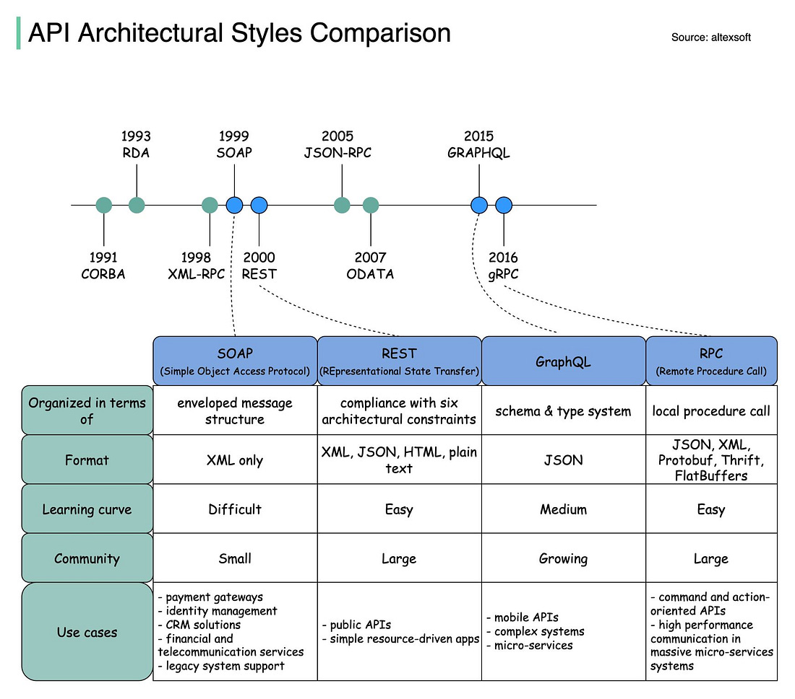
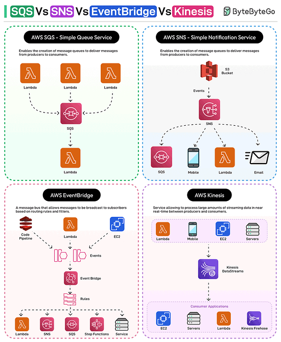
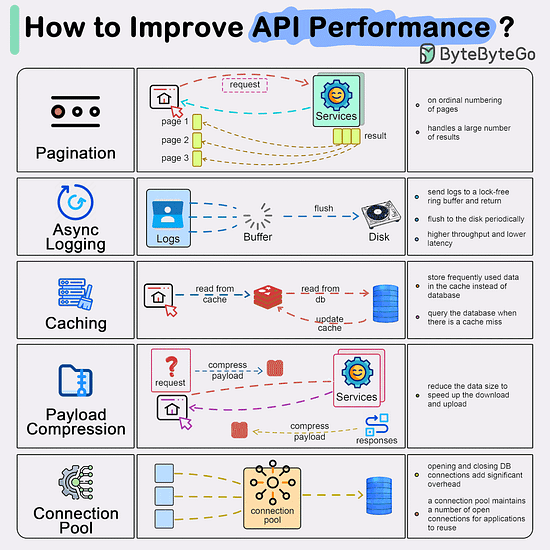
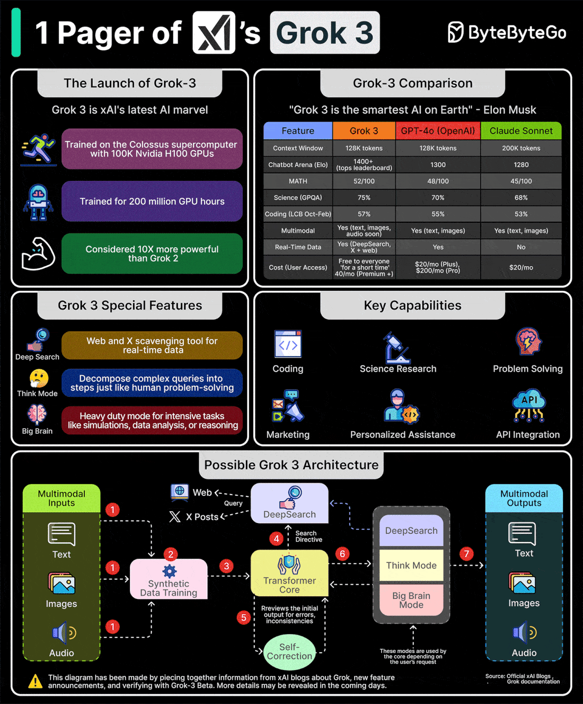

*Mời bạn thưởng thức Newsletter \#10.*

## [Gaining Years of Experience in a Few Months](https://marcgg.com/blog/2025/02/11/high-growth)

Bài viết của Marc G. Gauthier chia sẻ về cách đạt được nhiều năm kinh nghiệm trong một thời gian ngắn thông qua các dự án thách thức. Đây là một góc nhìn thú vị về sự phát triển nhanh trong sự nghiệp công nghệ.

Một số điểm chính:

1. **Các vùng phát triển:**
   - Vùng thoải mái (Comfort Zone): An toàn nhưng có nguy cơ tụt hậu
   - Vùng học tập (Learning Zone): Phát triển bền vững và ổn định
   - Vùng tăng trưởng nhanh (Fast Growth Zone): Đạt được nhiều năm kinh nghiệm trong thời gian ngắn
   - Vùng kiệt sức (Burnout Zone): Hậu quả của việc ở quá lâu trong vùng tăng trưởng nhanh

2. **Chu kỳ phát triển:**
   - Học tập <-> Tăng trưởng: Duy trì học tập liên tục, tận dụng cơ hội
   - Học tập -> Tăng trưởng -> Thoải mái -> Quay lại học tập: Sử dụng thời gian thoải mái để phục hồi
   - Thoải mái <-> Học tập: Cho phép nghỉ ngơi nhưng không nên ở quá lâu

3. **Kinh nghiệm cá nhân:**
   - Trải nghiệm từ việc Drivy được mua lại bởi Getaround
   - Phải giải quyết nhiều vấn đề phức tạp cùng lúc
   - Áp lực cao và deadline gấp
   - Đạt được nhiều thành tựu trong thời gian ngắn

4. **Điều kiện để tăng trưởng nhanh:**
   - Cơ hội thách thức bản thân
   - Môi trường phù hợp
   - Sức khỏe và năng lượng tốt
   - Hỗ trợ từ gia đình và đồng nghiệp

5. **Lưu ý quan trọng:**
   - Không nên duy trì tăng trưởng nhanh quá lâu
   - Cần cân bằng giữa phát triển và sức khỏe
   - Tận dụng cơ hội khi có thể
   - Biết khi nào cần nghỉ ngơi và phục hồi

## [Writing Better Commit Messages](https://refactoringenglish.com/chapters/commit-messages/)

Bài viết của Michael Lynch chia sẻ về cách viết commit message hiệu quả và dễ hiểu. Đây là một hướng dẫn chi tiết giúp cải thiện chất lượng commit message trong quá trình phát triển phần mềm.

Một số điểm chính:

1. **Cấu trúc cơ bản:**
   - Subject line ngắn gọn, rõ ràng (dưới 50 ký tự)
   - Body message chi tiết (wrap ở 72 ký tự)
   - Sử dụng thì hiện tại đơn (imperative mood)
   - Không cần dấu chấm ở cuối subject line

2. **Nội dung quan trọng:**
   - Giải thích WHY thay vì WHAT
   - Mô tả context của thay đổi
   - Liên kết đến issues hoặc tickets liên quan
   - Ghi chú về side effects nếu có

3. **Best Practices:**
   - Mỗi commit một mục đích
   - Tách commits logic và format
   - Sử dụng các prefix chuẩn (fix:, feat:, etc.)
   - Review commit message trước khi push

4. **Các lỗi thường gặp:**
   - Message quá ngắn hoặc không rõ ràng
   - Không giải thích lý do thay đổi
   - Mix nhiều thay đổi không liên quan
   - Sử dụng ngôn ngữ không chuyên nghiệp

5. **Tools và Conventions:**
   - Sử dụng Conventional Commits
   - Tích hợp commit hooks để validate
   - Dùng tools như commitlint
   - Template cho commit message

## [The Rotation Program That Keeps This Startup's Engineers Learning — and Not Leaving](https://review.firstround.com/the-rotation-program-that-keeps-this-startups-engineers-learning-and-not-leaving/)

Bài viết chia sẻ về chương trình luân chuyển nhân sự (rotation program) tại Checkr, một startup đã giúp giữ chân kỹ sư bằng cách tạo cơ hội học hỏi và phát triển liên tục. Đây là một case study thú vị về cách xây dựng văn hóa học tập và phát triển trong công ty công nghệ.

Một số điểm chính:

1. **Lý do triển khai chương trình:**
   - Giảm tỷ lệ nhân viên nghỉ việc (attrition rate gần 0%)
   - Tạo cơ hội học hỏi liên tục cho kỹ sư
   - Giữ chân nhân tài có kinh nghiệm
   - Tận dụng kiến thức chuyên môn trong nội bộ

2. **Cách triển khai:**
   - Cho phép kỹ sư làm việc tạm thời ở các team khác
   - Tập trung vào các dự án ưu tiên của công ty
   - Kết hợp với quá trình phát triển nghề nghiệp
   - Duy trì sự cân bằng giữa ổn định và luân chuyển

3. **Quy trình quản lý:**
   - Theo dõi và đánh giá hiệu quả của mỗi kỹ sư
   - Đảm bảo mỗi team có "anchor people" ổn định
   - Kiểm soát số lượng người luân chuyển cùng lúc
   - Đánh giá nhu cầu thực tế của dự án

4. **Thách thức và giải pháp:**
   - Quản lý lo ngại về việc mất nhân sự chủ chốt
   - Xây dựng niềm tin giữa các team
   - Tuyển dụng người có tinh thần hợp tác
   - Tập trung vào phát triển toàn diện

5. **Kết quả và bài học:**
   - 60% kỹ sư cấp cao ở lại hơn 6 năm
   - Tăng khả năng thích ứng với thay đổi
   - Phát triển kỹ năng đa dạng cho nhân viên
   - Xây dựng văn hóa học tập liên tục

## [Judge Your Coworkers](https://blog.staysaasy.com/p/judge-your-coworkers)

Bài viết của Stay SaaSy thảo luận về tầm quan trọng của việc đánh giá đồng nghiệp một cách xây dựng trong môi trường công ty. Đây là một góc nhìn thú vị về cách xây dựng văn hóa trách nhiệm và phát triển trong tổ chức.

Một số điểm chính:

1. **Tại sao cần đánh giá đồng nghiệp:**
   - Hiểu rõ công việc của nhau để hợp tác hiệu quả
   - Quan trọng với vai trò lãnh đạo và team cross-functional
   - Cần thiết để phát hiện và xử lý vấn đề hiệu suất
   - Giúp học hỏi và phát triển từ nhau

2. **Quy tắc cơ bản:**
   - Không công khai chỉ trích đồng nghiệp
   - Feedback được chia sẻ riêng tư với quản lý
   - Theo dõi và xử lý vấn đề một cách kín đáo
   - Không mong đợi đồng nghiệp hoàn hảo

3. **Cách thực hiện hiệu quả:**
   - Thiết lập kỳ vọng về việc đánh giá đồng nghiệp
   - Hỏi ý kiến định kỳ về hiệu suất của đồng nghiệp
   - Tận dụng các cuộc trò chuyện để dạy và học
   - Hiểu rõ vai trò và trách nhiệm của nhau

4. **Xử lý các tình huống:**
   - Khi đồng nghiệp làm tốt: Học hỏi từ thành công của họ
   - Khi có vấn đề: Tìm hiểu nguyên nhân và hỗ trợ cải thiện
   - Khi có hiểu lầm: Làm rõ vai trò và kỳ vọng
   - Khi cần hỗ trợ: Bù đắp điểm yếu của nhau

5. **Lưu ý quan trọng:**
   - Tránh văn hóa "không đổ lỗi" thái quá
   - Lãnh đạo cấp cao cần có quan điểm về hiệu suất đồng nghiệp
   - Tận dụng cơ hội học hỏi về vai trò khác
   - Cân bằng giữa trách nhiệm và phát triển

## [My LLM Codegen Workflow ATM](https://harper.blog/2025/02/16/my-llm-codegen-workflow-atm/)

Bài viết của Harper Reed chia sẻ về quy trình làm việc hiệu quả với LLM để tạo code. Đây là một hướng dẫn chi tiết về cách tận dụng AI để phát triển phần mềm nhanh và hiệu quả.

Một số điểm chính:

1. **Quy trình làm việc cơ bản:**
   - Brainstorm và lập kế hoạch chi tiết
   - Chia nhỏ các bước thực hiện
   - Thực thi từng bước với LLM
   - Kiểm tra và debug kết quả

2. **Công cụ và môi trường:**
   - Sử dụng Claude, Aider và các công cụ codegen khác
   - Thiết lập môi trường phát triển phù hợp
   - Tích hợp với các công cụ quản lý code
   - Tự động hóa các quy trình lặp lại

3. **Chiến lược hiệu quả:**
   - Tập trung vào các bước nhỏ, có thể kiểm soát
   - Duy trì kiểm soát tiến trình
   - Tận dụng thời gian chờ để làm việc khác
   - Cân bằng giữa tự động hóa và kiểm soát

4. **Xử lý các thách thức:**
   - Quản lý context và trạng thái
   - Xử lý các lỗi và vấn đề phát sinh
   - Tối ưu hóa quy trình làm việc
   - Duy trì chất lượng code

5. **Lưu ý quan trọng:**
   - Cần có kế hoạch rõ ràng trước khi bắt đầu
   - Kiểm soát tiến trình để tránh "over your skis"
   - Tận dụng thời gian chờ hiệu quả
   - Cân nhắc về tác động môi trường của LLM

## [Structured Logging in Spring Boot](https://www.javacodegeeks.com/structured-logging-in-spring-boot.html)

Bài viết của Yatin Batra chia sẻ về cách triển khai structured logging trong Spring Boot. Đây là một hướng dẫn chi tiết về cách cải thiện khả năng theo dõi và debug ứng dụng thông qua logging có cấu trúc.

Một số điểm chính:

1. **Tại sao cần Structured Logging:**
   - Tăng khả năng đọc và phân tích log
   - Dễ dàng tìm kiếm và lọc thông tin
   - Tích hợp tốt với các công cụ monitoring
   - Hỗ trợ debug hiệu quả hơn

2. **Cấu hình cơ bản:**
   - Sử dụng Logstash Logback Encoder
   - Cấu hình logback-spring.xml
   - Định dạng log theo JSON
   - Tích hợp với SLF4J

3. **Tính năng nâng cao:**
   - Thêm trường tùy chỉnh vào log
   - Tích hợp với Logstash
   - Cấu hình cho Loki
   - Sử dụng MDC cho metadata

4. **Chuẩn ECS và GELF:**
   - Elastic Common Schema cho Elastic Stack
   - Graylog Extended Log Format
   - So sánh và lựa chọn phù hợp
   - Tích hợp với các hệ thống khác

5. **Best Practices:**
   - Cấu hình phù hợp cho môi trường
   - Quản lý hiệu suất logging
   - Xử lý lỗi và exception
   - Bảo mật thông tin nhạy cảm

## [Secret Java Stream Hacks That Will Instantly Improve Your Coding Efficiency](https://gainjavaknowledge.medium.com/secret-java-stream-hacks-that-will-instantly-improve-your-coding-efficiency-8253d57d692b)

Bài viết của Gain Java Knowledge chia sẻ về các thủ thuật hữu ích khi sử dụng Java Stream API. Đây là một hướng dẫn chi tiết về cách tận dụng tối đa sức mạnh của Stream để cải thiện hiệu quả code.

Một số điểm chính:

1. **Collectors.teeing():**
   - Xử lý dữ liệu theo hai cách khác nhau cùng lúc
   - Kết hợp kết quả từ hai collector
   - Tránh phải duyệt stream nhiều lần
   - Ví dụ: Tính trung bình và tổng cùng lúc

2. **takeWhile() và dropWhile():**
   - Lấy phần tử cho đến khi điều kiện sai
   - Bỏ qua phần tử khi điều kiện đúng
   - Đơn giản hóa việc lọc có điều kiện
   - Tối ưu hiệu suất xử lý

3. **Các thủ thuật nâng cao:**
   - Sử dụng parallel streams hiệu quả
   - Tối ưu hóa memory usage
   - Xử lý exception trong streams
   - Kết hợp nhiều operation

4. **Best Practices:**
   - Chọn đúng collector cho từng trường hợp
   - Tránh side effects trong stream operations
   - Sử dụng method references khi có thể
   - Kiểm soát độ phức tạp của stream

5. **Lưu ý quan trọng:**
   - Hiểu rõ lazy evaluation
   - Cân nhắc hiệu suất với large datasets
   - Debug và maintain code dễ dàng
   - Tích hợp với các tính năng Java khác

## [Death of a Thousand Nits: Code Review Best Practices](https://bitfieldconsulting.com/posts/code-review)

Bài viết của John Arundel chia sẻ về cách thực hiện code review hiệu quả và thân thiện. Đây là một hướng dẫn chi tiết về cách xây dựng văn hóa review code tích cực trong team.

Một số điểm chính:

1. **Pair Review thay vì Review qua Text:**
   - Giao tiếp trực tiếp hiệu quả hơn
   - Giảm thiểu hiểu lầm và xung đột
   - Tăng tốc độ review và merge
   - Xây dựng mối quan hệ tốt trong team

2. **Cách đưa ra phản hồi hiệu quả:**
   - Tập trung vào việc thêm giá trị
   - Tránh chỉ trích về style
   - Đặt câu hỏi thay vì phê bình
   - Sử dụng ngôn ngữ tích cực

3. **Xử lý các tình huống khác nhau:**
   - Khi không hiểu code: Tìm hiểu trước khi hỏi
   - Khi có đề xuất: Đưa ra dưới dạng gợi ý
   - Khi phát hiện lỗi: Giải thích nhẹ nhàng
   - Khi nhận feedback: Lắng nghe và học hỏi

4. **Best Practices:**
   - Bắt đầu với những điểm tích cực
   - Kết thúc với lời động viên
   - Tập trung vào giá trị thực sự
   - Tránh nitpicking không cần thiết

5. **Xây dựng văn hóa review:**
   - Làm gương cho team
   - Tạo môi trường an toàn
   - Khuyến khích học hỏi lẫn nhau
   - Duy trì mối quan hệ tốt

## [Hash Functions Deep Dive](https://www.kirupa.com/data_structures_algorithms/hash_functions_deep_dive.htm)

Bài viết của Kirupa đi sâu vào phân tích về hash functions và cách chúng hoạt động. Đây là một hướng dẫn chi tiết về một khái niệm quan trọng trong khoa học máy tính.

Một số điểm chính:

1. **Định nghĩa và Mục đích:**
   - Hash function là hàm toán học chuyển đổi input thành output
   - Input có thể là bất kỳ dữ liệu số nào (text, file, binary data)
   - Output luôn có độ dài cố định
   - Được sử dụng trong nhiều lĩnh vực: lưu trữ dữ liệu, xác thực mật khẩu, kiểm tra tính toàn vẹn file

2. **Tiêu chí của một Hash Function tốt:**
   - Deterministic: Cùng input luôn cho cùng output
   - Uniform Distribution: Phân bố đều các giá trị hash
   - Fast Computation: Tính toán nhanh (O(1))
   - Avalanche Effect: Thay đổi nhỏ trong input tạo thay đổi lớn trong output
   - Fixed Output Size: Output luôn có độ dài cố định
   - Low Collision Rate: Tỷ lệ va chạm thấp
   - Non-Reversible: Khó tìm lại input từ output
   - No Correlation: Không có mối liên hệ giữa input và output tương tự

3. **Ví dụ về Hash Function đơn giản:**
   - Cộng mã ASCII của các ký tự
   - Sử dụng số nguyên tố để giảm va chạm
   - Dễ hiểu nhưng không đủ mạnh cho thực tế
   - Chỉ phù hợp cho mục đích học tập

4. **MD5 Hash Function:**
   - Output 32 ký tự hex (128 bits)
   - Thay đổi nhỏ trong input tạo thay đổi lớn trong output
   - Được sử dụng rộng rãi trong nhiều ứng dụng
   - Có một số điểm yếu về bảo mật

5. **Ứng dụng thực tế:**
   - Bảo vệ mật khẩu
   - Kiểm tra tính toàn vẹn file
   - Tạo chữ ký số
   - Tối ưu hóa hiệu suất cấu trúc dữ liệu

## [XOR: A Deep Dive into the Exclusive OR Operation](https://www.chiark.greenend.org.uk/~sgtatham/quasiblog/xor/)

Bài viết của Simon Tatham đi sâu vào phân tích về phép toán XOR và các ứng dụng của nó. Đây là một hướng dẫn chi tiết về một phép toán cơ bản nhưng quan trọng trong khoa học máy tính.

Một số điểm chính:

1. **Định nghĩa và Tính chất cơ bản:**
   - XOR là phép toán "Exclusive OR" (hoặc loại trừ)
   - Kết quả là 1 khi hai bit đầu vào khác nhau
   - Kết quả là 0 khi hai bit đầu vào giống nhau
   - Có tính chất giao hoán và kết hợp

2. **Các cách hiểu về XOR:**
   - Phép so sánh "không bằng" giữa hai bit
   - Phép đảo bit có điều kiện
   - Phép cộng modulo 2
   - Phép tính chẵn lẻ của số bit 1

3. **Ứng dụng trong mật mã học:**
   - Kết hợp plaintext với keystream
   - Tạo mã hóa đơn giản và hiệu quả
   - Sử dụng trong các hệ thống mã hóa phức tạp
   - Bảo vệ tính toàn vẹn dữ liệu

4. **Ứng dụng trong đồ họa:**
   - Vẽ và xóa pixel dễ dàng
   - Tạo hiệu ứng đặc biệt
   - Tối ưu hóa bộ nhớ
   - Xử lý hình ảnh hiệu quả

5. **Các ứng dụng thực tế khác:**
   - Hoán đổi giá trị hai biến không cần biến tạm
   - Tính trung bình hai số nguyên
   - Thực hiện phép cộng không nhớ
   - Giải quyết các bài toán tối ưu hóa

## Bonus: Vài ảnh hay ho đến từ [ByteByteGo](https://bytebytego.com/)

## Bonus 2: Vài video hay ho đến từ [Inside Java](https://inside.java/)

[Project Loom and Virtual Threads: Next Phases](https://inside.java/2025/02/22/devoxxbelgium-loom-next/)
