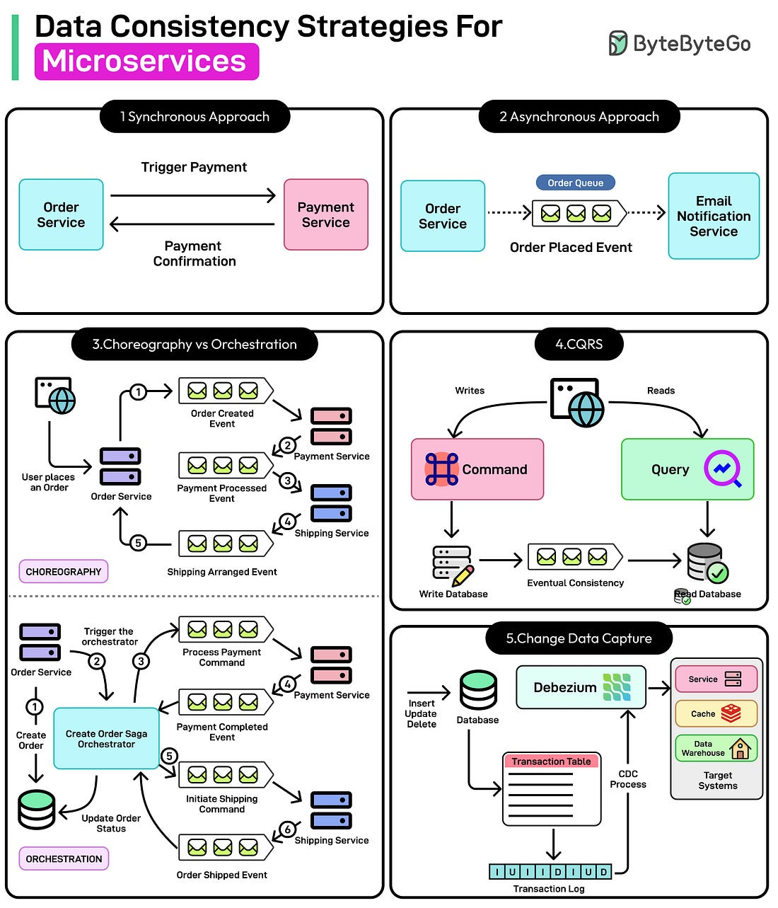

*Mời bạn thưởng thức Newsletter \#11.*

## [Enabling near real-time data analytics on the data lake](https://engineering.grab.com/enabling-near-realtime-data-analytics)

Bài viết chia sẻ cách Grab xây dựng hệ thống phân tích dữ liệu gần thời gian thực trên data lake. Các điểm chính:

- Sử dụng Apache Hudi để xử lý dữ liệu với độ trễ thấp
- Tối ưu hóa cho 2 loại nguồn dữ liệu: throughput cao (Kafka) và thấp (RDS)
- Cách tiếp cận khác nhau cho từng loại nguồn dữ liệu:
  - Nguồn throughput cao: Sử dụng Merge On Read (MOR) với Flink và Spark
  - Nguồn throughput thấp: Sử dụng Copy On Write (COW) đơn giản hơn
- Tác động tích cực:
  - Cung cấp metrics kinh doanh mới nhất
  - Phát hiện gian lận nhanh hơn

## [The Ultimate Guide To Software Architecture Documentation](https://www.workingsoftware.dev/software-architecture-documentation-the-ultimate-guide/)

Bài viết cung cấp hướng dẫn toàn diện về cách viết, cấu trúc, trực quan hóa và quản lý tài liệu kiến trúc phần mềm. Các điểm chính:

- Tại sao cần tài liệu hóa kiến trúc phần mềm:
  - Tạo sự hiểu biết chung cho các bên liên quan
  - Hỗ trợ công việc kiến trúc
  - Hướng dẫn team phát triển
  - Cải thiện giao tiếp với stakeholders

- Cách cấu trúc tài liệu:
  - Sử dụng mẫu arc42
  - Mô hình C4 cho trực quan hóa
  - 4 cấp độ: Context, Container, Component, Code

- Công cụ và phương pháp:
  - Documentation as Code
  - Diagrams as Code
  - Các công cụ như AsciiDoc, PlantUML, Structurizr

## [Beyond the Basics: Designing for a Million Users](https://javarevisited.substack.com/p/beyond-the-basics-designing-for-a)

Bài viết chia sẻ các khái niệm cốt lõi để thiết kế hệ thống có thể mở rộng từ 0 đến hàng triệu người dùng. Các điểm chính:

- Các vấn đề thường gặp khi mở rộng:
  - Server đơn lẻ bị quá tải
  - Sự cố làm cả hệ thống sập
  - Chi phí tài nguyên tăng đột biến
  - Vấn đề về độ trễ ở các khu vực địa lý khác nhau

- Giải pháp mở rộng:
  - Scale ngang thay vì scale dọc
  - Thiết kế stateless thay vì stateful
  - Sử dụng Load Balancer để phân phối tải
  - Chọn database phù hợp (SQL/NoSQL)
  - Replication và Sharding cho database
  - Caching cho dữ liệu truy cập thường xuyên
  - CDN cho nội dung tĩnh
  - Message Queue cho xử lý bất đồng bộ
  - Geo-routing cho người dùng toàn cầu
  - Logging và Monitoring toàn diện

## [Decision-Making Pitfalls for Technical Leaders](https://chelseatroy.com/2024/10/16/decision-making-pitfalls-for-technical-leaders/)

Bài viết chia sẻ 3 cạm bẫy phổ biến trong việc ra quyết định của các technical leader và cách tránh chúng:

1. **Giả định ngữ cảnh (Assuming Context)**
   - Áp dụng "best practice" mà không hiểu tại sao nó tốt
   - Không thể giải thích rõ ràng lý do cho team hoặc leadership
   - Dẫn đến giải pháp không phù hợp với vấn đề cụ thể

2. **Xem mọi thứ là chỉ số tối ưu (Treating Everything as an Optimizing Metric)**
   - Cố gắng tối ưu tất cả các khía cạnh cùng lúc
   - Kéo dài quá trình ra quyết định
   - Gây khó khăn cho các team phụ thuộc

3. **Tạo ra tình huống khẩn cấp (Manufacturing Emergencies)**
   - Không dự đoán được các sự kiện trong tương lai
   - Đánh giá quá cao mức độ nghiêm trọng của vấn đề
   - Tạo áp lực không cần thiết cho team

Giải pháp:
- Hiểu rõ tradeoffs của mỗi quyết định
- Phân biệt giữa optimizing metrics và satisficing metrics
- Giao tiếp minh bạch với team về áp lực từ leadership
- Hỗ trợ team thực hiện với ít xáo trộn nhất có thể

## [How I know I'm working with a strong engineer](https://www.seangoedecke.com/thoughts-about-engineers/)

Bài viết chia sẻ cách đánh giá một kỹ sư phần mềm giỏi thông qua hai suy nghĩ thường xuất hiện khi làm việc cùng họ:

1. **"Oh nice catch, I didn't think of that!"**
   - Khi kỹ sư phát hiện ra vấn đề mà bạn không nghĩ tới
   - Không phải là những phản hồi nhỏ nhặt, mà là những insight có giá trị
   - Giúp tránh bug, cải thiện UX, đơn giản hóa thiết kế
   - Nếu suy nghĩ này xuất hiện quá thường xuyên, có thể bạn nên để họ đưa ra các quyết định chính

2. **"Good, that'll work."**
   - Khi kỹ sư đưa ra giải pháp tương tự như bạn nghĩ
   - Cho thấy họ là người đáng tin cậy, có thể hoàn thành công việc
   - Đây cũng là một lời khen cao

Bài viết nhấn mạnh rằng có nhiều cách để đánh giá một kỹ sư giỏi, nhưng đây là một phương pháp đơn giản và hiệu quả để có cái nhìn ban đầu về năng lực của họ.

## [Ugly Code and Dumb Things](https://lucumr.pocoo.org/2025/2/20/ugly-code/)

Bài viết thảo luận về sự đánh đổi giữa code đẹp và code hiệu quả trong phát triển phần mềm. Các điểm chính:

1. **Hai đam mê, hai cách tiếp cận**
   - Tạo code đẹp, elegant: tập trung vào thiết kế rõ ràng và khả năng tái sử dụng
   - Giải pháp nhanh, thực tế: tập trung vào tốc độ và lặp lại để đáp ứng nhu cầu người dùng

2. **Triết lý của Flickr**
   - "Làm điều đơn giản nhất có thể hoạt động"
   - Ưu tiên scale, sharding, replication
   - Code có thể "xấu" nhưng hiệu quả trong việc giải quyết vấn đề thực tế

3. **Cân bằng giữa code đẹp và code hiệu quả**
   - Code hoàn hảo không đảm bảo thành công nếu không giải quyết vấn đề thực tế
   - Code "xấu" nhưng chức năng thường đi kèm với những thỏa hiệp phù hợp để phát triển nhanh
   - Dự án thành công sẽ trưởng thành và cần được tái cấu trúc khi thời điểm thích hợp

Bài viết kết luận rằng cả hai cách tiếp cận đều hợp lệ, nhưng hiếm khi tồn tại hài hòa trong cùng một codebase. Thách thức thực sự là quyết định khi nào nên chuyển từ giải pháp nhanh sang nền tảng vững chắc hơn.

## [Development Philosophy](https://develop.sentry.dev/getting-started/philosophy/)

Bài viết chia sẻ triết lý phát triển phần mềm của Sentry, được đúc kết từ hơn 10 năm kinh nghiệm. Các điểm chính:

1. **Cẩn thận với code "đẹp"**
   - Code không phải là nghệ thuật, mà là để giải quyết vấn đề của khách hàng
   - Cần cân bằng giữa abstraction và giải pháp "tạm thời"
   - Nên xin ý kiến từ người có kinh nghiệm khi cần

2. **Đúng không phải lúc nào cũng tốt**
   - Áp dụng nguyên tắc "be conservative in what you send, be liberal in what you accept"
   - Cần cân nhắc giữa tính đúng đắn và năng suất
   - Công cụ hữu ích có thể trở thành gánh nặng nếu áp dụng sai

3. **Chấp nhận giải pháp tạm thời**
   - "Duct tape" là công cụ tốt để thử nghiệm
   - Đôi khi giải pháp tạm thời có thể tồn tại lâu hơn tính năng
   - Giúp khám phá những gì thực sự cần xây dựng

4. **Xây dựng nền tảng vững chắc**
   - Không thể xây dựng toàn bộ doanh nghiệp trên giải pháp tạm thời
   - Sẵn sàng cam kết với các dự án kỹ thuật dài hạn
   - Ví dụ: từ llvm-symbolizer đến symbolicator service

5. **Các nguyên tắc khác**
   - Viết code dễ hiểu, tránh quá thông minh
   - Mọi người đều có thể đóng góp vào bất kỳ repository nào
   - Sử dụng Python, Rust và TypeScript làm ngôn ngữ chính
   - Tránh phụ thuộc vào database độc quyền
   - Cẩn thận với dependencies và chi phí của chúng
   - Luôn giữ mainline branch "xanh" (green)

## [AI is Stifling Tech Adoption](https://vale.rocks/posts/ai-is-stifling-tech-adoption)

Bài viết thảo luận về tác động của AI đối với việc áp dụng công nghệ mới trong phát triển phần mềm. Các điểm chính:

1. **Khoảng cách kiến thức (Knowledge Gap)**
   - Dữ liệu huấn luyện của AI thường bị giới hạn thời gian
   - Ví dụ: Claude 3.5 có cutoff tháng 4/2024, ChatGPT 4 có cutoff tháng 6/2024
   - Dẫn đến việc AI không thể hỗ trợ các công nghệ mới
   - Tạo ra vòng lặp ngược: thiếu hỗ trợ AI → ít người dùng → ít tài liệu → ít dữ liệu huấn luyện

2. **Ảnh hưởng của System Prompt**
   - AI có xu hướng ưu tiên một số công nghệ nhất định
   - Ví dụ: React và Tailwind thường được chọn cho các dự án web
   - Thậm chí có thể viết lại code theo "sở thích" của nó
   - Điều này ảnh hưởng đến quyết định của developer, đặc biệt là người mới

3. **Kết quả thử nghiệm**
   - Claude và ChatGPT: ưu tiên React + Tailwind
   - Gemini: ưu tiên HTML/CSS/JS thuần nhưng vẫn đề xuất React
   - DeepSeek: linh hoạt hơn nhưng cần nhiều prompt hơn

4. **Hệ quả**
   - Công nghệ phổ biến trước khi AI ra đời sẽ tiếp tục thống trị
   - Developer có thể chọn công nghệ dựa trên khả năng hỗ trợ của AI
   - Cần minh bạch hơn về bias công nghệ trong các mô hình AI

## [February - The Rest of the Story - JVM Weekly vol. 119](https://www.jvm-weekly.com/p/february-the-rest-of-the-story-jvm)

Bài viết tổng hợp các tin tức và cập nhật mới nhất trong thế giới JVM. Các điểm chính:

1. **Scala 3 LTS sắp tới**
   - Phiên bản LTS dự kiến ra mắt Q4/2025
   - Sẽ không còn hỗ trợ JDK 8
   - Đang cân nhắc giữa JDK 11 và 17 làm yêu cầu tối thiểu
   - Lý do: cần thay đổi implementation của lazy val do sun.misc.Unsafe

2. **Cập nhật Kotlin**
   - KotlinPoet 2.0: cải thiện việc xử lý khoảng trắng khi generate code
   - Dokka 2.0: công cụ tạo tài liệu với Gradle Plugin mới
   - Ktor CLI: công cụ dòng lệnh để tạo và quản lý dự án Ktor

3. **Công nghệ mới**
   - Pulumi Java 1.0: Infrastructure as Code cho Java
   - CheerpJ 3.1: JVM trên WebAssembly, hướng tới Java 11+ và JNI
   - JVM autoparallelizer: tự động song song hóa vòng lặp trong bytecode

4. **Các bài viết hay**
   - Hướng dẫn phỏng vấn Java Lead tại J.P. Morgan
   - Series về SOLID principles trong Kotlin
   - Agentic AI với Quarkus: tích hợp AI vào ứng dụng Java

## [Manager Antipatterns](https://blogs.newardassociates.com/blog/2024/management-antipatterns.html)

Bài viết tổng hợp các mẫu quản lý không hiệu quả thường gặp trong các công ty. Các điểm chính:

1. **Các mẫu quản lý không hiệu quả phổ biến**
   - "The Absentee Manager": Người quản lý vắng mặt
   - "The Bomb Manager": Muốn đập bỏ tất cả và làm lại từ đầu
   - "The C-Buddy Manager": Quản lý được bổ nhiệm vì là bạn của lãnh đạo
   - "The Funnel Manager": Chỉ truyền đạt thông tin từ cấp trên xuống
   - "The Hammer Manager": Chỉ biết một cách giải quyết vấn đề
   - "The Headless Chicken Manager": Hoảng loạn và không biết phải làm gì
   - "The Laissez-Faire Manager": Để mặc nhân viên tự làm
   - "The Lateral-Move Manager": Chuyển quản lý từ nhóm khác sang
   - "The Perfectionist Manager": Đòi hỏi mọi thứ phải hoàn hảo
   - "The Smartest-Engineer Manager": Thăng chức kỹ sư giỏi nhất làm quản lý
   - "The Sphinx Manager": Không giao tiếp rõ ràng
   - "The Tech-Lead Manager": Vừa làm quản lý vừa làm developer

2. **Cách khắc phục**
   - Khi bạn làm việc dưới quyền quản lý đó
   - Khi bạn là quản lý cấp trên của họ
   - Khi bạn chính là người quản lý đó

Bài viết nhấn mạnh tầm quan trọng của việc nhận diện và khắc phục các mẫu quản lý không hiệu quả để xây dựng môi trường làm việc tốt hơn.

## [Pause – Decision-Making Superpower](https://read.perspectiveship.com/p/pause)

Bài viết chia sẻ về tầm quan trọng của việc tạm dừng trước khi đưa ra quyết định. Các điểm chính:

1. **Tại sao cần tạm dừng?**
   - Tách biệt khỏi cảm xúc có thể làm mờ phán đoán
   - Kiểm tra các điểm mù
   - Có được góc nhìn mới
   - Tránh hối tiếc vì quyết định vội vàng

2. **Các tình huống cần tạm dừng**
   - Khi nhận được yêu cầu ước tính thời gian
   - Khi nhận được tin nhắn gây kích động
   - Khi phải trả lời câu hỏi khó trong tình huống căng thẳng
   - Khi cần đưa ra quyết định quan trọng

3. **Cách thực hiện**
   - Đặt ra quy tắc: "Tôi không trả lời ngay lập tức"
   - Dành thời gian suy nghĩ (vài giờ hoặc vài ngày)
   - Nếu không có câu trả lời, hãy nói rõ:
     - Điều gì nằm trong tầm kiểm soát
     - Điều gì nằm ngoài tầm kiểm soát
     - Các hành động đang được thực hiện

4. **Lợi ích**
   - Đưa ra quyết định tốt hơn
   - Tránh hối tiếc
   - Giao tiếp rõ ràng và chính xác hơn
   - Xây dựng niềm tin với người khác

Bài viết nhấn mạnh rằng việc tạm dừng là một kỹ năng quan trọng trong công việc và cuộc sống, giúp chúng ta tránh được nhiều sai lầm không đáng có.

## [APOSD vs Clean Code](https://github.com/johnousterhout/aposd-vs-clean-code/blob/main/README.md)

Bài viết ghi lại cuộc thảo luận giữa John Ousterhout (tác giả "A Philosophy of Software Design") và Robert Martin (tác giả "Clean Code") về những điểm khác biệt trong quan điểm của họ về thiết kế phần mềm. Các điểm chính:

1. **Độ dài của method**
   - Clean Code: Method nên rất ngắn (2-4 dòng), block trong if/while nên chỉ 1 dòng
   - APOSD: Method quá ngắn có thể gây ra vấn đề:
     - Interface nông (shallow): ẩn ít chức năng
     - Rối rắm (entanglement): phải đọc nhiều method để hiểu logic
     - Không giúp giảm lượng thông tin cần biết

2. **Comment**
   - Clean Code: Hạn chế comment, code nên tự giải thích
   - APOSD: Comment là cần thiết và không thể thay thế:
     - Hoàn thiện thông tin về interface
     - Giúp người đọc hiểu ý định của người viết
     - Tránh phải suy luận lại kiến thức đã có

3. **Test-Driven Development (TDD)**
   - Clean Code: Ưu tiên viết test trước, phát triển theo từng test nhỏ
   - APOSD: TDD có thể gây hại cho thiết kế:
     - Tập trung quá nhiều vào test thay vì thiết kế
     - Dễ dẫn đến code spaghetti
     - Cần nhiều refactoring để có thiết kế tốt

4. **Triết lý chung**
   - Clean Code: Tập trung vào các quy tắc cụ thể
   - APOSD: Tập trung vào mục tiêu cốt lõi:
     - Giảm độ phức tạp
     - Giảm lượng thông tin cần biết
     - Làm rõ thông tin quan trọng

Bài viết kết luận rằng cả hai tác giả đều có những điểm chung quan trọng, nhưng khác nhau trong cách tiếp cận để đạt được mục tiêu.

## [The Software Engineer Spectrum: Speed vs. Accuracy](https://benhowdle.im/software-engineer-spectrum)

Bài viết phân tích hai phong cách làm việc của kỹ sư phần mềm dựa trên 15 năm kinh nghiệm của tác giả. Các điểm chính:

1. **Phổ làm việc của kỹ sư phần mềm**
   - Speed-Oriented:
     - Tập trung vào tốc độ và khả năng lặp lại nhanh
     - Ưu tiên "ship now, improve later"
     - Phù hợp với startup, hackathon
     - Thách thức: tech debt, thiếu edge cases
   
   - Accuracy-Oriented:
     - Tập trung vào tính chính xác và ổn định lâu dài
     - Ưu tiên "make sure it's right before it goes live"
     - Phù hợp với enterprise, ngành có quy định
     - Thách thức: chậm, có thể over-engineering

2. **Phù hợp với từng giai đoạn công ty**
   - Startup (0 → 1):
     - Cần tốc độ để validate ý tưởng
     - Chấp nhận bug và thiếu hiệu quả
     - Phù hợp với speed-oriented engineers
   
   - Scaling (1 → 10):
     - Cần cân bằng giữa tốc độ và ổn định
     - Tập trung vào testing và kiến trúc
     - Cần engineers có thể nhìn xa hơn
   
   - Enterprise (10 → 100):
     - Ưu tiên ổn định và tuân thủ
     - Quy trình và quản trị rõ ràng
     - Phù hợp với accuracy-oriented engineers

3. **Tự đánh giá bản thân**
   - Bạn có thấy khó chịu với quyết định chậm?
   - Bạn có khó chịu khi ship code chưa hoàn hảo?
   - Bạn thích môi trường có cấu trúc hay linh hoạt?
   - Bạn thích prototype nhanh hay tinh chỉnh hệ thống?

4. **Lời khuyên cho leader**
   - Hiểu và tôn trọng cả hai phong cách
   - Xây dựng team cân bằng
   - Phân công công việc phù hợp với phong cách
   - Cho phép engineers phát triển và thay đổi

Bài viết nhấn mạnh rằng không có phong cách nào tốt hơn, mà quan trọng là tìm được môi trường phù hợp với phong cách của mình.

## [LLM Ecosystem Predictions](https://www.moderndescartes.com/essays/llm_predictions/)

Bài viết dự đoán về tương lai của hệ sinh thái LLM dựa trên các xu hướng hiện tại. Các điểm chính:

1. **Tập trung vào một số ít công ty**
   - Chi phí LLM giảm nhanh hơn Moore's Law (2x/6 tháng)
   - Cải tiến đến từ 3 nguồn:
     - Phần cứng: chip chuyên dụng
     - Kỹ thuật: tối ưu hóa hệ thống
     - Khoa học: đột phá trong nghiên cứu
   - Chỉ các công ty lớn có thể theo kịp tốc độ phát triển

2. **Simple agents sẽ thắng thế**
   - Tương tự như sự phát triển của phần mềm:
     - Ngôn ngữ bậc cao (Python, JS) thắng C/Java
     - Tốc độ lặp lại quan trọng hơn hiệu suất
   - Thay vì xây dựng framework phức tạp:
     - Sử dụng LLM mới nhất mỗi 6-12 tháng
     - Tập trung vào đánh giá chất lượng
     - Loại bỏ các thành phần không cần thiết

3. **Phân hóa DIY vs AI-as-a-Service**
   - Tương tự ngành phần mềm:
     - Managed services phát triển mạnh
     - DIY vẫn tồn tại cho người dùng đơn giản
   - "Excel cho LLM" sẽ xuất hiện:
     - Dễ sử dụng cho người ít kỹ thuật
     - Tự động hóa quy trình đơn giản
     - Phát triển trong 20 năm tới

4. **Chi phí và giá trị đa dạng**
   - Chi phí mỗi query:
     - Từ model nhỏ (100M params) đến lớn (1T params)
     - Từ text đơn giản đến đa phương tiện
     - Từ vài cent đến vài đô la mỗi giờ
   
   - Giá trị mang lại:
     - Thay thế công việc có chi phí cao:
       - Quản lý thông tin ($1000-10000/giờ)
       - Gia sư ($50-200/giờ)
       - Call center ($10/giờ)
     - Khả năng mở rộng và linh hoạt:
       - 24/7 coverage
       - Chất lượng đồng nhất
       - Triển khai toàn cầu nhanh chóng

Bài viết kết luận rằng thế giới năm 2030 sẽ thay đổi mạnh mẽ nhờ LLM, tương tự như sự thay đổi của điện thoại di động và Internet trong những thập kỷ trước.

## [The Right Kind of Stubborn](https://www.paulgraham.com/persistence.html)

Bài viết phân tích sự khác biệt giữa sự kiên trì (persistence) và sự bướng bỉnh (obstinacy) trong việc giải quyết vấn đề. Các điểm chính:

1. **Sự khác biệt cốt lõi**
   - Kiên trì: Gắn bó với mục tiêu, sẵn sàng thay đổi cách tiếp cận
   - Bướng bỉnh: Gắn bó với ý tưởng ban đầu, không muốn thay đổi
   - Người kiên trì lắng nghe phản hồi, người bướng bỉnh bỏ qua

2. **Cấu trúc của sự kiên trì**
   - Năng lượng: Không ngừng thử nghiệm
   - Trí tưởng tượng: Tìm ra cách tiếp cận mới
   - Khả năng phục hồi: Vượt qua thất bại
   - Phán đoán tốt: Đánh giá giá trị kỳ vọng
   - Mục tiêu rõ ràng: Định hướng nỗ lực

3. **Tại sao bướng bỉnh không hiệu quả**
   - Bám víu vào ý tưởng đầu tiên, ít thông tin nhất
   - Không lắng nghe phản hồi
   - Chỉ hoạt động với vấn đề đơn giản
   - Có thể thành công nhờ may mắn hoặc bù trừ lỗi khác

4. **Cách phát triển sự kiên trì**
   - Bắt đầu với mục tiêu nhỏ
   - Mở rộng dần khi đã có tiến bộ
   - Chấp nhận thay đổi ở các quyết định nhỏ
   - Giữ vững mục tiêu lớn

Bài viết kết luận rằng sự kiên trì đúng cách là sự kết hợp hiếm có của 5 phẩm chất, mang lại kết quả vượt trội so với sự bướng bỉnh đơn thuần.

## Bonus: Vài ảnh hay ho đến từ [ByteByteGo](https://bytebytego.com/)

