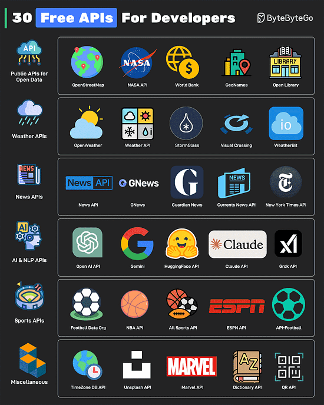
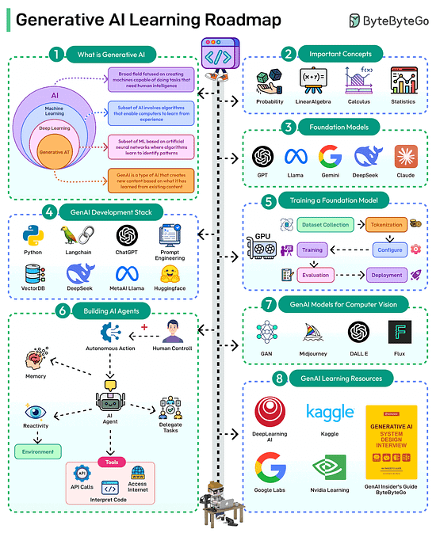
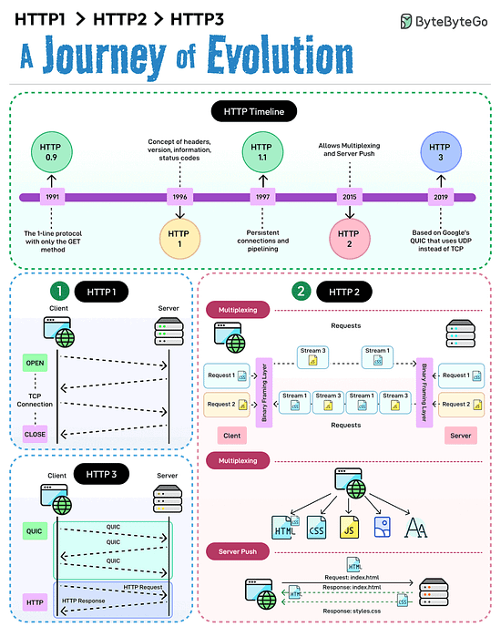
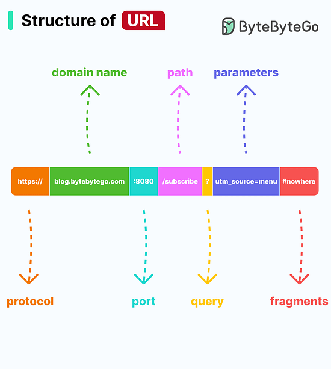

*Mời bạn thưởng thức Newsletter \#12.*

## [Fundamental Techniques for Software Architects](https://www.workingsoftware.dev/fundamental-techniques-for-software-architects/)

Bài viết này tổng hợp các kỹ thuật nền tảng mà mọi kiến trúc sư phần mềm nên biết, bao gồm cách tiếp cận phân tích hệ thống, thiết kế các thành phần linh hoạt, giao tiếp hiệu quả với các bên liên quan và đảm bảo hệ thống có thể mở rộng, bảo trì lâu dài. Đây là tài liệu hữu ích cho cả những người mới bắt đầu và các kiến trúc sư dày dạn kinh nghiệm muốn củng cố kiến thức cốt lõi.

## [The End of Programming as We Know It](https://www.oreilly.com/radar/the-end-of-programming-as-we-know-it/)

Bài viết này phân tích sự thay đổi lớn trong ngành lập trình khi AI trở thành đồng nghiệp của lập trình viên. Tác giả cho rằng AI sẽ giúp lập trình viên tăng năng suất gấp nhiều lần, đồng thời mở rộng phạm vi ứng dụng phần mềm trong doanh nghiệp và xã hội. Tuy nhiên, thay vì giảm nhu cầu nhân lực, AI sẽ tạo ra nhiều cơ hội mới, đòi hỏi lập trình viên phải liên tục học hỏi và sáng tạo. Bài viết cũng nhấn mạnh chất lượng sản phẩm sẽ ngày càng được nâng cao nhờ sự kết hợp giữa con người và AI.

## [In defense of simple architectures](https://danluu.com/simple-architectures/)

Bài viết này lập luận rằng nhiều hệ thống lớn, thành công vẫn có thể xây dựng dựa trên kiến trúc đơn giản như monolith với database truyền thống. Tác giả đưa ra ví dụ thực tế từ Wave và Stack Overflow để chứng minh rằng đơn giản giúp tiết kiệm chi phí, dễ bảo trì, giảm rủi ro vận hành và tập trung vào giá trị cho người dùng. Bài viết cũng cảnh báo về xu hướng chạy theo các kiến trúc phức tạp không cần thiết trong ngành công nghệ.

## [The trouble with "good enough"](https://newsletter.weskao.com/p/the-trouble-with-good-enough)

Bài viết này phân tích vấn đề khi các cá nhân hoặc đội nhóm dừng lại ở mức "đủ tốt" quá sớm, trước khi thực sự đạt đến điểm lợi ích cận biên giảm dần. Tác giả nhấn mạnh rằng mỗi người có định nghĩa khác nhau về "good enough", và nhiều khi chúng ta tự giới hạn tiêu chuẩn mà không nhận ra. Để tạo ra sản phẩm và kết quả xuất sắc, cần liên tục nâng cao tiêu chuẩn và đánh giá lại xem mình đã thực sự đạt đến mức tối ưu hay chưa.

## [Should managers still code?](https://theengineeringmanager.substack.com/p/should-managers-still-code)

Bài viết này bàn về câu hỏi muôn thuở: các engineering manager (EM) có nên tiếp tục viết code không? Tác giả cho rằng điều quan trọng là EM phải “ở trong code” (hiểu rõ codebase, review, nắm chi tiết kỹ thuật), nhưng không nhất thiết phải trực tiếp viết code hàng ngày. Việc này giúp EM duy trì sự kết nối với kỹ thuật, hỗ trợ team hiệu quả và tránh cảm giác “lạc lõng” với công việc cốt lõi của nhóm.

## [What is Saga Pattern in Distributed Systems?](https://newsletter.scalablethread.com/p/what-is-saga-pattern-in-distributed)

Bài viết này giải thích về Saga Pattern – một giải pháp giúp các hệ thống microservices phối hợp thực hiện các giao dịch phân tán. Saga Pattern đảm bảo tính nhất quán dữ liệu khi nhiều service độc lập cùng tham gia xử lý một yêu cầu (ví dụ: đặt hàng, thanh toán, vận chuyển...). Bài viết cũng chỉ ra điểm khác biệt giữa các giao dịch truyền thống (ACID) và cách tiếp cận Saga trong môi trường phân tán hiện đại.

## [What would happen if we didn't use TCP or UDP?](https://github.com/Hawzen/hdp)

Repo này ghi lại một loạt thử nghiệm thú vị: chuyện gì sẽ xảy ra nếu gửi các gói tin mạng sử dụng một giao thức vận chuyển không phải TCP, UDP hay ICMP – mà là một giá trị “tự chế”? Tác giả thực hiện các thí nghiệm thực tế trên máy cá nhân và qua Internet, khám phá cách hệ điều hành, router, firewall xử lý những gói tin “dị biệt” này. Đây là một ví dụ sinh động về cách tư duy khám phá, thử nghiệm và hiểu sâu về mạng máy tính hiện đại.

## [Scoped Values in Java 24 - Inside Java Newscast #86](https://www.youtube.com/watch?v=7tfUJLUbZiM)

Video này giới thiệu về Scoped Values – một tính năng mới trong Java 24 cho phép truyền dữ liệu bất biến giữa các phương thức, các luồng con một cách an toàn, tiện lợi và hiệu quả. Scoped Values giúp quản lý dữ liệu dùng chung trong phạm vi thực thi mà không cần dùng biến toàn cục hay ThreadLocal, từ đó nâng cao khả năng mở rộng và bảo trì mã nguồn.

## [Java 24 - Better Language, Better APIs, Better Runtime](https://www.youtube.com/watch?v=2NTyzL-9Bfo)

Video này điểm qua những cải tiến nổi bật trong các phiên bản Java mới nhất (từ 22 đến 24), bao gồm các tính năng ngôn ngữ hiện đại, API mới, và tối ưu hóa runtime. Các chủ đề nổi bật như unnamed patterns, module imports, Foreign Function & Memory API, và nhiều cải tiến giúp Java ngày càng mạnh mẽ, dễ dùng và hiệu quả hơn cho lập trình viên hiện đại.

## Bonus: Vài ảnh hay ho đến từ [ByteByteGo](https://bytebytego.com/)

## Bonus 2: Vài video hay ho đến từ [ByteByteGo](https://bytebytego.com/)

[8 Most Important Tips for Designing Fault-Tolerant System](https://www.youtube.com/watch?v=3Lis4w4_bBc)

## Bonus 3: Vài tài liệu hay ho đến từ [Redis.io](https://redis.io/)

[Cache and Message Broker for Microservices](doc/cache-and-message-broker-for-microservices-solution-brief.pdf)

[Caching at Scale With Redis](doc/caching-at-scale-with-redis-updated-2021-12-04.pdf)