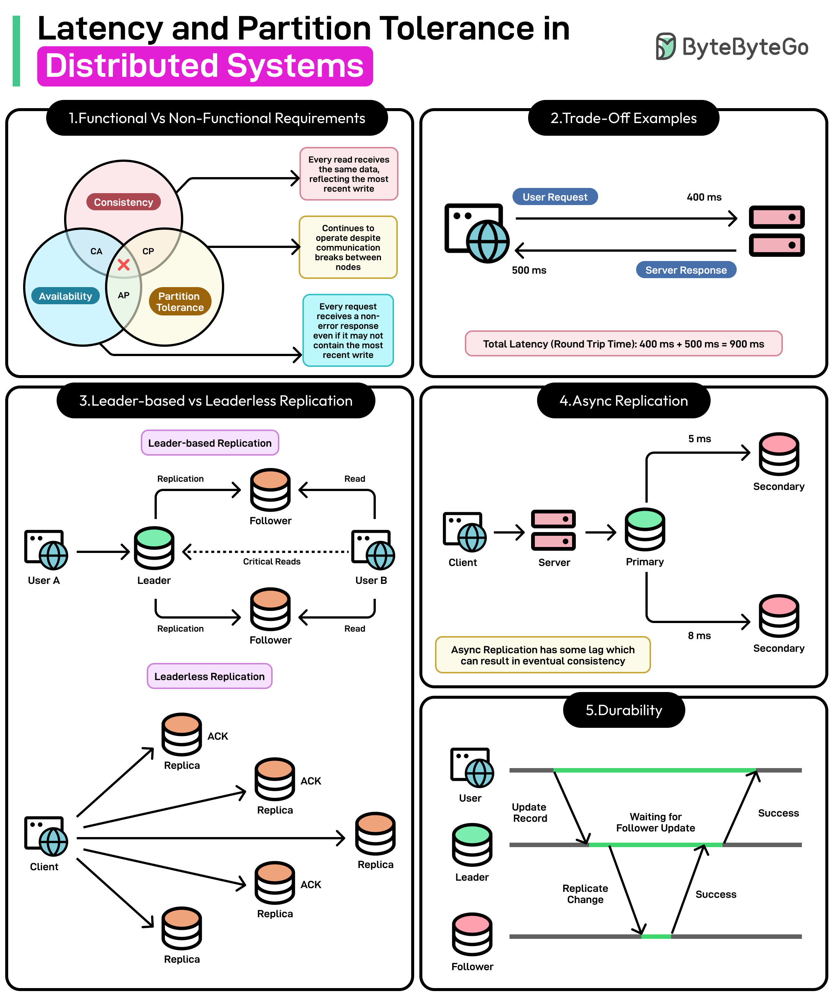

*Mời bạn thưởng thức Newsletter \#13.*

## [Designing a Distributed ID Generator](https://siddharthsabron.in/blog/id-generator/)

Bài viết này phân tích cách thiết kế và triển khai một hệ thống sinh ID phân tán hiệu quả. Tác giả trình bày các yêu cầu quan trọng của ID trong hệ thống phân tán như tính duy nhất, khả năng sắp xếp theo thời gian, hiệu suất cao và khả năng mở rộng. Bài viết so sánh các giải pháp khác nhau như UUID, cơ chế auto-increment của database, và đi sâu vào giải pháp Snowflake ID do Twitter phát triển. Đây là kiến thức thiết yếu cho các kỹ sư làm việc với hệ thống phân tán quy mô lớn.

## [3,200% CPU Utilization](https://josephmate.github.io/2025-02-26-3200p-cpu-util/)

Bài viết này mô tả một tình huống cực đoan khi tác giả phát hiện máy chủ của mình đạt tới mức sử dụng CPU 3,200% - tất cả 32 core đều hoạt động hết công suất. Điều thú vị là vấn đề này xuất phát từ race condition, một dạng lỗi thường được nghĩ đến trong context làm hỏng dữ liệu hoặc deadlock, chứ ít khi liên quan đến vấn đề hiệu năng. Bài viết cung cấp góc nhìn sâu sắc về cách phân tích và giải quyết các vấn đề hiệu năng phức tạp trong hệ thống đa luồng.

## [A map metaphor for architectural diagrams](https://www.giorgiosironi.com/2025/02/maps-metaphor-for-architectural-diagrams.html)

Bài viết này trình bày một cách tiếp cận thú vị khi sử dụng phép ẩn dụ về bản đồ để tạo và hiểu các sơ đồ kiến trúc phần mềm. Tác giả Giorgio Sironi so sánh việc thiết kế kiến trúc phần mềm với việc vẽ bản đồ hai chiều để biểu diễn một thế giới ba chiều phức tạp. Giống như cách bản đồ địa lý chọn lọc và trừu tượng hóa thông tin để làm nổi bật các yếu tố quan trọng, sơ đồ kiến trúc cũng cần phải đơn giản hóa hệ thống phức tạp mà vẫn giữ được bản chất và các mối quan hệ chính. Cách tiếp cận này giúp cải thiện giao tiếp giữa các bên liên quan và hỗ trợ việc ra quyết định trong quá trình phát triển phần mềm.

## [About "Developer philosophy"](https://tryingthings.wordpress.com/2025/02/28/about-developer-philosophy/)

Bài viết này phân tích và bình luận về triết lý phát triển phần mềm của tác giả qntm. Nó đưa ra những suy ngẫm về cách tiếp cận lập trình hiện đại, đặc biệt là những lời khuyên dành cho các lập trình viên mới vào nghề. Tác giả đặt ra câu hỏi thú vị về vai trò của các junior developer trong thời đại AI đang phát triển mạnh mẽ, đồng thời nhấn mạnh tầm quan trọng của việc xây dựng mã nguồn có tính bảo trì cao, rõ ràng và đơn giản. Bài viết kết hợp giữa kinh nghiệm cá nhân và những nguyên tắc phát triển phần mềm cốt lõi, tạo nên một góc nhìn đa chiều về nghề phát triển phần mềm hiện đại.

## [Team learning session: surviving legacy code by J.B. Rainsberger](https://www.giorgiosironi.com/2025/02/team-learning-session-surviving-legacy.html)

Bài viết này tổng hợp những kiến thức và chiến lược quý giá từ buổi học tập đội nhóm về cách làm việc hiệu quả với mã nguồn legacy (thừa kế), dưới sự hướng dẫn của chuyên gia J.B. Rainsberger. Tác giả chia sẻ các kỹ thuật thiết thực để tái cấu trúc mã nguồn cũ mà không làm gián đoạn hệ thống, nhấn mạnh phương pháp phát triển hướng kiểm thử (TDD) và việc xây dựng các characterization tests. Bài viết cung cấp lộ trình rõ ràng để cải thiện dần dần hệ thống legacy, giúp các đội phát triển có thể áp dụng ngay vào môi trường làm việc thực tế. Đây là tài liệu hữu ích cho bất kỳ ai đang phải đối mặt với thách thức của việc bảo trì và nâng cấp mã nguồn cũ.

## [Trimodal Nature of Tech Compensation in the US, UK and India](https://newsletter.pragmaticengineer.com/p/trimodal)

Bài viết này của Gergely Orosz, tác giả của bản tin The Pragmatic Engineer, phân tích sâu sắc về sự phân phối mức lương trong ngành công nghệ theo ba nhóm riêng biệt. Dựa trên phân tích hơn 20.000 điểm dữ liệu từ Levels.fyi, tác giả phát hiện rằng cùng một vị trí kỹ sư phần mềm có thể nhận được mức lương chênh lệch từ 2-4 lần, tùy thuộc vào loại công ty. Bài viết chia các công ty thành ba cấp độ: Cấp 1 là các công ty địa phương với mức lương thấp nhất, Cấp 2 là các công ty công nghệ có quy mô vừa phải, và Cấp 3 là các công ty công nghệ hàng đầu, các startup thành công và quỹ đầu tư với mức lương cao nhất. Đặc biệt, ở Mỹ, các quỹ đầu cơ thậm chí còn trả lương cao hơn cả các công ty Big Tech. Nghiên cứu này không chỉ giúp các kỹ sư hiểu rõ hơn về thị trường lương mà còn là thông tin quý giá cho những ai đang tìm kiếm cơ hội nghề nghiệp trong lĩnh vực công nghệ.

## [9 Software Architecture Patterns for Distributed Systems](https://dev.to/somadevtoo/9-software-architecture-patterns-for-distributed-systems-2o86)

Bài viết này giới thiệu chín mẫu kiến trúc phần mềm quan trọng cho hệ thống phân tán, đóng vai trò then chốt trong việc thiết kế các ứng dụng phân tán hiệu quả. Tác giả trình bày chi tiết về các mẫu như Peer-to-Peer (giao tiếp ngang hàng không cần điều phối trung tâm), API Gateway (điểm vào duy nhất cho nhiều dịch vụ), Pub-Sub (truyền thông không đồng bộ thông qua các chủ đề), Request-Response (giao tiếp đồng bộ giữa client và server), Event Sourcing (lưu trữ các thay đổi trạng thái dưới dạng sự kiện), ETL (trích xuất, biến đổi và tải dữ liệu), Batching (xử lý dữ liệu theo lô), Stream Processing (xử lý dữ liệu liên tục) và Orchestration (điều phối luồng công việc giữa các dịch vụ). Mỗi mẫu được phân tích về ưu điểm, nhược điểm và tình huống áp dụng phù hợp, giúp các kiến trúc sư và nhà phát triển có thể lựa chọn đúng mẫu thiết kế cho từng yêu cầu cụ thể trong hệ thống của họ.

## [Extending Java APIs - Add Missing Features Without the Hassle](https://foojay.io/today/extending-java-apis-add-missing-features-without-the-hassle/)

Bài viết này trình bày cách mở rộng các API Java để thêm tính năng mới mà không cần chờ đợi các bản cập nhật chính thức từ Oracle. Tác giả giới thiệu công cụ Manifold, cho phép nhà phát triển liền mạch bổ sung các phương thức còn thiếu vào các lớp trong API Java mà không làm thay đổi mã nguồn gốc. Phương pháp này duy trì tính tương thích ngược và tránh rủi ro khi mở rộng chức năng. Bài viết đưa ra các ví dụ cụ thể về việc thêm phương thức tiện ích vào các lớp chuẩn như String, File, và các lớp Collection. Đây là công cụ hữu ích cho các nhà phát triển Java muốn cải thiện trải nghiệm lập trình mà không cần viết các lớp wrapper phức tạp hoặc chờ đợi các tính năng xuất hiện trong phiên bản Java tiếp theo.

## [How Spring Boot Reloads Configuration Without Restart](https://medium.com/@AlexanderObregon/how-spring-boot-reloads-configuration-without-restart-4d9dc9e8b926)

Bài viết này đi sâu vào cơ chế cho phép Spring Boot tải lại cấu hình mà không cần khởi động lại ứng dụng. Tác giả Alexander Obregon giải thích cách Spring Boot sử dụng Spring Cloud Config Server kết hợp với Actuator endpoints để triển khai tính năng cập nhật cấu hình động (dynamic configuration updates). Bài viết mô tả chi tiết về cách cấu hình @RefreshScope annotation cho các bean cần được làm mới, cách thiết lập webhook để tự động cập nhật khi cấu hình thay đổi trong kho lưu trữ, và các phương pháp tối ưu để quản lý việc làm mới cấu hình trong môi trường phân tán. Đây là kiến thức thiết yếu cho các nhà phát triển Spring Boot muốn xây dựng ứng dụng có khả năng cập nhật cấu hình linh hoạt mà không cần thời gian chết (downtime), đặc biệt hữu ích trong các môi trường production yêu cầu tính khả dụng cao.

## [Building High-Performance RPC Services with gRPC and Spring Boot](https://www.javacodegeeks.com/2025/03/building-high-performance-rpc-services-with-grpc-and-spring-boot.html)

Bài viết này hướng dẫn chi tiết về cách kết hợp gRPC với Spring Boot để xây dựng các dịch vụ RPC hiệu năng cao. Tác giả giới thiệu về ưu điểm của gRPC so với REST API truyền thống, bao gồm giao thức nhẹ hơn, hiệu suất cao hơn nhờ sử dụng Protocol Buffers và HTTP/2, cũng như khả năng tạo mã tự động cho nhiều ngôn ngữ. Bài viết trình bày từng bước cách thiết lập dự án Spring Boot với gRPC, cách định nghĩa các service thông qua Protocol Buffers (.proto files), và cách triển khai cả phía server và client. Ngoài ra, tác giả cũng đề cập đến các chiến lược tối ưu hóa hiệu suất, xử lý lỗi, và triển khai các tính năng nâng cao như streaming và authentication. Đây là tài liệu toàn diện cho các nhà phát triển Java muốn nâng cao hiệu suất giao tiếp giữa các microservice trong hệ thống phân tán.

## Bonus: Vài ảnh hay ho đến từ [ByteByteGo](https://bytebytego.com/)

## Bonus 2: Vài video hay ho đến từ [ByteByteGo](https://bytebytego.com/)

[8 Most Important Tips for Designing Fault-Tolerant System](https://www.youtube.com/watch?v=3Lis4w4_bBc)

