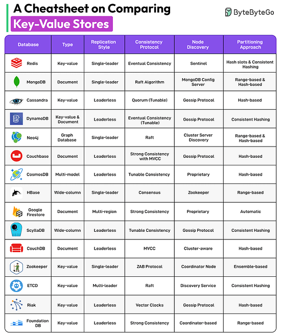
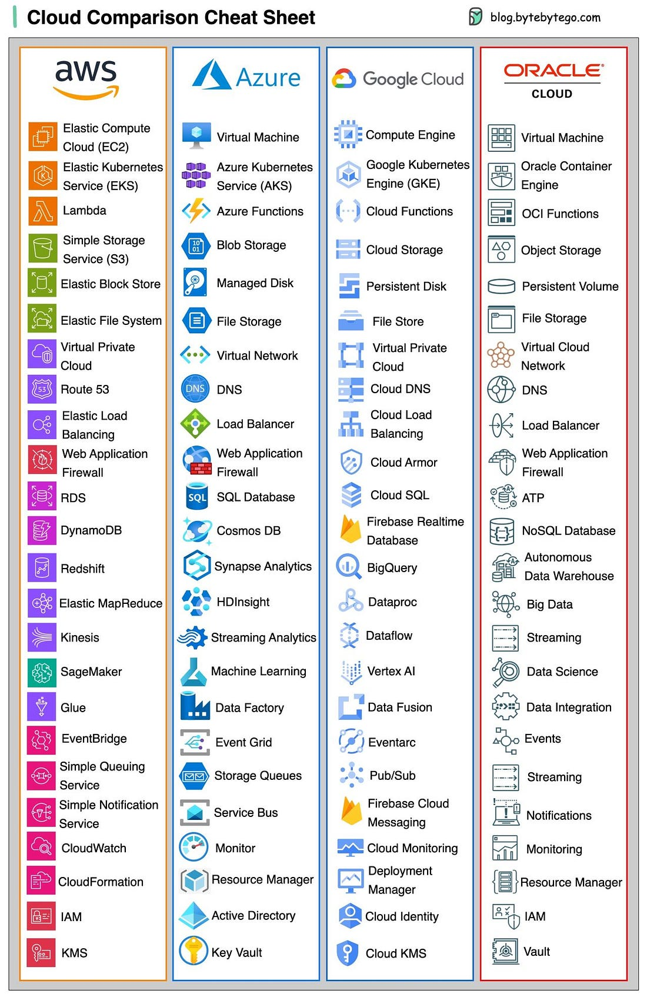
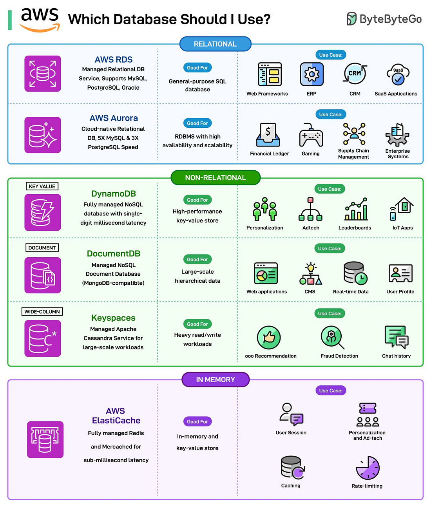

*Mời bạn thưởng thức Newsletter \#14.*

## [Bloom Filter: A Deep Dive](https://www.kirupa.com/data_structures_algorithms/bloom_filter.htm)

Bài viết giới thiệu về Bloom filter - một cấu trúc dữ liệu xác suất hiệu quả về không gian, được thiết kế để kiểm tra nhanh xem một phần tử có thuộc tập hợp hay không. Bloom filter hoạt động bằng cách lưu trữ "dấu vân tay" của dữ liệu thay vì lưu trữ toàn bộ dữ liệu, sử dụng một mảng bit và nhiều hàm băm.

Ưu điểm chính của Bloom filter là tiết kiệm bộ nhớ đáng kể (có thể giảm 13-20 lần so với hashtable) và tốc độ kiểm tra nhanh O(k) với k là số lượng hàm băm. Tuy nhiên, Bloom filter là cấu trúc dữ liệu xác suất - nó có thể trả lời chắc chắn khi một phần tử KHÔNG tồn tại, nhưng chỉ có thể đưa ra câu trả lời "có thể có" khi phần tử tồn tại (có tỷ lệ dương tính giả).

Bài viết cũng hướng dẫn cách tối ưu kích thước mảng bit và số lượng hàm băm dựa trên số lượng phần tử và tỷ lệ dương tính giả mong muốn. Đây là tài liệu hữu ích cho các lập trình viên muốn hiểu và áp dụng Bloom filter trong các hệ thống cần kiểm tra thành viên nhanh chóng với bộ nhớ hạn chế.

## [Rethinking LLM inference: Why developer AI needs a different approach](https://www.augmentcode.com/blog/rethinking-llm-inference-why-developer-ai-needs-a-different-approach)

Bài viết này trình bày các tối ưu kỹ thuật giúp giảm mạnh độ trễ và tăng throughput khi chạy mô hình LLM cho các ứng dụng AI lập trình. Augment Code tập trung vào việc xử lý context lớn (hàng chục ngàn tokens) với tốc độ cao, sử dụng các kỹ thuật như token-level batching, tối ưu FLOPS, CUDA Graphs, FlashAttention-3 và custom CUDA kernels. Kết quả cho thấy hệ thống inference của họ đạt <300ms time-to-first-token với 10k input tokens trên Llama3 70B, tận dụng hiệu quả tài nguyên GPU và vượt trội so với các giải pháp phổ biến hiện nay. Nếu bạn quan tâm đến tối ưu hóa hệ thống AI cho lập trình viên, đây là tài liệu rất đáng đọc!

## [Floyd’s Cycle Algorithm: Fraud Detection in Java Systems](https://dzone.com/articles/floyds-cycle-algorithm-fraud-detection-java-systems)

Bài viết này giới thiệu cách ứng dụng thuật toán phát hiện chu trình (Floyd’s Cycle Detection, hay còn gọi là Tortoise and Hare) trong việc phát hiện gian lận tài chính. Thuật toán giúp nhận diện các vòng lặp trong đồ thị giao dịch, ví dụ như các chuỗi chuyển tiền quay lại tài khoản gốc – một dấu hiệu điển hình của hành vi rửa tiền. Bài viết trình bày ví dụ thực tế về phát hiện vòng lặp trong các giao dịch ngân hàng, ưu nhược điểm của thuật toán, cũng như các lĩnh vực ứng dụng rộng rãi khác như phát hiện vòng lặp trong linked list, tối ưu hệ thống phân tán, phân tích dữ liệu sinh học, AI/ML và blockchain. Đây là một ví dụ điển hình về việc áp dụng thuật toán kinh điển vào các bài toán thực tế trong hệ thống Java.

## [Succinct data structures](https://blog.startifact.com/posts/succinct/)

Bài viết giới thiệu về các cấu trúc dữ liệu súc tích (succinct data structures) - một lĩnh vực tương đối mới trong khoa học máy tính. Khác với nén dữ liệu thông thường (yêu cầu giải nén trước khi sử dụng), các cấu trúc dữ liệu súc tích lưu trữ thông tin một cách nhỏ gọn nhưng vẫn cho phép truy vấn và thao tác trực tiếp trên dữ liệu đã nén.

Tác giả giới thiệu một số cấu trúc dữ liệu súc tích quan trọng:

1. **Rank/Select Bit Vector**: Cấu trúc nền tảng cho phép đếm số bit đã được đặt trước một vị trí (rank) hoặc tìm vị trí của bit thứ n (select) trong thời gian hằng số
2. **Wavelet Matrix**: Mở rộng rank/select cho các bảng chữ cái lớn hơn (không chỉ 0 và 1)
3. **FM-index**: Cho phép tìm kiếm mẫu con trong văn bản lớn một cách hiệu quả
4. **Balanced Parentheses**: Biểu diễn cây dữ liệu chỉ với 2 bit/nút thay vì 32 byte như cách thông thường

Bài viết cũng đề cập đến các ứng dụng thực tế như xử lý XML, DNA và AST của ngôn ngữ lập trình, cùng với các thư viện Rust hiện có như `vers`, `sucds` và `fm-index`. Đây là một lĩnh vực đầy tiềm năng cho các ứng dụng cần xử lý dữ liệu lớn với bộ nhớ hạn chế.

## [The art of engineering team focus: less is more](https://resources.github.com/developer-productivity/engineering-team-focus/)

Bài viết từ GitHub Resources trình bày một quan điểm ngược với trực giác thông thường: để đội ngũ kỹ thuật làm việc hiệu quả hơn, họ cần làm ít việc hơn cùng một lúc. Tác giả lập luận rằng việc phân tán nguồn lực vào nhiều tác vụ song song thường dẫn đến hiệu suất thấp hơn, không phải cao hơn.

Bài viết đưa ra năm nguyên tắc cốt lõi để xây dựng đội ngũ kỹ thuật linh hoạt và hiệu quả:

1. **Làm cho mọi công việc đều rõ ràng**: Khi tất cả công việc đều được hiển thị, không thể bỏ qua thực tế về khả năng của đội ngũ và dễ dàng đưa ra quyết định về việc nên ưu tiên điều gì.

2. **Chia nhỏ công việc**: Giới hạn công việc trong các chu kỳ 1-2 tuần giúp duy trì động lực, tạo điều kiện cho phản hồi thường xuyên và giảm thiểu rủi ro khi cần thay đổi hướng.

3. **Hạn chế công việc đang thực hiện**: Chuyển đổi ngữ cảnh giữa nhiều dự án có chi phí cao về mặt nhận thức. Nghiên cứu cho thấy có thể mất đến 23 phút để lấy lại sự tập trung sau mỗi lần chuyển đổi.

4. **Tài trợ đến mức tối đa**: Tập trung nhiều nhà phát triển vào một tính năng ưu tiên cao nhất có thể trước khi chuyển sang việc tiếp theo, thay vì phân bổ mỗi nhà phát triển cho một tính năng riêng biệt.

5. **Dành chỗ cho những điều không lường trước**: Duy trì khoảng 20% dung lượng đệm để xử lý công việc không lường trước, cho phép đội ngũ phản ứng với vấn đề mà không làm trật bánh công việc đã lên kế hoạch.

Bài viết kết luận rằng đội ngũ có dung lượng đệm thường đổi mới hơn, linh hoạt hơn và cuối cùng là năng suất hơn. Đôi khi, điều mạnh mẽ nhất mà một nhà lãnh đạo có thể làm là bớt việc cho đội của mình thay vì thêm việc.

## [Performance optimization, and how to do it wrong](https://genna.win/blog/convolution-simd/)

Bài viết chia sẻ kinh nghiệm tối ưu hóa thuật toán tích chập (convolution) bằng SIMD trên CPU. Tác giả mô tả hành trình đầy thử thách khi cố gắng cải thiện hiệu suất, nhưng lại vô tình làm code chậm hơn gấp đôi. Qua quá trình gỡ lỗi, tác giả rút ra ba bài học quan trọng: (1) các lệnh rẽ nhánh (branch) trong vòng lặp có thể làm giảm hiệu suất nghiêm trọng do CPU không thể dự đoán nhiều hơn một nhánh mỗi chu kỳ; (2) tách vòng lặp thành hai phần riêng biệt (một cho trường hợp thông thường, một cho trường hợp biên) hiệu quả hơn việc kiểm tra điều kiện trong mỗi lần lặp; (3) việc inline hàm trong Rust rất quan trọng khi sử dụng SIMD, vì nếu không được inline, compiler có thể tạo ra code gọi hàm qua stack thay vì sử dụng trực tiếp các lệnh SIMD.

## [Supercharging Discord Mobile: Our Journey to a Faster App](https://discord.com/blog/supercharging-discord-mobile-our-journey-to-a-faster-app)

Bài viết giới thiệu các cải tiến hiệu suất của Discord trên nền tảng di động. Đội ngũ kỹ thuật đã tập trung vào năm lĩnh vực chính: (1) Ảo hóa danh sách server giúp giảm 14% bộ nhớ và 10% thời gian khởi động; (2) Tối ưu hiệu suất chat bằng cơ chế tái sử dụng component và lazy loading, giúp giảm 60% khung hình bị lag; (3) Xây dựng emoji picker native cho Android thay vì dùng React Native, giải quyết vấn đề màn hình trắng khi cuộn; (4) Chuyển từ FlashList sang FastList tự phát triển để khắc phục hiện tượng "blanking" trong danh sách kênh; (5) Cải thiện Media Picker trên iOS bằng cách sử dụng thumbnail độ phân giải thấp hơn nhưng tải nhanh hơn. Năm 2025, Discord sẽ tiếp tục tối ưu với React Native New Architecture và chuyển logic cốt lõi sang Rust.

## [Git without a forge](https://www.chiark.greenend.org.uk/~sgtatham/quasiblog/git-no-forge/)

Bài viết của Simon Tatham (tác giả PuTTY) thảo luận về việc sử dụng Git mà không cần dựa vào các nền tảng forge phổ biến như GitHub hay GitLab. Tác giả trình bày các phương pháp thay thế để chia sẻ và cộng tác trên mã nguồn, bao gồm việc sử dụng URL trực tiếp của repository, git bundle và trao đổi patch qua email. Bài viết nhấn mạnh rằng các công cụ tích hợp của các forge như hệ thống issue tracking và pull/merge request không phải là thành phần thiết yếu của Git, và lập trình viên có thể tự do lựa chọn các giải pháp phù hợp với quy trình làm việc của mình mà không bị ràng buộc vào một nền tảng cụ thể.

## [40 Thoughts On Turning 40](https://newsletter.pathlesspath.com/p/40-thoughts-on-turning-40-287)

Bài viết của Paul Millerd chia sẻ 40 suy nghĩ khi tác giả bước sang tuổi 40, được chia thành bốn chủ đề chính. Về sự thay đổi, tác giả nhấn mạnh rằng quyết định từ bỏ sự nghiệp thành công để theo đuổi con đường không chắc chắn hơn là quyết định quan trọng nhất trong độ tuổi 30. Về công việc, ông chỉ ra rằng khao khát thoát khỏi công việc khiến nhiều người mắc kẹt trong tình huống không lý tưởng, trong khi tìm kiếm "công việc tốt" - công việc mang lại sự hài lòng cả trong hiện tại và khi nhìn lại - mới là điều đáng theo đuổi. Về mối quan hệ, tác giả chia sẻ rằng tìm được người bạn đời phù hợp là điều may mắn, và khuyên mọi người đừng từ bỏ việc tìm kiếm. Cuối cùng, về hạnh phúc, ông nhận xét rằng viết lách là một trong những hành động mạnh mẽ nhất trên thế giới, nhưng hãy cẩn thận với sức mạnh của nó trong việc phơi bày những khát vọng thực sự của bạn.

## Bonus: Vài ảnh hay ho đến từ [ByteByteGo](https://bytebytego.com/)

## Bonus 2: Vài video hay ho đến từ [ByteByteGo](https://bytebytego.com/)

[What Is the Most Popular Open-Source AI Stack?](https://www.youtube.com/watch?v=hFURlsMwU7c)
