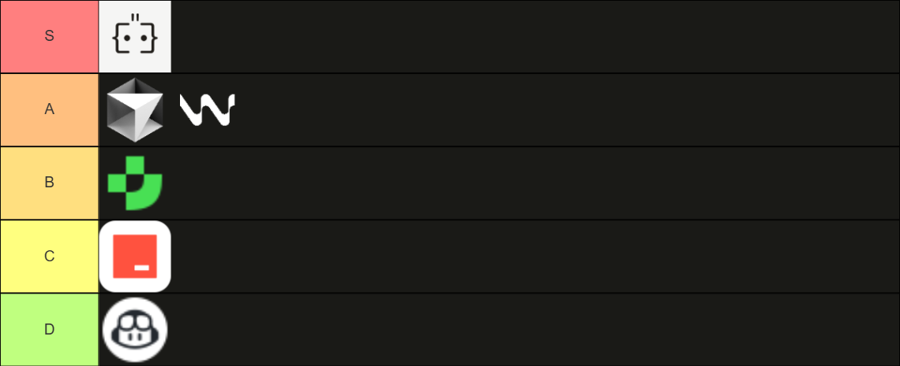

*Đây chỉ là đánh giá cá nhân. Mình cũng chỉ thường xài Agent cho các project cá nhân nhỏ nhỏ thôi nên có thể không chính xác. Bài viết chỉ nhằm mục đích bày tỏ quan điểm*

## Giải thích

### Augment

Augment có cơ chế tự index codebase khá tốt, ngoài ra hiện đang Augment đang **unlimit** cho gói Developer, khá hời so với mức giá 30$ (mình khá là serious với những cái "unlimit" dù biết rằng vốn dĩ chẳng có gì là không giới hạn :D)

### Cursor & Windsurf

Cả 2 tool này đều khá tốt, Cursor ban đầu tỏ ra khá vượt trội, nhưng trong các bản gần đây, Windsurf cũng có những cải thiện đáng kể. Ngoài ra OpenAI cũng đã mua lại Windsurf, có thể trong tương lai Windsurf sẽ tốt hơn

Về giá cả, Cursor cho phép unlimit "slow premium request", khá hấp dẫn. Windsurf cũng tỏ ra không hề kém cạnh khi giá khởi điểm 15$ hấp dẫn hơn Cursor (20$), tuy nhiên Windsurf sẽ giới hạn 500 prompt credits/tháng.

### Junie

Trong những ngày đầu ra mắt Junie còn nhiều điểm cần cải thiện, cá nhân mình thấy Junie index khá lâu, khi hỏi đôi khi còn phải đọc lại cả file, rất mất thời gian.

### Trae & Github Copilot

Cả 2 tool này mình thấy đều không tự tìm được file phù hợp, đều cần chúng ta include hộ. Nhưng mà Trae free, còn Copilot tốn phí, nên là Trae rank C, còn Copilot rank D.

## Bonus

Ngoài ra mình có tìm được một bài có tierlist nhiều công cụ hơn, các bạn có thể tham khảo thử

[Best AI for coding in 2025: 25 developer tools to use (or avoid)](https://www.pragmaticcoders.com/resources/ai-developer-tools)