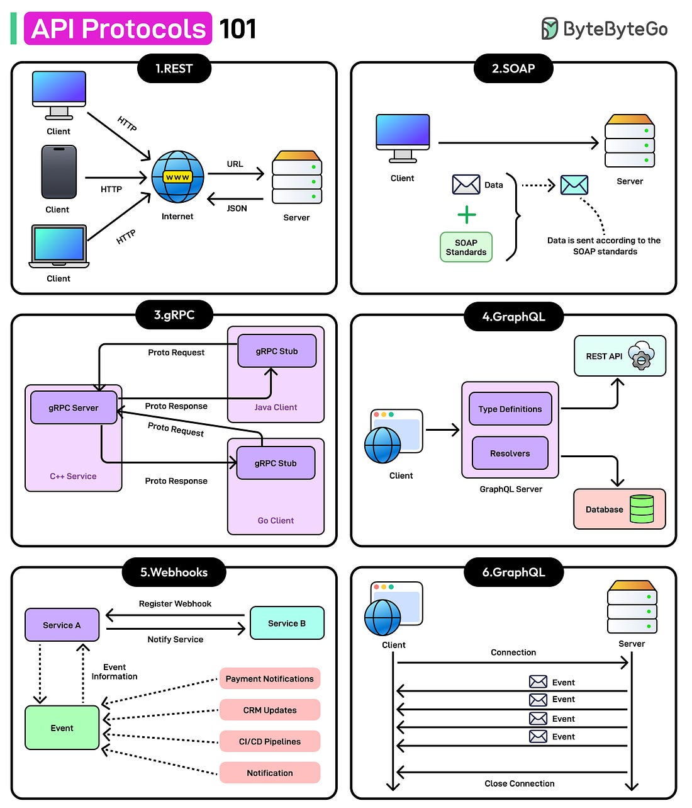

*Mặc định thì mình follow theo format mỗi ngày chỉ viết 1 post, nhưng mà dạo gần đây lười viết bài nên tích được nhiều bài hay ho quá, nên tạm thời trong thời gian tới sẽ trick lỏ viết lùi thời gian và cố gắng viết nhiều hơn để "kịp hết bài". VD như nay là 10/5 nhưng mình viết cho 2/5 vậy, check git history là ra à, hehe. Mời bạn thưởng thức Newsletter \#15.*

## [Here’s how I use LLMs to help me write code](https://simonwillison.net/2025/Mar/11/using-llms-for-code/)

Bài viết của Simon Willison chia sẻ kinh nghiệm sử dụng mô hình ngôn ngữ lớn (LLM) trong phát triển phần mềm. Tác giả đưa ra 5 cách sử dụng LLM hiệu quả cho lập trình viên:

1. **Giải thích code**: Sử dụng LLM để hiểu code phức tạp, đặc biệt là code của người khác hoặc code cũ của chính mình.

2. **Viết test**: LLM rất giỏi trong việc tạo test cases, đặc biệt là unit test và integration test, giúp tăng độ bao phủ và phát hiện lỗi.

3. **Refactoring code**: Sử dụng LLM để cải thiện cấu trúc code, tách các hàm phức tạp thành các hàm nhỏ hơn, dễ bảo trì hơn.

4. **Viết documentation**: LLM có thể tạo ra tài liệu hướng dẫn, docstrings và README chất lượng cao dựa trên code hiện có.

5. **Tạo code mới**: Sử dụng LLM để viết code từ đầu, nhưng luôn phải kiểm tra kỹ kết quả và hiểu rõ code được tạo ra.

Tác giả nhấn mạnh rằng LLM không phải là công cụ thay thế lập trình viên mà là công cụ hỗ trợ, giúp tăng năng suất và chất lượng code. Bài viết cũng cảnh báo về những hạn chế của LLM như hallucination (tạo ra thông tin sai) và khuyên lập trình viên nên luôn kiểm tra kỹ output từ LLM trước khi sử dụng.

## [I use Cursor daily - here's how I avoid the garbage parts](https://www.nickcraux.com/blog/cursor-tips)

Bài viết giới thiệu các mẹo và thủ thuật để sử dụng Cursor - một trình soạn thảo code tích hợp AI hiệu quả hơn. Cursor là công cụ được xây dựng dựa trên VS Code nhưng tích hợp sâu với các mô hình ngôn ngữ lớn như GPT-4, giúp lập trình viên tăng năng suất đáng kể.

Tác giả chia sẻ nhiều tip hữu ích như cách sử dụng các phím tắt quan trọng, kỹ thuật prompt hiệu quả để nhận được câu trả lời chính xác từ AI, cách tận dụng tính năng chat với codebase, và các chiến lược để tối ưu hóa quy trình làm việc. Bài viết cũng hướng dẫn cách cấu hình Cursor để phù hợp với nhu cầu cá nhân và dự án cụ thể.

Đặc biệt, tác giả nhấn mạnh các phương pháp để kết hợp sức mạnh của con người và AI một cách hài hòa, giúp tạo ra code chất lượng cao hơn trong thời gian ngắn hơn. Đây là tài liệu tham khảo hữu ích cho cả người mới bắt đầu và những người đã quen thuộc với Cursor muốn nâng cao kỹ năng sử dụng công cụ này.

## [Why Java endures: The foundation of modern enterprise development](https://github.blog/developer-skills/why-java-endures-the-foundation-of-modern-enterprise-development/)

Bài viết từ GitHub Blog phân tích lý do tại sao Java vẫn tiếp tục là nền tảng vững chắc cho phát triển phần mềm doanh nghiệp hiện đại, dù đã gần 30 năm tuổi. Tác giả chỉ ra rằng sức mạnh của Java nằm ở tính ổn định, hiệu suất cao, khả năng mở rộng và hệ sinh thái phong phú.

Bài viết nhấn mạnh vai trò của Java trong các hệ thống backend quy mô lớn, đặc biệt trong lĩnh vực tài chính, thương mại điện tử và các ứng dụng doanh nghiệp. Mặc dù có nhiều ngôn ngữ mới xuất hiện, Java vẫn duy trì vị thế nhờ khả năng thích ứng liên tục, cộng đồng lớn mạnh và sự hỗ trợ từ các công ty lớn như Oracle, Google và Amazon.

Tác giả cũng thảo luận về các xu hướng hiện đại trong hệ sinh thái Java như Spring Boot, Quarkus, và GraalVM, cũng như việc tích hợp với các công nghệ cloud-native và microservices. Bài viết kết luận rằng Java không chỉ là một ngôn ngữ lập trình mà còn là một nền tảng toàn diện, tiếp tục phát triển để đáp ứng nhu cầu của các doanh nghiệp trong kỷ nguyên số.

## [Part 5: Implementing a Web UI using Vaadin and GitHub Copilot Agent Mode](https://itnext.io/part-5-implementing-a-web-ui-using-vaadin-and-github-copilot-agent-mode-563e74f131aa)

Bài viết này là phần thứ 5 trong một series về phát triển ứng dụng web, tập trung vào việc xây dựng giao diện người dùng sử dụng Vaadin kết hợp với GitHub Copilot Agent Mode. Tác giả hướng dẫn chi tiết cách tạo một UI web hiện đại mà không cần viết nhiều JavaScript, nhờ vào framework Vaadin - một công cụ cho phép lập trình viên Java xây dựng giao diện người dùng hoàn toàn bằng Java.

Điểm nổi bật của bài viết là việc tận dụng GitHub Copilot Agent Mode - một tính năng AI mới của GitHub Copilot - để tăng tốc quá trình phát triển. Tác giả minh họa cách Copilot Agent có thể hiểu yêu cầu phức tạp, đề xuất các component UI phù hợp, và thậm chí tạo ra các layout hoàn chỉnh dựa trên mô tả bằng ngôn ngữ tự nhiên.

Bài viết cũng thảo luận về các thực hành tốt nhất khi kết hợp Vaadin với Spring Boot, cách xử lý dữ liệu và sự kiện trong ứng dụng, cũng như các chiến lược để tối ưu hóa hiệu suất của ứng dụng web. Đây là tài liệu hữu ích cho các lập trình viên Java muốn xây dựng ứng dụng web hiện đại với sự hỗ trợ của công nghệ AI.

## [Microservices vs. Monoliths: How to Choose the Right Architecture for Your Project](https://dev.to/jhonifaber/microservices-vs-monoliths-how-to-choose-the-right-architecture-for-your-project-2bep)

Bài viết phân tích sâu sắc về hai kiến trúc phổ biến trong phát triển phần mềm: microservices và monoliths. Tác giả Jhoni Faber cung cấp một cái nhìn toàn diện về ưu và nhược điểm của mỗi kiến trúc, giúp các đội phát triển đưa ra quyết định phù hợp cho dự án của họ.

Về kiến trúc monolith, tác giả chỉ ra những ưu điểm như dễ phát triển ban đầu, đơn giản trong triển khai và vận hành, hiệu suất tốt với độ trễ thấp, và chi phí phát triển ban đầu thấp. Tuy nhiên, monolith cũng có những hạn chế như khó mở rộng khi ứng dụng phát triển, khó áp dụng công nghệ mới, và rủi ro cao khi cập nhật vì toàn bộ hệ thống phải được triển khai lại.

Về microservices, bài viết nhấn mạnh các lợi ích như khả năng mở rộng và phát triển độc lập của từng service, linh hoạt trong việc áp dụng công nghệ mới cho từng service, và khả năng phục hồi tốt hơn khi một service gặp sự cố. Tuy nhiên, microservices cũng đi kèm với những thách thức như độ phức tạp cao trong việc quản lý và điều phối các service, chi phí vận hành lớn hơn, và yêu cầu cao về kỹ năng DevOps.

Phần quan trọng nhất của bài viết là hướng dẫn cách lựa chọn kiến trúc phù hợp dựa trên các yếu tố như quy mô dự án, yêu cầu về khả năng mở rộng, nguồn lực sẵn có của đội ngũ, và thời gian phát triển. Tác giả cũng đề xuất một cách tiếp cận thực tế là bắt đầu với monolith được thiết kế tốt và chuyển dần sang microservices khi cần thiết, thay vì áp dụng microservices ngay từ đầu cho mọi dự án.

## [Designing a Scalable Architecture - with Some Spring Boot Examples](https://dev.to/jhonifaber/designing-a-scalable-architecture-with-some-spring-boot-examples-340o)

Bài viết của Jhoni Faber trình bày chi tiết về cách thiết kế kiến trúc có khả năng mở rộng cao cho các ứng dụng Spring Boot. Tác giả đi sâu vào các nguyên tắc thiết kế và mẫu kiến trúc giúp xây dựng hệ thống có thể dễ dàng phát triển theo quy mô và nhu cầu kinh doanh.

Bài viết tập trung vào việc áp dụng kiến trúc phân lớp (layered architecture) trong Spring Boot, với sự phân chia rõ ràng giữa các thành phần: controller, service, repository và domain model. Tác giả nhấn mạnh tầm quan trọng của việc thiết kế giao diện (interface) rõ ràng giữa các lớp, giúp giảm sự phụ thuộc và tăng tính linh hoạt của hệ thống.

Một điểm nổi bật trong bài viết là các ví dụ thực tế về cách tổ chức code trong Spring Boot, bao gồm cách xử lý dependency injection, quản lý transaction, và thiết kế API RESTful. Tác giả cũng đề cập đến các kỹ thuật nâng cao như caching, asynchronous processing và event-driven architecture để tối ưu hiệu suất và khả năng mở rộng.

Phần cuối bài viết thảo luận về các chiến lược triển khai và giám sát hệ thống, bao gồm containerization với Docker, orchestration với Kubernetes, và các công cụ monitoring như Prometheus và Grafana. Đây là một tài liệu toàn diện cho các nhà phát triển Spring Boot muốn xây dựng các ứng dụng có khả năng mở rộng cao trong môi trường doanh nghiệp.

## [Java is Very Fast, If You Don’t Create Many Objects](https://blog.vanillajava.blog/2022/09/java-is-very-fast-if-you-dont-create.html)

Bài viết này từ Vanilla Java Blog phân tích một khía cạnh quan trọng về hiệu suất của Java: ngôn ngữ này có thể cực kỳ nhanh nếu bạn hạn chế việc tạo ra các đối tượng tạm thời (garbage). Tác giả Peter Lawrey, một chuyên gia về Java hiệu năng cao, giải thích rằng mặc dù Garbage Collector của Java đã được cải thiện đáng kể qua nhiều năm, việc liên tục tạo ra các đối tượng mới vẫn là nguyên nhân chính gây ra độ trễ và giảm hiệu suất trong các ứng dụng đòi hỏi hiệu năng cao.

Bài viết trình bày các kỹ thuật để giảm thiểu việc tạo đối tượng không cần thiết, bao gồm:
1. Sử dụng object pooling để tái sử dụng đối tượng thay vì tạo mới
2. Áp dụng các cấu trúc dữ liệu off-heap để lưu trữ dữ liệu bên ngoài heap của JVM
3. Tối ưu hóa code để tránh boxing/unboxing tự động và chuyển đổi kiểu dữ liệu không cần thiết
4. Sử dụng các thư viện như Chronicle Queue và Chronicle Map được thiết kế để giảm thiểu garbage

Tác giả cũng chia sẻ các benchmark so sánh hiệu suất giữa code Java thông thường và code được tối ưu để giảm thiểu garbage, cho thấy sự khác biệt đáng kể về thời gian xử lý và độ trễ. Đây là một bài viết giá trị cho các lập trình viên Java làm việc với các hệ thống yêu cầu hiệu năng cao như tài chính, giao dịch thời gian thực, hoặc xử lý dữ liệu lớn.

## [Microbenchmarks: Java Locks vs Atomic](https://blog.tombert.com/posts/2025-03-04-lock-benchmark/)

Bài viết này trình bày một phân tích chi tiết về hiệu suất của các cơ chế đồng bộ hóa (synchronization) khác nhau trong lập trình đa luồng. Tác giả đã thực hiện benchmark so sánh hiệu năng của nhiều loại lock khác nhau như mutex, spin lock, read-write lock và các giải pháp lock-free, đánh giá chúng trong các tình huống tải khác nhau.

Kết quả benchmark cho thấy sự khác biệt đáng kể giữa các loại lock, với những phát hiện thú vị như:
1. Spin lock thường hiệu quả hơn mutex trong các tác vụ ngắn với mức độ cạnh tranh thấp
2. Read-write lock mang lại lợi ích lớn trong các trường hợp đọc nhiều, ghi ít
3. Các giải pháp lock-free có thể mang lại hiệu suất vượt trội trong một số trường hợp, nhưng lại phức tạp hơn đáng kể trong việc triển khai và bảo trì

Bài viết cũng thảo luận về các yếu tố ảnh hưởng đến hiệu suất của lock như độ trễ, throughput, khả năng mở rộng theo số lượng luồng, và tác động của cache coherence. Tác giả cung cấp các hướng dẫn thực tế về việc lựa chọn cơ chế đồng bộ hóa phù hợp dựa trên đặc điểm của ứng dụng và mô hình truy cập dữ liệu.

Đây là một tài liệu tham khảo giá trị cho các lập trình viên làm việc với hệ thống đa luồng hiệu năng cao, giúp họ đưa ra quyết định sáng suốt khi lựa chọn cơ chế đồng bộ hóa phù hợp với yêu cầu cụ thể của dự án.

## Bonus: Vài ảnh hay ho đến từ [ByteByteGo](https://bytebytego.com/)

