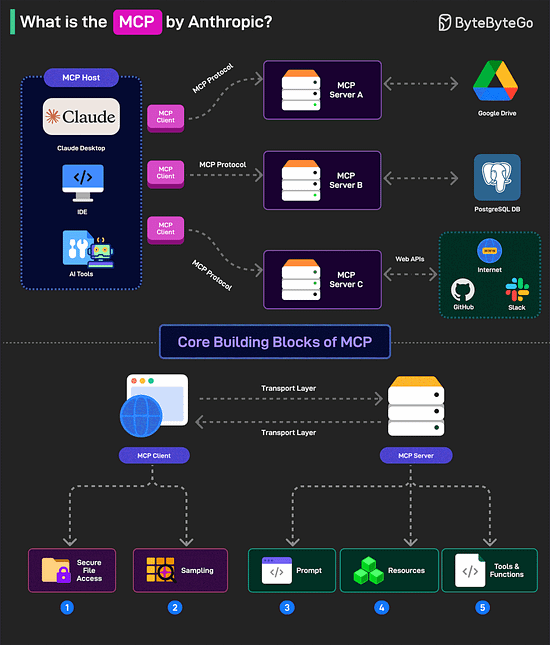
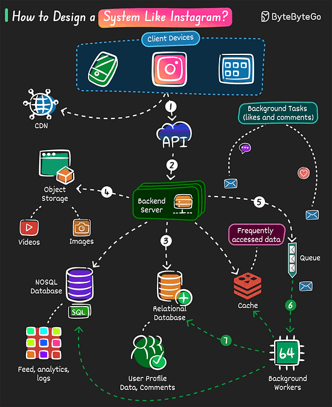
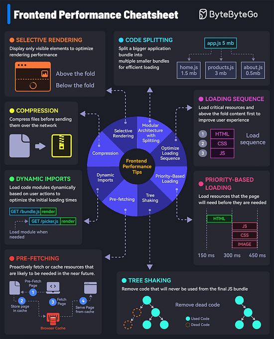

*Mời bạn thưởng thức Newsletter \#16.*

## [Choosing Languages](https://steveklabnik.com/writing/choosing-languages)

Bài viết của Steve Klabnik bàn về việc lựa chọn ngôn ngữ lập trình, được viết sau khi Microsoft thông báo sẽ viết lại TypeScript compiler bằng Go. Tác giả chia sẻ góc nhìn sâu sắc về việc tại sao chúng ta không nên vội vàng phán xét lựa chọn ngôn ngữ lập trình của người khác.

Một số điểm chính:

1. **Bối cảnh quan trọng**: Mỗi dự án có những yêu cầu và bối cảnh riêng. Ví dụ, Microsoft chọn Go vì code hiện tại của họ tương tự với Go, giúp việc port code dễ dàng hơn.

2. **Trải nghiệm cá nhân**: Tác giả chia sẻ câu chuyện về việc từng chỉ trích một người viết công cụ grep bằng Node.js vào năm 2013. Sự việc này đã thay đổi cách nhìn của ông về việc phán xét lựa chọn công nghệ của người khác.

3. **Văn hóa cộng đồng**: Klabnik nhấn mạnh tầm quan trọng của việc xây dựng văn hóa cộng đồng tích cực, không chỉ trích ngôn ngữ khác mà tập trung vào ưu điểm của ngôn ngữ mình chọn.

4. **Thông điệp chính**: Mỗi người có lý do riêng để chọn một ngôn ngữ lập trình, và chúng ta nên tôn trọng những lựa chọn đó thay vì vội vàng phán xét. Điều quan trọng là hiểu được bối cảnh đằng sau mỗi quyết định.

## [How Long Should Functions Be?](https://tidyfirst.substack.com/p/how-long-should-functions-be)

Bài viết của Kent Beck phân tích về độ dài của các hàm trong lập trình, dựa trên dữ liệu thực tế từ JUnit 5. Tác giả đưa ra những góc nhìn thú vị về việc tại sao chúng ta không nên áp đặt một con số cố định cho độ dài của hàm.

Một số điểm chính:

1. **Phân phối theo quy luật lũy thừa**: Độ dài của các hàm tuân theo quy luật phân phối lũy thừa (power law), không phải một con số cố định. Dữ liệu từ JUnit 5 cho thấy:
   - Nhiều hàm ngắn (1-3 dòng)
   - Một số ít hàm dài
   - Hệ số lũy thừa (α) là 2.46
   - Giá trị R-squared là 0.96, cho thấy mối tương quan mạnh

2. **Kết quả phân tích**:
   - Độ dài trung bình của hàm là 3.49 dòng
   - Phạm vi từ 1 đến 74 dòng
   - Các hàm dài có xu hướng ngày càng dài hơn theo thời gian
   - Dự án càng lớn, độ dài trung bình của hàm càng tăng

3. **Ý nghĩa quan trọng**:
   - Không có độ dài "đúng" cố định cho các hàm
   - Phân phối tự nhiên bao gồm:
     - Nhiều hàm ngắn
     - Một số ít hàm dài
     - Các hàm dài nhất sẽ tiếp tục phát triển khi hệ thống mở rộng

4. **Các yếu tố ảnh hưởng**:
   - Độ dốc của phân phối có thể được điều chỉnh
   - Phát triển hướng thử nghiệm (TDD) đã được chứng minh là có tương quan với độ dốc lớn hơn
   - Độ dốc lớn hơn đồng nghĩa với nhiều hàm ngắn hơn và giảm độ dài của các hàm dài nhất 

## [What Makes Code Hard To Read: Visual Patterns of Complexity](https://seeinglogic.com/posts/visual-readability-patterns/)

Bài viết phân tích các mẫu hình trực quan ảnh hưởng đến khả năng đọc hiểu code, dựa trên nghiên cứu về các metrics phức tạp và kinh nghiệm thực tế. Tác giả đưa ra 8 mẫu hình chính giúp cải thiện khả năng đọc hiểu code.

Một số điểm chính:

1. **Các metrics phức tạp**:
   - Halstead Complexity Metrics: đo lường số lượng operators và operands
   - Cognitive Complexity: đánh giá độ phức tạp dựa trên cấu trúc code
   - Các metrics này giúp định lượng khả năng đọc hiểu code

2. **8 mẫu hình cải thiện khả năng đọc hiểu**:
   - Số lượng dòng/operator/operand: Ưu tiên các hàm nhỏ với ít biến
   - Tính mới lạ: Tránh các cấu trúc mới lạ, ưu tiên các mẫu hình quen thuộc
   - Nhóm logic: Chia nhỏ các chuỗi hàm dài thành các nhóm logic
   - Đơn giản hóa điều kiện: Giữ các điều kiện ngắn gọn
   - Tránh goto: Chỉ sử dụng trong trường hợp đặc biệt
   - Giảm thiểu lồng ghép: Tránh logic lồng nhau phức tạp
   - Phân biệt biến: Sử dụng tên biến rõ ràng và khác biệt
   - Thời gian sống của biến: Ưu tiên biến có thời gian sống ngắn

3. **Ý nghĩa thực tế**:
   - Các mẫu hình này áp dụng được cho mọi ngôn ngữ lập trình
   - Giúp giảm thiểu lỗi và dễ dàng bảo trì code
   - Tạo ra code dễ đọc và dễ hiểu hơn cho cả bản thân và người khác

## [IO Devices and Latency](https://planetscale.com/blog/io-devices-and-latency)

Bài viết của Benjamin Dicken phân tích sâu về các thiết bị lưu trữ và độ trễ trong hệ thống máy tính, từ băng từ đến ổ cứng và SSD hiện đại. Tác giả cũng giải thích về tác động của việc chuyển đổi sang cloud và cách PlanetScale giải quyết các thách thức về hiệu suất.

Một số điểm chính:

1. **Lịch sử phát triển thiết bị lưu trữ**:
   - Băng từ (1950s): Lưu trữ tuần tự, độ trễ cao khi truy cập ngẫu nhiên
   - Ổ cứng (HDD): Cải thiện đáng kể với thời gian truy cập ngẫu nhiên 1-3ms
   - Ổ cứng thể rắn (SSD): Hiệu suất cao hơn nhưng có vấn đề về garbage collection

2. **Tác động của Cloud Computing**:
   - Tách biệt storage và compute
   - Sử dụng network-attached storage (EBS, etc.)
   - Độ trễ tăng lên đáng kể: 250μs so với 50μs của local NVMe
   - Giới hạn IOPS nhân tạo (ví dụ: 3000 IOPS/giây)

3. **Giải pháp PlanetScale Metal**:
   - Sử dụng NVMe SSD trực tiếp gắn với compute
   - Replication tự động với primary và hai replica
   - Không giới hạn IOPS
   - Khả năng mở rộng linh hoạt
   - Bảo vệ dữ liệu tốt hơn với nhiều lớp backup

4. **So sánh hiệu suất**:
   - CPU → RAM: ~100ns
   - CPU → Local NVMe: ~50,000ns
   - CPU → Network Storage: ~250,000ns
   - Network storage chậm hơn 5 lần so với local storage

## [The good times in tech are over](https://www.seangoedecke.com/good-times-are-over/)

Bài viết của Sean Goedecke phân tích về sự thay đổi trong ngành công nghệ, đặc biệt là về môi trường làm việc của các kỹ sư phần mềm trong thập kỷ qua. Tác giả giải thích nguyên nhân và tác động của những thay đổi này.

Một số điểm chính:

1. **Sự thay đổi môi trường làm việc**:
   - Thập kỷ trước: Nhiều đặc quyền, ít sa thải, được đối xử đặc biệt
   - Hiện tại: Các công ty tập trung vào hiệu suất và lợi nhuận
   - Meta đã công khai thừa nhận việc sa thải nhân viên kém hiệu quả

2. **Nguyên nhân chính**:
   - Lãi suất thấp (gần 0%) trong thập kỷ 2010 cho phép vay nhiều vốn
   - Các công ty tech được khuyến khích mở rộng và chi tiêu không giới hạn
   - Lãi suất tăng lên 5% vào năm 2023 thay đổi hoàn toàn động lực kinh doanh
   - COVID-19 tạo ra cơn sốt ngắn hạn nhưng không phải nguyên nhân gốc rễ

3. **Tác động đến kỹ sư phần mềm**:
   - Các công ty tập trung vào mục tiêu cụ thể thay vì thử nghiệm nhiều dự án
   - Giảm đầu tư vào các dự án phụ như open-source
   - Lợi ích cá nhân có thể mâu thuẫn với lợi ích công ty
   - Cần thích nghi với môi trường mới để tránh bị sa thải

4. **Mặt tích cực**:
   - Các công ty tech hoạt động thực tế hơn
   - Quy tắc làm việc rõ ràng hơn:
     - Cung cấp giá trị cho công ty = được thưởng
     - Không cung cấp giá trị = bị phạt
     - Giá trị = theo đuổi kế hoạch của ban lãnh đạo

## [Once You're Laid Off, You'll Never Be the Same Again](https://mertbulan.com/2025/01/26/once-you-are-laid-off-you-will-never-be-the-same-again/)

Bài viết của Mert Bulan chia sẻ trải nghiệm cá nhân về việc bị sa thải và những thay đổi trong cách nhìn nhận về công việc sau sự kiện này. Tác giả cũng đưa ra những dấu hiệu cảnh báo và lời khuyên cho những người đang làm việc trong ngành công nghệ.

Một số điểm chính:

1. **Dấu hiệu cảnh báo trước khi sa thải**:
   - Hủy đột ngột các sự kiện team
   - Nhận thông báo về gói hàng bất ngờ (để trả thiết bị)
   - Thiếu tầm nhìn rõ ràng từ ban lãnh đạo
   - Các cuộc họp đột ngột không có chương trình
   - Thời điểm xung quanh báo cáo tài chính quý

2. **Thực tế phũ phàng**:
   - Bạn chỉ là một dòng trong bảng Excel
   - Quyết định sa thải thường được đưa ra bởi người không biết bạn
   - Thành tích và đóng góp trước đó không được xem xét
   - Niềm tin giữa công ty và nhân viên đã bị phá vỡ

3. **Tác động lâu dài**:
   - Thay đổi cách nhìn nhận về công việc
   - Mất niềm tin vào cam kết của công ty
   - Chỉ làm đúng giờ quy định
   - Không còn nỗ lực vượt quá yêu cầu

4. **Lời khuyên cho người đang làm việc**:
   - Tuân thủ giờ làm việc theo hợp đồng
   - Tránh làm việc quá sức
   - Luôn duy trì việc phỏng vấn ở nơi khác
   - Tận dụng offer bên ngoài để tăng lương
   - Đừng quá lo lắng về CV có nhiều công ty ngắn hạn

## Bonus: Vài ảnh hay ho đến từ [ByteByteGo](https://bytebytego.com/)

