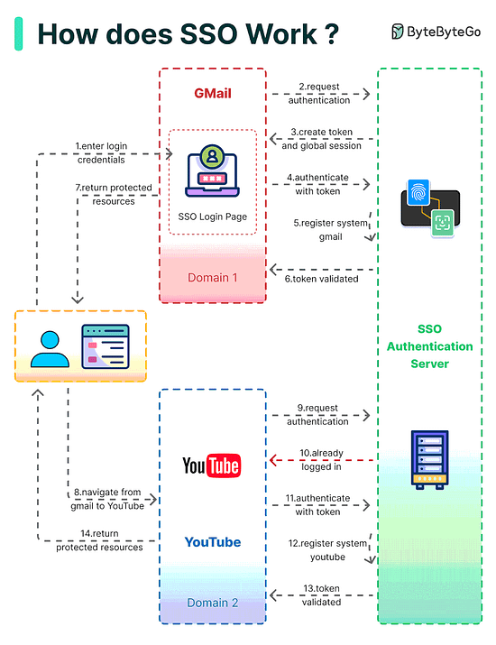
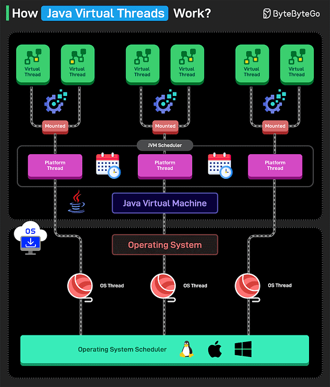
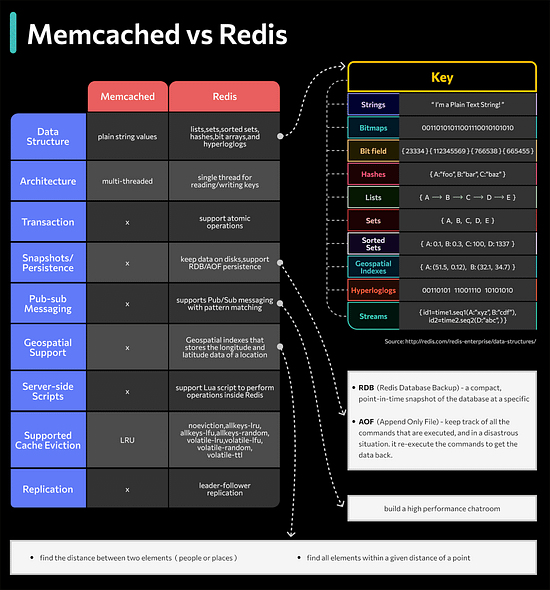
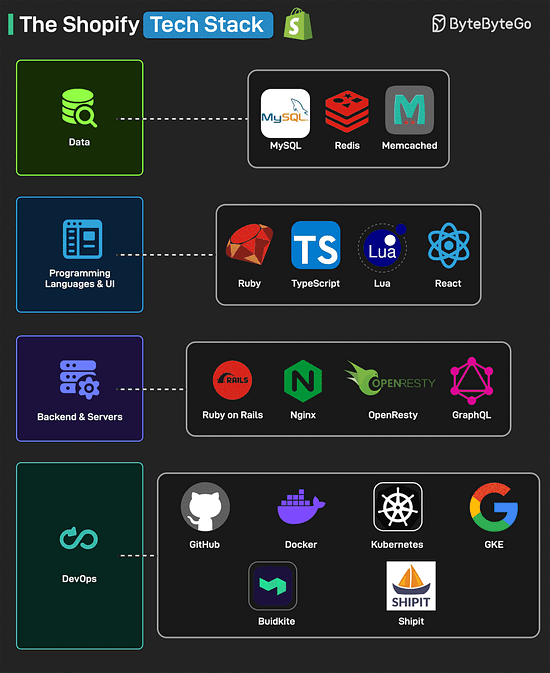

*Mời bạn thưởng thức Newsletter #18.*

## [No Longer My Favorite Git Commit](https://mtlynch.io/no-longer-my-favorite-git-commit/)

Trong bài viết này, tác giả Michael Lynch đã xem xét lại một commit Git nổi tiếng được David Thompson ca ngợi trong bài viết "My favourite Git commit". Commit này từng được coi là một ví dụ tuyệt vời về cách viết commit message chi tiết, nhưng theo thời gian, tác giả đã nhận ra một số nhược điểm trong cách tiếp cận này.

Commit message ban đầu mô tả chi tiết quá trình debug một lỗi liên quan đến ký tự UTF-8 trong một file template, nhưng lại đặt thông tin quan trọng nhất - nội dung thực sự của thay đổi - ở cuối message. Điều này khiến người đọc phải đọc qua sáu đoạn văn và năm đoạn code để hiểu được bản chất của thay đổi: chỉ là việc thay thế một ký tự khoảng trắng.

Tác giả đề xuất một phiên bản cải tiến của commit message, tuân theo nguyên tắc "kim tự tháp ngược" trong viết lách - đặt thông tin quan trọng nhất lên đầu và dần chuyển sang các chi tiết nhỏ hơn. Phiên bản cải tiến này:

* Bắt đầu với tóm tắt ngắn gọn về thay đổi
* Giải thích rõ ràng vấn đề với ký tự UTF-8 và nguồn gốc của nó
* Di chuyển phần lớn nội dung gốc vào phần "Cách tôi phát hiện ra điều này"
* Sửa lỗi ngữ pháp và loại bỏ câu bị động để tăng tính rõ ràng

Đây là một bài học quý giá về cách viết commit message hiệu quả, nhấn mạnh tầm quan trọng của việc truyền đạt thông tin một cách rõ ràng và có cấu trúc.

Những điểm chính:
* Commit message nên đặt thông tin quan trọng nhất lên đầu
* Sử dụng cấu trúc "kim tự tháp ngược" khi viết commit message
* Tránh sử dụng câu bị động để tăng tính rõ ràng
* Chi tiết kỹ thuật vẫn quan trọng nhưng nên được sắp xếp hợp lý

## [Our interfaces have lost their senses](https://wattenberger.com/thoughts/our-interfaces-have-lost-their-senses)

Trong bài viết này, tác giả Amelia Wattenberger đã đưa ra những quan sát sâu sắc về sự phát triển của giao diện người dùng và cách chúng đã dần mất đi sự phong phú đa giác quan. Tác giả mô tả quá trình "Làm phẳng" (The Great Flattening) của giao diện máy tính, từ những thiết bị vật lý đầu tiên với các nút bấm và công tắc, đến dòng lệnh, rồi giao diện đồ họa, và cuối cùng là màn hình cảm ứng phẳng lì hiện nay.

Đặc biệt, với sự xuất hiện của các chatbot AI, chúng ta đang mất đi nhiều hơn nữa: kết cấu, màu sắc, hình dạng. Thay vì các điều khiển tương tác phong phú, chúng ta chỉ còn lại một ô nhập văn bản. Muốn chỉnh sửa hình ảnh? Gõ lệnh. Điều chỉnh cài đặt? Nhập văn bản. Học điều gì đó? Đọc một khối văn bản khác.

Tác giả cho rằng khi loại bỏ quá nhiều ma sát trong các ứng dụng, chúng ta cũng đánh mất ý nghĩa và sự hài lòng. So sánh cảm giác cuộn màn hình vô thức với việc nhào bột, chơi nhạc cụ hay phác họa - những hoạt động này đòi hỏi nỗ lực nhưng mang lại sự thỏa mãn sâu sắc.

Những điểm chính:
* Giao diện người dùng hiện đại đã mất đi sự phong phú đa giác quan
* Chúng ta cần xây dựng giao diện tận dụng nhiều giác quan khác nhau, không chỉ thị giác
* Giao diện tương lai nên hỗ trợ nhiều phương thức đồng thời: giọng nói, cử chỉ, hình ảnh, thành phần không gian
* Thay vì làm cho vẽ tranh giống như đánh máy, chúng ta nên làm cho việc đánh máy cảm giác như vẽ tranh

## [Labeled Breaks in Java: Useful Tool or Code Smell?](https://www.baeldung.com/java-labeled-break)

Bài viết này phân tích về cơ chế hoạt động của câu lệnh labeled break và continue trong Java, một tính năng đã tồn tại từ Java 1.0 và vẫn được duy trì đến nay. Tác giả đặt câu hỏi liệu đây là một công cụ hữu ích hay là một mùi code (code smell) cần tránh.

Labeled break cho phép lập trình viên thoát khỏi các vòng lặp lồng nhau một cách cụ thể. Ví dụ:

```java
outer: // <-- label
for (int i = 0; i < 5; i++) {
    for (int j = 0; j < 5; j++) {
        println(i + ", " + j);
        if (j == 2) {
            break outer; // thoát khỏi vòng lặp ngoài
        }
    }
}
```

Tác giả phân tích cả ưu điểm và nhược điểm của kỹ thuật này. Về ưu điểm, labeled break mang lại hiệu quả trong các vòng lặp lồng nhau bằng cách cho phép thoát ngay lập tức mà không cần thêm cờ hoặc điều kiện phụ. Nó cũng cung cấp khả năng kiểm soát chi tiết, cho phép nhắm đến các vòng lặp cụ thể trong cấu trúc lồng nhau sâu.

Tuy nhiên, nhược điểm đáng kể là tính dễ đọc bị ảnh hưởng vì các label có thể giống như các lệnh GOTO, gây nhầm lẫn cho người bảo trì không quen với mã. Bảo trì cũng trở nên khó khăn hơn; việc sửa đổi một vòng lặp có label có thể phá vỡ các phụ thuộc của nó, đặc biệt trong các codebase lớn.

Tác giả cũng so sánh cách tiếp cận này với các ngôn ngữ khác như Kotlin và JavaScript, đồng thời đề xuất các giải pháp thay thế hiện đại hơn như sử dụng Stream API trong Java.

Những điểm chính:
* Labeled break có thể hữu ích trong một số trường hợp cụ thể nhưng cần cân nhắc kỹ lưỡng
* Các giải pháp thay thế như refactoring thành các phương thức riêng biệt hoặc sử dụng Stream API thường rõ ràng hơn
* Labeled break tồn tại trong nhiều ngôn ngữ khác như Kotlin và JavaScript với cú pháp tương tự
* Xu hướng lập trình hiện đại thường tránh sử dụng labeled break trừ khi thực sự cần thiết

## [Distributed Locking: A Practical Guide](https://www.architecture-weekly.com/p/distributed-locking-a-practical-guide)

Trong bài viết này, tác giả Oskar Dudycz đã cung cấp một hướng dẫn thực tế về khóa phân tán (distributed locking) - một công cụ cơ bản nhưng quan trọng trong hệ thống phân tán. Khi một ứng dụng được mở rộng trên nhiều máy hoặc microservices, các vấn đề về đồng thời có thể phát sinh khi nhiều tiến trình cố gắng cập nhật cùng một tài nguyên.

Tác giả giải thích cách thức hoạt động cơ bản của khóa phân tán: một node yêu cầu quyền truy cập độc quyền vào một tài nguyên chia sẻ bằng cách tạo một khóa. Nếu khóa chưa tồn tại, node sẽ tạo khóa và thực hiện thao tác cần thiết. Sau khi hoàn thành, node sẽ giải phóng khóa. Điều quan trọng là các khóa cần có cơ chế tự động giải phóng trong trường hợp node gặp sự cố, thường thông qua cơ chế TTL (Time-to-Live) hoặc ephemeral nodes.

Bài viết phân tích các công cụ phổ biến cho khóa phân tán:

1. **Redis**: Sử dụng khóa dựa trên TTL, đơn giản và hiệu quả nếu bạn đã sử dụng Redis, nhưng cần thận trọng với các vấn đề về phân chia mạng hoặc cluster.

2. **ZooKeeper/etcd**: Cung cấp bảo đảm tính nhất quán mạnh mẽ hơn thông qua ephemeral nodes, phức tạp hơn nhưng mạnh mẽ hơn cho các hệ thống phức tạp.

3. **Database Locks**: Sử dụng cơ chế khóa của cơ sở dữ liệu, thuận tiện nếu đã có một cơ sở dữ liệu duy nhất, nhưng có thể không mở rộng tốt qua nhiều cơ sở dữ liệu hoặc vùng.

4. **Kubernetes Single-Instance**: Đơn giản hóa vấn đề bằng cách chỉ chạy một bản sao của dịch vụ, tránh đồng thời hoàn toàn nhưng đánh đổi khả năng mở rộng và tính sẵn sàng cao.

Tác giả cũng thảo luận về các vấn đề tiềm ẩn và cách giải quyết, như deadlocks, lock contention, xử lý sự cố, điểm lỗi đơn và các vấn đề về đồng hồ và phân chia mạng.

Những điểm chính:
* Nên tránh sử dụng khóa phân tán nếu có thể, chỉ sử dụng khi thực sự cần thiết
* Sử dụng khóa cẩn thận: Quá nhiều khóa có thể làm giảm tính đồng thời, nhưng rất quan trọng khi cần ngăn chặn hư hỏng dữ liệu
* Chọn đúng công cụ lưu trữ: Redis thường đơn giản nhất nếu đã sử dụng, ZooKeeper phù hợp với điều phối nâng cao
* Lập kế hoạch cho sự cố: Triển khai khóa TTL/ephemeral để tránh khóa "zombie" hoặc bị kẹt

## [If it is worth keeping, save it in Markdown](https://p.migdal.pl/blog/2025/02/markdown-saves)

Trong bài viết này, tác giả Piotr Migdal chia sẻ quan điểm về việc bảo quản nội dung số dài hạn bằng định dạng Markdown. Tác giả bắt đầu với một cảnh báo: "Nếu bạn xuất bản điều gì đó trực tuyến, sớm hay muộn, nó sẽ biến mất." Đây là một thực tế đáng buồn của thế giới số - các liên kết thay đổi, các nền tảng đóng cửa, và nội dung có thể biến mất vĩnh viễn nếu không được lưu trữ đúng cách.

Tác giả đề xuất giải pháp sử dụng định dạng văn bản thuần (plaintext) với mã hóa UTF-8 và định dạng Markdown. Đây là một lựa chọn bền vững vì:

1. Các tập tin văn bản thuần có thể được đọc bởi bất kỳ máy tính nào, không cần phần mềm chuyên dụng
2. Markdown cung cấp cú pháp đơn giản cho các phần tử thông dụng như tiêu đề, danh sách, liên kết
3. Theo nguyên tắc "sức mạnh tối thiểu", Markdown tránh kiểm soát chi tiết về hiển thị, giúp nó ít phức tạp và bền vững hơn

Tác giả sử dụng Obsidian cho ghi chú cá nhân và các trình tạo trang tĩnh cho blog, cả hai đều dựa trên Markdown. Điều này tạo ra một quy trình lưu trữ và chia sẻ nội dung linh hoạt. Tác giả cũng mô tả cách tiếp cận thực tế của mình: khi tìm thấy nội dung đáng giữ lại, anh sao chép nó vào tập tin markdown, thêm frontmatter với ngày xuất bản, nguồn gốc và các thẻ liên quan.

Có nhiều công cụ hỗ trợ chuyển đổi định dạng, từ pandoc đa năng đến các công cụ chuyên biệt cho các nền tảng cụ thể. Thậm chí, các công cụ AI hiện đại cũng có thể giúp chuyển đổi nội dung phức tạp sang Markdown.

Những điểm chính:
* Nội dung số có thể biến mất bất cứ lúc nào, đặc biệt trong các "vườn tường" yêu cầu đăng nhập
* Văn bản thuần với Markdown là định dạng bền vững nhất cho lưu trữ dài hạn
* Nội dung đáng tìm kiếm một lần là nội dung đáng bảo quản vĩnh viễn
* Các công cụ như Obsidian, pandoc và AI có thể hỗ trợ quy trình lưu trữ và chuyển đổi

## [The Software Engineering Identity Crisis](https://annievella.com/posts/the-software-engineering-identity-crisis/)

Trong bài viết sâu sắc này, tác giả Annie Vella đã phân tích cuộc khủng hoảng bản sắc mà các kỹ sư phần mềm đang phải đối mặt trong kỷ nguyên AI. Tác giả bắt đầu bằng việc nhận diện bản chất của vấn đề: nhiều người trong chúng ta trở thành kỹ sư phần mềm vì tìm thấy bản sắc của mình trong việc xây dựng, tạo ra các giải pháp bằng chính tay, trí óc và code của mình.

Tuy nhiên, với sự xuất hiện của các trợ lý lập trình AI, bản sắc này đang bị thách thức sâu sắc. Chúng ta đang chuyển từ vai trò người sáng tạo sang người điều phối, từ người xây dựng sang người giám sát. Tác giả dẫn chứng bằng các con số đáng chú ý: Google tiết lộ rằng AI tạo ra hơn một phần tư mã mới của họ, trong khi CEO của Y Combinator cho biết khoảng một phần tư các startup của họ có 95% mã được viết bởi AI.

Tác giả cũng đề cập đến khái niệm "vibe coding" do Andrej Karpathy đề xuất - một cách tiếp cận mới trong việc viết phần mềm, nơi chúng ta tập trung vào ý định (what) thay vì cách thực hiện (how), để AI điền vào các chi tiết. Điều này đặt ra câu hỏi: chúng ta còn là kỹ sư nếu quên đi tất cả về code?

Tuy nhiên, tác giả không nhìn nhận sự chuyển đổi này hoàn toàn tiêu cực. Bài viết đưa ra một góc nhìn lạc quan: AI không lấy đi công việc của chúng ta mà đang cho chúng ta cơ hội để lấy lại những khía cạnh rộng lớn hơn của vai trò mà chúng ta đã giao cho các chuyên gia. Để trở lại thời điểm mà kỹ thuật phần mềm có nghĩa là nhiều hơn chỉ là viết code - khi nó có nghĩa là hiểu toàn bộ không gian vấn đề, từ nhu cầu người dùng đến tác động kinh doanh, từ thiết kế hệ thống đến sự xuất sắc trong vận hành.

Những điểm chính:
* Kỹ sư phần mềm đang chuyển từ người sáng tạo sang người điều phối AI
* "Vibe coding" đại diện cho sự chuyển dịch từ việc tập trung vào cách thực hiện sang tập trung vào ý định
* Các kỹ năng bền vững như giao tiếp, tư duy tổng thể, xử lý sự không rõ ràng trở nên quan trọng hơn trong thế giới do AI điều khiển
* Cuộc khủng hoảng bản sắc này tương tự như thời kỳ Cách mạng Công nghiệp, khi các thợ thủ công phải thích nghi với máy móc

## [Revenge of the junior developer](https://sourcegraph.com/blog/revenge-of-the-junior-developer)

Trong bài viết mới nhất của mình, Steve Yegge - một chuyên gia có tiếng trong ngành phần mềm - đã đưa ra những nhận định bất ngờ về sự thay đổi của ngành công nghiệp phần mềm dưới tác động của AI. Trái ngược với bài viết trước đó của ông về "Cái chết của lập trình viên mới", bài viết này lại chỉ ra rằng chính các lập trình viên mới lại là những người đang nắm bắt cơ hội tốt hơn trong kỷ nguyên AI.

Tác giả mô tả sự phát triển của lập trình qua sáu làn sóng chồng lấn nhau: lập trình truyền thống (2022), lập trình với các công cụ hoàn thành mã (2023), lập trình dựa trên chat (2024), các agent lập trình (2025 H1), các cụm agent (2025 H2), và đội hình agent (2026). Ông giới thiệu khái niệm "vibe coding" - một cách lập trình dựa trên chat, nơi bạn yêu cầu LLM viết mã, sau đó cung cấp kết quả và yêu cầu thêm trong một vòng lặp liên tục.

Một phát hiện đáng chú ý là các lập trình viên mới thực sự đã nhanh chóng áp dụng AI hơn các lập trình viên có kinh nghiệm. Họ đã nắm bắt các công cụ trợ lý lập trình, sử dụng lập trình dựa trên chat, và thậm chí đã bắt đầu sử dụng các agent lập trình. Trong khi đó, nhiều lập trình viên có kinh nghiệm lại đang phải vật lộn với sự thay đổi này, thậm chí có những người hoàn toàn chống lại việc sử dụng AI.

Tác giả cho rằng điều này xảy ra vì các lập trình viên có kinh nghiệm đã đầu tư quá nhiều vào hiện trạng, và họ cảm thấy rằng việc phải học một điều gì đó hoàn toàn mới giống như phải bắt đầu lại từ đầu. Tuy nhiên, ông cảnh báo rằng những người từ chối AI đã thua cuộc, và các lập trình viên mới đang nắm giữ lợi thế.

Kết luận của bài viết là công việc "kỹ sư phần mềm" vào cuối năm nay sẽ bao gồm ít lập trình trực tiếp và nhiều giám sát agent hơn. Các agent lập trình đang đến, và càng sớm thích nghi với điều đó, cuộc sống của bạn sẽ càng dễ dàng hơn.

Những điểm chính:
* Lập trình viên mới đang nhanh chóng áp dụng AI hơn các lập trình viên có kinh nghiệm
* "Vibe coding" là cách lập trình dựa trên chat, nhưng sẽ sớm bị thay thế bởi các agent lập trình
* Công việc kỹ sư phần mềm sẽ chuyển từ viết mã trực tiếp sang giám sát các agent
* Để thành công, hãy "học hỏi từ các lập trình viên mới" và nhanh chóng thích nghi với công nghệ mới

## Bonus: Vài ảnh hay ho đến từ [ByteByteGo](https://bytebytego.com/)






## Bonus 2: Vài video hay ho đến từ [ByteByteGo](https://bytebytego.com/)

[What Are AI Agents Really About?](https://www.youtube.com/watch?v=eHEHE2fpnWQ)
