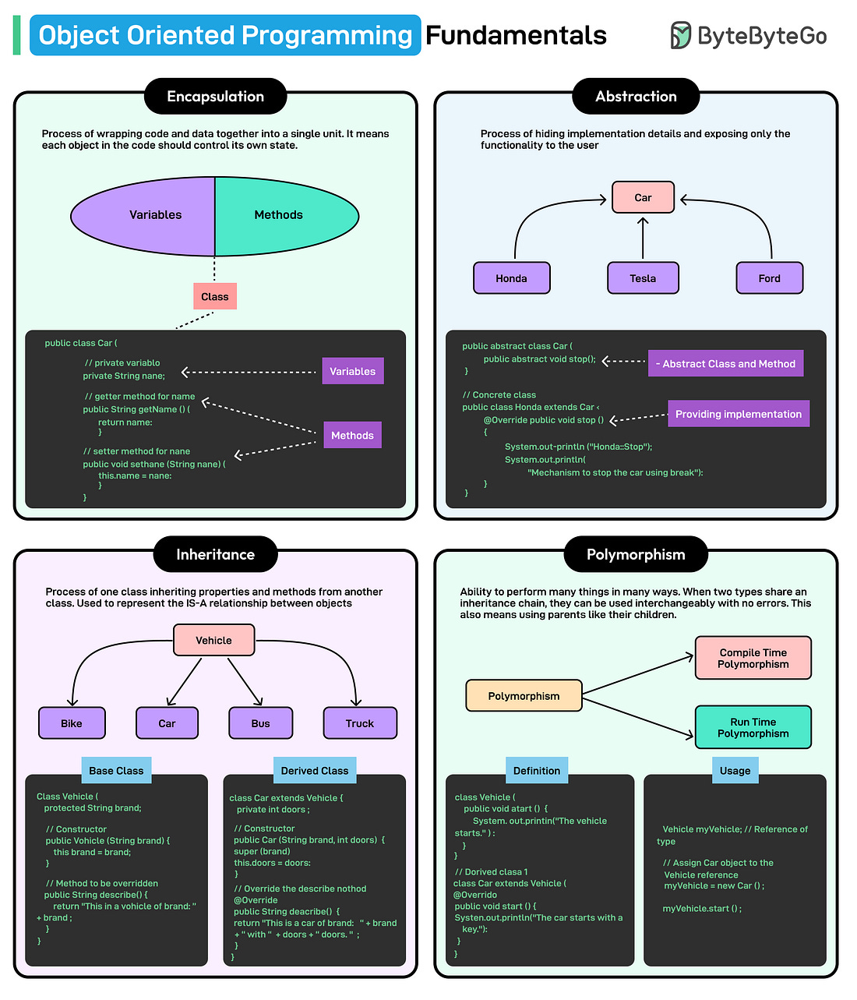

*Mời bạn thưởng thức Newsletter #19.*

## [A love letter to the CSV format](https://github.com/medialab/xan/blob/master/docs/LOVE_LETTER.md)

Trong thế giới công nghệ hiện nay, định dạng CSV thường bị chỉ trích và coi là lỗi thời so với các định dạng "hiện đại" hơn như Parquet, JSON hoặc MessagePack. Tuy nhiên, bài viết này đưa ra một góc nhìn khác, ca ngợi những ưu điểm đôi khi bị bỏ qua của CSV.

CSV có nhiều điểm mạnh đáng chú ý: nó đơn giản đến mức có thể giải thích trong vài giây (các giá trị được phân tách bằng dấu phẩy, các hàng được phân tách bằng dòng mới); nó là một ý tưởng tập thể không thuộc sở hữu của ai; nó là văn bản thuần túy có thể đọc và chỉnh sửa trực tiếp; nó có thể đọc theo luồng từng hàng một mà không cần nhiều bộ nhớ; dễ dàng thêm dữ liệu mới vào cuối file; nó có kiểu dữ liệu động giúp linh hoạt khi xử lý dữ liệu; và nó rất súc tích với lượng lặp lại tối thiểu.

Một điểm thú vị ít người biết là CSV đảo ngược vẫn là CSV hợp lệ, cho phép đọc hiệu quả các hàng cuối cùng của file. Và cuối cùng, Excel ghét CSV - điều này có lẽ chứng tỏ CSV đang làm điều gì đó đúng đắn!

Những điểm nổi bật:

* CSV đơn giản đến mức ai cũng có thể hiểu và sử dụng
* Định dạng văn bản thuần túy giúp dễ đọc và chỉnh sửa
* Khả năng đọc theo luồng giúp xử lý file lớn với bộ nhớ tối thiểu
* Dễ dàng thêm dữ liệu mới vào cuối file
* Kiểu dữ liệu động mang lại sự linh hoạt khi xử lý dữ liệu
* Cấu trúc súc tích với ít sự lặp lại
* CSV đảo ngược vẫn là CSV hợp lệ, cho phép đọc hiệu quả các hàng cuối

## [The role of developer skills in agentic coding](https://martinfowler.com/articles/exploring-gen-ai/13-role-of-developer-skills.html)

Trong bài viết này, Birgitta Böckeler chia sẻ những quan sát của mình về vai trò của kỹ năng lập trình trong môi trường sử dụng trợ lý lập trình AI (agentic coding assistants). Mặc dù các công cụ AI như Cursor, Windsurf và Cline đã đạt được những tiến bộ đáng kể trong việc hỗ trợ lập trình viên, tác giả nhấn mạnh rằng sự can thiệp và điều chỉnh của con người vẫn là yếu tố quan trọng không thể thiếu.

Tác giả phân loại các trường hợp cần sự can thiệp của lập trình viên thành ba nhóm tác động:

1. **Tác động đến thời gian hoàn thành**: AI đôi khi tạo ra mã không hoạt động hoặc chẩn đoán sai vấn đề, khiến quá trình phát triển chậm lại thay vì nhanh hơn.

2. **Tác động đến quy trình làm việc của nhóm**: AI thường tạo ra quá nhiều mã cùng lúc thay vì phát triển theo từng phần nhỏ, sử dụng các giải pháp tạm thời thay vì phân tích nguyên nhân gốc rễ, hoặc tạo ra quy trình phát triển phức tạp gây khó khăn cho các thành viên khác trong nhóm.

3. **Tác động đến khả năng bảo trì dài hạn**: Đây là vấn đề nghiêm trọng nhất với chu kỳ phản hồi dài nhất. AI thường tạo ra các bài kiểm tra dư thừa, thiếu tính tái sử dụng, và mã quá phức tạp hoặc dài dòng.

Để giảm thiểu những vấn đề này, tác giả đề xuất một số biện pháp bảo vệ:

* Luôn xem xét cẩn thận mã do AI tạo ra
* Dừng phiên làm việc với AI khi cảm thấy quá tải
* Cảnh giác với các giải pháp "đủ tốt" được tạo ra quá nhanh
* Thực hành lập trình cặp (pair programming)
* Thiết lập công cụ giám sát chất lượng mã
* Sử dụng các quy tắc tùy chỉnh cho trợ lý lập trình
* Xây dựng văn hóa tin cậy và giao tiếp cởi mở trong nhóm

## [CI/CD DevOps Pipeline Project: Deployment of Java Application on Kubernetes](https://dev.to/prodevopsguytech/cicd-devops-pipeline-project-deployment-of-java-application-on-kubernetes-4fi2)

Bài viết này trình bày chi tiết về việc triển khai một hệ thống CI/CD (Continuous Integration/Continuous Deployment) hoàn chỉnh cho ứng dụng Java trên Kubernetes. Đây là một dự án DevOps toàn diện nhằm tự động hóa toàn bộ vòng đời phát triển phần mềm, từ giai đoạn phát triển đến triển khai.  

Mục tiêu chính của dự án là tự động hóa quy trình phát triển phần mềm, cải thiện tốc độ, độ tin cậy và hiệu quả đồng thời giảm thiểu sự can thiệp thủ công. Dự án sử dụng nhiều công cụ DevOps phổ biến như Jenkins, Maven, SonarQube, Trivy, Nexus Repository, Docker, Kubernetes, Prometheus và Grafana.

Quy trình CI/CD được xây dựng bao gồm các bước chính:

1. **Cài đặt cơ sở hạ tầng**: Sử dụng các máy ảo AWS EC2 cho Kubernetes Master, Worker Nodes, SonarQube, Nexus Repository, Jenkins và máy chủ giám sát.

2. **Thiết lập Kubernetes Cluster**: Hướng dẫn chi tiết về việc cài đặt và cấu hình Kubernetes cluster sử dụng Kubeadm, bao gồm cài đặt CRI-O Runtime, cài đặt các gói Kubernetes và khởi tạo cluster.

3. **Xây dựng Pipeline trong Jenkins**: Tạo một pipeline hoàn chỉnh với các giai đoạn:
   - Lấy mã nguồn từ Git repository
   - Biên dịch và kiểm thử ứng dụng
   - Quét bảo mật với Trivy
   - Phân tích chất lượng mã với SonarQube
   - Đóng gói và xuất bản artifacts lên Nexus
   - Xây dựng và đẩy Docker image
   - Triển khai ứng dụng lên Kubernetes
   - Gửi thông báo về trạng thái của pipeline

4. **Thiết lập hệ thống giám sát**: Cài đặt và cấu hình Prometheus và Grafana để giám sát hệ thống theo thời gian thực.

Dự án này minh họa cách các công cụ DevOps hiện đại có thể được tích hợp để tạo ra một quy trình phát triển phần mềm liền mạch, tự động và đáng tin cậy.

## [Road to JDK 25: Over-Engineering Tic-Tac-Toe (Java 24)](https://briancorbinxyz.medium.com/road-to-jdk-25-over-engineering-tic-tac-toe-java-24-565c7f9b06d0)

Trong loạt bài "Road to JDK 25", tác giả Brian Corbin khám phá các tính năng mới của Java thông qua việc "over-engineering" (thiết kế quá mức cần thiết) trò chơi tic-tac-toe đơn giản. Bài viết này tập trung vào JDK 24, phiên bản mới nhất của Java với nhiều cải tiến đáng chú ý.

JDK 24 được phát hành với 24 JEP (JDK Enhancement Proposal), mang đến nhiều tính năng mới và cải tiến quan trọng. Trong đó, tác giả đặc biệt chú trọng đến các tính năng đã được hoàn thiện, không còn ở trạng thái preview:

1. **Stream Gatherers**: Đây là một tính năng mới quan trọng cho phép tạo các thao tác trung gian tùy chỉnh trên Stream API. Với Stream::gather(Gatherer), lập trình viên có thể xử lý và chuyển đổi luồng dữ liệu bằng các gatherer tùy chỉnh. Gatherer có thể là one-to-one, one-to-many, many-to-one, hoặc many-to-many, và có thể theo dõi trạng thái như các phần tử đã truy cập trước đó. JDK 24 cung cấp các gatherer mới như scan, fold, windowFixed/windowSliding.

2. **Generational ZGC**: Trong JDK 24, bộ thu gom rác ZGC (Z Garbage Collector) hoàn toàn chuyển sang chế độ thu gom rác đa thế hệ (multi-generational). Chế độ không phân thế hệ đã bị loại bỏ hoàn toàn. Điều này giúp tập trung thu gom các đối tượng ngắn hạn thường xuyên và hiệu quả hơn, giảm tần suất của các lần thu gom rác toàn bộ.

3. **Class-File API**: JDK 24 giới thiệu API mới cho phép phân tích, tạo và chuyển đổi các file class Java. Đây là nền tảng cho các công cụ phân tích và chuyển đổi mã Java trong tương lai.

4. **Ahead-of-Time Class Loading & Linking**: Tính năng này cải thiện thời gian khởi động và hiệu suất runtime của các module bằng cách tải và liên kết các lớp trước khi chạy chương trình.

5. **Quantum-Resistant Cryptography**: JDK 24 bổ sung các thuật toán mã hóa mới dựa trên mạng lưới (lattice-based) để chống lại các cuộc tấn công từ máy tính lượng tử trong tương lai.

Bài viết minh họa cách sử dụng các tính năng này trong một ứng dụng tic-tac-toe, và cho thấy cách Java tiếp tục phát triển để đáp ứng nhu cầu của các nhà phát triển hiện đại. Tác giả cũng nhắc nhở rằng JDK 25 sẽ là phiên bản LTS (Long-Term Support) tiếp theo, dự kiến phát hành vào tháng 9 năm 2025.

## [Oracle reveals five new features coming to Java](https://www.infoworld.com/article/3848288/oracle-reveals-five-new-features-coming-to-java.html)

Trong khi JDK 24 vừa mới được phát hành chính thức, Oracle đã hé lộ năm tính năng mới sẽ được bổ sung vào Java trong tương lai gần. Những tính năng này bao gồm cả các cải tiến về ngôn ngữ và tối ưu hóa hiệu suất, với Stable Values API đã được chính thức đưa vào JDK 25 dự kiến phát hành vào tháng 9 năm nay.

Năm tính năng được Oracle công bố đều đã được xuất bản dưới dạng JEP (JDK Enhancement Proposal) và hiện đang ở giai đoạn preview:

1. **Enhanced primitive boxing**: Cải tiến boxing để hỗ trợ các tính năng ngôn ngữ mới, cho phép xử lý các kiểu dữ liệu nguyên thủy (primitive types) giống như các kiểu tham chiếu (reference types). Mục tiêu bao gồm việc cho phép boxing các giá trị nguyên thủy khi chúng được sử dụng làm "receiver" của truy cập trường, gọi phương thức, hoặc tham chiếu phương thức.

2. **Null-restricted value class types**: Cho phép kiểu của một biến lưu trữ các đối tượng giá trị loại trừ giá trị null, cho phép lưu trữ gọn hơn và các tối ưu hóa khác trong thời gian chạy. Tính năng này đang được xem xét cả ở cấp độ ngôn ngữ và máy ảo Java.

3. **Value classes and objects**: Nâng cao nền tảng Java với các đối tượng giá trị (value objects), là các đối tượng chỉ có các trường final và không có identity. Mục tiêu bao gồm việc cho phép các nhà phát triển tham gia vào một mô hình lập trình cho các giá trị đơn giản, trong đó các đối tượng chỉ được phân biệt bởi giá trị của các trường của chúng.

4. **Derived record creation**: Nâng cao ngôn ngữ với khả năng tạo một record mới từ một record hiện có. Một mục tiêu là cung cấp phương tiện ngắn gọn để tạo các giá trị record mới có nguồn gốc từ các giá trị record hiện có. Một mục tiêu khác là đơn giản hóa việc khai báo các lớp record bằng cách loại bỏ nhu cầu cung cấp các phương thức wither rõ ràng.

5. **Stable values**: Là các đối tượng chứa dữ liệu bất biến. Vì stable values được JVM coi là hằng số, chúng cho phép các tối ưu hóa hiệu suất tương tự như khi khai báo một trường là final. Đồng thời, chúng cung cấp tính linh hoạt hơn về thời điểm khởi tạo. Mục tiêu của đề xuất này bao gồm cải thiện thời gian khởi động của các ứng dụng Java bằng cách phân chia việc khởi tạo trạng thái ứng dụng đơn nguyên.

Những tính năng này cho thấy Oracle tiếp tục đầu tư vào việc cải tiến Java, đặc biệt là trong các lĩnh vực liên quan đến mô hình đối tượng, hiệu suất và trải nghiệm lập trình. Các tính năng này dự kiến sẽ được triển khai trong các phiên bản Java sắp tới, với Stable Values đã được xác nhận sẽ có trong JDK 25.

## [Java bytecode hacking for fun and profit](https://cory.li/bytecode-hacking/)

Bài viết này trình bày một cái nhìn sâu sắc về kỹ thuật tối ưu bytecode trong Java, một chủ đề đã trở nên khá hiếm gặp trong thời đại hiện nay với sự xuất hiện của trình biên dịch JIT (Just-In-Time) từ Java 1.3. Tác giả đưa ra bài viết này trong bối cảnh của cuộc thi Battlecode, nơi các đội phải viết AI điều khiển robot ảo và bị giới hạn bởi số lượng bytecode thực thi thay vì thời gian CPU thông thường.

Bytecode là các lệnh nguyên tử chạy trên JVM (Java Virtual Machine) - mã nguồn Java được biên dịch thành bytecode, tương tự như assembly. Trong Battlecode, mỗi đội chỉ được sử dụng một số lượng bytecode giới hạn (khoảng 6-10 nghìn) cho mỗi lượt, nên việc tối ưu hóa số lượng bytecode trở nên rất quan trọng.

Tác giả giải thích cơ chế hoạt động của JVM, một kiến trúc dựa trên stack với tập lệnh khá toàn diện cho phép thao tác trên cả kiểu dữ liệu nguyên thủy và đối tượng. Mỗi bytecode là một lệnh nguyên tử, tương đương với một lệnh assembly trong mã máy thực. Sau đó, tác giả chia sẻ một số kỹ thuật tối ưu hóa bytecode, bao gồm:

1. **Hiểu cách đếm bytecode**: Trong Battlecode, chỉ số lượng bytecode được tính, không phải kích thước hay độ phức tạp của chúng. Ví dụ, `iload_0` (1 byte) và `iload #5` (2 byte) đều được tính là 1 bytecode.

2. **Tối ưu hóa vòng lặp**: Tác giả trình bày cách tối ưu hóa các vòng lặp, từ vòng lặp for-each tiêu chuẩn đến các phiên bản tối ưu hơn. Ví dụ, việc sử dụng vòng lặp for thông thường thay vì for-each có thể tiết kiệm được 2 bytecode mỗi lần lặp.

3. **Đưa biến vào phạm vi cục bộ**: Truy cập trực tiếp các biến thành viên của một lớp tiêu tốn 2 bytecode mỗi lần truy cập. Việc sao chép các biến thành viên vào các biến cục bộ có thể giúp tiết kiệm bytecode đáng kể trong các vòng lặp.

4. **So sánh với số 0**: Các so sánh với số 0 được tối ưu đặc biệt trong JVM, vì vậy việc chuyển đổi các so sánh thành so sánh với 0 khi có thể sẽ giúp tiết kiệm bytecode.

Tác giả nhấn mạnh rằng những tối ưu hóa này chỉ nên được thực hiện sau khi đã xây dựng xong khung AI và các thuật toán chính. Viết mã đúng và hiệu quả về mặt thuật toán luôn quan trọng hơn việc tối ưu hóa mã sai hoặc kém hiệu quả. Tuy nhiên, trong môi trường có giới hạn nghiêm ngặt về bytecode, mỗi tối ưu hóa nhỏ đều có thể tạo nên sự khác biệt giữa chiến thắng và thất bại.

## [How to Write Blog Posts that Developers Read](https://refactoringenglish.com/chapters/write-blog-posts-developers-read/)

Trong bài viết này, Michael Lynch - một blogger có kinh nghiệm 9 năm với blog phần mềm thu hút 300-500 nghìn độc giả mỗi năm - chia sẻ những bí quyết để viết các bài blog mà các lập trình viên sẽ thực sự đọc. Ông chỉ ra rằng nhiều blogger phần mềm có những hiểu biết thú vị nhưng lại mắc phải những lỗi cơ bản khiến bài viết của họ không đến được với độc giả.

Tác giả đưa ra năm nguyên tắc quan trọng để viết bài blog thu hút được các lập trình viên:

1. **Đi thẳng vào vấn đề**: Lỗi lớn nhất của các blogger phần mềm là viết lan man. Khi độc giả đến với bài viết, họ cần biết ngay hai điều: bài viết có dành cho họ không và họ sẽ được lợi gì khi đọc nó. Hãy trả lời cả hai câu hỏi này trong tiêu đề và ba câu đầu tiên.

2. **Suy nghĩ rộng hơn một bậc**: Nhiều blogger không bao giờ tự hỏi liệu có đối tượng đọc rộng hơn cho chủ đề của họ không. Ví dụ, nếu bạn viết bài cho các lập trình viên Java có kinh nghiệm, liệu có thể mở rộng đối tượng đọc đến tất cả lập trình viên Java không? Thường chỉ cần thêm vài câu để giới thiệu khái niệm hoặc thay thế thuật ngữ chuyên môn bằng các thuật ngữ dễ tiếp cận hơn.

3. **Lên kế hoạch đường đến với độc giả**: Không đủ khi chỉ viết một bài hay, bạn cần có kế hoạch thực tế để bài viết đến được với độc giả. Google sẽ không giúp bạn nếu bạn viết về chủ đề đã bão hòa. Hãy tìm các góc độ độc đáo hoặc các nền tảng phù hợp để chia sẻ bài viết của bạn.

4. **Sử dụng nhiều hình ảnh hơn**: Thay đổi mang lại hiệu quả cao nhất cho bài blog là thêm hình ảnh. Nếu bài viết của bạn có các đoạn văn bản dài, hãy xem liệu có thể thêm ảnh chụp màn hình, biểu đồ, đồ thị hoặc sơ đồ nào có thể làm cho bài viết trở nên thú vị hơn về mặt hình ảnh.

5. **Thích ứng với người đọc lướt**: Nhiều độc giả lướt qua bài viết trước khi quyết định có đáng đọc hay không. Hãy làm cho những độc giả này ấn tượng ngay từ cái nhìn đầu tiên. Nếu độc giả chỉ nhìn thấy các tiêu đề và hình ảnh của bạn, liệu điều đó có khiến họ quan tâm không?

Bài viết này là một phần của cuốn sách sắp tới của tác giả về cách cải thiện kỹ năng viết cho các lập trình viên. Những nguyên tắc này không chỉ giúp các blogger phần mềm viết bài tốt hơn mà còn có thể áp dụng cho việc viết tài liệu kỹ thuật, email, và các hình thức truyền thông khác trong lĩnh vực phần mềm.

## [The New Look and Feel of Apache Kafka 4.0](https://thenewstack.io/the-new-look-and-feel-of-apache-kafka-4-0/)

Apache Kafka 4.0 đánh dấu một bước tiến lớn trong hệ sinh thái xử lý dữ liệu luồng (stream processing) với nhiều cải tiến đáng kể trên toàn bộ nền tảng. Phiên bản này mang đến một diện mạo mới và các tính năng quan trọng giúp đơn giản hóa và nâng cao hiệu suất của hệ thống.

Những thay đổi chính trong Apache Kafka 4.0 bao gồm:

1. **Từ biệt ZooKeeper, chào đón KRaft**: Kafka 4.0 loại bỏ sự phụ thuộc vào ZooKeeper và thay thế bằng KRaft (Kafka Raft) - một cơ chế quản lý metadata được tích hợp trực tiếp vào Kafka. Điều này mang lại nhiều lợi ích như cài đặt đơn giản hơn, hiệu suất tốt hơn và độ tin cậy cao hơn do giảm thiểu các thành phần cần quản lý.

2. **Queues for Kafka - Consumer linh hoạt hơn**: Phiên bản mới giới thiệu tính năng Queues for Kafka, cho phép nhiều consumer cùng xử lý dữ liệu trên cùng một partition. Trước đây, số lượng consumer bị giới hạn bởi số lượng partition, nhưng giờ đây Kafka có thể hoạt động tương tự như các hệ thống hàng đợi truyền thống như RabbitMQ hay SQS, giúp tăng khả năng mở rộng và linh hoạt hơn trong việc xử lý dữ liệu.

3. **Cân bằng consumer group mượt mà hơn**: Kafka 4.0 cải thiện đáng kể quá trình cân bằng lại các consumer group. Khi thêm máy chủ mới hoặc khắc phục sự cố, hệ thống có thể điều chỉnh mà không gây gián đoạn, giảm thiểu thời gian ngừng hoạt động và tăng tốc độ xử lý dữ liệu.

4. **Phát triển và giám sát dễ dàng hơn**: Kafka 4.0 đơn giản hóa việc thêm logic chung trong các ứng dụng Kafka Streams, giảm thiểu mã trùng lặp. Đồng thời, các công cụ giám sát mới giúp dễ dàng theo dõi hoạt động bên trong Kafka, hỗ trợ các đội phát hiện và khắc phục sự cố nhanh chóng.

Apache Kafka 4.0 là một bước tiến đáng kể cho các nhà phát triển và doanh nghiệp sử dụng dữ liệu luồng. Việc loại bỏ ZooKeeper, giới thiệu Queues for Kafka, cải thiện cân bằng và nâng cao các công cụ phát triển và giám sát đã biến phiên bản này trở thành một cập nhật quan trọng đối với cộng đồng xử lý dữ liệu luồng.

## [Five Things AI Will Not Change](https://metastable.org/five/)

Trong bài viết sâu sắc này, tác giả đã phân tích năm khía cạnh mà trí tuệ nhân tạo (AI), dù có phát triển mạnh mẽ đến đâu, cũng sẽ không thay đổi. Thay vì cố gắng dự đoán mọi chi tiết về tương lai của AI, tác giả đã lấy cảm hứng từ Jeff Bezos - người đã xây dựng Amazon dựa trên những điều ông tin rằng sẽ không thay đổi trong tương lai của internet.

Năm điều mà tác giả tin rằng sẽ không thay đổi, ngay cả khi chúng ta có AI mạnh mẽ, bao gồm:

1. **Sẽ có nhiều AI khác nhau**: Trái với giả định phổ biến về một AI duy nhất, tác giả tin rằng sẽ luôn tồn tại một hệ sinh thái đa dạng với hàng nghìn mô hình AI và hàng triệu phiên bản đang chạy. Ngay cả khi một AI có thể tự cải thiện, sự cạnh tranh khốc liệt trong ngành công nghiệp AI sẽ không cho phép một AI duy trì vị trí dẫn đầu quá lâu.

2. **Sẽ có các AI độc hại và không được kiểm soát**: Ngay cả khi chúng ta biết cách xây dựng AI an toàn, vẫn sẽ có những AI độc hại do con người cố ý hoặc vô tình tạo ra. Giống như cách các tổ chức liên kết với Nga đã tạo ra các nhóm Facebook giả mạo để gây chia rẽ trong cuộc bầu cử 2016, con người sẽ sử dụng AI để thực hiện các hành động tương tự và tệ hơn.

3. **Sự dồi dào sẽ không được phân phối đồng đều**: Mặc dù nhiều người cho rằng AI sẽ nhanh chóng dẫn đến "thời đại dồi dào" không cần tiền, tác giả lập luận rằng chỉ có AI không thể giải quyết vấn đề bất động sản, hàng hóa vật chất khan hiếm, và các nguồn lực hữu hạn. Tiền vẫn sẽ cần thiết để phân bổ các tài nguyên này.

4. **Chính trị sẽ vẫn chia rẽ sâu sắc**: AI sẽ không tự động giải quyết các vấn đề chính trị gây tranh cãi như phá thai, giáo dục, ngân sách, chăm sóc sức khỏe, thuế, cơ sở hạ tầng, quân đội và chính sách đối ngoại. Nhiều bất đồng cơ bản xuất phát từ xung đột giữa các giá trị sâu sắc, không phải thiếu thông tin.

5. **Chúng ta sẽ không trở thành "kiến" đối với AI**: Trái với quan điểm phổ biến rằng AI siêu thông minh sẽ coi con người như kiến, tác giả cho rằng AI sẽ tương tác sâu sắc với chúng ta. AI được đào tạo trên lượng lớn văn hóa con người, sẽ hiểu ngôn ngữ của chúng ta và có thể thảo luận mọi chủ đề. Kênh giao tiếp chính giữa chúng ta và AI sẽ là cuộc trò chuyện cá nhân trực tiếp về bất cứ điều gì.

Tác giả kết luận rằng cả những người quá lạc quan và quá bi quan về AI đều có thể sai lầm, và sự thật nằm ở đâu đó giữa. Tương lai sẽ phức tạp, đôi khi tối tăm, nhưng cũng sẽ đẹp đẽ, truyền cảm hứng và siêu việt. Bài viết cũng nhấn mạnh rằng việc phát triển AI là không thể tránh khỏi, vì nó có tiềm năng giải quyết nhiều vấn đề cấp bách của nhân loại, từ bệnh tật đến đói nghèo.

## Bonus: Vài ảnh hay ho đến từ [ByteByteGo](https://bytebytego.com/)

