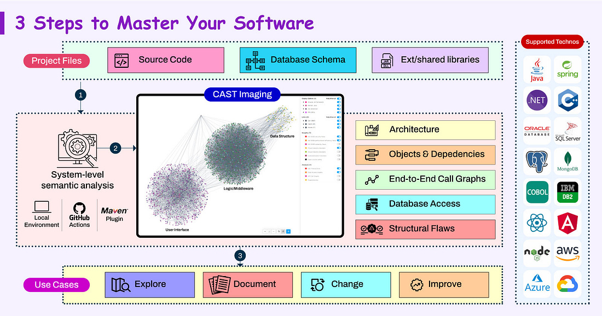
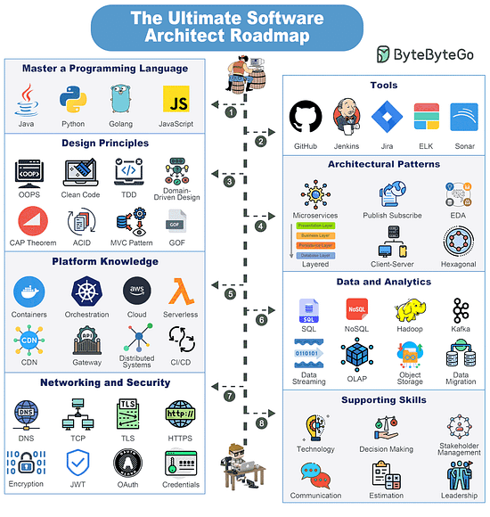
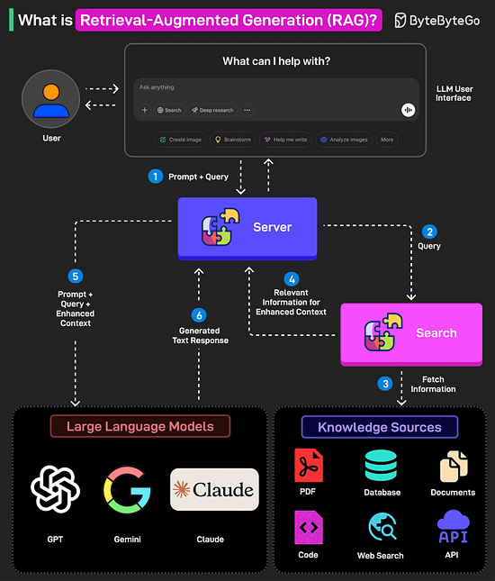
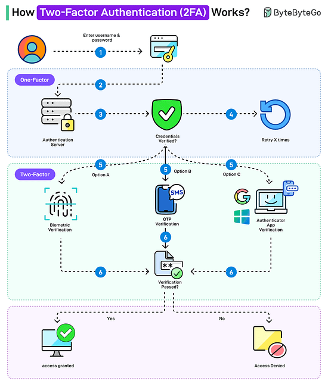
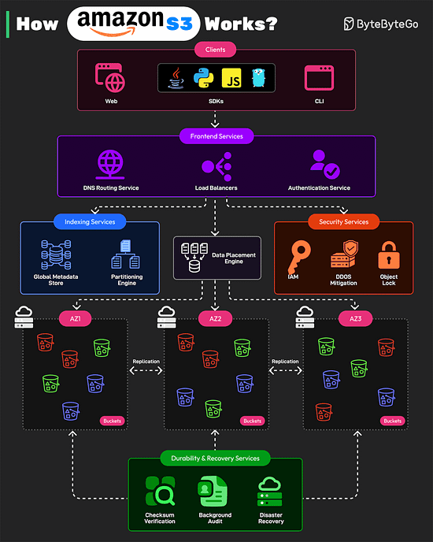

*Mời bạn thưởng thức Newsletter #20.*

## [Performance Improvements in JDK 24](https://inside.java/2025/03/19/performance-improvements-in-jdk24/)

JDK 24 đã được phát hành với nhiều cải tiến đáng kể về hiệu suất so với các phiên bản trước đó. Bài viết từ Inside.java đã tổng hợp những cải tiến quan trọng nhất trong phiên bản mới này.

Một trong những cải tiến nổi bật nhất là việc cải thiện Foreign Function & Memory API (FFM API) thông qua việc tối ưu hóa các thao tác bulk như `MemorySegment::fill`, `MemorySegment::copy` và `MemorySegment::mismatch`. Các thao tác này trước đây được thực hiện thông qua các phương thức Unsafe đòi hỏi chuyển đổi từ Java sang mã native. Với JDK 24, hệ thống sẽ kiểm tra kích thước segment và nếu đủ nhỏ, thao tác sẽ được thực hiện bằng mã Java thuần túy thay vì chuyển sang mã native, giúp cải thiện hiệu suất đáng kể.

JDK 24 cũng giới thiệu một cải tiến quan trọng cho virtual threads thông qua JEP 491, cho phép đồng bộ hóa virtual threads mà không cần pinning. Trước đây, virtual threads bị pinned vào carrier thread của chúng trong quá trình đồng bộ hóa, nhưng giờ đây virtual threads có thể giải phóng carrier thread để các virtual thread khác sử dụng, cải thiện đáng kể khả năng mở rộng của mã Java sử dụng các phương thức và câu lệnh synchronized.

Những điểm nổi bật khác bao gồm:

* Cải thiện hiệu suất của các thuật toán SHA3 lên đến 27% bằng cách giảm chuyển đổi qua lại giữa mảng byte và mảng long
* Cải thiện ClassFile API đang được hoàn thiện trong JDK 24, với nhiều tối ưu hóa để giảm tác động tiêu cực đến thời gian khởi động
* Tăng tốc String::indexOf khoảng 1.3x cho các nền tảng x64 hỗ trợ AVX2 thông qua mã intrinsic chuyên biệt
* JEP 483: Ahead-of-Time Class Loading & Linking, một phần của Project Leyden, giúp cải thiện thời gian khởi động và warmup
* JEP 450: 8-byte Object Headers (Experimental) giúp giảm kích thước header của object từ 96-128 bit xuống còn 64 bit trên kiến trúc 64-bit, giảm tiêu thụ bộ nhớ từ 10% đến 20% cho các workload thông thường

Ngoài ra, JDK 24 cũng mang đến nhiều cải tiến cho nền tảng RISC-V, bao gồm các intrinsic cho CRC32, Adler32 và tối ưu hóa hiệu suất của các thao tác so sánh chuỗi và đảo byte.

Với những cải tiến này, JDK 24 tiếp tục khẳng định cam kết của Oracle và cộng đồng OpenJDK trong việc không ngừng cải thiện hiệu suất của Java, giúp ngôn ngữ này vẫn duy trì vị thế mạnh mẽ trong thế giới phát triển phần mềm hiện đại.

## [Clean your Memory: From Finalize to Cleaner](https://blog.frankel.ch/java-cleaner/)

Java cung cấp cơ chế Garbage Collection để quản lý bộ nhớ, nhưng cơ chế này không tự động dọn dẹp các tài nguyên ngoài bộ nhớ như socket hay file handle. Nếu không quản lý đúng cách, việc rò rỉ tài nguyên có thể xảy ra, dẫn đến suy giảm hiệu suất hoặc thậm chí crash ứng dụng. Cleaner API, được giới thiệu từ Java 9, cung cấp một cơ chế hiện đại và hiệu quả để dọn dẹp tài nguyên khi đối tượng không còn được tham chiếu.

Phương thức `finalize()` trước đây được sử dụng để giải phóng tài nguyên trước khi đối tượng bị thu gom, nhưng có nhiều vấn đề nghiêm trọng: thời điểm thực thi không thể dự đoán, gây tốn kém hiệu suất, tiềm ẩn nguy cơ rò rỉ bộ nhớ và cơ chế hàng đợi finalization có thể gây ra tình trạng tranh chấp thread. Đó là lý do tại sao `finalize()` đã bị deprecated và sẽ bị loại bỏ trong tương lai.

Cleaner API hoạt động dựa trên cơ chế PhantomReference của Java, nhưng cung cấp một lớp trừu tượng dễ sử dụng hơn. Khi đăng ký một đối tượng với Cleaner, nó sẽ được theo dõi bởi một thread daemon nền. Khi đối tượng trở nên không thể truy cập, tác vụ dọn dẹp sẽ được đưa vào hàng đợi để thực thi trong thread nền này.

Cách sử dụng Cleaner cơ bản như sau:

* Tạo một instance của Cleaner thông qua phương thức `Cleaner.create()`
* Định nghĩa một lớp hoặc đối tượng thực hiện interface Runnable để xử lý việc dọn dẹp
* Đăng ký đối tượng cần quản lý với Cleaner thông qua phương thức `register()`
* Khi đối tượng không còn được tham chiếu, tác vụ dọn dẹp sẽ tự động được thực thi

Cleaner cũng có thể kết hợp với AutoCloseable để cung cấp cả cơ chế dọn dẹp tự động và thủ công. Trong trường hợp này, phương thức `close()` có thể gọi `cleanable.clean()` để kích hoạt việc dọn dẹp ngay lập tức.

Tuy nhiên, cần lưu ý rằng Cleaner chỉ nên được sử dụng khi không thể giải phóng tài nguyên thông qua try-with-resources hoặc gọi phương thức close() một cách tường minh. Cleaner có chi phí cao hơn do sử dụng thread nền và cơ chế PhantomReference, vì vậy nên ưu tiên sử dụng try-with-resources khi có thể.

## [5 Hidden Git Tips for Java Developers](https://blog.payara.fish/5-hidden-git-tips-for-java-developers)

Git là công cụ quản lý phiên bản không thể thiếu đối với các lập trình viên Java. Ngoài các lệnh cơ bản như git commit, git push và git pull, Git còn có nhiều tính năng ẩn có thể cải thiện đáng kể quy trình làm việc của bạn. Bài viết từ blog của Payara giới thiệu năm mẹo Git hữu ích dành riêng cho phát triển Java.

### 1. Sử dụng Git Bisect để tìm commit gây ra lỗi

Khi làm việc với các dự án Java phức tạp, việc tìm ra commit chính xác đã gây ra lỗi có thể rất khó khăn. Lệnh `git bisect` thực hiện tìm kiếm nhị phân qua lịch sử commit để xác định commit có vấn đề. Quy trình hoạt động như sau:

* Bắt đầu quá trình bisect với `git bisect start`
* Đánh dấu commit hiện tại là "xấu" với `git bisect bad`
* Đánh dấu một commit đã biết là "tốt" với `git bisect good <commit-hash>`
* Git sẽ tự động checkout một commit ở giữa khoảng và bạn kiểm tra xem lỗi có tồn tại không
* Tiếp tục đánh dấu các commit là "tốt" hoặc "xấu" cho đến khi Git xác định được commit gây ra lỗi
* Kết thúc quá trình với `git bisect reset`

### 2. Sử dụng git blame để hiểu các thay đổi trong mã

Khi làm việc với codebase lớn, lệnh `git blame` giúp bạn xem ai đã sửa đổi mỗi dòng của một tệp và khi nào. Cách sử dụng:

* Chạy `git blame <tên-tệp>` để xem hash commit, tác giả và ngày cho mỗi dòng
* Sử dụng cờ -L để tập trung vào các dòng cụ thể: `git blame -L 50,60 <tên-tệp>`

### 3. Sử dụng git stash để lưu tạm công việc chưa hoàn thành

Khi cần chuyển đổi giữa các tác vụ, `git stash` cho phép bạn tạm thời lưu các thay đổi mà không cần commit:

* Lưu tạm thời các thay đổi với `git stash`
* Chuyển nhánh hoặc làm việc trên tác vụ khác
* Áp dụng lại các thay đổi đã lưu với `git stash pop`
* Sử dụng `git stash list` để xem tất cả các stash và `git stash apply <stash-id>` để áp dụng một stash cụ thể

### 4. Tự động dọn dẹp với git clean

Các dự án Java thường tạo ra nhiều tệp build (ví dụ: tệp .class, thư mục target/). Lệnh `git clean` giúp loại bỏ các tệp không được theo dõi:

* Xem trước các tệp sẽ bị xóa với `git clean -n`
* Xóa các tệp không được theo dõi với `git clean -f`
* Xóa cả thư mục không được theo dõi với `git clean -fd`
* Sử dụng `git clean -x` để xóa cả các tệp bị bỏ qua (ví dụ: .idea/ hoặc .classpath)

### 5. Sử dụng git hooks để tự động hóa quy trình làm việc

Git hooks là các script chạy tự động trước hoặc sau các sự kiện Git như commit, push hoặc merge:

* Tạo hook script trong thư mục .git/hooks của repository
* Làm cho script có thể thực thi với `chmod +x .git/hooks/<tên-hook>`
* Thêm logic tùy chỉnh, ví dụ như chạy unit test trước khi commit

Mẹo bổ sung: Sử dụng `git checkout -` để nhanh chóng chuyển đổi giữa các nhánh. Lệnh này cho phép bạn quay lại nhánh trước đó mà không cần gõ lại tên nhánh, tiết kiệm thời gian và giảm nguy cơ gõ sai khi chuyển nhánh.

## [Simplify Your System by Challenging the Status-Quo and Learning from Other Ecosystems](https://www.infoq.com/podcasts/simplify-system-learning-ecosystems/)

Trong podcast này, Max Rydahl Andersen, kỹ sư xuất sắc tại RedHat và người tạo ra JBang, thảo luận về cách học hỏi liên tục từ các hệ sinh thái khác và áp dụng các công cụ mới để đơn giản hóa tư duy và hệ thống của bạn. Điều này sẽ tăng cường niềm vui cho các lập trình viên và tạo ra các hệ thống an toàn và mạnh mẽ hơn.

Max chia sẻ rằng sau khi nghỉ một năm và thử nghiệm với các ngôn ngữ khác như Python, ông đã nhìn nhận lại Java với góc nhìn mới. Ông nhận ra rằng cộng đồng Java đã vô tình tạo ra quá nhiều độ phức tạp qua các năm, với mỗi tính năng nhỏ được thêm vào tạo ra cái gọi là "các vết cắt ngàn lần" (thousand paper cuts).

Quarkus, dự án mà Max tham gia tại RedHat, đã đảo ngược cách tiếp cận này bằng cách chuyển hầu hết các xử lý sang thời điểm biên dịch (build time) thay vì thời điểm chạy (runtime). Điều này cho phép JVM khởi động trong vòng vài mili giây hoặc ít hơn một giây, và có thể áp dụng native image để tăng tốc hơn nữa. Đây là một sự thay đổi lớn so với cách tiếp cận truyền thống của các framework Java EE hoặc Spring.

Ngoài việc cải thiện hiệu suất runtime, Quarkus còn mang đến trải nghiệm phát triển tốt hơn với các tính năng như:

* Hot reload/live reload cho phép các lập trình viên thử nghiệm nhanh chóng
* Kiểm tra liên tục (continuous testing) để phát hiện lỗi sớm
* Dev services tự động tạo các dịch vụ cần thiết (như Postgres, Kafka) nếu chưa được cấu hình
* Hỗ trợ tốt cho AI với LangChain4J và giao diện chat UI trong môi trường phát triển

Max cũng thảo luận về JBang, một công cụ khác do ông tạo ra, được lấy cảm hứng từ các hệ sinh thái như Python và Node.js để đơn giản hóa việc khởi tạo và chạy các ứng dụng Java. Ông tuyên bố rằng nếu bạn tìm thấy bất kỳ môi trường phát triển nào trên thế giới dễ dàng cài đặt hơn JBang, đó sẽ được coi là một lỗi.

Thông điệp chính của podcast là chúng ta nên thách thức hiện trạng, học hỏi từ các hệ sinh thái khác, và chấp nhận rằng một số việc có thể đơn giản hơn những gì chúng ta đã quen. Đặc biệt trong thời đại AI, việc đơn giản hóa các hệ thống không chỉ giúp các lập trình viên làm việc hiệu quả hơn mà còn tạo ra các hệ thống an toàn và bền vững hơn.

## [About "vibe coding"](https://tryingthings.wordpress.com/2025/03/24/about-vibe-coding/)

Trong bài viết ngắn gọn này, tác giả Sorin Costea chia sẻ quan điểm của mình về xu hướng "vibe coding" - một cách gọi mới cho việc sử dụng AI để lập trình. Tác giả bày tỏ sự hoài nghi của mình đối với các công cụ AI trong phát triển phần mềm, đặc biệt sau khi đọc bài viết "Vibe coding vs Reality" và tự trải nghiệm với công cụ Cursor.

Tác giả mô tả trải nghiệm của mình khi sử dụng Cursor với một dự án Java Maven. Ông phát hiện rằng Cursor không thể thực hiện một thao tác cơ bản như đổi tên một lớp Java. Công cụ này hoặc chỉ đổi tên lớp mà không đổi tên tệp, hoặc khi được yêu cầu lại, nó tạo ra một tệp mới rỗng với tên mới. Điều này khiến tác giả mất lòng tin vào khả năng của công cụ này trong việc xử lý các dự án thực tế.

Khi chia sẻ trải nghiệm này trên Hacker News, tác giả nhận được các phản hồi không mấy tích cực như "haha Java", khiến ông tự hỏi liệu Cursor chỉ được huấn luyện cho các framework frontend phổ biến hay những người ủng hộ nó không thực sự quan tâm đến các ứng dụng trong thế giới thực. Kết quả là tác giả đã gỡ cài đặt Cursor và xây dựng một thái độ hoài nghi đối với các giải pháp AI "kỳ diệu".

Tác giả kết luận bài viết với câu "Nhưng năm sau? Chúng ta sẽ xem xét lại vào năm sau", thể hiện thái độ chờ đợi và sẵn sàng đánh giá lại các công nghệ AI trong tương lai khi chúng trưởng thành hơn.

## [Visual-Focused Algorithms Cheat Sheet](https://photonlines.substack.com/p/visual-focused-algorithms-cheat-sheet)

Bài viết này cung cấp một tổng quan trực quan về các thuật toán quan trọng được sử dụng trong thế giới thực. Tác giả Nick M đã tập hợp một bảng tra cứu (cheat sheet) bao gồm nhiều loại thuật toán khác nhau, từ các thuật toán sắp xếp và tìm kiếm cơ bản đến các thuật toán phức tạp hơn trong học máy và bảo mật.

Bảng tra cứu này được chia thành nhiều phần chính:

### Thuật toán sắp xếp (Sorting Algorithms)

Phần này giới thiệu các thuật toán sắp xếp phổ biến như:

* **Selection Sort**: Thuật toán đơn giản liên tục tìm phần tử nhỏ nhất và đưa vào vị trí đúng, với độ phức tạp O(n²)
* **Insertion Sort**: Sắp xếp bằng cách so sánh và chèn các phần tử vào vị trí thích hợp trong phần đã sắp xếp, cũng có độ phức tạp O(n²)
* **Heap Sort**: Sử dụng cấu trúc dữ liệu binary heap để sắp xếp với độ phức tạp O(n log n)
* **Quick Sort**: Thuật toán chia để trị hiệu quả cao với độ phức tạp trung bình O(n log n)
* **Merge Sort**: Thuật toán ổn định chia để trị với độ phức tạp O(n log n)
* **Tim Sort**: Thuật toán lai kết hợp Insertion Sort và Merge Sort, được sử dụng trong Python và Java

### Thuật toán tìm kiếm (Search Algorithms)

* **Binary Search**: Tìm kiếm nhanh trên mảng đã sắp xếp với độ phức tạp O(log n)
* **Depth-First Search (DFS)**: Duyệt đồ thị theo chiều sâu, thích hợp cho việc khám phá sâu
* **Breadth-First Search (BFS)**: Duyệt đồ thị theo chiều rộng, tốt cho việc tìm đường đi ngắn nhất

### Thuật toán đồ thị (Graph Algorithms)

* **Prim's Algorithm**: Tìm cây khung nhỏ nhất trong đồ thị có trọng số
* **Kruskal's Algorithm**: Cũng tìm cây khung nhỏ nhất nhưng bằng cách sắp xếp các cạnh theo trọng số
* **Dijkstra's Algorithm**: Tìm đường đi ngắn nhất từ một đỉnh đến tất cả các đỉnh khác trong đồ thị có trọng số không âm
* **Bellman-Ford Algorithm**: Tương tự Dijkstra nhưng có thể xử lý cả trọng số âm
* **A* Search**: Thuật toán tìm đường cải tiến từ Dijkstra, kết hợp tìm đường ngắn nhất và tìm kiếm dựa trên hế số ước lượng

Bài viết cũng bao gồm các phần về thuật toán nén và mã hóa, thuật toán tối ưu, thuật toán học máy và khoa học dữ liệu, cũng như các thuật toán bảo mật và mã hóa. Đặc biệt, phần học máy giới thiệu các thuật toán như hồi quy (Linear, Logistic, và Polynomial), Support Vector Machines (SVMs), cây quyết định (Decision Trees) và các biến thể như Random Forest và Boosted Trees.

Bảng tra cứu này là một tài nguyên quý giá cho cả sinh viên và các chuyên gia trong lĩnh vực công nghệ, cung cấp cái nhìn trực quan và dễ hiểu về các thuật toán quan trọng được sử dụng trong thực tế. Tác giả cũng đã bao gồm các tài liệu hữu ích cho việc chuẩn bị phỏng vấn công việc, với các mục như "14 Patterns to Ace Any Coding Interview" và "5 Simple Steps for Solving Dynamic Programming Problems".

## Bonus: Vài ảnh hay ho đến từ [ByteByteGo](https://bytebytego.com/)

