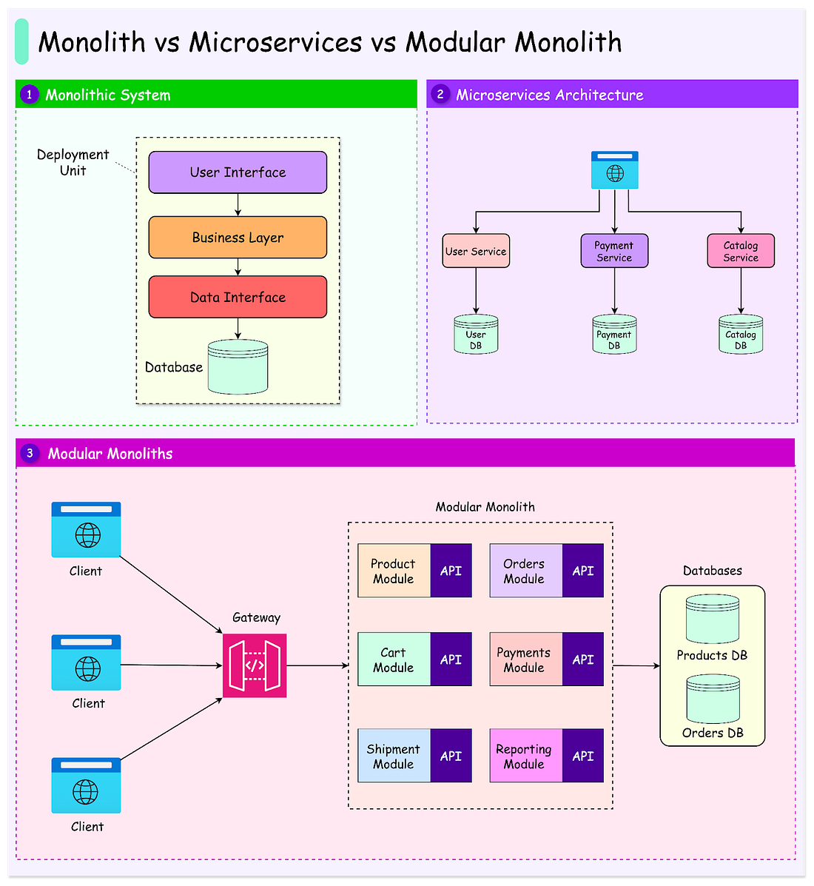

*Mời bạn thưởng thức Newsletter #17.*

## [To fork or not to fork?](https://www.augmentcode.com/blog/to-fork-or-not-to-fork)

Bài viết phân tích sâu về hai cách tiếp cận khác nhau trong việc tích hợp AI vào môi trường phát triển phần mềm (IDE). Tác giả so sánh hai phương pháp chính:

* Phương pháp plugin tiêu chuẩn (được sử dụng bởi GitHub Copilot và Augment Code)
* Phương pháp fork IDE (được sử dụng bởi Cursor và Codeium với Windsurf)

Bài viết chỉ ra những thách thức và rủi ro khi fork VS Code, bao gồm:
- Người dùng bị buộc phải chuyển đổi IDE
- Mất hỗ trợ từ Microsoft
- Mất khả năng tương thích với hệ sinh thái Microsoft
- Mất quyền truy cập vào các tính năng mới của VS Code

Tác giả kết luận rằng Augment Code đã chọn không fork VS Code để đảm bảo tính bền vững lâu dài cho người dùng, đồng thời tập trung vào việc cung cấp giải pháp AI chuyên sâu cho các dự án phức tạp.

### Điểm chính cần lưu ý:
- Việc fork IDE có thể mang lại lợi ích ngắn hạn nhưng tiềm ẩn nhiều rủi ro dài hạn
- Các plugin tiêu chuẩn có thể mất nhiều thời gian hơn để hoàn thiện nhưng mang lại trải nghiệm người dùng ổn định hơn
- Sự cạnh tranh trong lĩnh vực AI coding đang thúc đẩy sự đổi mới và giá trị cho người dùng 

## [Why I'm No Longer Talking to Architects About Microservices](https://blog.container-solutions.com/why-im-no-longer-talking-to-architects-about-microservices)

Bài viết này phản ánh sự mệt mỏi của tác giả khi thảo luận về microservices với các kiến trúc sư phần mềm, bởi thuật ngữ này ngày càng trở nên mơ hồ và các cuộc trao đổi thường thiếu trọng tâm thực tiễn. Tác giả chỉ ra rằng không có định nghĩa thống nhất về microservices, dẫn đến việc mỗi người hiểu và áp dụng khác nhau, gây ra nhiều hiểu lầm trong quá trình thiết kế hệ thống.

Một vấn đề lớn là các cuộc thảo luận về microservices thường tách rời mục tiêu kinh doanh thực tế. Nhiều tổ chức theo đuổi microservices vì lý do “xu hướng” mà không xác định rõ vấn đề kinh doanh cần giải quyết, dẫn đến việc gia tăng phức tạp mà không mang lại giá trị thiết thực. Tác giả nhấn mạnh rằng nên tập trung vào các mục tiêu như rút ngắn thời gian phát triển, tăng độ tin cậy và giải quyết các nút thắt cụ thể thay vì chạy theo công nghệ mới một cách mù quáng.

Bên cạnh đó, microservices chỉ thực sự phát huy hiệu quả khi đi kèm với thay đổi tổ chức, như xây dựng các nhóm đa chức năng, tự chủ và phát triển văn hóa DevOps trưởng thành. Nếu tổ chức không sẵn sàng thay đổi về mặt vận hành và quản trị, việc áp dụng microservices có thể khiến mọi thứ trở nên tồi tệ hơn.

### Điểm chính cần lưu ý:
- Không có định nghĩa thống nhất về microservices, dẫn đến nhiều hiểu lầm.
- Các cuộc thảo luận về microservices thường thiếu liên hệ với mục tiêu kinh doanh cụ thể.
- Microservices chỉ có ý nghĩa khi tổ chức thay đổi cấu trúc và quy trình phù hợp.
- Nên tập trung vào giải quyết vấn đề thực tế thay vì chạy theo công nghệ.
- Việc áp dụng microservices không phù hợp có thể làm tăng sự phức tạp và giảm hiệu quả tổ chức.

## [Not all AI-assisted programming is vibe coding (but vibe coding rocks)](https://simonwillison.net/2025/Mar/19/vibe-coding/)

Bài viết của Simon Willison phân tích sự khác biệt giữa "vibe coding" (lập trình cảm hứng với AI) và các hình thức lập trình hỗ trợ bởi AI khác. Tác giả cho rằng vibe coding giúp hạ thấp rào cản cho người mới tiếp cận lập trình, đồng thời mở ra nhiều cơ hội sáng tạo cho cả lập trình viên giàu kinh nghiệm. Tuy nhiên, ông cũng nhấn mạnh rằng việc sử dụng AI trong lập trình đòi hỏi phải xây dựng trực giác và hiểu biết về các giới hạn của công cụ.

Simon cũng cảnh báo về những rủi ro khi "vibe coding" với các dự án có yếu tố bảo mật, dữ liệu nhạy cảm hoặc liên quan đến chi phí tài chính. Ông khuyến nghị chỉ nên áp dụng vibe coding cho các dự án có rủi ro thấp và luôn cân nhắc đến bảo mật, quyền riêng tư và tác động tới cộng đồng mạng. Nếu dự án có thể ảnh hưởng đến người khác, nên tham khảo ý kiến chuyên gia trước khi chia sẻ rộng rãi.

### Điểm chính cần lưu ý:
- Vibe coding giúp giảm rào cản cho người mới học lập trình và thúc đẩy sáng tạo.
- Cần xây dựng trực giác về giới hạn và khả năng của AI khi lập trình.
- Không nên áp dụng vibe coding cho các dự án có rủi ro bảo mật hoặc tài chính cao.
- Luôn chú ý tới bảo mật, quyền riêng tư và tác động tới cộng đồng khi dùng AI hỗ trợ lập trình.
- Nên tham khảo ý kiến chuyên gia nếu dự án sẽ được sử dụng bởi nhiều người.

## [Career advice in 2025.](https://lethain.com/career-advice-2025)

Bài viết của Will Larson phân tích sâu về những thay đổi lớn trong thị trường việc làm công nghệ năm 2025 và đưa ra lời khuyên thực tế cho các chuyên gia phần mềm. Tác giả nhấn mạnh rằng các công ty phi AI ngày càng khó tiếp cận vốn và cơ hội tăng trưởng, trong khi các công ty AI cạnh tranh khốc liệt và không phải ai cũng hưởng lợi lớn từ làn sóng này.

Thị trường việc làm chuyển dịch trọng tâm từ kỹ năng quản lý sang khả năng làm việc chi tiết, đẩy nhanh tiến độ và thích nghi với các mô hình AI nền tảng. Nhiều lãnh đạo kỳ cựu cảm thấy khó thích nghi, trong khi những người từng giỏi về tốc độ lại gặp khó trong việc thăng tiến. Sự thay đổi này khiến nhiều người cảm thấy bị bỏ lại phía sau, dù không phải ai cũng gặp tình trạng này.

Tác giả cũng cảnh báo rằng việc áp dụng AI vào sản phẩm đòi hỏi tư duy thiết kế mới, với xác thực tiến bộ và kỹ thuật human-in-the-loop. Các công ty cần chuẩn bị cho cả kịch bản AI phát triển vượt bậc lẫn trường hợp không có cải tiến lớn trong vài năm tới.

### Điểm chính cần lưu ý:
- Các công ty phi AI khó tiếp cận vốn, tăng trưởng và thăng tiến.
- Các công ty AI cạnh tranh khốc liệt, không phải ai cũng hưởng lợi lớn.
- Thị trường việc làm ưu tiên kỹ năng chi tiết, tốc độ và thích nghi với AI.
- Lãnh đạo kỳ cựu và nhân sự cũ gặp khó khăn trong môi trường mới.
- Áp dụng AI đòi hỏi thiết kế sản phẩm với xác thực tiến bộ và human-in-the-loop.

## [Tips For Better Interactions](https://staysaasy.com/saas/2025/03/17/interactions.html)

Bài viết chia sẻ các lời khuyên thực tế giúp nâng cao chất lượng các cuộc họp và tương tác trong môi trường làm việc hiện đại. Tác giả nhấn mạnh tầm quan trọng của việc kiểm soát cảm xúc, chủ động ghi chú, tránh tranh luận không cần thiết và lựa chọn thời điểm phù hợp cho các cuộc trao đổi quan trọng.

Một số điểm nổi bật bao gồm: không để bị gán nhãn là "frustrated" trong cuộc họp; ghi chú giúp bạn trở thành người dẫn dắt hiệu quả; tránh phản đối theo kiểu "nếu làm quá sẽ..."; chấp nhận để người khác sai ở những chi tiết không quan trọng; và sắp xếp thời gian họp hợp lý để tăng hiệu quả.

### Điểm chính cần lưu ý:
- Không đồng ý với việc bị gán nhãn "frustrated" hoặc "upset" trong công việc.
- Chủ động ghi chú trong cuộc họp giúp nâng cao vai trò lãnh đạo và kiểm soát thảo luận.
- Tránh phản đối kiểu "boundary objections" không thực tế.
- Chấp nhận để người khác sai ở những chi tiết không quan trọng, tập trung vào mục tiêu chính.
- Sắp xếp thời gian họp và tương tác hợp lý, tránh các khung giờ kém hiệu quả.

## [Code is the new no-code](https://lumberjack.so/p/code-is-the-new-no-code)

Bài viết phân tích sự chuyển dịch từ các nền tảng no-code sang việc lập trình truyền thống với sự hỗ trợ mạnh mẽ của AI và các mô hình thành phần (component-based) như React. Tác giả cho rằng, dù no-code hứa hẹn giúp mọi người xây dựng phần mềm mà không cần biết lập trình, thực tế các công cụ này vẫn gặp giới hạn về độ phức tạp và khả năng mở rộng.

Nhiều người dùng no-code cuối cùng vẫn phải học lập trình hoặc mong muốn có thể viết mã để giải quyết các vấn đề phức tạp. Sự phát triển của AI coding assistant và các framework hiện đại đã thu hẹp khoảng cách giữa no-code và code, giúp việc lập trình trở nên dễ tiếp cận hơn, đồng thời duy trì được sự linh hoạt và sức mạnh vốn có của code.

### Điểm chính cần lưu ý:
- Các nền tảng no-code ngày càng tích hợp thêm khả năng viết mã để đáp ứng nhu cầu phức tạp.
- AI coding assistant đang phát triển nhanh hơn bất kỳ nền tảng no-code nào trước đây.
- Khoảng cách kiến thức giữa coder và non-coder đang dần thu hẹp nhờ AI giải thích và hỗ trợ trực tiếp.
- Mô hình component-based (như React) giúp lập trình backend và workflow trở nên trực quan, dễ bảo trì hơn.
- Lập trình truyền thống, khi được hỗ trợ tốt, vẫn là con đường bền vững và mạnh mẽ nhất cho phát triển phần mềm.

## [How to Improve JVM-Based Application Startup Time?](https://softwaremill.com/how-to-improve-jvm-based-application-startup-time/)

Bài viết tổng hợp và so sánh các phương pháp tối ưu hóa thời gian khởi động ứng dụng dựa trên JVM, một chủ đề quan trọng đối với các hệ thống yêu cầu hiệu năng cao hoặc khởi động nhanh (như serverless, microservices). Tác giả phân tích các giải pháp như Class Data Sharing (CDS), Application Class Data Sharing (AppCDS), GraalVM, CRaC và Project Leyden, đồng thời cung cấp số liệu benchmark thực tế trên nhiều môi trường khác nhau.

Kết quả cho thấy AppCDS dễ áp dụng nhưng hiệu quả vừa phải; CRaC và GraalVM mang lại tốc độ khởi động nhanh nhất, phù hợp cho các ứng dụng chạy lâu hoặc ngắn hạn tuỳ trường hợp. Project Leyden vẫn đang phát triển nhưng hứa hẹn nhiều tiềm năng. Lựa chọn giải pháp tối ưu cần dựa vào đặc thù ứng dụng và môi trường triển khai.

### Điểm chính cần lưu ý:
- JVM khởi động chậm do quá trình load, verify, initialize class.
- AppCDS dễ dùng, cải thiện thời gian khởi động gấp đôi so với mặc định.
- CRaC phù hợp cho ứng dụng chạy lâu dài, tận dụng tối ưu runtime.
- GraalVM thích hợp cho ứng dụng ngắn hạn cần khởi động siêu nhanh.
- Project Leyden là hướng đi tiềm năng nhưng vẫn chưa hoàn thiện.
- Không có giải pháp “một cho tất cả”, cần cân nhắc theo từng trường hợp thực tế.

## [Domain Driven Design](https://dev.to/lovestaco/domain-driven-design-3i2j)

Bài viết giới thiệu tổng quan về Domain Driven Design (DDD) – một phương pháp thiết kế phần mềm đặt trọng tâm vào lĩnh vực nghiệp vụ (domain) thay vì chỉ tập trung vào kỹ thuật. DDD giúp tổ chức hệ thống thành các phần độc lập, rõ ràng, tăng khả năng mở rộng, bảo trì và giao tiếp giữa đội ngũ phát triển với chuyên gia nghiệp vụ.

Tác giả trình bày các khái niệm cốt lõi như Domain/Subdomain, Bounded Context, Entity, Value Object, Aggregate, Domain Event, Repository, Service, Factory và Ubiquitous Language. Việc áp dụng đúng các khái niệm này giúp giảm phức tạp, tăng tính nhất quán và đảm bảo phần mềm phát triển đúng hướng với nhu cầu kinh doanh.

### Điểm chính cần lưu ý:
- Domain là phạm vi nghiệp vụ chính, có thể chia thành nhiều subdomain nhỏ.
- Bounded Context giúp xác định ranh giới rõ ràng cho từng phần nghiệp vụ, tránh xung đột mô hình dữ liệu.
- Entity có danh tính riêng, Value Object bất biến và xác định bằng thuộc tính.
- Aggregate gom nhóm các thực thể liên quan, Aggregate Root đảm bảo tính nhất quán.
- Domain Event giúp tách biệt logic nghiệp vụ, tăng khả năng mở rộng.
- Repository, Service, Factory hỗ trợ quản lý, thao tác và khởi tạo đối tượng domain.
- Ubiquitous Language là ngôn ngữ chung giữa kỹ thuật và nghiệp vụ, giúp giảm hiểu lầm khi phát triển phần mềm.

## Bonus: Vài ảnh hay ho đến từ [ByteByteGo](https://bytebytego.com/)

