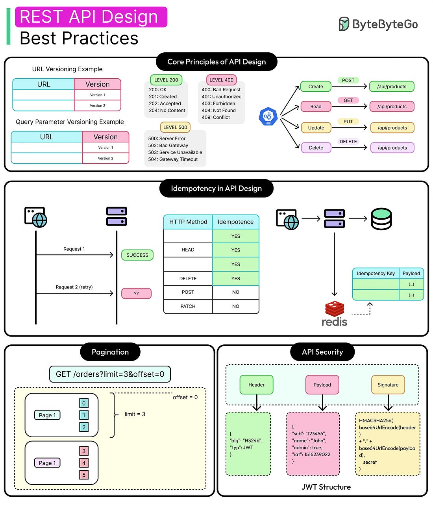
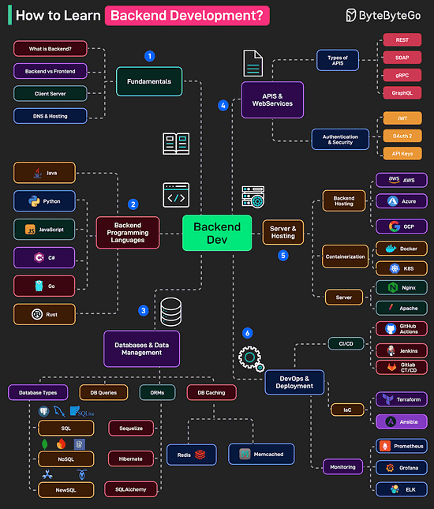
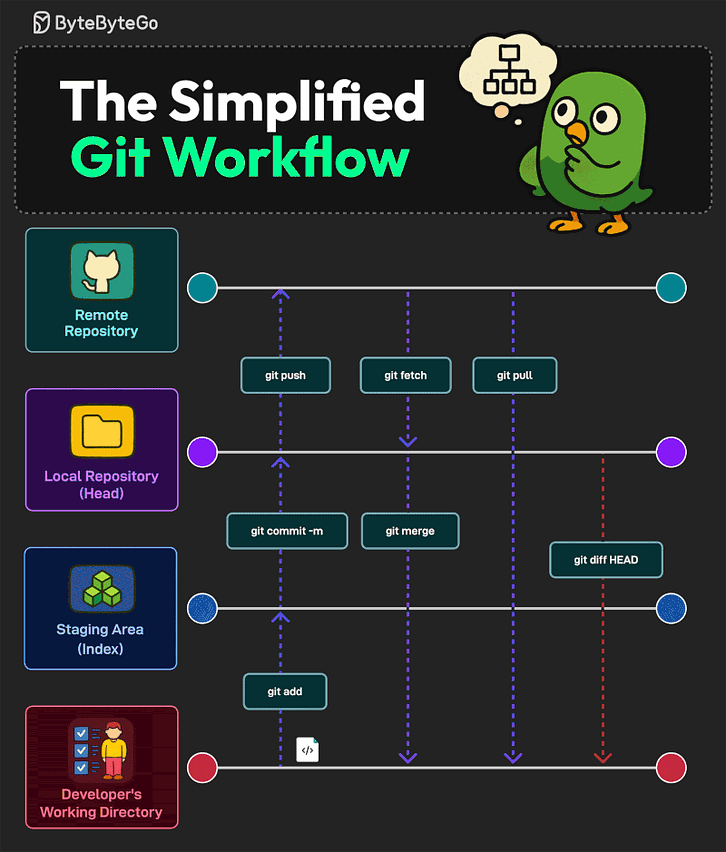
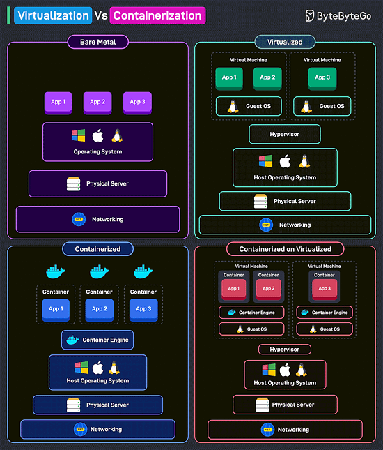
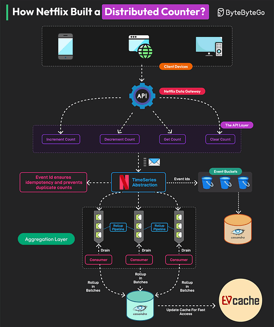

*Mời bạn thưởng thức Newsletter #24.*

## [Google's principles for measuring developer productivity](https://newsletter.getdx.com/p/googles-principles-for-measuring-developer-productivity)

Bài viết này chia sẻ những nguyên tắc quan trọng mà Google đã phát triển để đo lường năng suất của các kỹ sư phần mềm một cách hiệu quả và tránh những tác động tiêu cực không mong muốn. Dựa trên nghiên cứu của Ciera Jaspan và Collin Green, bài viết đưa ra năm nguyên tắc chính:

1. Tránh sử dụng mô hình đơn chỉ số: Không nên dựa vào một chỉ số duy nhất để đánh giá năng suất vì điều này có thể bỏ sót nhiều khía cạnh quan trọng.

2. Đo lường tất cả các kết quả quan trọng: Với mỗi kết quả cần quan tâm, nên thu thập nhiều chỉ số khác nhau để có cái nhìn toàn diện hơn.

3. Chú ý đến các động lực được tạo ra bởi việc đo lường: Khi một chỉ số trở thành mục tiêu, nó có thể mất đi tính hữu ích của mình và tạo ra những hành vi không mong muốn.

4. Đo lường nhiều khía cạnh khác nhau của năng suất: Cần đảm bảo bao quát được cả ba khía cạnh: tốc độ, dễ dàng và chất lượng.

5. Kết hợp dữ liệu hệ thống và dữ liệu tự báo cáo: Cả hai phương pháp đều có ưu điểm riêng và nên được sử dụng cùng nhau.

Bài viết cũng nhấn mạnh rằng với các nhóm nhỏ (có thể họp trong một phòng họp), việc đo lường năng suất không cần thiết vì có thể thảo luận trực tiếp. Với các nhóm lớn hơn, nên bắt đầu bằng các cuộc khảo sát để hiểu rõ hơn về trải nghiệm của các kỹ sư.

*Những điểm chính cần ghi nhớ:*
- Việc đo lường năng suất là một bài toán phức tạp cần được tiếp cận một cách toàn diện
- Cần tránh tạo ra những động lực tiêu cực thông qua việc đo lường
- Nên kết hợp nhiều phương pháp và chỉ số khác nhau
- Luôn bắt đầu bằng việc xác định rõ mục đích của việc đo lường 

## [In defense of ruthless managers](https://www.seangoedecke.com/ruthless-managers/)

Bài viết này đưa ra một góc nhìn thú vị về hai kiểu quản lý trong ngành công nghệ: người quản lý đồng cảm (empathetic) và người quản lý tàn nhẫn (ruthless). Tác giả cho rằng những người quản lý tàn nhẫn thường bị đánh giá thấp và có những ưu điểm không ngờ tới:

1. **Vẫn quan tâm đến hạnh phúc của kỹ sư**: Người quản lý tàn nhẫn vẫn muốn kỹ sư của họ hạnh phúc vì điều này mang lại lợi ích cho cả hai bên. Kỹ sư hạnh phúc sẽ làm việc hiệu quả hơn và dễ quản lý hơn.

2. **Có nhiều ảnh hưởng chính trị hơn**: Trong khi người quản lý đồng cảm thường xung đột với cấp trên, người quản lý tàn nhẫn thường có nhiều "vốn chính trị" hơn. Điều này có thể giúp họ thực hiện được những thay đổi quan trọng khi cần thiết.

3. **Ít căng thẳng hơn**: Người quản lý tàn nhẫn ít bị ảnh hưởng bởi những quyết định khó khăn, giúp họ tập trung tốt hơn vào công việc và đội nhóm.

4. **Giao tiếp rõ ràng hơn**: Họ thường truyền đạt thông tin một cách trực tiếp và rõ ràng, không cố gắng làm mềm những tin xấu.

5. **Dễ dự đoán hơn**: Họ luôn hành động theo giá trị và ưu tiên của công ty, giúp kỹ sư dễ dàng hiểu được kỳ vọng và cách để thành công.

Tuy nhiên, tác giả cũng nhấn mạnh rằng những ưu điểm này chỉ áp dụng cho những người quản lý có năng lực trong một công ty tương đối lành mạnh. Nếu người quản lý không có năng lực, việc họ tàn nhẫn có thể dẫn đến những hậu quả tiêu cực.

*Những điểm chính cần ghi nhớ:*
- Mỗi kiểu quản lý đều có ưu và nhược điểm riêng
- Người quản lý tàn nhẫn có thể hiệu quả trong việc thực hiện thay đổi
- Giao tiếp rõ ràng và dễ dự đoán là những ưu điểm quan trọng
- Năng lực của người quản lý vẫn là yếu tố quyết định nhất 

## [AI ambivalence](https://nolanlawson.com/2025/04/02/ai-ambivalence/)

Bài viết này chia sẻ góc nhìn của một kỹ sư có nền tảng về ngôn ngữ học tính toán về sự phát triển của AI và tác động của nó đến công việc lập trình. Tác giả Nolan Lawson, người có bằng thạc sĩ về ngôn ngữ học tính toán, chia sẻ hành trình từ việc ban đầu hoài nghi về AI đến việc chấp nhận và sử dụng nó trong công việc:

1. **Nền tảng và hoài nghi ban đầu**: Với kiến thức sâu về ngôn ngữ học và ngôn ngữ học tính toán, tác giả ban đầu hoài nghi về khả năng của AI trong việc thực sự hiểu và xử lý ngôn ngữ tự nhiên.

2. **Sự thay đổi quan điểm**: Mặc dù vẫn giữ thái độ hoài nghi về khả năng của AI trong việc đạt được trí tuệ nhân tạo tổng quát (AGI), tác giả thừa nhận rằng các công cụ AI hiện đại có thể thực sự "làm được việc" và hữu ích trong thực tế.

3. **Trải nghiệm với AI trong lập trình**: Tác giả chia sẻ về việc sử dụng Claude và Claude Code trong công việc, thừa nhận rằng công cụ này có khả năng vượt xa những gì ông từng mong đợi, đặc biệt trong việc phân tích codebase lớn, tạo unit test, và refactor code.

4. **Những lo ngại về "vibe coding"**: Tác giả bày tỏ lo ngại về việc AI có thể làm mất đi niềm vui trong việc lập trình, biến lập trình viên thành người "trông trẻ" cho AI, chỉ đọc và sửa lỗi code do AI tạo ra.

5. **Cân bằng giữa hiệu quả và niềm vui**: Bài viết kết luận với việc cân nhắc giữa việc sử dụng AI để tăng hiệu quả và việc duy trì niềm vui, sự sáng tạo trong công việc lập trình.

*Những điểm chính cần ghi nhớ:*
- AI đã trở thành một công cụ mạnh mẽ trong lập trình, đặc biệt trong việc xử lý codebase lớn
- Cần cân nhắc giữa hiệu quả và niềm vui trong công việc lập trình
- "Vibe coding" có thể dẫn đến việc phụ thuộc quá mức vào AI
- Việc hiểu và kiểm soát code vẫn là kỹ năng quan trọng của lập trình viên
- Cần có thái độ cân bằng và thực tế khi sử dụng AI trong lập trình

## [Use Abstraction to Improve Function Readability](https://testing.googleblog.com/2023/09/use-abstraction-to-improve-function.html)

Bài viết này từ Google Testing Blog chia sẻ về cách sử dụng trừu tượng hóa (abstraction) để cải thiện khả năng đọc hiểu của các hàm trong code. Đây là một kỹ thuật quan trọng trong việc viết code sạch và dễ bảo trì.

### Tại sao cần trừu tượng hóa:

1. **Cải thiện khả năng đọc hiểu**: Trừu tượng hóa giúp code dễ đọc hơn bằng cách ẩn đi các chi tiết phức tạp và tập trung vào ý định của code.

2. **Giảm độ phức tạp**: Bằng cách tách các chi tiết triển khai thành các hàm riêng biệt, code trở nên đơn giản và dễ hiểu hơn.

3. **Tăng khả năng tái sử dụng**: Các hàm được trừu tượng hóa tốt có thể được tái sử dụng ở nhiều nơi khác nhau trong codebase.

4. **Dễ dàng bảo trì**: Khi cần thay đổi logic, việc sửa đổi một hàm được trừu tượng hóa tốt sẽ ít ảnh hưởng đến các phần khác của code.

### Cách áp dụng trừu tượng hóa:

1. **Tách biệt các mối quan tâm**: Mỗi hàm nên chỉ thực hiện một nhiệm vụ cụ thể và rõ ràng.

2. **Đặt tên hàm có ý nghĩa**: Tên hàm nên phản ánh chính xác những gì hàm đó làm.

3. **Giảm thiểu độ phức tạp**: Mỗi hàm nên có ít tham số và logic đơn giản.

4. **Sử dụng các mức trừu tượng phù hợp**: Code nên được tổ chức theo các mức trừu tượng khác nhau, từ cao đến thấp.

5. **Tài liệu hóa rõ ràng**: Các hàm phức tạp nên được tài liệu hóa đầy đủ để người khác dễ dàng hiểu và sử dụng.

*Những điểm chính cần ghi nhớ:*
- Trừu tượng hóa là một công cụ mạnh mẽ để cải thiện chất lượng code
- Mỗi hàm nên có một nhiệm vụ rõ ràng và cụ thể
- Tên hàm nên phản ánh chính xác chức năng của nó
- Code nên được tổ chức theo các mức trừu tượng phù hợp
- Tài liệu hóa là một phần quan trọng của việc trừu tượng hóa

## [How Apple Pay Handles 41 Million Transactions a Day Securely](https://newsletter.systemdesign.one/p/how-does-apple-pay-work)

Bài viết này phân tích kiến trúc của Apple Pay và cách nó xử lý hơn 41 triệu giao dịch mỗi ngày một cách an toàn. Đây là một ví dụ điển hình về việc thiết kế hệ thống thanh toán di động với tính bảo mật cao.

### Kiến trúc của Apple Pay:

1. **Đăng ký thẻ tín dụng**: Khi người dùng thêm thẻ tín dụng vào Apple Wallet, thông tin thẻ và metadata của iPhone được gửi đến mạng thanh toán (như Visa hoặc MasterCard) dưới dạng mã hóa. Apple không lưu trữ thông tin thẻ trên iPhone hoặc máy chủ của họ.

2. **Số tài khoản thiết bị (DAN)**: Mạng thanh toán xác minh thông tin thẻ và tạo ra một DAN - một số ngẫu nhiên duy nhất đại diện cho số thẻ tín dụng. DAN được lưu trữ trong "secure element" của iPhone, một chip chuyên biệt có độ bảo mật cao.

3. **Xác thực giao dịch**: Khi thực hiện thanh toán, iPhone giao tiếp với đầu đọc thẻ qua NFC (Near Field Communication). Quá trình xác thực bao gồm:
   - Xác thực sinh trắc học (Touch ID hoặc Face ID)
   - Tạo cryptogram yêu cầu từ DAN và chi tiết giao dịch
   - Xác thực cryptogram bởi mạng thanh toán

4. **Bảo mật dữ liệu sinh trắc học**: Thông tin sinh trắc học chỉ được lưu trữ trong "secure enclave" của iPhone, một bộ xử lý riêng biệt được cách ly với phần còn lại của hệ thống.

5. **Xử lý giao dịch không cần internet**: Apple Pay có thể hoạt động mà không cần kết nối internet, tương tự như thẻ tín dụng vật lý, nhờ vào việc sử dụng tiêu chuẩn EMV cho thanh toán không tiếp xúc.

### Các biện pháp bảo mật chính:

1. **Bảo vệ thông tin thẻ**: Thông tin thẻ tín dụng không bao giờ được lưu trữ trên thiết bị hoặc máy chủ của Apple.

2. **Xác thực hai yếu tố**: Mỗi giao dịch đều yêu cầu xác thực sinh trắc học.

3. **Mã hóa đầu cuối**: Tất cả dữ liệu nhạy cảm đều được mã hóa trong quá trình truyền tải.

4. **Cryptogram động**: Mỗi giao dịch sử dụng một cryptogram duy nhất, dựa trên thời gian và chi tiết giao dịch.

5. **Cách ly phần cứng**: Secure element và secure enclave cung cấp lớp bảo vệ phần cứng cho dữ liệu nhạy cảm.

*Những điểm chính cần ghi nhớ:*
- Apple Pay sử dụng kiến trúc phân tầng để đảm bảo an toàn cho giao dịch
- Thông tin thẻ tín dụng không bao giờ được lưu trữ trực tiếp
- Xác thực sinh trắc học là bắt buộc cho mỗi giao dịch
- Hệ thống có thể hoạt động mà không cần kết nối internet
- Bảo mật được đảm bảo ở cả cấp độ phần mềm và phần cứng

## [Four Kinds of Optimisation](https://tratt.net/laurie/blog/2023/four_kinds_of_optimisation.html)

Bài viết này phân tích bốn loại tối ưu hóa chính trong lập trình và cách chúng được sử dụng để cải thiện hiệu suất của chương trình. Tác giả chia sẻ kinh nghiệm của mình trong việc tối ưu hóa và đưa ra những hiểu biết sâu sắc về việc lựa chọn phương pháp tối ưu hóa phù hợp.

### Bốn loại tối ưu hóa chính:

1. **Sử dụng thuật toán tốt hơn**: Đây là phương pháp phổ biến nhất và thường mang lại hiệu quả cao. Tuy nhiên, việc lựa chọn thuật toán phù hợp phụ thuộc vào nhiều yếu tố như:
   - Đặc điểm của dữ liệu đầu vào
   - Yêu cầu về bộ nhớ
   - Độ phức tạp của việc triển khai
   - Khả năng xảy ra trường hợp xấu nhất

2. **Sử dụng cấu trúc dữ liệu tốt hơn**: Việc lựa chọn cấu trúc dữ liệu phù hợp có thể cải thiện đáng kể hiệu suất. Ví dụ:
   - Sử dụng hash map thay vì tìm kiếm tuần tự
   - Sử dụng cây nhị phân cho dữ liệu có thứ tự
   - Tối ưu hóa cấu trúc dữ liệu cho các thao tác phổ biến

3. **Sử dụng hệ thống cấp thấp hơn**: Việc chuyển sang ngôn ngữ lập trình cấp thấp hơn có thể mang lại hiệu suất tốt hơn, nhưng cũng đi kèm với nhiều thách thức:
   - Tăng độ phức tạp của code
   - Khó bảo trì hơn
   - Tốn nhiều thời gian phát triển hơn
   - Tỷ lệ cải thiện/chi phí thường không cao

4. **Chấp nhận giải pháp kém chính xác hơn**: Đây là phương pháp ít được sử dụng nhất nhưng có thể rất hiệu quả trong một số trường hợp:
   - Chấp nhận kết quả gần đúng thay vì chính xác
   - Sử dụng xấp xỉ thay vì tính toán chính xác
   - Áp dụng trong các bài toán không yêu cầu độ chính xác tuyệt đối

### Những bài học quan trọng:

1. **Tầm quan trọng của việc đo lường**: Trước khi tối ưu hóa, cần đo lường kỹ lưỡng để xác định chính xác điểm cần cải thiện.

2. **Cân nhắc chi phí và lợi ích**: Mỗi phương pháp tối ưu hóa đều có chi phí riêng, cần cân nhắc kỹ lưỡng trước khi áp dụng.

3. **Hiểu rõ ngữ cảnh**: Việc lựa chọn phương pháp tối ưu hóa phụ thuộc vào ngữ cảnh cụ thể của ứng dụng.

4. **Tập trung vào giải pháp đơn giản**: Thường thì các giải pháp đơn giản mang lại hiệu quả tốt nhất và ít rủi ro nhất.

*Những điểm chính cần ghi nhớ:*
- Có bốn phương pháp tối ưu hóa chính, mỗi phương pháp có ưu và nhược điểm riêng
- Việc đo lường kỹ lưỡng là bước quan trọng trước khi tối ưu hóa
- Cần cân nhắc chi phí và lợi ích của mỗi phương pháp
- Giải pháp đơn giản thường hiệu quả hơn giải pháp phức tạp
- Hiểu rõ ngữ cảnh là yếu tố quyết định trong việc lựa chọn phương pháp tối ưu hóa

## [The Fifth Kind of Optimisation](https://tratt.net/laurie/blog/2025/the_fifth_kind_of_optimisation.html)

Bài viết này bổ sung thêm một loại tối ưu hóa quan trọng mà tác giả đã bỏ sót trong bài viết trước của mình: song song hóa (parallelization). Trong khi trước đây tác giả đã liệt kê bốn loại tối ưu hóa chính (sử dụng thuật toán tốt hơn, cấu trúc dữ liệu tốt hơn, hệ thống cấp thấp hơn, và chấp nhận giải pháp kém chính xác hơn), bài viết này tập trung vào việc sử dụng song song hóa như một công cụ tối ưu hóa mạnh mẽ.

### Tại sao song song hóa quan trọng:

1. **Tận dụng phần cứng hiện đại**: Máy tính hiện đại có nhiều lõi CPU, từ máy tính cá nhân với 16 lõi đến máy chủ với hàng trăm lõi. Song song hóa cho phép tận dụng tối đa sức mạnh này.

2. **Cải thiện hiệu suất thực tế**: Tác giả chia sẻ kinh nghiệm cá nhân về việc song song hóa hệ thống xây dựng website, giúp giảm thời gian xây dựng từ 0.6s xuống còn 0.3s trong chế độ "quick" và tăng tốc hơn 3 lần trong chế độ "deploy".

3. **Tăng hiệu quả phát triển**: Song song hóa không chỉ cải thiện hiệu suất mà còn tăng hiệu quả làm việc của nhà phát triển, đặc biệt trong các tác vụ như chạy test.

### Thách thức và giải pháp:

1. **Vấn đề về phần cứng**: Trước đây, phần cứng không cung cấp đủ tiềm năng song song hóa. Ngày nay, với sự phát triển của CPU đa lõi, điều này đã thay đổi.

2. **Vấn đề về ngôn ngữ lập trình**: Các ngôn ngữ lập trình truyền thống gặp khó khăn trong việc hỗ trợ song song hóa an toàn. Các ngôn ngữ hiện đại như Rust đã giải quyết vấn đề này tốt hơn.

3. **Mô hình bộ nhớ**: Sự khác biệt giữa các mô hình bộ nhớ (như x86 và Arm) đã từng gây khó khăn cho việc song song hóa. Ngày nay, các tiêu chuẩn như C11 memory model đã giúp thống nhất cách tiếp cận.

### Ứng dụng thực tế:

1. **Xây dựng website**: Tác giả chia sẻ việc song song hóa hệ thống xây dựng website của mình, giúp cải thiện đáng kể thời gian phản hồi.

2. **Chạy test**: Framework lang_tester của tác giả chạy test song song, giúp giảm thời gian chạy test từ 37s xuống còn 2.5s trên máy chủ 72 lõi.

3. **Xử lý dữ liệu**: Song song hóa đặc biệt hiệu quả cho các tác vụ xử lý dữ liệu độc lập.

*Những điểm chính cần ghi nhớ:*
- Song song hóa là một công cụ tối ưu hóa mạnh mẽ trong thời đại CPU đa lõi
- Hiệu quả của song song hóa phụ thuộc vào phần cứng và tính chất của tác vụ
- Các ngôn ngữ lập trình hiện đại đã cải thiện đáng kể việc hỗ trợ song song hóa
- Song song hóa không chỉ cải thiện hiệu suất mà còn tăng hiệu quả phát triển
- Cần cân nhắc kỹ lưỡng khi áp dụng song song hóa vào các tác vụ cụ thể

## Bonus: Vài ảnh hay ho đến từ [ByteByteGo](https://bytebytego.com/)

## Bonus 2: Vài video hay ho đến từ [ByteByteGo](https://bytebytego.com/)

[Why Everyone's Talking About MCP?](https://www.youtube.com/watch?v=_d0duu3dED4)