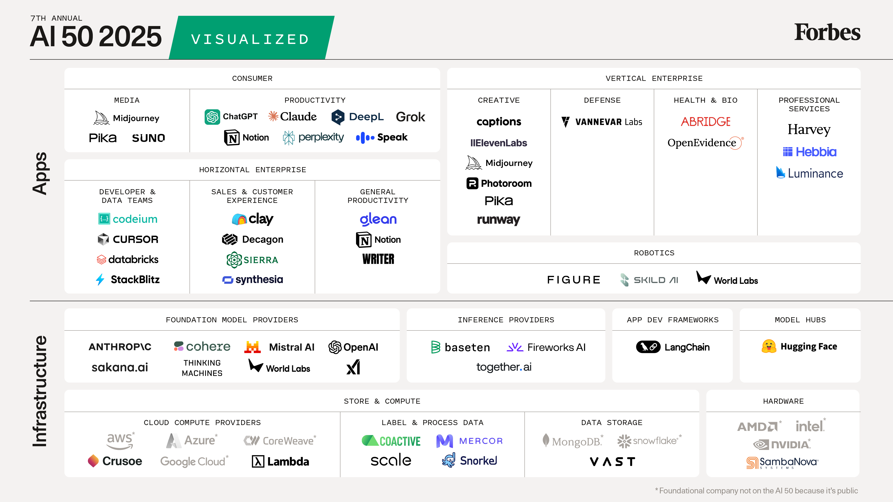
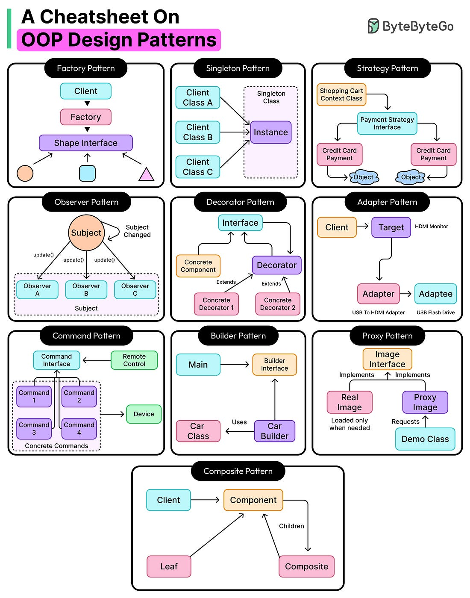

*Mời bạn thưởng thức Newsletter #26.*

## [The Philosophy of Software Design – with John Ousterhout](https://newsletter.pragmaticengineer.com/p/the-philosophy-of-software-design)

Trong bài viết này, Giáo sư John Ousterhout từ Stanford chia sẻ những quan điểm sâu sắc về tầm quan trọng của thiết kế phần mềm trong kỷ nguyên AI. Ông cho rằng việc thiết kế phần mềm tốt thậm chí còn quan trọng hơn khi các công cụ AI ngày càng phát triển.

### Những điểm chính:

- **Tầm quan trọng của thiết kế phần mềm trong kỷ nguyên AI**: Các công cụ AI hiện tại giống như "cơn lốc chiến thuật" - tạo code nhanh nhưng có thể tạo ra nhiều vấn đề mới và nợ kỹ thuật. Thiết kế phần mềm cấp cao vẫn là yếu tố không thể thay thế.

- **Thiết kế phần mềm là vấn đề phân rã**: Cách chia nhỏ một hệ thống lớn thành các đơn vị nhỏ hơn để có thể triển khai độc lập. Đây là ý tưởng quan trọng nhất trong khoa học máy tính.

- **Phương pháp "Thiết kế hai lần"**: John ủng hộ việc thiết kế hai lần cho mỗi vấn đề, vì thiết kế thứ hai thường tốt hơn. Ví dụ điển hình là khi ông thiết kế API cho Tk Toolkit.

- **Quan điểm về TDD và Clean Code**: John có những quan điểm khác biệt với Robert Martin về các phương pháp ngắn và TDD. Ông cho rằng việc chia nhỏ quá mức có thể làm tăng độ phức tạp của giao diện và giảm khả năng hiểu.

- **Tầm quan trọng của comments**: Khác với quan điểm trong Clean Code, John ủng hộ việc sử dụng comments để giải thích cách sử dụng module và mục đích của các biến thành viên.

### Ứng dụng thực tế:

John hiện đang đóng góp vào Linux Kernel, triển khai Homa Transport Protocol - một giao thức mới được phát minh bởi một trong những nghiên cứu sinh tiến sĩ của ông. Đây là một ví dụ thực tế về việc áp dụng các nguyên tắc thiết kế phần mềm vào các dự án thực tế.

### Kết luận:

Thiết kế phần mềm vẫn là một kỹ năng quan trọng và không thể thay thế, ngay cả trong kỷ nguyên AI. Việc hiểu và áp dụng các nguyên tắc thiết kế tốt sẽ giúp tạo ra các hệ thống phần mềm bền vững và dễ bảo trì hơn. 

## [20 years of Git. Still weird, still wonderful](https://blog.gitbutler.com/20-years-of-git)

Trong bài viết này, Scott Chacon - đồng sáng lập GitHub và GitButler - chia sẻ câu chuyện thú vị về 20 năm phát triển của Git, từ một công cụ quản lý nội dung đơn giản trở thành hệ thống quản lý phiên bản phổ biến nhất thế giới.

### Những điểm chính:

- **Nguồn gốc của Git**: Git được tạo ra từ sự thất vọng của cộng đồng phát triển Linux kernel với các hệ thống quản lý phiên bản thời đó. Ban đầu, Git được thiết kế như một công cụ quản lý nội dung hiệu quả hơn cho quy trình làm việc với patches và tarballs.

- **Commit đầu tiên**: Commit đầu tiên của Git chỉ bao gồm 7 công cụ đơn giản, độc lập. Các lệnh này rất cơ bản như `write-tree` và `commit-tree`, khác xa với các lệnh Git hiện đại mà chúng ta sử dụng ngày nay.

- **Sự phát triển của các lệnh Git**: Nhiều lệnh Git quen thuộc ngày nay bắt đầu chỉ là các script shell đơn giản. Ví dụ, lệnh `git log` đầu tiên chỉ là một wrapper script gọi `git-rev-list --pretty` và pipe kết quả qua pager.

- **Nguồn gốc của "rebase"**: Lệnh rebase nổi tiếng được sinh ra từ một cuộc thảo luận về workflow giữa Junio và Linus vào tháng 6/2005, khi họ tìm cách cải thiện quy trình làm việc với patches.

- **Octocat và GitHub**: Từ "octopus" trong Git (chỉ merge commit với nhiều parent) đã truyền cảm hứng cho biểu tượng Octocat của GitHub. Tom Preston-Werner đã tìm kiếm hình ảnh clipart về "octopus" và chọn hình ảnh của Simon Oxley làm biểu tượng cho GitHub.

### Tương lai của Git:

Sau 20 năm, Git vẫn đang được sử dụng theo cách mà nó được thiết kế ban đầu - như một công cụ quản lý nội dung hiệu quả. GitButler, một công cụ hiện đại, vẫn sử dụng Git không chỉ để theo dõi thay đổi code mà còn để lưu trữ lịch sử dự án.

### Kết luận:

Git đã đi một chặng đường dài từ một dự án cá nhân đơn giản trở thành công cụ không thể thiếu trong phát triển phần mềm. Câu chuyện về sự phát triển của Git không chỉ là câu chuyện về một công cụ, mà còn là câu chuyện về cách một ý tưởng đơn giản có thể thay đổi hoàn toàn cách chúng ta làm việc với code. 

## [A Modest Critique of Optional Handling](https://mccue.dev/pages//4-5-25-optional-critique)

Trong bài viết này, Ethan McCue đưa ra một phân tích sâu sắc về việc sử dụng `java.util.Optional` trong Java, đặc biệt là những thách thức và hạn chế của nó trong thực tế.

### Những điểm chính:

- **Mục đích ban đầu của Optional**: Optional được thiết kế để giải quyết vấn đề với chuỗi các phương thức trong stream operations, không phải để thay thế hoàn toàn cho `null`.

- **Vấn đề với cách sử dụng hiện tại**: Nhiều lập trình viên đang sử dụng Optional như một cách để "giải quyết null", dẫn đến code phức tạp và khó đọc hơn.

- **Hạn chế của Optional**: 
  - Khó xử lý với checked exceptions
  - Code trở nên phức tạp khi có nhiều Optional lồng nhau
  - Khó khăn trong việc thay đổi biến local trong lambda
  - Các công cụ phân tích tĩnh cần xử lý đặc biệt

- **Giải pháp đề xuất**: Thay vì sử dụng `.isPresent()` và `.get()`, tác giả đề xuất sử dụng `.orElse(null)` và xử lý null theo cách thông thường. Cách này giúp:
  - Code dễ đọc và bảo trì hơn
  - Xử lý checked exceptions dễ dàng hơn
  - Làm việc với nhiều Optional đơn giản hơn
  - Công cụ phân tích tĩnh có thể xử lý tốt hơn

### Ứng dụng thực tế:

Tác giả cung cấp nhiều ví dụ cụ thể về cách chuyển đổi code từ cách sử dụng Optional truyền thống sang cách tiếp cận mới, cho thấy sự cải thiện rõ rệt về mặt khả năng đọc và bảo trì của code.

### Kết luận:

Mặc dù Optional là một tính năng hữu ích trong Java, nhưng việc sử dụng nó cần được cân nhắc kỹ lưỡng. Thay vì tuân theo các quy tắc cứng nhắc về việc "tránh .isPresent/.get", các lập trình viên nên linh hoạt trong việc chọn cách tiếp cận phù hợp với từng tình huống cụ thể. 

## [Project Loom: Structured Concurrency in Java](https://rockthejvm.com/articles/structured-concurrency-in-java)

Trong bài viết này, Riccardo Cardin từ Rock the JVM chia sẻ một hướng dẫn chi tiết về Structured Concurrency trong Java, một tính năng mới được giới thiệu trong Project Loom.

### Những điểm chính:

- **Giới thiệu về Structured Concurrency**: Đây là một cách tiếp cận mới để quản lý đồng thời trong Java, giúp đơn giản hóa việc viết code đồng thời và tránh các vấn đề phổ biến như rò rỉ thread.

- **Cấu hình Project**: 
  - Yêu cầu Java 23 với preview features
  - Cấu hình Maven để hỗ trợ structured concurrency
  - Sử dụng SLF4J và Logback cho logging

- **Ví dụ thực tế**: Bài viết sử dụng một ví dụ về việc tương tác với GitHub API để minh họa:
  - Lấy thông tin người dùng
  - Lấy danh sách repository
  - Xử lý đồng thời các request

- **Các tính năng chính**:
  - Quản lý mối quan hệ parent-child giữa các task
  - Chính sách đồng bộ hóa (Synchronization Policies)
  - Hủy task một cách an toàn
  - Xử lý ngoại lệ trong môi trường đồng thời

- **Lợi ích**:
  - Code dễ đọc và bảo trì hơn
  - Giảm thiểu rò rỉ thread
  - Quản lý tài nguyên hiệu quả hơn
  - Tương thích với các thư viện hiện có

### Ứng dụng thực tế:

Tác giả cung cấp một ví dụ cụ thể về việc triển khai structured concurrency trong một ứng dụng thực tế, sử dụng GitHub API làm case study. Code mẫu minh họa cách:
- Thiết kế các interface phù hợp
- Xử lý đồng thời các request
- Quản lý lifecycle của các task
- Xử lý lỗi và timeout

### Kết luận:

Structured Concurrency trong Project Loom đánh dấu một bước tiến quan trọng trong việc xử lý đồng thời trong Java. Tính năng này không chỉ giúp code dễ viết hơn mà còn an toàn hơn, giảm thiểu các vấn đề phổ biến trong lập trình đồng thời. Với việc được tích hợp vào Java 23, đây là thời điểm tốt để các developer bắt đầu tìm hiểu và áp dụng tính năng này vào các dự án của mình. 

## [Go's HTTP Server Patterns in Java 25](https://mccue.dev/pages/4-5-25-go-http-server)

Trong bài viết này, Ethan McCue chia sẻ cách triển khai các mẫu HTTP server giống Go trong Java 25, thông qua việc xây dựng một wiki server đơn giản.

### Những điểm chính:

- **Giới thiệu về jdk.httpserver**: 
  - Module mới trong Java cho phép tạo HTTP server đơn giản
  - Tương tự như cách Go xử lý HTTP server
  - Phù hợp cho phát triển và prototyping

- **Cấu trúc dữ liệu cơ bản**:
  - Sử dụng record để định nghĩa Page
  - Hỗ trợ lưu và đọc dữ liệu từ file
  - Xử lý encoding/decoding UTF-8

- **Xử lý HTTP Request**:
  - Routing đơn giản với path-based handlers
  - Hỗ trợ các phương thức HTTP cơ bản
  - Xử lý form data và parameters

- **Template Engine**:
  - Sử dụng JMustache cho template
  - Tách biệt logic và giao diện
  - Hỗ trợ layout linh hoạt

- **Các tính năng bảo mật**:
  - Xử lý path traversal
  - Redirect cho trang không tồn tại
  - Xử lý lỗi an toàn

### Ứng dụng thực tế:

Tác giả minh họa việc xây dựng một wiki server với các chức năng:
- Xem trang (view)
- Chỉnh sửa trang (edit)
- Lưu trang (save)
- Xử lý template
- Redirect thông minh

### Kết luận:

Mặc dù `jdk.httpserver` được đánh dấu là "for development only", nó cung cấp một cách tiếp cận đơn giản và hiệu quả để xây dựng HTTP server trong Java, tương tự như cách Go làm. Điều này mở ra khả năng phát triển nhanh các ứng dụng web đơn giản mà không cần đến các framework phức tạp. Tuy nhiên, cho môi trường production, tác giả khuyến nghị sử dụng các server chuyên nghiệp như Jetty. 

## [Java is dying and it paid off my mortgage](https://alyosha.net/posts/java-is-dying-and-it-paid-off-my-mortgage/)

Trong bài viết này, Alyosha chia sẻ một góc nhìn thú vị về sự nghiệp phát triển phần mềm với Java, dựa trên trải nghiệm cá nhân của anh từ việc chuyển đổi từ MERN stack sang Java.

### Những điểm chính:

- **Quan điểm về công nghệ "hot"**:
  - Ban đầu lo ngại về việc làm việc với Java vì ít được bàn luận trên mạng
  - So sánh với JavaScript luôn có nhiều bài viết và thảo luận
  - Nỗi sợ bị "kẹt" trong hệ sinh thái Java

- **Thực tế thị trường việc làm**:
  - Java vẫn đứng đầu về mức lương và phúc lợi
  - Các công ty ổn định thường sử dụng Java
  - Ít được bàn luận không đồng nghĩa với việc ít cơ hội

- **Góc nhìn về công nghệ trưởng thành**:
  - Java đang ở giai đoạn của một công nghệ đã trưởng thành
  - Sau 1-2 thập kỷ phát triển mạnh mẽ
  - Vẫn duy trì vị thế quan trọng trong doanh nghiệp

- **Bài học về sự nghiệp**:
  - Không nên quá lo lắng về việc chọn công nghệ
  - Các công nghệ "cũ" vẫn có thể mang lại thành công
  - Tập trung vào việc giải quyết vấn đề thực tế

### Ứng dụng thực tế:

Tác giả chia sẻ câu chuyện cá nhân:
- Từ lo lắng về tương lai nghề nghiệp
- Đến việc trở thành chủ nhà nhờ làm việc với Java
- Chứng minh rằng công nghệ "không hot" vẫn có thể mang lại thành công

### Kết luận:

Bài viết đưa ra một góc nhìn mới về việc theo đuổi sự nghiệp trong lĩnh vực phát triển phần mềm. Thay vì chạy theo các xu hướng công nghệ mới, việc làm chủ các công nghệ đã trưởng thành như Java có thể mang lại sự ổn định và thành công lâu dài. Câu chuyện của tác giả là một minh chứng cho thấy đôi khi những lựa chọn "không phổ biến" lại có thể là lựa chọn tốt nhất cho sự nghiệp. 

## [Refining var-handles in Valhalla](https://cr.openjdk.org/~jrose/values/atomic-value-access-api.html)

Trong bài viết này, John Rose trình bày một phân tích sâu về việc cải tiến var-handles trong Project Valhalla, đặc biệt là về cách xử lý atomic value access trong Java.

### Những điểm chính:

- **Vấn đề với var-handles hiện tại**:
  - Cần đồng bộ hóa giữa interpreter, JIT và JNI
  - Phải tuân thủ các quy tắc layout của biến
  - Xử lý phức tạp với các loại layout khác nhau

- **Các loại layout trong Valhalla**:
  - `REFERENCE`: Con trỏ quản lý (32 hoặc 64 bit, có thể null)
  - `NON_ATOMIC_FLAT`: Biến có nhiều trường con, thường lớn hơn 64 bit
  - `ATOMIC_FLAT`: Biến đóng gói trong 64 bit, có thể có các trường con nhỏ
  - `NULLABLE_ATOMIC_FLAT`: Tương tự ATOMIC_FLAT nhưng có thêm null flag
  - `NULLABLE_NON_ATOMIC_FLAT`: Tương tự NON_ATOMIC_FLAT với null flag
  - `BUFFERED`: Trường hợp đặc biệt cho giá trị read-only

- **Đề xuất cải tiến**:
  - Thêm các phương thức truy vấn mới:
    - `isFlat`: Kiểm tra biến có được flatten hay không
    - `isConsistent`: Kiểm tra tính atomic của biến
    - `isPortableAtomic`: Kiểm tra khả năng hỗ trợ CAS
  - Thêm phương thức `copyConsistentValue` để xử lý atomic operations
  - Tách biệt logic xử lý field và memory transfer

- **Lợi ích của cải tiến**:
  - Code dễ hiểu và bảo trì hơn
  - Tách biệt rõ ràng giữa các concerns
  - Hỗ trợ tốt hơn cho GC
  - Xử lý atomic operations an toàn hơn

### Ứng dụng thực tế:

Tác giả cung cấp pseudocode chi tiết cho việc triển khai:
- Xử lý get/set value
- Quản lý buffer riêng tư
- Xử lý các trường con
- Đảm bảo tính atomic

### Kết luận:

Việc cải tiến var-handles trong Valhalla là một bước quan trọng để hỗ trợ tốt hơn cho value types trong Java. Cách tiếp cận mới giúp đơn giản hóa việc xử lý atomic operations và cải thiện hiệu suất của ứng dụng. Tuy nhiên, đây là một API phức tạp và chỉ nên được sử dụng bởi các developer có kinh nghiệm. 

## [Cấu hình domain .localhost cho ứng dụng local](https://inclouds.space/localhost-domains)

Trong bài viết này, Charles Chamberlain chia sẻ một cách tiếp cận thú vị để cấu hình các domain tùy chỉnh cho các ứng dụng web chạy trên máy local, thay vì phải nhớ và gõ các port khác nhau.

### Những điểm chính:

- **Vấn đề cần giải quyết**:
  - Khó nhớ các port khác nhau cho các ứng dụng local
  - Cần một cách đơn giản hơn để truy cập các ứng dụng
  - Muốn có URL thân thiện với người dùng hơn

- **Giải pháp đề xuất**:
  - Sử dụng domain .localhost tùy chỉnh
  - Mỗi ứng dụng có một domain riêng
  - Ví dụ: thay vì localhost:5050, sử dụng appname.localhost

- **Cách triển khai**:
  1. Cấu hình ứng dụng như một launchd daemon
  2. Thêm entry vào /etc/hosts để redirect về 127.0.0.1
  3. Sử dụng Caddy để:
     - Reverse proxy đến port tương ứng
     - Cấu hình TLS internal
     - Nén dữ liệu với gzip và zstd

- **Ví dụ cấu hình**:
  ```bash
  # /etc/hosts
  127.0.0.1 inclouds.localhost

  # Caddyfile
  inclouds.localhost {
      reverse_proxy localhost:5050
      tls internal
      encode gzip zstd
  }
  ```

### Ứng dụng thực tế:

Tác giả đề xuất một số cải tiến trong tương lai:
- Tự động hóa quá trình cài đặt/gỡ bỏ domain
- Đơn giản hóa việc cấu hình
- Tích hợp với dnsmasq để quản lý DNS tốt hơn

### Kết luận:

Cách tiếp cận này mang lại nhiều lợi ích cho việc phát triển và kiểm thử ứng dụng web locally. Nó giúp đơn giản hóa việc truy cập các ứng dụng và tạo ra một môi trường phát triển chuyên nghiệp hơn. Mặc dù cần một số cấu hình ban đầu, nhưng lợi ích mang lại là đáng kể, đặc biệt khi làm việc với nhiều ứng dụng cùng lúc. 

## [AI 50: AI Agents Move Beyond Chat](https://www.sequoiacap.com/article/ai-50-2025/)



Trong bài viết này, Konstantine Buhler từ Sequoia Capital phân tích xu hướng AI năm 2025, đặc biệt là sự chuyển đổi từ AI chỉ trả lời câu hỏi sang AI thực sự thực hiện công việc.

### Những điểm chính:

- **Sự chuyển đổi của AI**:
  - Từ chatbot đơn thuần sang giải quyết toàn bộ quy trình
  - Tập trung vào kết quả kinh doanh thực tế
  - Ứng dụng AI vào các tác vụ phức tạp

- **Công cụ doanh nghiệp dẫn đầu**:
  - Harvey: Tự động hóa quy trình pháp lý
  - Sierra: Cải thiện dịch vụ khách hàng
  - Cursor: Hỗ trợ phát triển phần mềm nâng cao
  - Tập trung vào giải quyết vấn đề thực tế

- **Sự phát triển của Robotics**:
  - Tích hợp transformer models với phần cứng
  - Figure AI: Sản xuất robot humanoid
  - Skild AI: Phát triển mô hình nền tảng cho robotics
  - Cơ hội thị trường 50 nghìn tỷ USD

- **AI cho người dùng cuối**:
  - Chuyển từ chatbot sang ứng dụng thực tế
  - Tự động hóa các tác vụ hàng ngày
  - Quản lý lịch, đặt vé, tổ chức file
  - Claude Code: Lập trình cho người dùng phổ thông

### Ứng dụng thực tế:

Các công ty trong danh sách AI 50 đã chứng minh:
- AI có thể xử lý khối lượng công việc lớn
- Tự động hóa các quy trình phức tạp
- Cải thiện hiệu suất doanh nghiệp
- Mở ra cơ hội mới cho người dùng

### Kết luận:

Năm 2025 đánh dấu bước ngoặt quan trọng trong phát triển AI, chuyển từ công cụ trả lời sang công cụ hành động. Mặc dù vẫn còn thách thức về độ chính xác và bảo mật, nhưng xu hướng phát triển là không thể phủ nhận. Các tiến bộ trong doanh nghiệp sẽ dần lan tỏa sang đời sống hàng ngày, mở ra một kỷ nguyên mới cho AI trong năm 2026. 

## Vài ảnh hay ho đến từ [ByteByteGo](https://bytebytego.com/)

