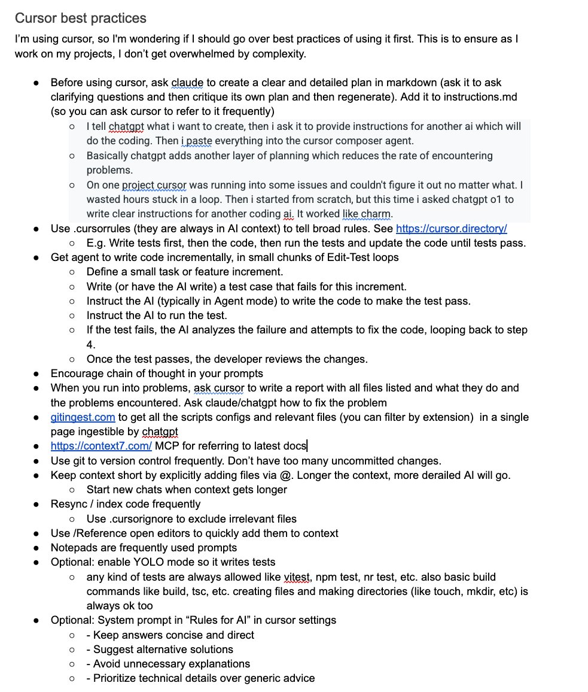

*Mời bạn thưởng thức Newsletter #34.*

## [Why TDD Doesn't Lead to Dumb Code](https://tidyfirst.substack.com/p/why-tdd-doesnt-lead-to-dumb-code)

Phát triển theo hướng kiểm thử (TDD) thường bị hiểu lầm là sẽ tạo ra mã nguồn "ngu ngốc" hoặc quá đơn giản. Kent Beck trong bài viết này giải thích tại sao quan điểm này không đúng và chỉ ra rằng chất lượng mã nguồn phụ thuộc vào kỹ năng và quyết định thiết kế của lập trình viên, chứ không phải phương pháp kiểm thử.

Tác giả minh họa quá trình tổng quát hóa thông qua ví dụ về hàm tính giai thừa. Bắt đầu với test case đơn giản `assert factorial(1) == 1`, sau đó từng bước thêm độ phức tạp và tổng quát hóa. Điểm quan trọng là tránh hardcode các giá trị cụ thể và dần dần trừu tượng hóa việc triển khai.

Thách thức chính trong TDD không phải là phương pháp tạo ra mã kém chất lượng, mà là:
- Lập trình viên có thể không có đủ kiểm thử để ràng buộc mã nguồn
- Việc tổng quát hóa logic phức tạp đôi khi cần thời gian và sự thấu hiểu sâu
- Cần biết nhận ra các mẫu thiết kế thay vì copy-paste vô tận

TDD mang lại lợi ích là giảm sự kết nối chặt chẽ giữa kiểm thử và triển khai, cho phép thêm kiểm thử mà không cần thay đổi mã hiện có, và khuyến khích phát triển mã nguồn một cách từng bước và có suy nghĩ.

## [How Discord Indexes Trillions of Messages](https://discord.com/blog/how-discord-indexes-trillions-of-messages)

Discord chia sẻ cách họ xây dựng hệ thống tìm kiếm cho hàng nghìn tỷ tin nhắn, một thách thức kỹ thuật khổng lồ. Trước đây, hệ thống cũ gặp nhiều vấn đề: hàng đợi Redis thường xuyên mất tin nhắn, việc đánh chỉ mục hàng loạt dễ bị lỗi khi node Elasticsearch gặp sự cố, và các cụm Elasticsearch lớn có chi phí vận hành cao.

Giải pháp mới của Discord sử dụng kiến trúc "cell" với nhiều cụm Elasticsearch nhỏ hơn chạy trên Kubernetes. Họ di chuyển hàng đợi tin nhắn từ Redis sang Google PubSub và phát triển chiến lược gộp tin nhắn thông minh. Hệ thống mới được viết bằng Rust với Tokio async runtime để xử lý routing tin nhắn hiệu quả.

Kết quả đạt được rất ấn tượng:
- Tăng gấp đôi tốc độ đánh chỉ mục tin nhắn
- Giảm độ trễ truy vấn từ 500ms xuống dưới 100ms
- Hỗ trợ 40 cụm Elasticsearch với hàng nghìn chỉ mục
- Kích hoạt tính năng tìm kiếm tin nhắn riêng tư và hỗ trợ "Big Freaking Guilds"

Đây là một case study tuyệt vời về cách mở rộng hệ thống tìm kiếm ở quy mô lớn với kiến trúc phân tán hiện đại.

## [Data Oriented Programming (DOP) in Java](https://nejckorasa.github.io/posts/data-oriented-programming-in-java/)

Lập trình hướng dữ liệu (DOP) trong Java là một phương pháp tiếp cận mới tập trung vào việc tách biệt dữ liệu khỏi hành vi. Thay vì nhúng logic xử lý vào các lớp dữ liệu, DOP khuyến khích sử dụng các cấu trúc dữ liệu đơn giản và các hàm độc lập để thao tác trên dữ liệu đó.

Các nguyên tắc chính của DOP bao gồm: mô hình hóa dữ liệu bất biến và minh bạch, tập trung vào việc biểu diễn dữ liệu thuần túy, làm cho các trạng thái không hợp lệ trở nên không thể biểu diễn được, và tách biệt các thao tác khỏi cấu trúc dữ liệu.

Java hiện đại hỗ trợ DOP thông qua nhiều tính năng mới:
- **Records**: Các lớp dữ liệu nhẹ và bất biến
- **Sealed Classes**: Hạn chế các kiểu con có thể có để mô hình hóa dữ liệu dự đoán được hơn  
- **Pattern Matching và Switch Expressions**: Cho phép kiểm tra kiểu toàn diện và xử lý dữ liệu sạch sẽ

Lợi ích của DOP bao gồm mã nguồn đơn giản và dễ đọc hơn, khả năng bảo trì được cải thiện, giảm sự kết nối chặt chẽ giữa các thành phần hệ thống, dễ dàng kiểm thử các hàm độc lập, và tái cấu trúc an toàn hơn.

## [Why performance optimization is hard work](https://purplesyringa.moe/blog/why-performance-optimization-is-hard-work/)

Tối ưu hiệu suất là một trong những lĩnh vực khó khăn nhất trong phát triển phần mềm, và bài viết này giải thích lý do tại sao. Tác giả chỉ ra năm thách thức chính khiến việc tối ưu hiệu suất trở thành "công việc cần sức lực":

**Tính tổng hợp (Composability)**: Các kỹ thuật tối ưu thường không tương thích với nhau hoặc thậm chí phản tác dụng khi kết hợp. Việc loại bỏ những cách tiếp cận "rõ ràng là không tối ưu" chỉ là phỏng đoán, đòi hỏi nhiều thử nghiệm và hiểu biết sâu về phần cứng.

**Tính liên tục (Continuity)**: Hiệu suất có thể thay đổi đột ngột với những sửa đổi nhỏ. Việc tìm ra điều kiện biên phức tạp và điều chỉnh tham số liên tục là cần thiết để đạt được hiệu suất tối ưu.

**Tính không tương thích**: Các ràng buộc bên ngoài như giới hạn bộ nhớ đệm và áp lực thanh ghi tạo ra những thách thức đặc thù cho phần cứng, đòi hỏi các giải pháp sáng tạo và thỏa hiệp.

**Hạn chế của trình biên dịch**: Trình biên dịch không tự động tạo ra mã tối ưu, đòi hỏi kiểm tra thủ công mã assembly được tạo ra và profiling chi tiết.

Kết luận quan trọng là tối ưu hiệu suất về cơ bản là một "nhiệm vụ dùng sức lực", đòi hỏi sự kiên trì, kiến thức kỹ thuật sâu và khả năng giải quyết vấn đề sáng tạo.

## [Good vs Great Animations](https://emilkowal.ski/ui/good-vs-great-animations)

Trong thời đại mà hầu hết phần mềm đều "đủ tốt", việc tạo ra sự khác biệt thông qua trải nghiệm người dùng trở nên quan trọng hơn bao giờ hết. Bài viết này khám phá sự khác biệt giữa animation tốt và animation xuất sắc trong thiết kế giao diện.

**Animation nhận biết nguồn gốc (Origin-Aware)**: Animation tuyệt vời luôn có điểm xuất phát rõ ràng và tự nhiên. Ví dụ, menu dropdown nên xuất hiện từ vị trí nút bấm thay vì từ trung tâm màn hình. Sử dụng `transform-origin` để kiểm soát điểm bắt đầu của animation.

**Easing và thời gian**: Đây là yếu tố quan trọng nhất để tạo ra chuyển động tự nhiên. Thay vì sử dụng `linear`, nên ưu tiên `ease-out` hoặc `ease-in-out` để mô phỏng gia tốc và giảm tốc như trong thế giới thực.

**Đường cong easing tùy chỉnh**: Các đường cong CSS có sẵn thường không đủ để tạo ra animation hấp dẫn. Sử dụng các công cụ như easing.dev và easings.co để tạo ra các đường cong tùy chỉnh mang lại cảm giác năng động hơn.

**Tương tác dạng lò xo (Spring-based)**: Sử dụng chuyển động dạng lò xo để tạo ra cảm giác tự nhiên và hữu cơ, đặc biệt hiệu quả cho các element trang trí không mang tính chức năng.

Điểm mấu chốt: animation tuyệt vời không chỉ là về kỹ thuật mà còn về việc tạo ra chuyển động có mục đích, tự nhiên và nâng cao trải nghiệm người dùng.

## [Senior engineers should make side bets](https://www.seangoedecke.com/side-bets/)

Kỹ sư phần mềm senior nên dành 10-20% thời gian cho các dự án phụ (side bets) - những công việc tự khởi xướng không nằm trong danh sách nhiệm vụ chính thức. Đây là lời khuyên từ góc nhìn thực tế về cách phát triển sự nghiệp và tạo tác động.

**Tại sao cần side bets**: Các dự án phụ tạo ra giá trị độc đáo mà không kỹ sư nào khác có thể tạo ra. Chúng thể hiện sự chủ động, sáng tạo và tư duy chiến lược vượt ra ngoài công việc được giao.

**Chiến lược thực hiện**:
- Chọn các dự án có lợi ích cụ thể, có thể đo lường được
- Tỷ lệ thành công kỳ vọng: 2-3 side bet thành công mỗi năm
- Nếu thất bại, im lặng chuyển sang dự án khác
- Nếu thành công, tích cực truyền đạt giá trị tới đồng nghiệp và quản lý

**Nguyên tắc quan trọng**: Hầu hết side bets sẽ thất bại và điều này hoàn toàn bình thường. Những side bet thành công sẽ bù đắp cho tất cả. Chúng cần có tiềm năng tạo giá trị cho công ty, có tác động có thể chứng minh được, và không tiêu tốn quá nhiều thời gian hoặc tài nguyên.

Quan điểm này đặc biệt phù hợp với kỹ sư senior muốn nâng cao uy tín và tác động trong tổ chức thông qua các sáng kiến cá nhân có ý nghĩa.

## [Avoiding Skill Atrophy in the Age of AI](https://addyo.substack.com/p/avoiding-skill-atrophy-in-the-age)

Trong thời đại AI trợ lý lập trình ngày càng phổ biến, một thách thức mới nổi lên: làm thế nào để tránh suy giảm kỹ năng cá nhân khi quá phụ thuộc vào công nghệ? Bài viết này đưa ra những chiến lược thực tế để duy trì và phát triển năng lực lập trình trong bối cảnh AI.

**Dấu hiệu cảnh báo suy giảm kỹ năng**:
- Ngừng đọc tài liệu kỹ thuật và chỉ dựa vào AI
- Mất khả năng debug độc lập
- Giảm sút tư duy thiết kế hệ thống và kiến trúc
- Quên cú pháp và khái niệm lập trình cơ bản

**Chiến lược "Vệ sinh AI" (AI Hygiene)**:
- Luôn xác minh và hiểu rõ mã do AI tạo ra
- Phê phán các gợi ý của AI một cách có phản biện
- Yêu cầu AI giải thích mã từng dòng
- Kiểm thử các giải pháp AI với input phức tạp

**Thực hành duy trì kỹ năng có chủ đích**:
- Thiết lập "Ngày không AI" để lập trình thủ công
- Thử giải quyết vấn đề độc lập trước khi nhờ AI
- Sử dụng AI như một đồng nghiệp junior, không phải giải pháp hoàn chỉnh
- Ghi chép học hỏi từ các nhiệm vụ có sự hỗ trợ của AI

**Triết lý cốt lõi**: Sử dụng AI để "khuếch đại" khả năng cá nhân thay vì thay thế hoàn toàn kỹ năng con người. Mục tiêu là bảo tồn "nghề thủ công và niềm vui giải quyết vấn đề" trong khi tận dụng sức mạnh của AI như một công cụ hỗ trợ thông minh.

## [Cursor best practices](https://x.com/paraschopra/status/1917466537637859544)

