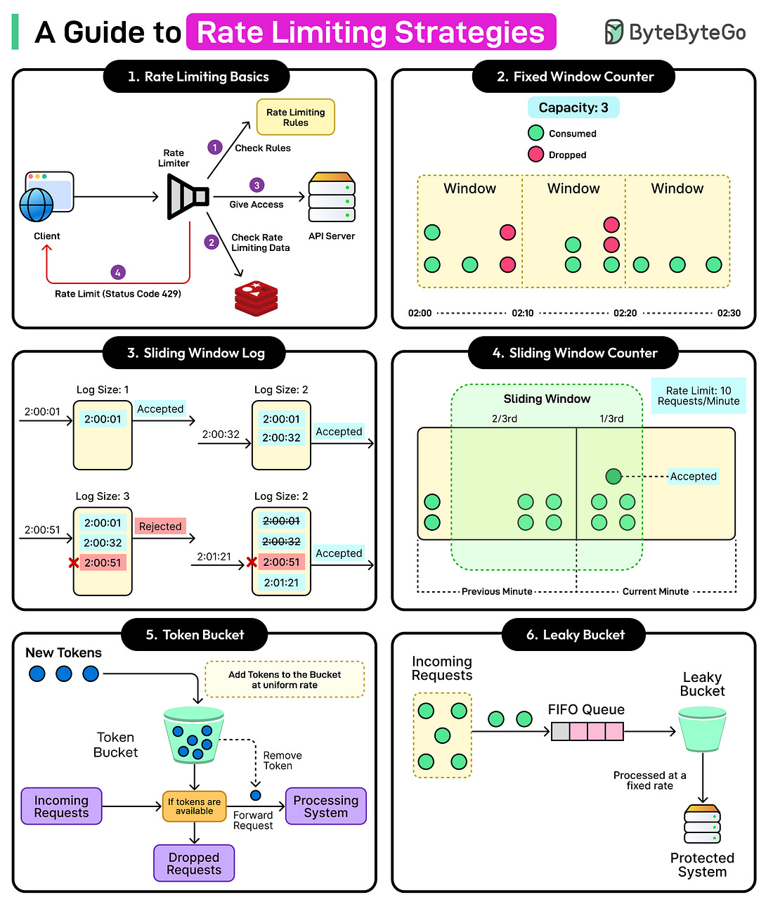
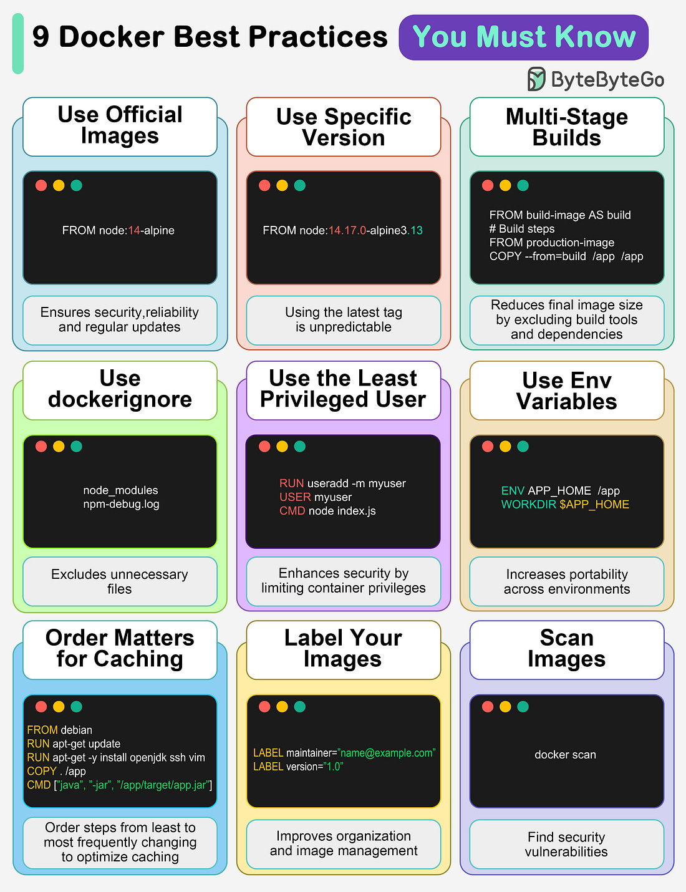
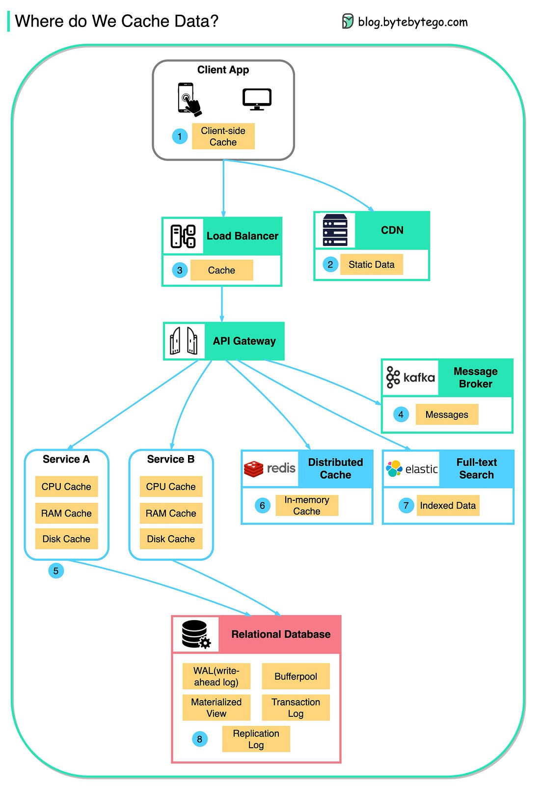

*Mời bạn thưởng thức Newsletter #55.*

## [%CPU Utilization Is A Lie](https://www.brendanlong.com/cpu-utilization-is-a-lie.html)

Bài viết từ Brendan Long đưa ra một phát hiện thú vị và quan trọng về việc hiểu sai lầm phổ biến liên quan đến CPU utilization - một chỉ số mà hầu hết các quản trị viên hệ thống đều theo dõi hàng ngày.

Tác giả đã thực hiện các bài test stress chi tiết trên một máy Ryzen 9 5900X (12 core / 24 thread) và phát hiện ra rằng CPU utilization được báo cáo bởi hệ thống thường là một ước tính thấp, đôi khi đáng kể so với công việc thực tế mà CPU đang thực hiện.

**Các phát hiện chính từ bài test**:

- **General CPU**: Tại mức 50% utilization được báo cáo, hệ thống thực tế đang làm 60-65% công việc tối đa có thể
- **64-bit Integer Math**: Tình hình còn tệ hơn nữa - tại "50% utilization", CPU thực tế đang làm 65-85% công việc tối đa
- **Matrix Math**: Đáng báo động nhất - tại "50% utilization", CPU thực tế đang làm 80-100% công việc tối đa

**Nguyên nhân chính của hiện tượng này**:

1. **SMT/Hyperthreading**: Khi số lượng worker vượt quá số core vật lý, các core phải chia sẻ tài nguyên, dẫn đến hiệu suất không tuyến tính
2. **Turbo Boost**: Tốc độ clock giảm khi nhiều core hoạt động đồng thời, làm cho công thức tính utilization (busy cycles / total cycles) trở nên phức tạp hơn

**Hệ quả thực tế**: Nếu bạn dựa vào CPU utilization để dự đoán khả năng mở rộng hệ thống, bạn sẽ gặp nhiều khó khăn. Đặc biệt khi CPU đang hoạt động hiệu quả (trên "50% utilization"), chỉ số utilization được báo cáo thường là một ước tính thấp.

**Giải pháp đề xuất**: Thay vì chỉ dựa vào CPU utilization, tác giả khuyên nên:
- Benchmark công việc thực tế mà server có thể thực hiện trước khi gặp lỗi hoặc độ trễ không chấp nhận được
- Báo cáo lượng công việc hiện tại mà server đang thực hiện
- So sánh hai chỉ số này thay vì chỉ dựa vào CPU utilization

Đây là một bài viết quan trọng cho bất kỳ ai làm việc với hiệu suất hệ thống, đặc biệt là các quản trị viên DevOps và kỹ sư infrastructure cần hiểu rõ giới hạn thực tế của các server của mình.

## [We only hire the trendiest](https://danluu.com/programmer-moneyball/)

Bài viết từ Dan Luu đưa ra một phân tích sâu sắc về vấn đề tuyển dụng trong ngành công nghệ, nơi các công ty thường tập trung vào việc tuyển dụng những ứng viên có "background trendy" thay vì đánh giá năng lực thực tế.

Tác giả kể về câu chuyện của Mike, một lập trình viên có 11 năm kinh nghiệm nhưng bị từ chối bởi nhiều công ty chỉ vì kinh nghiệm của anh ấy không đủ "trendy" - làm việc với .NET, kinh nghiệm hợp đồng, và có trải nghiệm đa dạng nhưng không tập trung vào một lĩnh vực cụ thể.

**Các vấn đề chính được đề cập**:

1. **Sự thiên vị trong tuyển dụng**: Các công ty như TrendCo (tên ẩn danh) từ chối ứng viên vì lý do:
   - Kinh nghiệm công nghệ không liên quan (thực chất là không thích .NET)
   - Kinh nghiệm quá ngẫu nhiên (thực chất là không có background trendy)
   - Là contractor (thực chất là định kiến)

2. **Chi phí của việc chỉ tuyển dụng trendy**: Các công ty này phải đối mặt với hai lựa chọn:
   - Trả lương cực cao để cạnh tranh với các công ty hàng đầu
   - Chấp nhận trả lương không cạnh tranh và mất đi nhiều ứng viên giỏi

3. **Hiệu ứng Moneyball**: Tương tự như câu chuyện Billy Beane trong bóng chày, các công ty nên tập trung vào việc tìm kiếm những ứng viên bị đánh giá thấp nhưng có năng lực thực sự, thay vì chạy theo những ứng viên có background "hot".

**Giải pháp đề xuất**:

- **Moneyball approach**: Tìm kiếm những ứng viên bị đánh giá thấp về mặt thống kê nhưng có năng lực thực sự
- **Đầu tư vào đào tạo**: Thay vì chỉ tập trung vào việc tuyển dụng người giỏi, hãy đầu tư vào việc đào tạo và phát triển nhân viên hiện tại
- **Cải tiến quy trình và công cụ**: Đầu tư vào công cụ, quy trình và văn hóa làm việc hiệu quả hơn là chỉ tập trung vào việc "săn" nhân tài

**Bài học quan trọng**: Nhiều lập trình viên giỏi nhất đã từng bị từ chối bởi các công ty trước khi họ làm việc tại Google hoặc các công ty công nghệ lớn khác. Việc đánh giá giá trị của một ứng viên chỉ dựa trên background trendy có thể khiến các công ty bỏ lỡ những tài năng thực sự.

Đây là một bài viết đáng suy ngẫm cho cả nhà tuyển dụng và ứng viên, giúp nhận ra những định kiến vô hình trong ngành công nghệ và tìm cách khắc phục chúng.

## [How I solved a distributed queue problem after 15 years](https://www.dbos.dev/blog/durable-queues)

Bài viết từ DBOS chia sẻ kinh nghiệm thực tế về việc giải quyết vấn đề hàng đợi phân tán sau 15 năm làm việc trong lĩnh vực hệ thống đám mây, mang đến những hiểu biết sâu sắc về cách xây dựng hàng đợi bền vững và có khả năng quan sát.

**Tầm quan trọng của hàng đợi trong hệ thống đám mây**:

Hàng đợi đóng vai trò quan trọng trong việc giúp các hệ thống có khả năng mở rộng ngang (horizontal scaling), lập lịch (scheduling) và kiểm soát luồng (flow control). Chúng cho phép các thành phần hệ thống hoạt động một cách độc lập và bất đồng bộ, giúp tăng cường khả năng chịu lỗi và hiệu suất tổng thể.

**Các thách thức chính khi xây dựng hàng đợi phân tán**:

1. **Độ bền (Durability)**: Đảm bảo rằng các thông điệp không bị mất ngay cả khi hệ thống gặp sự cố. Điều này đòi hỏi cơ chế lưu trữ đáng tin cậy và khả năng phục hồi sau lỗi.
2. **Khả năng quan sát (Observability)**: Cần có khả năng theo dõi trạng thái hàng đợi, hiệu suất và các vấn đề phát sinh để có thể chẩn đoán và khắc phục kịp thời.
3. **Mở rộng ngang**: Hàng đợi cần có khả năng phân tán trên nhiều node để xử lý tải lớn mà không trở thành nút thắt cổ chai.
4. **Tính nhất quán**: Đảm bảo rằng các thông điệp được xử lý đúng thứ tự và không bị mất mát trong môi trường phân tán.

**Giải pháp được đề xuất**:

Bài viết tập trung vào việc xây dựng hàng đợi sử dụng các công nghệ hiện đại như database transactional để đảm bảo độ bền, kết hợp với các pattern như event sourcing và CQRS (Command Query Responsibility Segregation) để tăng cường khả năng quan sát.

**Các lợi ích chính**:

- **Khả năng phục hồi cao**: Hệ thống có thể phục hồi nhanh chóng sau sự cố nhờ cơ chế lưu trữ transactional
- **Hiệu suất tốt**: Việc sử dụng các kỹ thuật tối ưu hóa giúp giảm độ trễ và tăng throughput
- **Dễ dàng giám sát**: Các metric và logging chi tiết giúp theo dõi hiệu suất hệ thống
- **Mở rộng linh hoạt**: Hệ thống có thể dễ dàng mở rộng theo nhu cầu

**Kết luận**: Việc xây dựng hàng đợi phân tán bền vững là một thách thức phức tạp nhưng cực kỳ quan trọng đối với các hệ thống hiện đại. Bằng cách kết hợp các nguyên tắc thiết kế đúng đắn và công nghệ phù hợp, các kỹ sư có thể tạo ra những hệ thống hàng đợi đáng tin cậy, hiệu suất cao và dễ dàng quản lý.

## [Cognitive load is what matters](https://minds.md/zakirullin/cognitive)

Bài viết từ Artem Zakirullin đưa ra một quan điểm cơ bản và quan trọng về việc giảm tải nhận thức (cognitive load) trong phát triển phần mềm, tập trung vào điều thực sự quan trọng thay vì chạy theo các thuật ngữ và best practices hào nhoáng.

**Khái niệm cốt lõi**:

Tác giả lập luận rằng có quá nhiều buzzwords và best practices, nhưng điều thực sự quan trọng là lượng nhầm lẫn mà các lập trình viên cảm thấy khi đọc qua code. Sự nhầm lẫn này tốn thời gian và tiền bạc, và được gây ra bởi cognitive load cao - một ràng buộc cơ bản của con người, không phải là một khái niệm trừu tượng.

**Cognitive load là gì**:

Cognitive load là lượng tư duy mà một lập trình viên cần để hoàn thành một nhiệm vụ. Khi đọc code, bạn phải đặt các giá trị biến, logic luồng điều khiển và chuỗi gọi vào đầu óc. Người trung bình có thể giữ khoảng 4 mẩu thông tin như vậy trong bộ nhớ làm việc. Khi cognitive load đạt đến ngưỡng này, việc hiểu trở nên khó khăn hơn nhiều.

**Các loại cognitive load**:

1. **Intrinsic**: Do độ khó cố hữu của nhiệm vụ, không thể giảm bớt, là cốt lõi của phát triển phần mềm
2. **Extraneous**: Được tạo ra bởi cách thông tin được trình bày, do các yếu tố không liên quan trực tiếp đến nhiệm vụ, có thể giảm đáng kể

**Các ví dụ thực tế về extraneous cognitive load**:

1. **Module nông (Shallow modules)**: Có quá nhiều module nông với giao diện phức tạp so với chức năng nhỏ chúng cung cấp. Điều này đòi hỏi phải nhớ trách nhiệm của từng module và tương tác của chúng.
2. **Microservices nông**: Quá nhiều microservices nông dẫn đến distributed monolith, nơi mỗi yêu cầu mới dẫn đến thay đổi ở 4+ microservices.
3. **Ngôn ngữ tính năng phong phú**: Khi có nhiều tính năng, lập trình viên phải dành thời gian chơi với vài dòng code để sử dụng một tính năng nào đó, và khi quay lại, họ phải tái tạo quá trình tư duy đó.
4. **Lạm dụng nguyên tắc DRY**: Việc loại bỏ mọi sự lặp lại có thể dẫn đến coupling chặt chẽ giữa các thành phần không liên quan.
5. **Framework coupling chặt chặt**: Việc phụ thuộc quá nhiều vào framework buộc các lập trình viên tương lai phải học "magic" của framework đó trước.
6. **Kiến trúc tầng nhiều lớp**: Các lớp trừu tượng ngang không cần thiết chỉ làm tăng cognitive load.

**Giải pháp đề xuất**:

- **Ưu tiên module sâu (Deep modules)**: Các thành phần cung cấp chức năng mạnh mẽ nhưng có giao diện đơn giản
- **Giảm số lượng lựa chọn**: Giảm cognitive load bằng cách giới hạn số lượng lựa chọn
- **Sử dụng chuỗi mô tả tự thân**: Ưu tiên chuỗi mô tả tự thân thay vì mã số (ví dụ: "jwt_has_expired" thay vì 401)
- **Tránh các lớp trừu tượng không cần thiết**: Chỉ thêm các lớp trừu tượng khi thực sự cần điểm mở rộng
- **Đo lường confusion của lập trình viên mới**: Nếu họ bị nhầm lẫn hơn ~40 phút liên tục - bạn có điều gì đó cần cải thiện trong code

**Kết luận**: Chúng ta nên giảm bất kỳ cognitive load nào nằm ngoài intrinsic complexity của công việc chúng ta làm. Code tốt không phải là code phức tạp hay thông minh, mà là code mà các lập trình viên tương lai (bao gồm chính bạn) có thể hiểu nhanh chóng.

## [Claude Code Framework Wars](https://shmck.substack.com/p/claude-code-framework-wars)

Bài viết từ Shawn đưa ra một cái nhìn tổng quan về cuộc chiến framework Claude Code, nơi các nhà phát triển đang thử nghiệm với cấu trúc, điều phối và tiêu chuẩn để khai thác tối đa tiềm năng của AI coding.

**Bối cảnh hiện tại**:

Claude Code đang phát triển nhanh chóng với nhiều framework khác nhau xuất hiện, mỗi framework tập trung vào các khía cạnh khác nhau của quy trình phát triển AI. Các framework này đang cạnh tranh để trở thành tiêu chuẩn cho tương lai của AI coding.

**Các khía cạnh chính của Claude Code Framework**:

1. **Cấu trúc (Structure)**: Cách các dự án được tổ chức và quản lý
2. **Điều phối (Orchestration)**: Cách AI được điều phối và quản lý trong quy trình phát triển
3. **Tiêu chuẩn (Standards)**: Các quy tắc và hướng dẫn để đảm bảo chất lượng và nhất quán

**Các loại framework chính**:

1. **Framework tập trung vào Product Specs**:
   - Tập trung vào việc tạo ra product specifications chi tiết
   - Sử dụng AI để chuyển đổi specs thành code
   - Ví dụ: Framework giúp tạo ra các sản phẩm từ mô tả chi tiết

2. **Framework tập trung vào Role Simulation**:
   - Mô phỏng các vai trò khác nhau trong đội ngũ phát triển
   - AI đóng vai trò như kỹ sư senior, reviewer, hoặc product manager
   - Giúp tạo ra code chất lượng cao với nhiều góc nhìn khác nhau

3. **Framework tập trung vào Repo Artifacts**:
   - Tập trung vào việc tạo và quản lý các artifact trong repository
   - Sử dụng AI để tạo ra các file cấu hình, documentation, và code
   - Ví dụ: Framework giúp tạo ra các file README, cấu hình CI/CD

4. **Framework tập trung vào Parallel Sessions**:
   - Cho phép chạy nhiều phiên AI song song
   - Mỗi phiên tập trung vào một nhiệm vụ cụ thể
   - Tăng tốc độ phát triển bằng cách phân công công việc

**Các lợi ích chính**:

1. **Tăng tốc độ phát triển**: AI giúp tự động hóa các công việc lặp đi lặp lại
2. **Cải thiện chất lượng code**: AI đóng vai trò như reviewer, giúp phát hiện lỗi sớm
3. **Giảm cognitive load**: AI giúp xử lý các công việc phức tạp, cho phép developer tập trung vào kiến trúc
4. **Tăng tính nhất quán**: AI tuân thủ các tiêu chuẩn và quy tắc đã được định nghĩa

**Các thách thức**:

1. **Quản lý context**: AI cần được cung cấp đủ context để làm việc hiệu quả
2. **Đảm bảo chất lượng**: Cần có cơ chế review và kiểm tra chất lượng
3. **Tích hợp với quy trình hiện tại**: Framework cần được tích hợp mượt mà với quy trình làm việc hiện có

**Kết luận**: Bài viết nhấn mạnh rằng AI hoạt động tốt nhất khi được cung cấp cấu trúc rõ ràng. Các framework Claude Code đang hội tụ về một tương lai nơi AI không phải là một hộp ma thuật mà là một tập các đồng đội mà bạn quản lý. Điều thú vị là: cấu trúc bạn cung cấp càng nhiều, bạn nhận lại càng nhiều.

## [The Last Programmers](https://www.xipu.li/posts/the-last-programmers)

Bài viết từ Xipu Li đưa ra một quan điểm sâu sắc và đáng suy ngẫm về tương lai của ngành lập trình, nơi chúng ta đang chứng kiến thế hệ cuối cùng của những người tự dịch ý tưởng thành code bằng tay.

**Bối cảnh cá nhân của tác giả**:

Xipu đã rời bỏ công việc tại Amazon vào tháng 5 để tham gia một startup có tên Icon. Anh chia sẻ rằng đây là quyết định sự nghiệp tốt nhất anh từng đưa ra, không phải vì những lý do bạn có thể nghĩ.

Tại Amazon, anh làm việc trong nhóm Amazon Q Developer - xây dựng trợ lý AI coding của Amazon. Anh nhận thấy rằng Amazon đang thua cuộc trong cuộc đua AI, với tầm nhìn sản phẩm rất hạn chế và tốc độ phát triển chậm chạp so với các đối thủ như Cursor và Anthropic.

**Những gì tác giả đang chứng kiến hiện nay**:

Một đồng đội của anh đã không xem xét code thực tế trong nhiều tuần. Thay vào đó, anh ấy viết tài liệu thiết kế bằng tiếng Anh thông thường và tin tưởng AI xử lý việc triển khai. Khi cần sửa chữa, anh ấy chỉnh sửa tài liệu, không phải code.

Điều này khiến tác giả nhận ra một điều sâu sắc: chúng ta đang sống qua thời đại kết thúc của một kỷ nguyên mà con người tự dịch ý tưởng thành code bằng tay. Trong vài năm tới, kỹ năng này sẽ trở nên liên quan như biết cách đóng ngựa.

**Sự phân chia đang diễn ra**:

Tác giả quan sát thấy hai nhóm đang hình thành trong đội ngũ của mình:

1. **Nhóm thử nghiệm (Experimenters)**: Những người dành thời gian nghỉ trưa để thử nghiệm các công cụ AI coding mới, thiết lập các workflow tạo ra toàn bộ tính năng từ lệnh thoại, và liên tục đẩy ranh giới của việc ít code thủ công nhất. Họ có thể bị coi là lười biếng, nhưng thực chất họ đang theo con đường tự nhiên của công nghệ.

2. **Nhóm bảo vệ (Guardians)**: Những người tin sâu sắc rằng hiểu code ở mức độ cơ bản là không thể thương lượng. Họ có thể phát hiện thuật toán không hiệu quả, hiểu tại sao các mẫu thiết kế tồn tại, và hiểu các hệ thống nền tảng đủ tốt để gỡ lỗi những vấn đề AI không thể xử lý.

**Sự hàng hóa hóa của phần mềm**:

Tương tự như ngành công nghiệp sôcôla, phần mềm đang hướng đến cùng một hướng. Sự khác biệt giữa sản phẩm phần mềm và hàng tiêu dùng đang thu hẹp hàng tháng. Cả hai cạnh tranh về thương hiệu, phân phối và hiểu biết tâm lý khách hàng hơn là chức năng thuần túy.

**Ba điều gì thực sự tồn tại khi triển khai kỹ thuật trở nên hàng hóa hóa**:

1. **Hiểu biết nhu cầu thực sự của con người**: Không phải những gì họ nói trong khảo sát hay nhóm tập trung, mà những gì họ sẵn sàng trả tiền và sử dụng hàng ngày.
2. **Biết nên xây dựng gì và không nên xây dựng gì**: Đây là gu thẩm mỹ, nhưng cũng là chiến lược. Hiểu biết tính năng nào sẽ tạo ra giá trị thực sự so với tính năng nào chỉ thêm độ phức tạp.
3. **Đưa sản phẩm trước đúng người và thuyết phục họ quan tâm**: Phân phối và marketing, nhưng cũng là định vị, thời điểm và hiểu biết tâm lý khách hàng.

**Ý nghĩa đối với những người mới bắt đầu**:

Nếu bạn đang học code ngày nay, đừng dừng lại. Nhưng đừng biến coding thành kỹ năng duy nhất của bạn. Những nhà phát triển sẽ phát triển trong thế giới mới này là những người hiểu biết người dùng, thị trường và mô hình kinh doanh tốt như họ hiểu công nghệ.

**Ý nghĩa đối với những người đã đang xây dựng**:

Nếu bạn đã là nhà phát triển hoặc đang xây dựng công ty, hãy nhớ rằng triển khai kỹ thuật của bạn sớm sẽ có thể được bất kỳ ai có quyền truy cập vào công cụ AI tốt sao chép. Lợi thế cạnh tranh của bạn cần là điều gì khác.

**Thế hệ cuối cùng**:

Chúng ta là thế hệ cuối cùng của những người tự dịch ý tưởng thành code bằng tay. Con cái của chúng ta sẽ mô tả những gì họ muốn và xem nó xuất hiện trên màn hình, giống như chúng ta mô tả những gì chúng ta muốn cho công cụ tìm kiếm và xem kết quả xuất hiện.

Họ sẽ phán xét chúng ta giống như chúng ta phán xét những người tính toán sổ sách thủ công trước khi bảng tính tồn tại. Đáng nể về sự tận tâm với nghề, nhưng cuối cùng là nỗ lực không cần thiết dành cho những vấn đề đã được giải quyết bằng công cụ tốt hơn.

**Kết luận**: Những phần luôn thực sự quan trọng. Hiểu biết con người. Xây dựng những thứ họ muốn. Đưa những thứ đó trước mặt họ. Mọi thứ khác chỉ là chi tiết triển khai.

## Bonus: Vài ảnh hay ho đến từ [ByteByteGo](https://bytebytego.com/)

## Bonus: Một vài video hay ho

