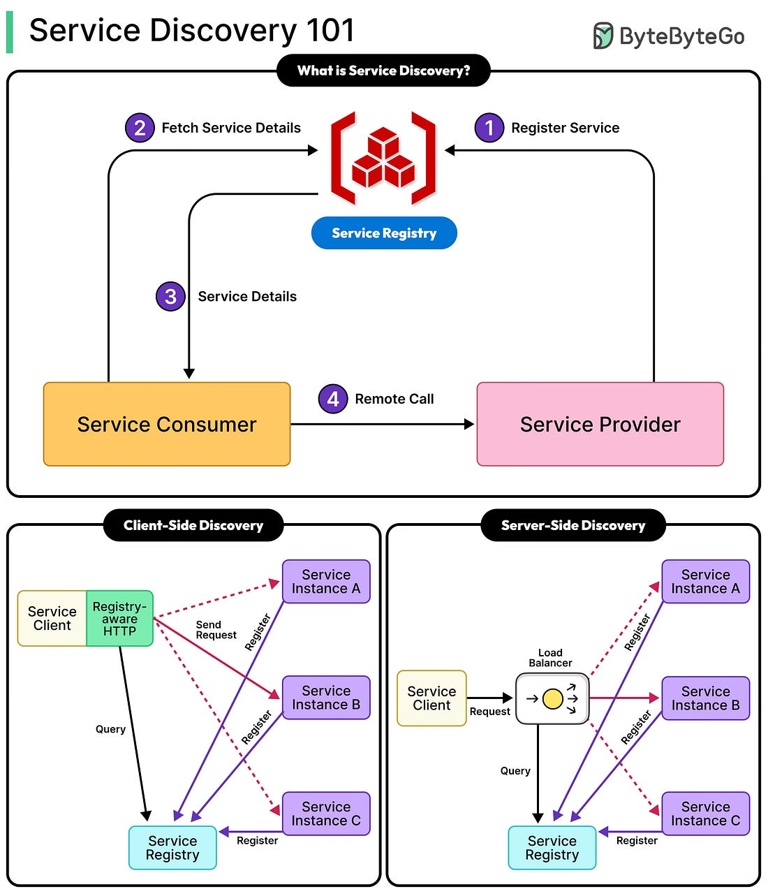

*Mời bạn thưởng thức Newsletter #59.*

## [Taking a Look at Compression Algorithms](https://cefboud.com/posts/compression/)

Trong thế giới công nghệ, các thuật toán nén dữ liệu đóng vai trò quan trọng trong việc tối ưu hóa lưu trữ và truyền tải thông tin. Bài viết này khám phá bốn thuật toán nén lossless phổ biến: GZIP (DEFLATE), Snappy, LZ4 và ZSTD, với các cân bằng khác nhau giữa tốc độ và tỷ lệ nén.

GZIP/DEFLATE là sự kết hợp của kỹ thuật trượt cửa sổ LZ77 và mã hóa Huffman. Nó sử dụng bảng băm chuỗi để tìm kiếm nhanh và hỗ trợ nhiều loại khối khác nhau (không nén, Huffman cố định/động). Triển khai trong Go cho thấy các tối ưu hóa như so khớp lười và các mức nén cân bằng giữa sử dụng CPU và lợi ích nén.

Snappy ưu tiên tốc độ hơn tỷ lệ, nén với tốc độ trên 250 MB/s. Nó sử dụng thẻ đơn giản cho các đoạn văn bản gốc và bản sao, với bảng băm nhẹ chỉ lưu các kết quả khớp 4-byte gần đây. Phù hợp cho các ứng dụng thời gian thực cần giải nén nhanh.

LZ4 còn nhanh hơn Snappy, đạt tốc độ ~780 MB/s. Nó mã hóa chuỗi các đoạn văn bản gốc và kết quả khớp bằng token 4-bit, với độ dài mở rộng tùy chọn. Thiết kế tốc độ cao sử dụng hàm băm hiệu quả và so khớp mở rộng dựa trên XOR.

ZSTD kết hợp so khớp kiểu LZ với mã hóa entropy hiện đại (FSE/ANS) để đạt tỷ lệ cao (~2.9x) với tốc độ (~510 MB/s) ngang bằng LZ4. Tính năng bao gồm từ điển huấn luyện và chế độ streaming. Nó cải tiến mã hóa số học với chuẩn hóa cho hiệu suất thực tế.

Mỗi thuật toán hướng đến các trường hợp sử dụng khác nhau: DEFLATE cho lưu trữ tổng quát, Snappy/LZ4 cho hệ thống yêu cầu tốc độ, và ZSTD cho sự cân bằng tối ưu.

**Điểm chính:**
- GZIP/DEFLATE phù hợp cho lưu trữ tổng quát với tỷ lệ nén tốt
- Snappy và LZ4 tối ưu cho tốc độ, dùng trong ứng dụng real-time
- ZSTD cung cấp sự cân bằng tốt nhất giữa tốc độ và tỷ lệ nén
- Lựa chọn thuật toán đúng tùy thuộc vào yêu cầu cụ thể của hệ thống

## [90%](https://lucumr.pocoo.org/2025/9/29/90-percent/)

Armin Ronacher chia sẻ rằng AI hiện đang viết hơn 90% mã code cho một dự án hạ tầng mới mà ông dẫn đầu, phản ánh sự thay đổi lớn trong phát triển phần mềm. Ông nhấn mạnh rằng mặc dù AI đóng góp phần lớn code, ông vẫn giữ trách nhiệm cho kiến trúc, độ tin cậy và các quyết định thiết kế.

Những hiểu biết chính bao gồm:
- AI xuất sắc trong việc tạo SQL thô và dựng khung hệ thống dựa trên OpenAPI.
- Kết hợp các công cụ như Claude và Codex cải thiện kết quả; Claude hỗ trợ gỡ lỗi, Codex xem xét code.
- Các lập trình viên phải hướng dẫn AI cẩn thận, vì AI có thể tái tạo lại các thành phần hiện có hoặc đưa ra các lựa chọn kiến trúc kém.
- AI giúp tăng tốc nghiên cứu, tái cấu trúc và thiết lập hạ tầng, nhưng có thể đưa vào code dễ vỡ nếu không được giám sát.
- Các nền tảng kỹ thuật mạnh vẫn rất cần thiết; AI không thay thế nhu cầu hiểu biết kỹ thuật sâu sắc.

Ronacher kết luận rằng mặc dù code viết bằng AI đã trở thành hiện thực cho nhiều lập trình viên, thành công phụ thuộc vào sự giám sát cẩn thận và sử dụng có chọn lọc các khả năng của AI.

**Điểm chính:**
- AI viết code đã trở thành hiện thực, nhưng cần giám sát cẩn thận
- Các lập trình viên vẫn cần nền tảng kỹ thuật mạnh để hướng dẫn AI
- Sự kết hợp giữa Claude và Codex mang lại kết quả tốt hơn
- AI xuất sắc trong tạo khung và SQL thô nhưng cần giám sát để tránh kiến trúc kém

## [The Weird Concept of Branchless Programming](https://sanixdk.xyz/blogs/the-weird-concept-of-branchless-programming)

Lập trình không nhánh (branchless programming) là kỹ thuật viết lại code để tránh các bước nhảy điều kiện có thể làm chậm CPU. Thay vì logic "if-else", nó sử dụng các phép toán bit và số học để làm cho việc thực thi nhanh hơn và dễ đoán hơn.

Những lợi ích chính bao gồm:
- Tránh tình trạng dừng pipeline của CPU do dự đoán nhánh sai.
- Cải thiện hiệu suất trong các vòng lặp chặt chẽ với điều kiện không thể đoán trước.
- Thực thi xác định, hữu ích trong mật mã và hệ thống thời gian thực.

Ví dụ:
1. **Giá trị tuyệt đối**: Thay thế điều kiện bằng thao tác bit sử dụng mặt nạ.
2. **Hàm Clamp**: Giới hạn một giá trị giữa min/max mà không cần phân nhánh.
3. **Thuật toán phân vùng**: Cho thấy tốc độ cải thiện đáng kể bằng cách loại bỏ nhánh trong một chương trình con sắp xếp.

Trích dẫn từ bài viết:
> "Lập trình không nhánh là một con dao mổ, không phải là búa tạ."

Mặc dù không luôn cần thiết cho các hàm đơn giản, các kỹ thuật không nhánh rất mạnh trong code yêu cầu hiệu suất cao.

**Điểm chính:**
- Kỹ thuật lập trình không nhánh giúp tránh chậm trễ do CPU dự đoán sai nhánh
- Hiệu quả đặc biệt trong các vòng lặp với điều kiện phức tạp
- Sử dụng phép toán bit và số học thay thế cho các câu lệnh điều kiện
- Phù hợp cho các ứng dụng mật mã và thời gian thực yêu cầu hiệu suất cao

## [AI Coding Assistants: Building Apps for 30 Hours Straight](https://threadreaderapp.com/thread/1972793278744461627.html)

Một thread Twitter từ @IntuitMachine cho thấy Claude Sonnet 4.5 có thể xây dựng các ứng dụng giống Slack một cách tự chủ trong lên đến 30 giờ. Những hiểu biết chính bao gồm:

Prompt hệ thống thực thi "code lớn" thành các artifact bền vững, yêu cầu code trên ~20 dòng phải được lưu dưới dạng artifact.
Một quy trình làm việc lặp lại phân biệt giữa các cập nhật nhỏ và viết lại lớn, hỗ trợ phát triển an toàn cho các codebase lớn.
Tính ổn định của UI được duy trì thông qua các ràng buộc thời gian chạy như cấm localStorage và yêu cầu trạng thái trong bộ nhớ.
Quản lý phụ thuộc và đóng gói được đơn giản hóa thông qua các loại artifact và quy tắc nhập đã được cho phép.
Một nhịp độ nghiên cứu hỗ trợ các tác vụ phức tạp sử dụng vòng lặp kế hoạch-nghiên cứu-trả lời để đưa ra quyết định có thông tin.
Sử dụng công cụ được quản lý để giảm các ngõ cụt trong khi lựa chọn framework hoặc schema.
Sự tách biệt giữa lập kế hoạch và hành động ngăn chặn code chưa hoàn thiện và duy trì kỷ luật phạm vi.
Khả năng tự chủ tầm xa được kích hoạt thông qua các vòng lặp lập kế hoạch/phan hồi lấy cảm hứng từ các kiến trúc như Voyager.
Trạng thái cuộc trò chuyện được gửi đầy đủ mỗi lần để duy trì tính nhất quán trong các chu kỳ tạo.
Nghi lễ lỗi và hàng rào bảo vệ giúp quản lý các vấn đề tích hợp trong khi xây dựng dài.
Các ngăn xếp công nghệ quen thuộc (React, Flask) cải thiện độ chính xác và thông lượng.
Tự tổ chức được hỗ trợ bằng cách cho phép các artifact gọi API LLM bên trong.
Đầu ra có thể phân tích bằng máy cho phép xác minh tự động và lặp lại không cần giám sát.

Những mô hình này cùng nhau cho phép phát triển phần mềm phức tạp được duy trì bởi AI.

**Điểm chính:**
- Claude Sonnet 4.5 có thể xây dựng ứng dụng giống Slack trong 30 giờ
- Các kỹ thuật như artifact bền vững và quy trình làm việc lặp lại cho phép phát triển an toàn
- Các ràng buộc thời gian chạy giúp duy trì UI ổn định
- Tự động hóa được kích hoạt thông qua vòng lặp lập kế hoạch/phản hồi
- Các ngăn xếp công nghệ quen thuộc cải thiện độ chính xác và hiệu suất

## [Development Gets Better with Age](https://www.allthingsdistributed.com/2025/10/better-with-age.html)

Trong bài viết "Development gets better with Age", chuyên gia công nghệ kỳ cựu Werner Vogels chia sẻ về cách kinh nghiệm nâng cao khả năng đổi mới và giải quyết vấn đề của các lập trình viên. Với gần 25 năm tại Amazon, ông nhấn mạnh rằng sự già đi trong công nghệ mang đến những hiểu biết vô giá:

**Kinh nghiệm sinh ra trí tuệ**: Các lập trình viên lớn tuổi đã "thấy rất nhiều và gặp nhiều vấn đề mà các lập trình viên trẻ đang đối mặt". Họ mang theo "vết sẹo chiến đấu", biết điều gì hiệu quả và điều gì không hiệu quả.

**Nhận dạng mẫu**: "Các mẫu lặp đi lặp lại... liên tục". Điều này cho phép các lập trình viên có kinh nghiệm phát hiện các dấu hiệu cảnh báo và tránh các sai lầm trong quá khứ.

**Sáng tạo & Thực dụng**: Với kiến thức nền tảng đã được củng cố, các lập trình viên có kinh nghiệm tập trung năng lượng tinh thần vào sự sáng tạo - xây dựng "các giải pháp độc đáo mới".

**AI & Công nghệ Tạo sinh**: Mặc dù AI tạo sinh rất thú vị, các lập trình viên lớn tuổi tiếp cận nó với sự hoài nghi lành mạnh. Họ nhớ thời kỳ công nghệ phát triển chậm hơn và áp dụng những bài học từ các nền tảng như AWS.

**Lãnh đạo trong hỗn loạn**: Giữa sự thay đổi nhanh chóng, lập trình viên có kinh nghiệm "nhấn nút tạm dừng", hướng dẫn các nhóm tập trung vào các vấn đề thực sự, không phải hype.

Như Vogels kết luận: "Lập trình viên lớn tuổi không lo lắng về loạt thông báo mô hình mới... Anh ấy đã thấy điều đó trước rồi. Công nghệ mới, cùng mẫu cũ."

**Điểm chính:**
- Kinh nghiệm giúp các lập trình viên nhận ra các mẫu và tránh các lỗi trong quá khứ
- Lập trình viên lớn tuổi mang theo "vết sẹo chiến đấu" từ những dự án trước
- Kỹ năng sáng tạo được nâng cao khi nền tảng kỹ thuật đã vững chắc
- Cách tiếp cận hoài nghi lành mạnh với AI tạo sinh từ những bài học trước đây
- Vai trò lãnh đạo trong việc hướng dẫn nhóm tập trung vào vấn đề thực sự

## Bonus: Một vài ảnh thú vị đến từ [ByteByteGo](https://bytebytego.com/)

*Bài viết trong kho của mình đã hết rồi. Có lẽ phải chờ một thời gian để mình tích luỹ lại sau đó mới tiếp tục được nhé. Hẹn gặp lại các bạn sau.*
